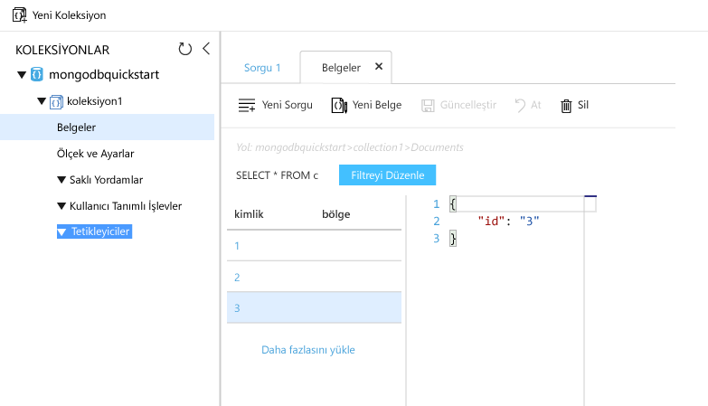

# <a name="azure-cosmos-db-migrate-an-existing-nodejs-mongodb-web-app"></a>Azure Cosmos DB: Var olan bir Node.js MongoDB web uygulamasını geçirme 

> [!div class="op_single_selector"]
> * [.NET](create-mongodb-dotnet.md)
> * [Java](create-mongodb-java.md)
> * [Node.js](create-mongodb-nodejs.md)
> * [Python](create-mongodb-flask.md)
> * [Xamarin](create-mongodb-xamarin.md)
> * [Golang](create-mongodb-golang.md)
>  

Azure Cosmos DB, Microsoft'un genel olarak dağıtılmış çok modelli veritabanı hizmetidir. Bu hizmetle belge, anahtar/değer ve grafik veritabanlarını kolayca oluşturup sorgulayabilir ve tüm bunları yaparken Azure Cosmos DB'nin genel dağıtım ve yatay ölçeklendirme özelliklerinden faydalanabilirsiniz. 

Bu hızlı başlangıçta, Node.js’de yazılmış mevcut bir MongoDB uygulamasını kullanma ve [MongoDB API](mongodb-introduction.md) kullanarak MongoDB istemci bağlantılarını destekleyen Azure Cosmos DB veritabanınıza bağlama işlemi gösterilmektedir. Diğer bir deyişle, Node.js uygulamanız yalnızca MongoDB API’lerini kullanarak bir veritabanına bağlandığını bilir. Verilerin Azure Cosmos DB'de depolandığı uygulamaya açıkça gösterilir.

İşiniz bittiğinde, [Azure Cosmos DB](https://azure.microsoft.com/services/cosmos-db/) üzerinde çalışan bir MEAN uygulamanız (MongoDB, Express, Angular ve Node.js) olacaktır. 


[!INCLUDE [cloud-shell-try-it](../../includes/cloud-shell-try-it.md)]

CLI'yi yerel olarak yükleyip kullanmayı tercih ederseniz bu konu, Azure CLI 2.0 veya sonraki bir sürümünü kullanmanızı gerektirir. Sürümü bulmak için `az --version` komutunu çalıştırın. Yükleme veya yükseltme yapmanız gerekiyorsa bkz. [Azure CLI'yı yükleme]( /cli/azure/install-azure-cli). 

## <a name="prerequisites"></a>Ön koşullar 
Azure aboneliğiniz yoksa başlamadan önce [ücretsiz bir hesap](https://azure.microsoft.com/free/?WT.mc_id=A261C142F) oluşturun. 
[!INCLUDE [cosmos-db-emulator-mongodb](../../includes/cosmos-db-emulator-mongodb.md)]

`npm` ve `git` komutlarını çalıştırmak için Azure CLI'nin yanı sıra yerel olarak [Node.js](https://nodejs.org/) ve [Git](http://www.git-scm.com/downloads) yüklemeniz gerekir.

Node.js çalıştırma bilgisine sahip olmanız gerekir. Bu hızlı başlangıç, genel olarak Node.js uygulamaları geliştirmenize yardımcı olmak için tasarlanmamıştır.

## <a name="clone-the-sample-application"></a>Örnek uygulamayı kopyalama

Örnek depoyu kopyalamak için aşağıdaki komutları çalıştırın. Bu örnek depo, varsayılan [MEAN.js](http://meanjs.org/) uygulamasını içerir.

1. Bir komut istemini açın, git-samples adlı yeni bir klasör oluşturun ve komut istemini kapatın.

    ```bash
    md "C:\git-samples"
    ```

2. Git Bash gibi bir Git terminal penceresi açın ve örnek uygulamayı yüklemek üzere yeni bir klasör olarak değiştirmek için `cd` komutunu kullanın.

    ```bash
    cd "C:\git-samples"
    ```

3. Örnek depoyu kopyalamak için aşağıdaki komutu çalıştırın. Bu komut bilgisayarınızda örnek uygulamanın bir kopyasını oluşturur. 

    ```bash
    git clone https://github.com/prashanthmadi/mean
    ```

## <a name="run-the-application"></a>Uygulamayı çalıştırma

Gereken paketleri yükleyip uygulamayı başlatın.

```bash
cd mean
npm install
npm start
```
Uygulama bir MongoDB kaynağına bağlanmayı deneyip başarısız olur, çıkış "[MongoError: connect ECONNREFUSED 127.0.0.1:27017]" döndürdüğünde uygulamadan çıkabilirsiniz.

## <a name="log-in-to-azure"></a>Azure'da oturum açma

Yüklenen bir Azure CLI kullanıyorsanız [az login](/cli/azure/reference-index#az-login) komutuyla Azure aboneliğinizde oturum açın ve ekrandaki yönergeleri uygulayın. Azure Cloud Shell'i kullanıyorsanız bu adımı atlayabilirsiniz.

```azurecli
az login 
``` 
   
## <a name="add-the-azure-cosmos-db-module"></a>Azure Cosmos DB modülü ekleme

Yüklenen bir Azure CLI kullanıyorsanız `az` komutunu çalıştırarak `cosmosdb` bileşeninin zaten yüklü olup olmadığını kontrol edin. `cosmosdb`, temel komutlar listesindeyse bir sonraki komuta geçin. Azure Cloud Shell'i kullanıyorsanız bu adımı atlayabilirsiniz.

`cosmosdb`, temel komutlar listesinde değilse [Azure CLI]( /cli/azure/install-azure-cli)'yi yeniden yükleyin.

## <a name="create-a-resource-group"></a>Kaynak grubu oluşturma

[az group create](/cli/azure/group#az-group-create) ile bir [kaynak grubu](../azure-resource-manager/resource-group-overview.md) oluşturun. Azure kaynak grubu; web uygulamaları, veritabanları ve depolama hesapları gibi Azure kaynaklarının dağıtıldığı ve yönetildiği bir mantıksal kapsayıcıdır. 

Aşağıdaki örnekte Batı Avrupa bölgesinde bir kaynak grubu oluşturulmaktadır. Kaynak grubu için benzersiz bir ad seçin.

Azure Cloud Shell kullanıyorsanız **Deneyin**'e tıklayın, oturum açmak için ekrandaki istemleri uygulayın, ardından komutu komut istemine kopyalayın.

```azurecli-interactive
az group create --name myResourceGroup --location "West Europe"
```

## <a name="create-an-azure-cosmos-db-account"></a>Azure Cosmos DB hesabı oluşturma

[az cosmosdb create](/cli/azure/cosmosdb#az-cosmosdb-create) komutuyla bir Azure Cosmos DB hesabı oluşturun.

Aşağıdaki komutta lütfen benzersiz Azure Cosmos DB hesap adınızı `<cosmosdb-name>` yer tutucusunu gördüğünüz yere yerleştirin. Bu benzersiz ad, Azure Cosmos DB uç noktanızın (`https://<cosmosdb-name>.documents.azure.com/`) bir parçası olarak kullanılacağı için, adın Azure’daki tüm Azure Cosmos DB hesaplarında benzersiz olması gerekir. 

```azurecli-interactive
az cosmosdb create --name <cosmosdb-name> --resource-group myResourceGroup --kind MongoDB
```

`--kind MongoDB` parametresi MongoDB istemci bağlantılarını etkinleştirir.

Azure Cosmos DB hesabı oluşturulduğunda Azure CLI, aşağıdaki örneğe benzer bilgiler gösterir. 

> [!NOTE]
> Bu örnek, varsayılan Azure CLI çıktı biçimi olarak JSON kullanır. Başka bir çıktı biçimi kullanmak için bkz. [Azure CLI komutları için çıktı biçimleri](https://docs.microsoft.com/cli/azure/format-output-azure-cli).

```json
{
  "databaseAccountOfferType": "Standard",
  "documentEndpoint": "https://<cosmosdb-name>.documents.azure.com:443/",
  "id": "/subscriptions/00000000-0000-0000-0000-000000000000/resourceGroups/myResourceGroup/providers/Microsoft.Document
DB/databaseAccounts/<cosmosdb-name>",
  "kind": "MongoDB",
  "location": "West Europe",
  "name": "<cosmosdb-name>",
  "readLocations": [
    {
      "documentEndpoint": "https://<cosmosdb-name>-westeurope.documents.azure.com:443/",
      "failoverPriority": 0,
      "id": "<cosmosdb-name>-westeurope",
      "locationName": "West Europe",
      "provisioningState": "Succeeded"
    }
  ],
  "resourceGroup": "myResourceGroup",
  "type": "Microsoft.DocumentDB/databaseAccounts",
  "writeLocations": [
    {
      "documentEndpoint": "https://<cosmosdb-name>-westeurope.documents.azure.com:443/",
      "failoverPriority": 0,
      "id": "<cosmosdb-name>-westeurope",
      "locationName": "West Europe",
      "provisioningState": "Succeeded"
    }
  ]
} 
```

## <a name="connect-your-nodejs-application-to-the-database"></a>Node.js uygulamanızı veritabanına bağlama

Bu adımda, MEAN.js örnek uygulamanızı, MongoDB bağlantı dizesi kullanarak yeni oluşturduğunuz bir Azure Cosmos DB veritabanına bağlayacaksınız. 

<a name="devconfig"></a>
## <a name="configure-the-connection-string-in-your-nodejs-application"></a>Node.js uygulamanızda bağlantı dizesini yapılandırma

MEAN.js deponuzda `config/env/local-development.js` dosyasını açın.

Bu dosyanın içeriğini aşağıdaki kodla değiştirin. İki `<cosmosdb-name>` yer tutucusunu Azure Cosmos DB hesap adınızla değiştirdiğinizden emin olun.

```javascript
'use strict';

module.exports = {
  db: {
    uri: 'mongodb://<cosmosdb-name>:<primary_master_key>@<cosmosdb-name>.documents.azure.com:10255/mean-dev?ssl=true&sslverifycertificate=false'
  }
};
```

## <a name="retrieve-the-key"></a>Anahtarı alma

Bir Azure Cosmos DB veritabanına bağlanmak için veritabanı anahtarı gerekir. Birincil anahtarı almak için [az cosmosdb list-keys](/cli/azure/cosmosdb#list-keys) komutunu kullanın.

```azurecli-interactive
az cosmosdb list-keys --name <cosmosdb-name> --resource-group myResourceGroup --query "primaryMasterKey"
```

Azure CLI aşağıdaki örneğe benzer bilgiler çıkarır. 

```json
"RUayjYjixJDWG5xTqIiXjC..."
```

`primaryMasterKey` değerini kopyalayın. `local-development.js` içinde bulunan `<primary_master_key>` üzerine yapıştırın.

Yaptığınız değişiklikleri kaydedin.

### <a name="run-the-application-again"></a>Uygulamayı yeniden çalıştırın.

`npm start` komutunu yeniden çalıştırın. 

```bash
npm start
```

Bir konsol iletisi, geliştirme ortamının çalışır durumda olduğunu söyleyecektir. 

Bir tarayıcıda `http://localhost:3000` sayfasına gidin. Üstteki menüden **Kaydol**’a tıklayıp iki sahte kullanıcı oluşturmaya çalışın. 

MEAN.js örnek uygulaması, kullanıcı verilerini veritabanında depolar. Başarılı olursanız ve MEAN.js oluşturulan kullanıcının oturumunu otomatik olarak açarsa, Azure Cosmos DB bağlantınız çalışıyordur. 


## <a name="view-data-in-data-explorer"></a>Veri Gezgini’nde verileri görüntüleme

Bir Azure Cosmos DB tarafından depolanan veriler, Azure portalında görüntülenebilir, sorgulanabilir ve iş mantığında çalıştırılabilir.

Önceki adımda oluşturulan verileri görüntülemek, sorgulamak ve üzerinde çalışmak için web tarayıcınızda [Azure portalı](https://portal.azure.com) oturumunu açın.

Arama kutusuna Azure Cosmos DB yazın. Cosmos DB hesabı dikey penceresi açıldığında Cosmos DB hesabınızı seçin. Sol gezinti bölmesinde Veri Gezgini'ne tıklayın. Koleksiyonlar bölmesinde koleksiyonunuzu genişletin; bundan sonra koleksiyondaki belgeleri görüntüleyebilir, verileri sorgulayabilir ve hatta saklı yordam, tetikleyici ve UDF’ler oluşturup çalıştırabilirsiniz. 




## <a name="deploy-the-nodejs-application-to-azure"></a>Node.js uygulamasını Azure’a dağıtma

Bu adımda, MongoDB’ye bağlı Node.js uygulamanızı Azure Cosmos DB’ye dağıtacaksınız.

Daha önce değiştirdiğiniz yapılandırma dosyasının geliştirme ortamına (`/config/env/local-development.js`) yönelik olduğunu fark etmiş olabilirsiniz. Uygulamanızı App Service’e dağıttığınızda, varsayılan olarak üretim ortamında çalıştırılır. O halde şimdi, ilgili yapılandırma dosyasında aynı değişikliği yapmanız gerekir.

MEAN.js deponuzda `config/env/production.js` dosyasını açın.

`db` nesnesinde `uri` değerini aşağıdaki örnekte gösterilen şekilde değiştirin. Yer tutucuları daha önceki gibi değiştirdiğinizden emin olun.

```javascript
'mongodb://<cosmosdb-name>:<primary_master_key>@<cosmosdb-name>.documents.azure.com:10255/mean?ssl=true&sslverifycertificate=false',
```

> [!NOTE] 
> [Azure Cosmos DB, SSL gerektirdiğinden](connect-mongodb-account.md#connection-string-requirements) `ssl=true` seçeneği önemlidir. 
>
>

Terminalde tüm değişikliklerinizi Git’e uygulayın. Her iki komutu birlikte çalıştırmak üzere kopyalayabilirsiniz.

```bash
git add .
git commit -m "configured MongoDB connection string"
```
## <a name="clean-up-resources"></a>Kaynakları temizleme

[!INCLUDE [cosmosdb-delete-resource-group](../../includes/cosmos-db-delete-resource-group.md)]

## <a name="next-steps"></a>Sonraki adımlar

Bu hızlı başlangıçta Azure Cosmos DB hesabı oluşturmayı, Veri Gezgini'ni kullanarak bir MongoDB koleksiyonu oluşturmayı öğrendiniz. Şimdi MongoDB verilerinizi Azure Cosmos DB’ye geçirebilirsiniz.  

> [!div class="nextstepaction"]
> [Azure Cosmos DB’ye MongoDB verileri aktarma](mongodb-migrate.md)
