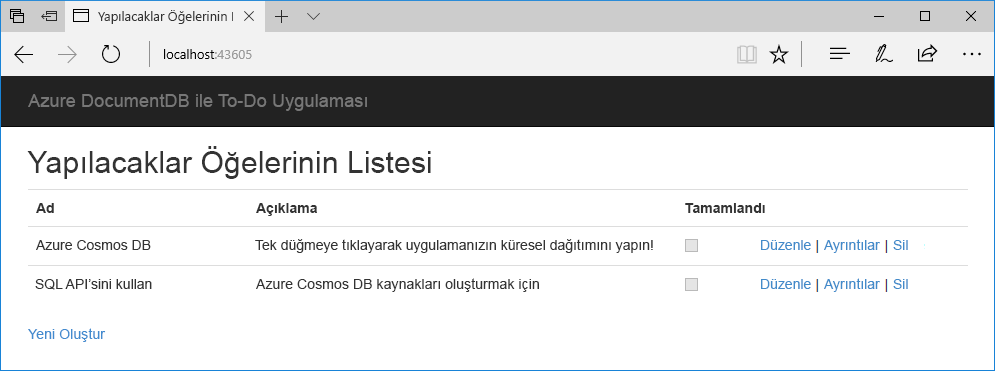

# <a name="quickstart-build-a-net-web-app-using-sql-api-account-in-azure-cosmos-db"></a>Hızlı Başlangıç: Azure Cosmos DB SQL API hesabı kullanarak bir .NET web uygulaması derleme

> [!div class="op_single_selector"]
> * [.NET](create-sql-api-dotnet.md)
> * [.NET (Önizleme)](create-sql-api-dotnet-preview.md)
> * [Java](create-sql-api-java.md)
> * [Node.js](create-sql-api-nodejs.md)
> * [Python](create-sql-api-python.md)
> * [Xamarin](create-sql-api-xamarin-dotnet.md)
>  
> 

Azure Cosmos DB, Microsoft'un genel olarak dağıtılmış çok modelli veritabanı hizmetidir. Azure Cosmos DB, hızlı bir şekilde oluşturmak ve anahtar/değer veritabanları, belge veritabanları ve her biri genel dağıtım ve yatay ölçeklendirme özelliklerinden faydalanabilirsiniz Azure Cosmos DB'nin grafik veritabanlarını sorgulamak için kullanabilirsiniz. 

Bu hızlı başlangıçta bir Azure Cosmos DB oluşturmak için Azure portalını kullanmayı gösteren [SQL API](sql-api-introduction.md) hesabı, bir belge veritabanı ve koleksiyon oluşturma ve veri koleksiyonuna ekleyin. Daha sonra bir [SQL .NET SDK'sı](sql-api-sdk-dotnet.md) koleksiyona daha fazla veri eklemek için web uygulaması. 

Bu hızlı başlangıçta, Veri Gezgini Azure Portalı'nda veritabanı ve koleksiyonunu oluşturmak için kullanın. .NET örnek kodu kullanarak veritabanı ve koleksiyonu da oluşturabilirsiniz. Daha fazla bilgi için bkz. [.NET kodu gözden](#review-the-net-code). 

## <a name="prerequisites"></a>Önkoşullar

Visual Studio 2017 ile yüklü Azure geliştirme iş akışı
- İndirip kullanabilirsiniz **ücretsiz** [Visual Studio 2017 Community Edition](https://www.visualstudio.com/downloads/). Visual Studio kurulumu sırasında **Azure dağıtımını** etkinleştirdiğinizden emin olun. 

Bir Azure aboneliği veya ücretsiz Azure Cosmos DB deneme hesabı
- [!INCLUDE [quickstarts-free-trial-note](../../includes/quickstarts-free-trial-note.md)] 
- [!INCLUDE [cosmos-db-emulator-docdb-api](../../includes/cosmos-db-emulator-docdb-api.md)]  

<a id="create-account"></a>
## <a name="create-an-azure-cosmos-db-account"></a>Azure Cosmos DB hesabı oluşturma

[!INCLUDE [cosmos-db-create-dbaccount](../../includes/cosmos-db-create-dbaccount.md)]

<a id="create-collection-database"></a>
## <a name="add-a-database-and-a-collection"></a>Bir veritabanı ve koleksiyon Ekle 

Azure portalında Veri Gezgini, veritabanı ve koleksiyon oluşturmak için kullanabilirsiniz. 

1.  Seçin **Veri Gezgini** Azure Cosmos DB üzerinde sol gezinti bölmesinden hesap sayfası ve ardından **yeni koleksiyon**. 
    
    Hemen görmek için kaydırmanız gerekebilir **koleksiyon Ekle** alan.
    
    
    
1.  **Koleksiyon Ekle** sayfasında, yeni koleksiyon için ayarları girin.
    
    |Ayar|Önerilen değer|Açıklama
    |---|---|---|
    |**Veritabanı kimliği**|ToDoList|Girin *ToDoList* yeni bir veritabanı adı olarak. Veritabanı adı 1 ila 255 karakter içermeli ve içeremezler `/, \\, #, ?`, veya bir boşluk.|
    |**Koleksiyon kimliği**|Öğeler|Yeni koleksiyonunuzun adı olarak *Öğeler* girin. Koleksiyon kimlikleri aynı karakter gereksinimleri veritabanı adlarına sahip.|
    |**Bölüm anahtarı**| /kategori| Bu makalede açıklanan örnek kullanır */Category* bölüm anahtarı olarak.|
    |**Aktarım hızı**|400|Aktarım hızını 400 istek birimi (RU/sn) saniyede bırakılacak. Daha sonra gecikme süresini azaltmak isterseniz aktarım hızının ölçeğini artırabilirsiniz.| 
    
    Ekleme **benzersiz anahtarlar** bu örneğin. Benzersiz anahtarlar oluşturulduğunda, bölüm anahtarı başına bir veya daha fazla değer sağlayarak veritabanına bir veri bütünlüğü katmanı eklemenize olanak sağlar. Daha fazla bilgi için [Azure Cosmos DB'de benzersiz anahtarlar](unique-keys.md).
    
1.  **Tamam**’ı seçin. 
    Veri Gezgini, yeni veritabanını ve koleksiyonu görüntüler.
    
    

## <a name="add-data-to-your-database"></a>Veritabanınıza veri eklemek

Veri Gezgini'ni kullanarak yeni veritabanınıza veri ekleyin.

1. İçinde **Veri Gezgini**, yeni veritabanı görünür **koleksiyonları** bölmesi. Genişletin **ToDoList** genişletin, veritabanı **öğeleri** koleksiyonu, select **belgeleri**ve ardından **yeni belge**. 
   
   
   
1. Aşağıdaki yapıya sağ alt tarafında belgeye eklediğiniz **belgeleri** bölmesi:

     ```json
     {
         "id": "1",
         "category": "personal",
         "name": "groceries",
         "description": "Pick up apples and strawberries.",
         "isComplete": false
     }
     ```

1. **Kaydet**’i seçin.
   
   
   
1. Seçin **yeni belge** yeniden oluşturmak ve başka bir belgeyi benzersiz bir kaydetme `id`ve diğer özellikler ve değerleri. Azure Cosmos DB, verileriniz üzerinde herhangi bir şema koymaz çünkü belgelerinizi herhangi bir yapı olabilir.

## <a name="query-your-data"></a>Verilerinizi sorgulayın

[!INCLUDE [cosmos-db-create-sql-api-query-data](../../includes/cosmos-db-create-sql-api-query-data.md)]

## <a name="use-the-net-web-app-to-manage-data"></a>.NET web uygulaması verileri yönetmek için kullanma

Ne kadar kolay olduğunu, Azure Cosmos DB verilerle program aracılığıyla çalışmanın, örnek SQL API .NET web uygulaması kopyalayalım görmek için bağlantı dizesini güncelleştirin ve verilerinizi güncelleştirmek için uygulamayı çalıştırın. 

.NET örnek kodu kullanarak veritabanı ve koleksiyonu da oluşturabilirsiniz. Daha fazla bilgi için bkz. [.NET kodu gözden](#review-the-net-code).

### <a name="clone-the-sample-app"></a>Örnek uygulamayı kopyalama

İlk olarak, kopya bir C# [SQL API'si uygulaması](https://github.com/Azure-Samples/documentdb-dotnet-todo-app) github'dan. 

1. Açık Git Bash gibi bir git terminal penceresi oluşturma adlı yeni bir dizin *git-samples*ve şekilde değiştirin: 
   
   ```bash
   mkdir /c/git-samples/
   cd /c/git-samples/
   ```
   
1. Örnek depoyu kopyalamak ve bilgisayarınızda örnek uygulamanın bir kopyasını oluşturmak için aşağıdaki komutu çalıştırın:
   
   ```bash
   git clone https://github.com/Azure-Samples/documentdb-dotnet-todo-app.git
   ```

### <a name="update-the-connection-string"></a>Bağlantı dizesini güncelleştirme 

1. Gidin ve açmak *todo.sln* kopyalanan uygulamanızı Visual Studio'da dosya. 

1. Visual Studio'da **Çözüm Gezgini**açın *web.config* dosya. 

1. Bağlantı dizesi bilgilerinizi kopyalayıp yapıştırabilirsiniz kopyalamak için Azure portalına dönün Git *web.config*.
   
   1. Azure Cosmos DB hesabı sol gezinti bölmesinde **anahtarları**.
      
      
      
   1. Altında **okuma-yazma anahtarları**, kopyalama **URI** sağ taraftaki Kopyala düğmesini kullanarak değer ve yapıştırın `endpoint` anahtarını *web.config*. Örneğin: 
      
      `<add key="endpoint" value="https://mysqlapicosmosdb.documents.azure.com:443/" />`
      
   1. Kopyalama **birincil anahtar** yapıştırın ve değer `authKey` anahtarını *web.config*. Örneğin:
      
      `<add key="authKey" value="19ZDNJAiYL26tmnRvoez6hmtIfBGwjun50PWRjNYMC2ig8Ob9hYk7Fq1RYSv8FcIYnh1TdBISvCh7s6yyb0000==" />`

       
1. Veritabanı ve koleksiyon değerleri emin *web.config* daha önce oluşturduğunuz adlarla eşleşir. 

   ```csharp
   <add key="database" value="ToDoList"/>
   <add key="collection" value="Items"/>
   ```
 
1. Kaydet *web.config.* Uygulamanız artık Azure Cosmos DB ile iletişim kurmak için gereken tüm bilgileri ile de güncelleştirdik.

### <a name="run-the-web-app"></a>Web uygulamasını çalıştırma

1. Visual Studio'da sağ **todo** projesi **Çözüm Gezgini**ve ardından **NuGet paketlerini Yönet**. 

1. NuGet **Gözat** kutusuna *DocumentDB* yazın.

1. Sonuçlardan yükleme **Microsoft.Azure.DocumentDB** zaten yüklü değilse kitaplığı. Bu yükler [Microsoft.Azure.DocumentDB](https://www.nuget.org/packages/Microsoft.Azure.DocumentDB/) paketi ve tüm bağımlılıklar.
   
   NuGet Paket Yöneticisi bazı paketler çözümden eksik olduğu bir ileti görüntülenirse, seçin **geri** iç kaynaklardan yüklenecek. 

1. Seçin **Ctrl**+**F5** uygulamayı tarayıcınızda çalıştırın. 

1. Seçin **Yeni Oluştur** Yapılacaklar uygulamasında ve birkaç yeni görev oluşturun.

   

Veri Gezgini, Azure portalında görmek için sorgulamak, değiştirmek ve yeni verilerinizle çalışmanıza geri dönebilirsiniz. 

## <a name="review-the-net-code"></a>.NET kodu gözden geçirin

Bu adım isteğe bağlıdır. Bu hızlı başlangıçta, Azure portalında bir veritabanı ve koleksiyonu oluşturulur ve .NET örneği kullanarak örnek veriler eklenir. Ancak, ayrıca veritabanı ve koleksiyonu .NET örneği kullanarak oluşturabilirsiniz. Veritabanı kaynaklarının kodda nasıl oluşturulduğunu ilgileniyorsanız aşağıdaki kod parçacıklarının gözden geçirin. Kod parçacıklarının tümü alınmıştır *DocumentDBRepository.cs* dosyası **todo** proje.

* Bu kod başlatır `DocumentClient`: 

    ```csharp
    client = new DocumentClient(new Uri(ConfigurationManager.AppSettings["endpoint"]), ConfigurationManager.AppSettings["authKey"]);
    ```

* Bu kodu kullanarak yeni bir veritabanı oluşturur. `CreateDatabaseAsync` yöntemi:

    ```csharp
    await client.CreateDatabaseAsync(new Database { Id = DatabaseId });
    ```

* Aşağıdaki kodu kullanarak yeni bir koleksiyon oluşturur. `CreateDocumentCollectionAsync` yöntemi:

    ```csharp
    private static async Task CreateCollectionIfNotExistsAsync()
    {
        try
        {
           await client.ReadDocumentCollectionAsync(UriFactory.CreateDocumentCollectionUri(DatabaseId, CollectionId));
        }
        catch (DocumentClientException e)
        {
           if (e.StatusCode == System.Net.HttpStatusCode.NotFound)
           {
              await client.CreateDocumentCollectionAsync(
              UriFactory.CreateDatabaseUri(DatabaseId),
              new DocumentCollection
              {
                  Id = CollectionId
              },
              new RequestOptions { OfferThroughput = 400 });
           }
           else
           {
             throw;
           }
        }
    }
    ```

## <a name="clean-up-resources"></a>Kaynakları temizleme

[!INCLUDE [cosmosdb-delete-resource-group](../../includes/cosmos-db-delete-resource-group.md)]

## <a name="next-steps"></a>Sonraki adımlar

Bu hızlı başlangıçta, bir Azure Cosmos DB hesabı oluşturma, veritabanı ve Veri Gezgini'ni kullanarak koleksiyon oluşturma ve verilerinizi güncelleştirmek için bir .NET web uygulamasını çalıştırmayı öğrendiniz. Şimdi Azure Cosmos DB hesabınıza ek veriler aktarabilirsiniz. 

> [!div class="nextstepaction"]
> [Azure Cosmos DB'ye veri aktarma](import-data.md)

