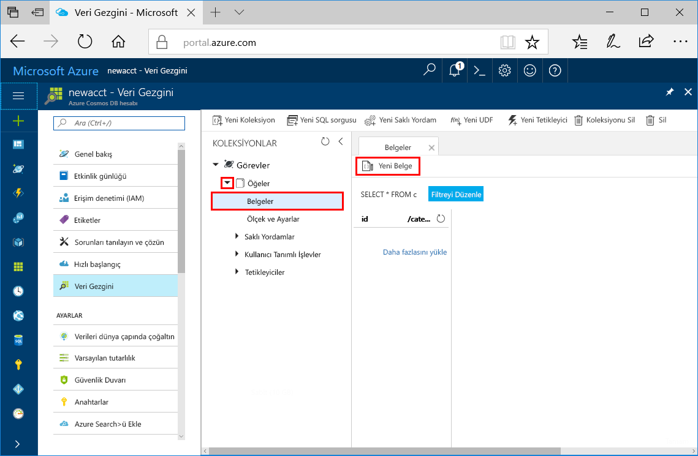
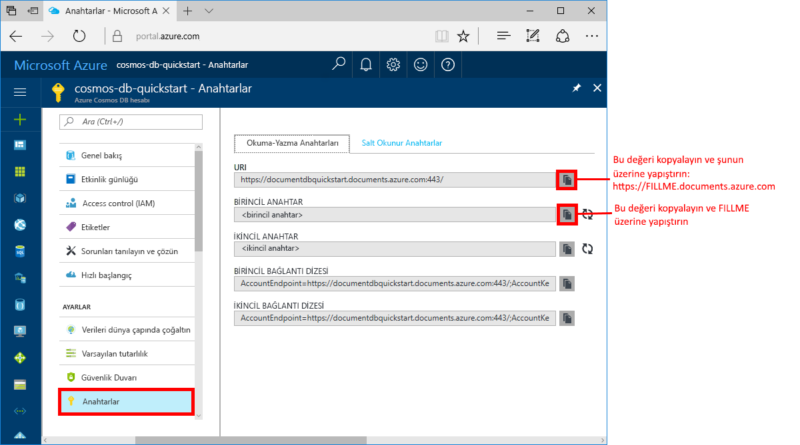

# <a name="azure-cosmos-db-create-a-document-database-using-java-and-the-azure-portal"></a>Azure Cosmos DB: Java ve Azure portalını kullanarak bir belge veritabanı oluşturma

Azure Cosmos DB, Microsoft'un genel olarak dağıtılmış çok modelli veritabanı hizmetidir. Azure Cosmos DB’yi kullanarak hızlıca yönetilen belgeler, tablolar ve grafik veritabanları oluşturabilir ve bunları sorgulayabilirsiniz.

Bu hızlı başlangıç Azure Cosmos DB [SQL API](sql-api-introduction.md) için Azure portal araçlarını kullanarak bir belge veritabanı oluşturur. Bu hızlı başlangıçta ayrıca bir Java konsol uygulamasını [SQL Java API](sql-api-sdk-java.md) kullanarak nasıl hızlı bir şekilde oluşturabileceğiniz gösterilmektedir. Bu hızlı başlangıçtaki yönergeler Java çalıştırabilen tüm işletim sistemlerinde izlenebilir. Bu hızlı başlangıcı tamamladığınızda, tercihinize bağlı olarak Kullanıcı Arabiriminde veya programlama arabiriminde belge veritabanı kaynaklarını oluşturma ve değiştirme hakkında bilgi sahibi olacaksınız.

## <a name="prerequisites"></a>Ön koşullar

[!INCLUDE [quickstarts-free-trial-note](../../includes/quickstarts-free-trial-note.md)] 
[!INCLUDE [cosmos-db-emulator-docdb-api](../../includes/cosmos-db-emulator-docdb-api.md)]

Buna ek olarak: 

* [Java Development Kit (JDK) 1.7+](http://www.oracle.com/technetwork/java/javase/downloads/jdk8-downloads-2133151.html)
    * Ubuntu’da JDK’yi yüklemek için `apt-get install default-jdk` komutunu çalıştırın.
    * JAVA_HOME ortam değişkenini JDK’nin yüklü olduğu klasöre işaret edecek şekilde ayarladığınızdan emin olun.
* Bir [Maven](http://maven.apache.org/) ikili arşivi [indirin](http://maven.apache.org/download.cgi) ve [yükleyin](http://maven.apache.org/install.html)
    * Ubuntu’da Maven’i yüklemek için `apt-get install maven` komutunu çalıştırabilirsiniz.
* [Git](https://www.git-scm.com/)
    * Ubuntu’da Git’i yüklemek için `sudo apt-get install git` komutunu çalıştırabilirsiniz.

## <a name="create-a-database-account"></a>Veritabanı hesabı oluşturma

Bir belge veritabanı oluşturmadan önce Azure Cosmos DB ile bir SQL API hesabı oluşturmanız gerekir.

[!INCLUDE [cosmos-db-create-dbaccount](../../includes/cosmos-db-create-dbaccount.md)]

## <a name="add-a-collection"></a>Koleksiyon ekleme

[!INCLUDE [cosmos-db-create-collection](../../includes/cosmos-db-create-collection.md)]

<a id="add-sample-data"></a>
## <a name="add-sample-data"></a>Örnek verileri ekleme

Şimdi Veri Gezgini'ni kullanarak yeni koleksiyonunuza veri ekleyebilirsiniz.

1. **Öğeler** koleksiyonunu genişletin, **Belgeler** > **Yeni Belge**’ye tıklayın.

   
  
2. Şimdi koleksiyona aşağıdaki yapıya sahip bir belge ekleyin ve **Kaydet**’e tıklayın. Jason’ı panonuza kopyalamak için kod kutusundaki **Kopyala** düğmesini kullanın.

     ```json
     {
         "id": "1",
         "category": "personal",
         "name": "groceries",
         "description": "Pick up apples and strawberries.",
         "isComplete": false
     }
     ```

    

3.  `id` özelliğini 2 olarak değiştirdiğiniz yerde bir veya daha fazla belge oluşturun ve kaydedin ve diğer özellikleri uygun şekilde değiştirin. Azure Cosmos DB, verilerinizin bir şemaya uygun olmasını şart koşmadığı için yeni belgelerinizin yapısını istediğiniz şekilde oluşturabilirsiniz.

## <a name="query-your-data"></a>Verilerinizi sorgulayın

Artık, verilerinizi almak ve filtrelemek için Veri Gezgini'ndeki sorguları kullanabilirsiniz.

1. Sorgunun, varsayılan olarak `SELECT * FROM c` şeklinde ayarlandığına dikkat edin. Bu varsayılan sorgu, koleksiyondaki tüm belgeleri alır ve görüntüler. 

    

2. **Documents** sekmesinde kalın ve **Filtreyi düzenle** düğmesine tıklayıp sorgu koşulu kutusuna `ORDER BY c._ts DESC` ekledikten sonra **Filtre Uygula** seçeneğine tıklayarak sorguyu değiştirin.

    

Düzenlenen sorguda belgeler zaman damgalarına göre azalan sırada listelendiğinden, şimdi ikinci belgeniz ilk sırada görüntülenir. SQL söz dizimini biliyorsanız desteklenen [SQL sorgularını](sql-api-sql-query.md) bu kutuya girebilirsiniz. 

Bu işlemle Veri Gezgini üzerindeki çalışmalarımız tamamlanmış olur. Kodlarla çalışmaya başlamadan önce, Veri Gezgini'ni kullanarak ayrıca saklı yordamlar, UDF'ler ve tetikleyiciler oluşturabileceğinizi, bu sayede sunucu tarafı iş mantığını gerçekleştirebileceğinizi ve aktarım hızını ölçeklendirebileceğinizi göz önünde bulundurun. Veri Gezgini, API'lerdeki tüm yerleşik programlı veri erişimini açığa çıkarır ancak Azure portalındaki verilerinize kolayca erişmenizi sağlar.

## <a name="clone-the-sample-application"></a>Örnek uygulamayı kopyalama

Şimdi kod ile çalışmaya geçelim. GitHub'dan bir SQL API'si uygulaması kopyalayalım, bağlantı dizesini ayarlayalım ve uygulamayı çalıştıralım. Verilerle program aracılığıyla çalışmanın ne kadar kolay olduğunu göreceksiniz. 

1. Bir komut istemini açın, git-samples adlı yeni bir klasör oluşturun ve komut istemini kapatın.

    ```bash
    md "C:\git-samples"
    ```

2. Git Bash gibi bir Git terminal penceresi açın ve örnek uygulamayı yüklemek üzere yeni bir klasör olarak değiştirmek için `cd` komutunu kullanın. 

    ```bash
    cd "C:\git-samples"
    ```

3. Örnek depoyu kopyalamak için aşağıdaki komutu çalıştırın. Bu komut bilgisayarınızda örnek uygulamanın bir kopyasını oluşturur.

    ```bash
    git clone https://github.com/Azure-Samples/azure-cosmos-db-documentdb-java-getting-started.git
    ```

## <a name="review-the-code"></a>Kodu gözden geçirin

Bu adım isteğe bağlıdır. Veritabanı kaynaklarının kodda nasıl oluşturulduğunu öğrenmekle ilgileniyorsanız aşağıdaki kod parçacıklarını gözden geçirebilirsiniz. Aksi durumda, [Bağlantı dizenizi güncelleştirme](#update-your-connection-string) bölümüne atlayabilirsiniz. 

Aşağıdaki kod parçacıklarının tümü C:\git-samples\azure-cosmos-db-documentdb-java-getting-started\src\GetStarted\Program.java dosyasından alınmıştır.

* `DocumentClient` başlatma. [DocumentClient](https://docs.microsoft.com/java/api/com.microsoft.azure.documentdb._document_client), Azure Cosmos DB veritabanı hizmeti için istemci tarafı mantıksal gösterim sağlar. Bu istemci, istekleri hizmete göre yapılandırmak ve çalıştırmak için kullanılır. Bu kodun `FILLME` kısımları, hızlı başlangıcın ilerleyen kısmında güncelleştirilecektir.

    ```java
    this.client = new DocumentClient("https://FILLME.documents.azure.com",
            "FILLME", 
            new ConnectionPolicy(),
            ConsistencyLevel.Session);
    ```

* [Veritabanı](https://docs.microsoft.com/java/api/com.microsoft.azure.documentdb._database) oluşturma.

    ```java
    Database database = new Database();
    database.setId(databaseName);
    
    this.client.createDatabase(database, null);
    ```

* [DocumentCollection](https://docs.microsoft.com/java/api/com.microsoft.azure.documentdb._document_collection) oluşturma.

    ```java
    DocumentCollection collectionInfo = new DocumentCollection();
    collectionInfo.setId(collectionName);

    ...

    this.client.createCollection(databaseLink, collectionInfo, requestOptions);
    ```

* [createDocument](https://docs.microsoft.com/java/api/com.microsoft.azure.documentdb._document_client.createdocument) metodunu kullanarak belge oluşturma.

    ```java
    // Any Java object within your code can be serialized into JSON and written to Azure Cosmos DB
    Family andersenFamily = new Family();
    andersenFamily.setId("Andersen.1");
    andersenFamily.setLastName("Andersen");
    // More properties

    String collectionLink = String.format("/dbs/%s/colls/%s", databaseName, collectionName);
    this.client.createDocument(collectionLink, family, new RequestOptions(), true);
    ```

* JSON üzerindeki SQL sorguları, [queryDocuments](https://docs.microsoft.com/java/api/com.microsoft.azure.documentdb._document_client.querydocuments) metoduyla yapılır.

    ```java
    FeedOptions queryOptions = new FeedOptions();
    queryOptions.setPageSize(-1);
    queryOptions.setEnableCrossPartitionQuery(true);

    String collectionLink = String.format("/dbs/%s/colls/%s", databaseName, collectionName);
    FeedResponse<Document> queryResults = this.client.queryDocuments(
        collectionLink,
        "SELECT * FROM Family WHERE Family.lastName = 'Andersen'", queryOptions);

    System.out.println("Running SQL query...");
    for (Document family : queryResults.getQueryIterable()) {
        System.out.println(String.format("\tRead %s", family));
    }
    ```    

## <a name="update-your-connection-string"></a>Bağlantı dizenizi güncelleştirme

Bu adımda Azure portalına dönerek bağlantı dizesi bilgilerinizi kopyalayıp uygulamaya ekleyin. Bu, uygulamanızın barındırılan veritabanıyla iletişim kurmasına olanak tanır.

1. [Azure portalında](http://portal.azure.com/), **Anahtarlar**’a tıklayın. 

    En üstte yer alan değer olan URI’yi kopyalamak için, ekranın sağ tarafındaki kopyalama düğmelerini kullanın.

    

2. C:\git-samples\azure-cosmos-db-documentdb-java-getting-started\src\GetStarted klasöründeki `Program.java` dosyasını açın. 

3. Portaldan URI değerini 45. satırda `https://FILLME.documents.azure.com` üzerine yapıştırın.

4. Portala geri dönün ve ekran görüntüsünde gösterildiği gibi PRIMARY KEY değerini kopyalayın. Portaldan PRIMARY KEY değerini 46. satırda `FILLME` üzerine yapıştırın.

    getStartedDemo metodu artık şuna benzer şekilde görünmelidir: 
    
    ```java
    private void getStartedDemo() throws DocumentClientException, IOException {
        this.client = new DocumentClient("https://youraccountname.documents.azure.com:443/",
                "your-primary-key...RJhQrqQ5QQ==", 
                new ConnectionPolicy(),
                ConsistencyLevel.Session);
    ```

5. Program.java dosyasını kaydedin.

## <a name="run-the-app"></a>Uygulamayı çalıştırma

1. Git terminal penceresinde `cd` komutuyla azure-cosmos-db-documentdb-java-getting-started klasörüne ulaşın.

    ```git
    cd "C:\git-samples\azure-cosmos-db-documentdb-java-getting-started"
    ```

2. Git terminal penceresinde aşağıdaki komutu kullanarak gerekli Java paketlerini yükleyin.

    ```
    mvn package
    ```

3. Git terminal penceresinde, Java uygulamasını başlatmak için aşağıdaki komutları kullanın.

    ```
    mvn exec:java -D exec.mainClass=GetStarted.Program
    ```

    Terminal penceresinde, FamilyDB veritabanının oluşturulduğunu belirten bir bildirim görüntülenir. 
    
4. Veritabanını oluşturmak için bir tuşa basın ve sonra koleksiyonu oluşturmak için başka bir tuşa basın. 

    Programın sonunda tüm kaynaklar silinir; bu nedenle tarayıcınızda Veri Gezgini’ne geri dönerek bir FamilyDB veritabanı ve FamilyCollection koleksiyonu içerdiğini doğrulayın.

5. Konsol penceresine geçin ve birinci belgeyi oluşturmak için bir tuşa ve ikinci belgeyi oluşturmak için başka bir tuşa basın. Daha sonra Veri Gezgini’ne geri dönerek bunları görüntüleyin. 

6. Bir sorgu çalıştırmak ve konsol penceresinde çıktıyı görmek için bir tuşa basın. 

7. Bastığınız sonraki tuş, kaynakları siler. Kaynakları tutmak istiyorsanız, konsol penceresinde CTRL+C tuşlarına basarak programı sonlandırabilirsiniz. Aksi takdirde, ücret oluşmaması için herhangi bir tuşa basarak hesabınızdan kaynakları silin. 

    


## <a name="review-slas-in-the-azure-portal"></a>Azure portalında SLA'ları gözden geçirme

[!INCLUDE [cosmosdb-tutorial-review-slas](../../includes/cosmos-db-tutorial-review-slas.md)]

## <a name="clean-up-resources"></a>Kaynakları temizleme

[!INCLUDE [cosmosdb-delete-resource-group](../../includes/cosmos-db-delete-resource-group.md)]

## <a name="next-steps"></a>Sonraki adımlar

Bu hızlı başlangıçta Azure Cosmos DB hesabını ve belge veritabanını oluşturmayı, Veri Gezgini'ni kullanarak koleksiyon oluşturmayı ve bu işlemleri programlı bir şekilde yapacak bir uygulamayı çalıştırmayı öğrendiniz. Şimdi Azure Cosmos DB koleksiyonunuza ek veri aktarabilirsiniz. 

> [!div class="nextstepaction"]
> [Azure Cosmos DB hesabınıza veri aktarma](import-data.md)


