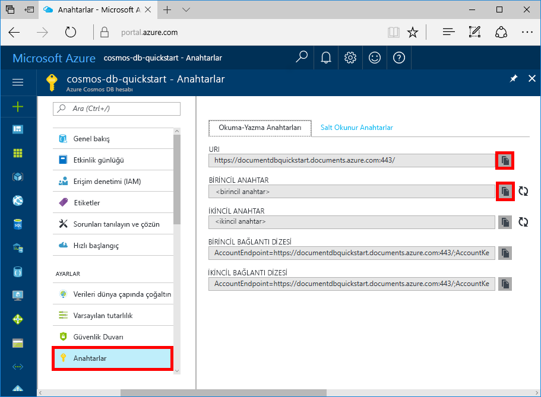
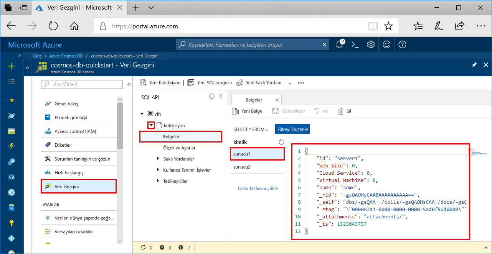

# <a name="azure-cosmos-db-build-a-python-application-using-azure-cosmos-db-sql-api-account"></a>Azure Cosmos DB: Azure Cosmos DB SQL API hesabı kullanarak bir Python uygulaması oluşturma

> [!div class="op_single_selector"]
> * [.NET](create-sql-api-dotnet.md)
> * [.NET (Önizleme)](create-sql-api-dotnet-preview.md)
> * [Java](create-sql-api-java.md)
> * [Node.js](create-sql-api-nodejs.md)
> * [Python](create-sql-api-python.md)
> * [Xamarin](create-sql-api-xamarin-dotnet.md)
>  

Azure Cosmos DB, Microsoft'un genel olarak dağıtılmış çok modelli veritabanı hizmetidir. Hızla oluşturun ve belge, anahtar/değer ve grafik veritabanlarını sorgulama. Tüm bu işlemler, dağıtım ve Azure Cosmos DB ölçeğini yararlı olacağı.

Bu hızlı başlangıç belgesinde Azure portalını kullanarak bir Azure Cosmos DB [SQL API](sql-api-introduction.md) hesabını, belge veritabanını ve kapsayıcısını nasıl oluşturacağınız anlatılmıştır. Daha sonra [SQL API](sql-api-sdk-python.md)'si için Python SDK'sı ile bir konsol uygulamasını derleyip çalıştıracaksınız. Bu hızlı başlangıç [Python SDK] 3.0 sürümünü kullanmaktadır.(https://pypi.org/project/azure-cosmos)

[!INCLUDE [quickstarts-free-trial-note](../../includes/quickstarts-free-trial-note.md)] [!INCLUDE [cosmos-db-emulator-docdb-api](../../includes/cosmos-db-emulator-docdb-api.md)]

## <a name="prerequisites"></a>Önkoşullar

* [Python 3.6](https://www.python.org/downloads/), ile `python` yürütülebilir bulunan, `PATH`.
* [Visual Studio Code](https://code.visualstudio.com/)
* [Visual Studio Code için Python uzantısı](https://marketplace.visualstudio.com/items?itemName=ms-python.python#overview)

## <a name="create-a-database-account"></a>Veritabanı hesabı oluşturma

[!INCLUDE [cosmos-db-create-dbaccount](../../includes/cosmos-db-create-dbaccount.md)]

## <a name="add-a-collection"></a>Koleksiyon ekleme

[!INCLUDE [cosmos-db-create-collection](../../includes/cosmos-db-create-collection.md)]

## <a name="add-sample-data"></a>Örnek verileri ekleme

[!INCLUDE [cosmos-db-create-sql-api-add-sample-data](../../includes/cosmos-db-create-sql-api-add-sample-data.md)]

## <a name="query-your-data"></a>Verilerinizi sorgulayın

[!INCLUDE [cosmos-db-create-sql-api-query-data](../../includes/cosmos-db-create-sql-api-query-data.md)]

## <a name="clone-the-sample-application"></a>Örnek uygulamayı kopyalama

Şimdi GitHub'dan bir SQL API uygulaması kopyalayalım, bağlantı dizesini ayarlayalım ve uygulamayı çalıştıralım.

1. Bir komut istemini açın, git-samples adlı yeni bir klasör oluşturun ve komut istemini kapatın.

    ```bash
    md "C:\git-samples"
    ```

2. Git Bash gibi bir Git terminal penceresi açın ve örnek uygulamayı yüklemek üzere yeni bir klasör olarak değiştirmek için `cd` komutunu kullanın.

    ```bash
    cd "C:\git-samples"
    ```

3. Örnek depoyu kopyalamak için aşağıdaki komutu çalıştırın. Bu komut bilgisayarınızda örnek uygulamanın bir kopyasını oluşturur. 

    ```bash
    git clone https://github.com/Azure-Samples/azure-cosmos-db-python-getting-started.git
    ```  

## <a name="update-your-connection-string"></a>Bağlantı dizenizi güncelleştirme

Bu adımda Azure portalına dönerek bağlantı dizesi bilgilerinizi kopyalayıp uygulamaya ekleyin.

1. [Azure portalında](https://portal.azure.com/), Azure Cosmos DB hesabınızın sol gezinti menüsünden **Anahtarlar**'a tıklayın. Ekranın sağ tarafındaki kopyalama düğmelerini kullanarak **URI** ve **Primary Key** değerlerini kopyalayıp sonraki adımda bunları `CosmosGetStarted.py` dosyasına yapıştırın.

    

2. C:\git-samples\azure-cosmos-db-python-getting-started klasöründeki `CosmosGetStarted.py` dosyasını Visual Studio Code'da açın.

3. **URI** değerinizi (kopyalama düğmesini kullanarak) portaldan kopyalayın ve ``CosmosGetStarted.py`` dosyasına **endpoint** anahtarının değeri olarak yapıştırın. 

    `'ENDPOINT': 'https://FILLME.documents.azure.com',`

4. Ardından portaldan **PRIMARY KEY** değerinizi kopyalayın ve ``CosmosGetStarted.py`` dosyasında **config.PRIMARYKEY** değeri yapın. Bu adımlarla uygulamanıza Azure Cosmos DB ile iletişim kurması için gereken tüm bilgileri eklemiş oldunuz. 

    `'PRIMARYKEY': 'FILLME',`

5. ``CosmosGetStarted.py`` dosyasını kaydedin.

## <a name="review-the-code"></a>Kodu gözden geçirin

Bu adım isteğe bağlıdır. Kod içinde oluşturulan veritabanı kaynakları hakkında bilgi edinin veya atlayabilirsiniz [bağlantı dizenizi güncelleştirme](#update-your-connection-string).

Python SDK'sının eski sürümünü kullandıysanız "koleksiyon" ve "belge" terimlerine aşina olabilirsiniz. Azure Cosmos DB birden fazla API modelini desteklediğinden Python SDK'sının 3.0 ve üzeri sürümlerinde koleksiyon, grafik veya tablo olabilen "kapsayıcı" genel terimi, kapsayıcının içeriğini anlatmak içinse "öğe" terimi kullanılmaktadır.

Aşağıdaki kod parçacıklarının tümü `CosmosGetStarted.py` dosyasından alınmıştır.

* CosmosClient başlatılır. "Bitiş" ve "ana anahtarı" değerleri açıklanan şekilde güncelleştirdiğinizden emin olun [bağlantı dizenizi güncelleştirme](#update-your-connection-string) bölümü. 

    ```python
    # Initialize the Cosmos client
    client = cosmos_client.CosmosClient(url_connection=config['ENDPOINT'], auth={'masterKey': config['MASTERKEY']})
    ```

* Yeni bir veritabanı oluşturulur.

    ```python
    # Create a database
    db = client.CreateDatabase({ 'id': config['DATABASE'] })
    ```

* Yeni bir koleksiyon oluşturulur.

    ```python
    # Create collection options
    options = {
        'offerThroughput': 400
    }

    # Create a container
    container = client.CreateContainer(db['_self'], container_definition, options)
    ```

* Kapsayıcıya bazı öğeler eklenir.

    ```python
    # Create and add some items to the container
    item1 = client.CreateItem(container['_self'], {
        'serverId': 'server1',
        'Web Site': 0,
        'Cloud Service': 0,
        'Virtual Machine': 0,
        'message': 'Hello World from Server 1!'
        }
    )

    item2 = client.CreateItem(container['_self'], {
        'serverId': 'server2',
        'Web Site': 1,
        'Cloud Service': 0,
        'Virtual Machine': 0,
        'message': 'Hello World from Server 2!'
        }
    )
    ```

* SQL kullanılarak bir sorgu gerçekleştirilir

    ```python
    query = {'query': 'SELECT * FROM server s'}

    options = {}
    options['enableCrossPartitionQuery'] = True
    options['maxItemCount'] = 2

    result_iterable = client.QueryItems(container['_self'], query, options)
    for item in iter(result_iterable):
        print(item['message'])
    ```
   
## <a name="run-the-app"></a>Uygulamayı çalıştırma

1. Visual Studio Code’da, **Görünüm**>**Komut Paleti**’ni seçin. 

2. İstemde, girin **Python: Yorumlayıcıyı seçme** ve daha sonra kullanmak için Python sürümünü seçin.

    Visual Studio Code’daki alt bilgi, seçilen yorumlayıcıyı belirtmek için güncelleştirilir. 

3. Visual Studio Code tümleşik terminalini açmak için **Görünüm** > **Tümleşik Terminal**'i seçin.

4. Tümleşik terminal penceresinde, azure-cosmos-db-python-getting-started klasöründe olduğunuzdan emin olun. Değilseniz, örnek klasörü değiştirmek için aşağıdaki komutu çalıştırın. 

    ```
    cd "C:\git-samples\azure-cosmos-db-python-getting-started"`
    ```

5. azure-cosmos package'i yüklemek için aşağıdaki komutu çalıştırın. 

    ```
    pip3 install azure-cosmos
    ```

    azure-cosmos'u yüklemeye çalışırken erişim engellendi hatası alırsanız, [VS Code’u yönetici olarak çalıştırmanız gerekir](https://stackoverflow.com/questions/37700536/visual-studio-code-terminal-how-to-run-a-command-with-administrator-rights).

6. Örneği çalıştırmak ve Azure Cosmos dB’de yeni belgeler oluşturup depolamak için aşağıdaki komutu çalıştırın.

    ```
    python CosmosGetStarted.py
    ```

7. Yeni öğelerin oluşturulup kaydedildiğini onaylamak için, Azure portalda, **Veri Gezgini**’ni seçin, **coll** seçeneğini genişletin, **Belgeler** seçeneğini genişletin ve ardından **server1** belgesini seçin. Server1 belgesinin içerikleri tümleşik terminal pencerede döndürülen içerikle eşleşir. 

    

## <a name="review-slas-in-the-azure-portal"></a>Azure portalında SLA'ları gözden geçirme

[!INCLUDE [cosmosdb-tutorial-review-slas](../../includes/cosmos-db-tutorial-review-slas.md)]

## <a name="clean-up-resources"></a>Kaynakları temizleme

[!INCLUDE [cosmosdb-delete-resource-group](../../includes/cosmos-db-delete-resource-group.md)]

## <a name="next-steps"></a>Sonraki adımlar

Bu hızlı başlangıçta Azure Cosmos DB hesabı oluşturmayı, Veri Gezgini'ni kullanarak koleksiyon oluşturmayı ve bir uygulamayı çalıştırmayı öğrendiniz. Şimdi Cosmos DB hesabınıza ek veri aktarabilirsiniz. 

> [!div class="nextstepaction"]
> [SQL API'si için Azure Cosmos DB'ye veri aktarma](import-data.md)


