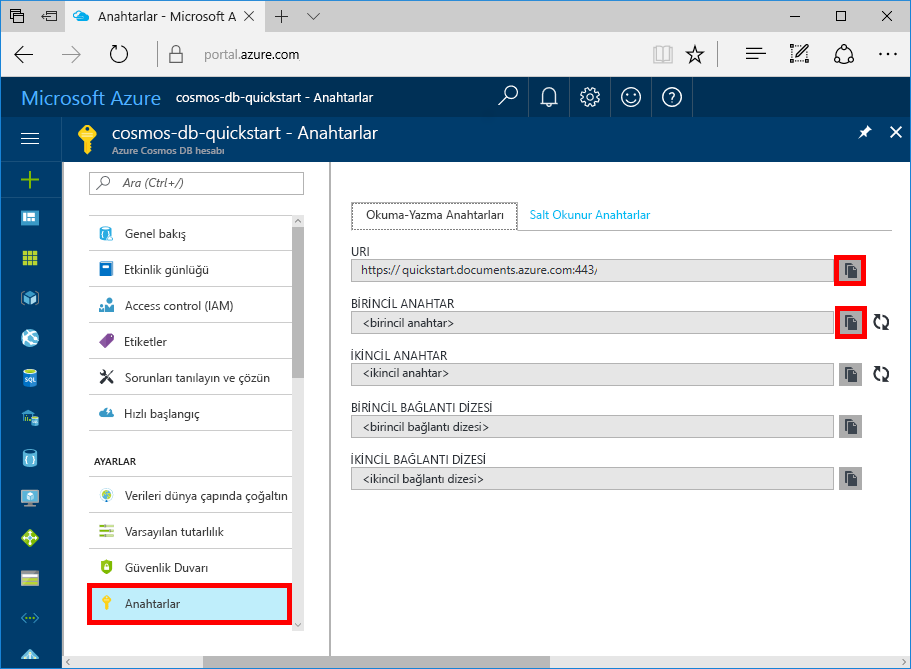

# <a name="quickstart-build-a-todo-app-with-xamarin-using-azure-cosmos-db-sql-api-account"></a>Hızlı Başlangıç: Azure Cosmos DB SQL API hesabı kullanarak Xamarin ile todo uygulaması derleme

> [!div class="op_single_selector"]
> * [.NET](create-sql-api-dotnet.md)
> * [.NET (Önizleme)](create-sql-api-dotnet-preview.md)
> * [Java](create-sql-api-java.md)
> * [Node.js](create-sql-api-nodejs.md)
> * [Python](create-sql-api-python.md)
> * [Xamarin](create-sql-api-xamarin-dotnet.md)
>  

Azure Cosmos DB, Microsoft'un genel olarak dağıtılmış çok modelli veritabanı hizmetidir. Bu hizmetle belge, anahtar/değer ve grafik veritabanlarını kolayca oluşturup sorgulayabilir ve tüm bunları yaparken Azure Cosmos DB'nin genel dağıtım ve yatay ölçeklendirme özelliklerinden faydalanabilirsiniz.

> [!NOTE]
> CosmosDB de dahil birçok Azure teklifini gösteren tamamen kurallı örnek bir Xamarin uygulaması için örnek koda GitHub’da [buradan](https://github.com/xamarinhq/app-geocontacts) erişilebilir. Bu uygulama, coğrafi olarak dağınık kişilerin görüntülenmesini sergileyerek bu kişilerin konumlarını güncelleştirmesine olanak sağlar.

Bu hızlı başlangıç belgesinde Azure portalını kullanarak bir Azure Cosmos DB SQL API hesabını, belge veritabanını ve koleksiyonunu nasıl oluşturacağınız anlatılmıştır. Daha sonra [SQL .NET API](sql-api-sdk-dotnet.md) ile [Xamarin](https://docs.microsoft.com/xamarin/) üzerinde derlenmiş bir todo liste web uygulamasını [Xamarin.Forms](https://docs.microsoft.com/xamarin/) ve [MVVM mimari deseni](https://docs.microsoft.com/xamarin/xamarin-forms/xaml/xaml-basics/data-bindings-to-mvvm) kullanarak derleyip dağıtacaksınız.


## <a name="prerequisites"></a>Önkoşullar

Windows üzerinde geliştirme yapıyorsanız ve Visual Studio yüklü 2019 önceden yüklü değilse, indirip kullanabilirsiniz **ücretsiz** [Visual Studio 2019 Community Edition](https://www.visualstudio.com/downloads/). Visual Studio kurulumu sırasında **Azure geliştirme** ve **.NET ile Mobil Dağıtım** iş yüklerini etkinleştirdiğinizden emin olun.

Mac kullanıyorsanız, [Mac için Visual Studio](https://www.visualstudio.com/vs/mac/)’yu **ücretsiz** olarak indirebilirsiniz.

[!INCLUDE [quickstarts-free-trial-note](../../includes/quickstarts-free-trial-note.md)]
[!INCLUDE [cosmos-db-emulator-docdb-api](../../includes/cosmos-db-emulator-docdb-api.md)]

## <a name="create-a-database-account"></a>Veritabanı hesabı oluşturma

[!INCLUDE [cosmos-db-create-dbaccount](../../includes/cosmos-db-create-dbaccount.md)]

## <a name="add-a-collection"></a>Koleksiyon ekleme

[!INCLUDE [cosmos-db-create-collection](../../includes/cosmos-db-create-collection.md)]

## <a name="add-sample-data"></a>Örnek verileri ekleme

[!INCLUDE [cosmos-db-create-sql-api-add-sample-data](../../includes/cosmos-db-create-sql-api-add-sample-data.md)]

## <a name="query-your-data"></a>Verilerinizi sorgulayın

[!INCLUDE [cosmos-db-create-sql-api-query-data](../../includes/cosmos-db-create-sql-api-query-data.md)]

## <a name="clone-the-sample-application"></a>Örnek uygulamayı kopyalama

Şimdi github'dan Xamarin SQL API'si uygulaması kopyalayalım, kodu gözden geçirin, API anahtarlarını edinin ve uygulamayı çalıştıralım. Verilerle program aracılığıyla çalışmanın ne kadar kolay olduğunu göreceksiniz.

1. Bir komut istemini açın, git-samples adlı yeni bir klasör oluşturun ve komut istemini kapatın.

    ```bash
    md "C:\git-samples"
    ```

2. Git Bash gibi bir Git terminal penceresi açın ve örnek uygulamayı yüklemek üzere yeni bir klasör olarak değiştirmek için `cd` komutunu kullanın.

    ```bash
    cd "C:\git-samples"
    ```

3. Örnek depoyu kopyalamak için aşağıdaki komutu çalıştırın. Bu komut bilgisayarınızda örnek uygulamanın bir kopyasını oluşturur.

    ```bash
    git clone https://github.com/Azure-Samples/azure-cosmos-db-sql-xamarin-getting-started.git
    ```

4. Ardından Visual Studio’da samples/xamarin/ToDoItems klasöründen ToDoItems.sln dosyasını açın.

## <a name="obtain-your-api-keys"></a>API anahtarlarınızı edinme

Azure portalına geri dönerek API anahtarı bilgilerini alın ve uygulamaya kopyalayın.

1. [Azure portalında](https://portal.azure.com/), Azure Cosmos DB SQL API hesabınızın sol taraftaki gezinti menüsünden **Anahtarlar**'a ve ardından **Okuma/Yazma Anahtarları**'na tıklayın. Ekranın sağ tarafındaki kopyalama düğmelerini kullanarak URI ve Birincil Anahtar değerlerini kopyalayarak sonraki adımda APIKeys.cs dosyasına yapıştırın.

    

2. Visual Studio 2019 veya Mac için Visual Studio azure-documentdb-dotnet/samples/xamarin/ToDoItems/ToDoItems.Core/Helpers klasöründen Apıkeys.cs dosyasını açın.

3. Portaldaki URI değerinizi kopyalayın (kopyalama düğmesini kullanarak) ve APIKeys.cs dosyasındaki `CosmosEndpointUrl` değişkeninin değeri yapın.

    `public static readonly string CosmosEndpointUrl = "{Azure Cosmos DB account URL}";`

4. Ardından portaldaki BİRİNCİL ANAHTAR değerinizi kopyalayıp APIKeys.cs dosyasına `Cosmos Auth Key` değeri olarak yapıştırın.

    `public static readonly string CosmosAuthKey = "{Azure Cosmos DB secret}";`

[!INCLUDE [cosmos-db-auth-key-info](../../includes/cosmos-db-auth-key-info.md)]

## <a name="review-the-code"></a>Kodu gözden geçirin

Bu çözüm, Azure Cosmos DB SQL API ve Xamarin.Forms kullanarak bir ToDo uygulaması oluşturma işlemini gösterir. Uygulamada iki sekme bulunur; birinci sekme henüz tamamlanmamış todo öğelerini gösteren bir liste görünümü içerir. İkinci sekme tamamlanmış todo öğelerini gösterir. Birinci sekmede tamamlanmamış todo öğelerini görüntülemeye ek olarak yeni todo öğeleri ekleyebilir, var olanları düzenleyebilir ve öğeleri tamamlandı olarak işaretleyebilirsiniz.


ToDoItems çözümündeki kod şunları içerir:

* Todoıtems.Core: Bu, bir Xamarin.Forms projesi ve Azure Cosmos DB'de todo öğelerini sürdüren bir paylaşılan uygulama mantığı kod, .NET standart bir projedir.
* Todoıtems.Android: Bu proje Android uygulamasını içerir.
* Todoıtems.iOS: Bu proje iOS uygulamasını içerir.

Şimdi uygulamanın Azure Cosmos DB ile nasıl iletişim kurduğuna hızlıca göz atalım.

* [Microsoft.Azure.DocumentDb.Core](https://www.nuget.org/packages/Microsoft.Azure.DocumentDB.Core/) NuGet paketinin tüm projelere eklenmesi gerekir.
* azure-documentdb-dotnet/samples/xamarin/ToDoItems/ToDoItems.Core/Models klasöründeki `ToDoItem` sınıfı, yukarıda oluşturulan **Items** koleksiyonundaki belgeleri modeller. Özellik adlarının büyük/küçük harfe duyarlı olduğunu unutmayın.
* azure-documentdb-dotnet/samples/xamarin/ToDoItems/ToDoItems.Core/Services klasöründeki `CosmosDBService` sınıfı, Azure Cosmos DB ile iletişimi kapsüller.
* `CosmosDBService` sınıfında bir `DocumentClient` tür değişkeni bulunur. `DocumentClient`, Azure Cosmos DB hesabına göre istekleri yapılandırıp yürütmek için kullanılır ve 31. satırda örneği oluşturulur:

    ```csharp
    docClient = new DocumentClient(new Uri(APIKeys.CosmosEndpointUrl), APIKeys.CosmosAuthKey);
    ```

* Bir belge koleksiyonu sorgulanırken, buradaki `CosmosDBService.GetToDoItems` işlevinde görüldüğü gibi `DocumentClient.CreateDocumentQuery<T>` yöntemi kullanılır:

    ```csharp
    public async static Task<List<ToDoItem>> GetToDoItems()
    {
        var todos = new List<ToDoItem>();

        var todoQuery = docClient.CreateDocumentQuery<ToDoItem>(
                                UriFactory.CreateDocumentCollectionUri(databaseName, collectionName),
                                .Where(todo => todo.Completed == false)
                                .AsDocumentQuery();

        while (todoQuery.HasMoreResults)
        {
            var queryResults = await todoQuery.ExecuteNextAsync<ToDoItem>();

            todos.AddRange(queryResults);
        }

        return todos;
    }
    ```

    `CreateDocumentQuery<T>`, önceki bölümde oluşturulan koleksiyona işaret eden bir URI alır. Ayrıca, bir `Where` yan tümcesi gibi LINQ işleçleri belirtebilirsiniz. Bu durumda yalnızca tamamlanmamış todo öğeleri döndürülür.

    `CreateDocumentQuery<T>` işlevi zaman uyumlu olarak yürütülür ve bir `IQueryable<T>` döndürür. Ancak, `AsDocumentQuery` yöntemi `IQueryable<T>` değerini zaman uyumsuz olarak yürütülebilen bir `IDocumentQuery<T>` nesnesine dönüştürür. Böylece, mobil uygulamalar için kullanıcı arabirimi iş parçacığı engellenmez.

    `IDocumentQuery<T>.ExecuteNextAsync<T>` işlevi Azure Cosmos DB’den sonuç sayfasını alır ve bu sayfa, döndürülecek başka sonuçların kalıp kalmadığını görmek üzere `HasMoreResults` tarafından denetlenir.

> [!TIP]
> Azure Cosmos DB koleksiyonları ve belgeleri üzerinde çalışan birkaç işlev, koleksiyon veya belgenin adresini belirten bir parametre olarak URI alır. Bu URI `URIFactory` sınıfı kullanılarak oluşturulur. Veritabanı, koleksiyon ve belge URI'lerinin tümü bu sınıfla oluşturulabilir.

* 107. satırdaki `ComsmosDBService.InsertToDoItem` işlevi yeni bir belge ekleme işlemini gösterir:

    ```csharp
    public async static Task InsertToDoItem(ToDoItem item)
    {
        ...
        await docClient.CreateDocumentAsync(UriFactory.CreateDocumentCollectionUri(databaseName, collectionName), item);
        ...
    }
    ```

    Belge toplama URI’sinin yanı sıra eklenecek öğe belirtilir.

* 124. satırdaki `CosmosDBService.UpdateToDoItem` işlevi, var olan bir belgeyi yeni bir belgeyle değiştirme işlemini gösterir:

    ```csharp
    public async static Task UpdateToDoItem(ToDoItem item)
    {
        ...
        var docUri = UriFactory.CreateDocumentUri(databaseName, collectionName, item.Id);

        await docClient.ReplaceDocumentAsync(docUri, item);
    }
    ```

    Burada değiştirilecek belgeyi benzersiz bir şekilde tanımlamak için yeni bir URI gerekir ve bu URI, `UriFactory.CreateDocumentUri` kullanılarak ve veritabanı ile koleksiyon adlarının yanında belgenin kimliği geçirilerek elde edilir.

    `DocumentClient.ReplaceDocumentAsync`, URI tarafından tanımlanan belgeyi parametre olarak belirtilen bir belgeyle değiştirir.

* Bir öğenin silindiği, 115. satırdaki `CosmosDBService.DeleteToDoItem` işlevi ile gösterilir:

    ```csharp
    public async static Task DeleteToDoItem(ToDoItem item)
    {
        ...
        var docUri = UriFactory.CreateDocumentUri(databaseName, collectionName, item.Id);

        await docClient.DeleteDocumentAsync(docUri);
    }
    ```

    Belgenin benzersiz olan URI'si oluşturulur ve geçirilen yeniden unutmayın `DocumentClient.DeleteDocumentAsync` işlevi.

## <a name="run-the-app"></a>Uygulamayı çalıştırma

Bu adımlarla uygulamanıza Azure Cosmos DB ile iletişim kurması için gereken tüm bilgileri eklemiş oldunuz.

Aşağıdaki adımlarda, Mac için Visual Studio hata ayıklayıcısı kullanılarak uygulamayı çalıştırma işlemi gösterilecektir.

> [!NOTE]
> Android sürümündeki bir uygulama da tamamen aynı şekilde kullanılır ve her türlü değişiklik aşağıdaki adımlarda belirtilir. Windows üzerinde Visual Studio hatalarını ayıklamak isterseniz buna yönelik belgeler [iOS için burada](https://docs.microsoft.com/xamarin/ios/deploy-test/debugging-in-xamarin-ios?tabs=vswin) ve [Android için burada](https://docs.microsoft.com/xamarin/android/deploy-test/debugging/) bulunabilir.

1. İlk olarak vurgulanan açılır listeye tıklayarak ve iOS için ToDoItems.iOS, Android için ToDoItems.Android öğesini seçerek hedeflemek istediğiniz platformu seçin.

    

2. Uygulamada hata ayıklamaya başlamak için cmd+Enter tuşlarına basın veya oynat düğmesine tıklayın.

    

3. iOS simülatörü veya Android öykünücüsü başlatma işlemini tamamladığında, uygulama iOS için alt ekranda ve Android için üst ekranda 2 sekme gösterir. Birinci sekme tamamlanmamış todo öğelerini, ikinci sekme ise tamamlanmış todo öğelerini gösterir.

    

4. iOS’ta bir todo öğesini tamamlamak için sola kaydırın > **Tamamla** düğmesine dokunun. Android’de bir todo öğesini tamamlamak için öğeye uzun basın > ardından tamamla düğmesine dokunun.

    

5. Bir todo öğesini düzenlemek için > öğeye dokunun > yeni değerler girmenize olanak tanıyan yeni bir ekran görüntülenir. Kaydet düğmesine dokunduğunuzda değişiklikler Azure Cosmos DB’de kalıcı hale gelir.

    

6. Bir todo öğesi eklemek için > giriş ekranının sağ üst köşesindeki **Ekle** düğmesine dokunun > yeni ve boş bir düzenleme sayfası görüntülenir.

    

## <a name="review-slas-in-the-azure-portal"></a>Azure portalında SLA'ları gözden geçirme

[!INCLUDE [cosmosdb-tutorial-review-slas](../../includes/cosmos-db-tutorial-review-slas.md)]

## <a name="clean-up-resources"></a>Kaynakları temizleme

[!INCLUDE [cosmosdb-delete-resource-group](../../includes/cosmos-db-delete-resource-group.md)]

## <a name="next-steps"></a>Sonraki adımlar

Bu hızlı başlangıçta Azure Cosmos DB hesabı oluşturmayı, Veri Gezgini'ni kullanarak koleksiyon oluşturmayı ve bir Xamarin uygulaması derleyip dağıtmayı öğrendiniz. Şimdi Azure Cosmos DB hesabınıza ek veriler aktarabilirsiniz.

> [!div class="nextstepaction"]
> [Azure Cosmos DB hesabınıza veri aktarma](import-data.md)
