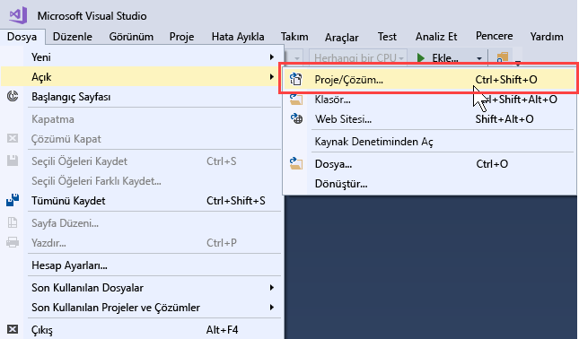
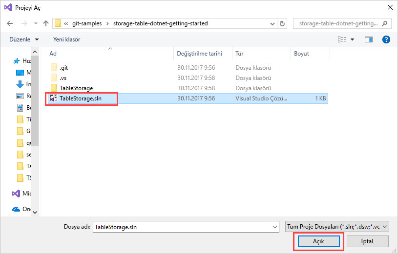
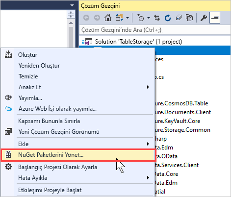
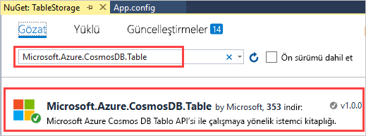
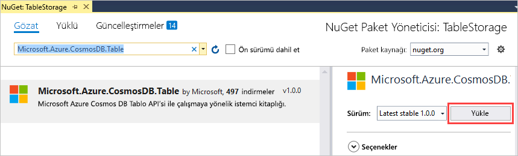
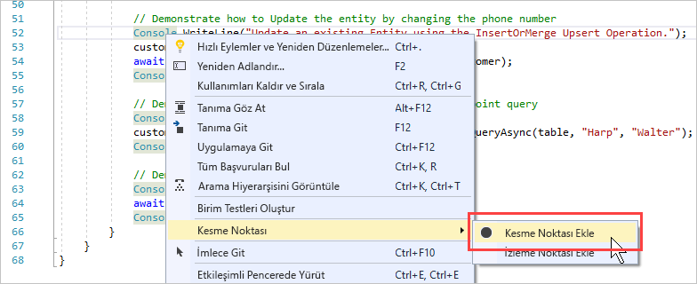
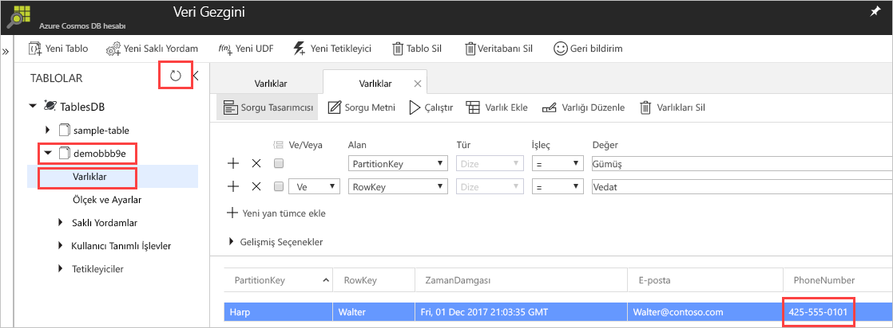

# <a name="quickstart-build-a-table-api-app-with-net-and-azure-cosmos-db"></a>Hızlı Başlangıç: .NET ve Azure Cosmos DB ile Tablo API’si uygulaması oluşturma 

Bu hızlı başlangıçta GitHub’dan bir örneği kopyalayarak bir uygulama oluşturmak için .NET ve Azure Cosmos DB [Tablo API’sini](table-introduction.md) nasıl kullanacağınız gösterilmektedir. Bu hızlı başlangıçta ayrıca Azure Cosmos DB hesabı oluşturma ve web tabanlı Azure portalında tablo ve varlıklar oluşturmak için Veri Gezgini’ni kullanma da gösterilmektedir.

Azure Cosmos DB, Microsoft'un genel olarak dağıtılmış çok modelli veritabanı hizmetidir. Bu hizmetle belge, anahtar/değer ve grafik veritabanlarını kolayca oluşturup sorgulayabilir ve tüm bunları yaparken Azure Cosmos DB'nin genel dağıtım ve yatay ölçeklendirme özelliklerinden faydalanabilirsiniz. 

## <a name="prerequisites"></a>Ön koşullar

Henüz Visual Studio 2017’yi yüklemediyseniz, **ücretsiz** [Visual Studio 2017 Community Edition](https://www.visualstudio.com/downloads/)’ı indirip kullanabilirsiniz. Visual Studio kurulumu sırasında **Azure dağıtımını** etkinleştirdiğinizden emin olun.

[!INCLUDE [quickstarts-free-trial-note](../../includes/quickstarts-free-trial-note.md)]

## <a name="create-a-database-account"></a>Veritabanı hesabı oluşturma

> [!IMPORTANT] 
> Genel olarak kullanılabilir Tablo API'si SDK'ları ile çalışmak için yeni bir Tablo API'si hesabı oluşturmanız gerekir. Önizleme sırasında oluşturulan Tablo API’si hesapları genel olarak kullanılabilir SDK’lar tarafından desteklenmez.
>

[!INCLUDE [cosmos-db-create-dbaccount-table](../../includes/cosmos-db-create-dbaccount-table.md)]

## <a name="add-a-table"></a>Tablo ekleme

[!INCLUDE [cosmos-db-create-table](../../includes/cosmos-db-create-table.md)]

## <a name="add-sample-data"></a>Örnek verileri ekleme

[!INCLUDE [cosmos-db-create-table-add-sample-data](../../includes/cosmos-db-create-table-add-sample-data.md)]

## <a name="clone-the-sample-application"></a>Örnek uygulamayı kopyalama

Şimdi GitHub'dan bir Tablo uygulaması kopyalayalım, bağlantı dizesini ayarlayalım ve uygulamayı çalıştıralım. Verilerle program aracılığıyla çalışmanın ne kadar kolay olduğunu göreceksiniz. 

1. Bir komut istemini açın, git-samples adlı yeni bir klasör oluşturun ve komut istemini kapatın.

    ```bash
    md "C:\git-samples"
    ```

2. Git Bash gibi bir Git terminal penceresi açın ve örnek uygulamayı yüklemek üzere yeni bir klasör olarak değiştirmek için `cd` komutunu kullanın.

    ```bash
    cd "C:\git-samples"
    ```

3. Örnek depoyu kopyalamak için aşağıdaki komutu çalıştırın. Bu komut bilgisayarınızda örnek uygulamanın bir kopyasını oluşturur.

    ```bash
    git clone https://github.com/Azure-Samples/storage-table-dotnet-getting-started.git
    ```
## <a name="open-the-sample-application-in-visual-studio"></a>Örnek uygulamayı Visual Studio'da açma

1. Visual Studio'da **Dosya** menüsünden **Aç**'ı ve ardından **Proje/Çözüm**'ü seçin. 

    

2. Örnek uygulamayı kopyaladığınız klasöre gidip TableStorage.sln dosyasını açın.

    

## <a name="update-your-connection-string"></a>Bağlantı dizenizi güncelleştirme

Bu adımda Azure portalına dönerek bağlantı dizesi bilgilerinizi kopyalayıp uygulamaya ekleyin. Bu, uygulamanızın barındırılan veritabanıyla iletişim kurmasına olanak tanır. 

1. [Azure portalında](http://portal.azure.com/) **Bağlantı Dizesi**’ne tıklayın. 

    Pencerenin sağ tarafındaki kopyala düğmesini kullanarak **PRIMARY CONNECTION STRING**'i kopyalayın.

    

2. Visual Studio'da App.config dosyasını açın. 

3. Bu öğretici Azure SDK'sı Depolama Öykünücüsü kullanmadığından 8. satırdaki StorageConnectionString öğesini açıklama durumundan çıkarın ve 7. satırdaki StorageConnectionString öğesini açıklama yapın. 7. ve 8. satır artık şöyle görünmelidir:

    ```
    <!--key="StorageConnectionString" value="UseDevelopmentStorage=true;" />-->
    <add key="StorageConnectionString" value="DefaultEndpointsProtocol=https;AccountName=[AccountName];AccountKey=[AccountKey]" />
    ```

4. Portaldan aldığınız **PRIMARY CONNECTION STRING**'i 8. satırdaki StorageConnectionString değerine yapıştırın. Dizeyi tırnak işareti içinde yapıştırın. 

    > [!IMPORTANT]
    > Uç Noktanız documents.azure.com kullanıyorsa, bir önizleme hesabınız var demektir ve genel olarak kullanılabilir Tablo API'si SDK'ları ile çalışmak için [yeni bir Tablo API'si hesabı](#create-a-database-account) oluşturmanız gerekir. 
    > 

    8. satır şimdi şuna benzer şekilde görünmelidir:

    ```
    <add key="StorageConnectionString" value="DefaultEndpointsProtocol=https;AccountName=<account name>;AccountKey=txZACN9f...==;TableEndpoint=https://<account name>.table.cosmosdb.azure.com;" />
    ```

5. CTRL+S tuşlarına basarak App.config dosyasını kaydedin.

Bu adımlarla uygulamanıza Azure Cosmos DB ile iletişim kurması için gereken tüm bilgileri eklemiş oldunuz. 

## <a name="build-and-deploy-the-app"></a>Uygulama derleme ve dağıtma

1. Visual Studio'nun **Çözüm Gezgini**’nde **TableStorage** projesine sağ tıklayın ve ardından **NuGet Paketlerini Yönet**'e tıklayın. 

   
2. NuGet **Gözat** kutusuna *Microsoft.Azure.CosmosDB.Table* yazın. Cosmos DB Table API istemci kitaplığı görüntülenir.
   
   

3. **Microsoft.Azure.CosmosDB.Table** kitaplığını yüklemek için **Yükle**'ye tıklayın. Bunu yaptığınızda Azure Cosmos DB Tablo API paketi ve tüm bağımlılıklar yüklenir.

    

4. BasicSamples.cs dosyasını açın. 52. satıra sağ tıklayın, **Kesme Noktası**'nı ve ardından **Kesme Noktası Ekle**'yi seçin. 55. satıra da bir kesme noktası ekleyin.

    

5. Uygulamayı çalıştırmak için F5'e basın.

    Konsol penceresinde, Azure Cosmos DB içinde yeni tablo veritabanının adı (bu örnekte demo91ab4) görüntülenir. 
    
    

    Bağımlılıklarla ilgili bir hata alırsanız bkz. [Sorun giderme](table-sdk-dotnet.md#troubleshooting).

    İlk kesme noktasına ulaştığınızda Azure portalında Veri Gezgini'ne dönün. **Yenile** düğmesine tıklayın, demo* tablosunu genişletin ve **Varlıklar**'a tıklayın. Sağdaki **Varlıklar** sekmesinde Walter Harp için eklenmiş olan yeni varlık gösterilir. Yeni varlığın telefon numarasının 425-555-0101 olduğuna dikkat edin.

    
    
6. Veri Gezgini'nde **Varlıklar** sekmesini kapatın.
    
7. Uygulamayı bir sonraki kesme noktasına kadar çalıştırmak için F5'e basın. 

    Kesme noktasına ulaştığınızda Azure portalına dönün, yeniden **Varlıklar**'a tıklayarak **Varlıklar** sekmesini açın ve telefon numarasının 425-555-0105 olarak güncelleştirildiğine dikkat edin.

8. Uygulamayı çalıştırmak için F5'e basın. 
 
   Uygulama varlıkları Tablo API'si tarafından desteklenmeyen gelişmiş örnek uygulamada kullanılmak üzere ekler. Uygulama ardından örnek uygulama tarafından oluşturulan tabloyu siler.

9. Konsol penceresinde uygulamanın yürütülmesini sonlandırmak için Enter'a basın. 
  

## <a name="review-slas-in-the-azure-portal"></a>Azure portalında SLA'ları gözden geçirme

[!INCLUDE [cosmosdb-tutorial-review-slas](../../includes/cosmos-db-tutorial-review-slas.md)]

## <a name="clean-up-resources"></a>Kaynakları temizleme

[!INCLUDE [cosmosdb-delete-resource-group](../../includes/cosmos-db-delete-resource-group.md)]

## <a name="next-steps"></a>Sonraki adımlar

Bu hızlı başlangıçta Azure Cosmos DB hesabı oluşturmayı, Veri Gezgini'ni kullanarak tablo oluşturmayı ve bir uygulamayı çalıştırmayı öğrendiniz.  Şimdi Tablo API'sini kullanarak verilerinizi sorgulayabilirsiniz.  

> [!div class="nextstepaction"]
> [Tablo verilerini Tablo API’sine aktarma](table-import.md)

