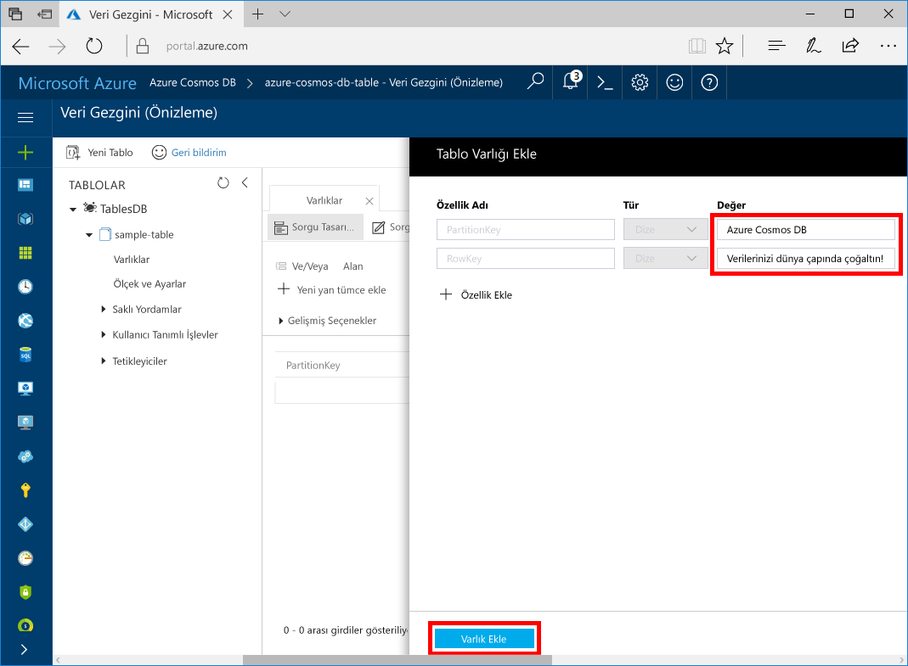

# <a name="quickstart-build-a-table-api-app-with-net-and-azure-cosmos-db"></a>Hızlı Başlangıç: bir tablo .NET ve Azure Cosmos DB ile API uygulaması oluşturma 

Bu hızlı başlangıç Java ve Azure Cosmos DB nasıl kullanılacağını gösterir [tablo API](table-introduction.md) örneği github'dan kopyalanarak bir uygulama oluşturmak için. Bu hızlı başlangıç ayrıca bir Azure Cosmos DB hesabının nasıl oluşturulacağını ve Veri Gezgini tabloları ve varlıkları web tabanlı Azure portalında oluşturmak için nasıl kullanılacağı gösterilmektedir.

Azure Cosmos DB, Microsoft'un genel olarak dağıtılmış çok modelli veritabanı hizmetidir. Bu hizmetle belge, anahtar/değer ve grafik veritabanlarını kolayca oluşturup sorgulayabilir ve tüm bunları yaparken Azure Cosmos DB'nin genel dağıtım ve yatay ölçeklendirme özelliklerinden faydalanabilirsiniz. 

## <a name="prerequisites"></a>Ön koşullar

Henüz Visual Studio 2017’yi yüklemediyseniz, **ücretsiz** [Visual Studio 2017 Community Edition](https://www.visualstudio.com/downloads/)’ı indirip kullanabilirsiniz. Visual Studio kurulumu sırasında **Azure dağıtımını** etkinleştirdiğinizden emin olun.

[!INCLUDE [quickstarts-free-trial-note](../../includes/quickstarts-free-trial-note.md)]

## <a name="create-a-database-account"></a>Veritabanı hesabı oluşturma

> [!IMPORTANT] 
> Genel olarak kullanılabilir tablo API SDK'ları ile çalışmak için yeni bir tablo API hesabı oluşturmanız gerekir. Önizleme sırasında oluşturulan tablo API hesaplarını genel olarak kullanılabilir SDK'ları tarafından desteklenmez.
>

[!INCLUDE [cosmos-db-create-dbaccount-table](../../includes/cosmos-db-create-dbaccount-table.md)]

## <a name="add-a-table"></a>Tablo ekleme

[!INCLUDE [cosmos-db-create-table](../../includes/cosmos-db-create-table.md)]

## <a name="add-sample-data"></a>Örnek verileri ekleme

Şimdi Veri Gezgini'ni kullanarak yeni tablonuza veri ekleyebilirsiniz.

1. Veri Gezgini'nde **sample-table** seçeneğini genişletin, **Varlıklar**'a ve ardından **Varlık Ekle**'ye tıklayın.

   
2. Şimdi veri PartitionKey değer kutusuna ve RowKey değer kutularına ekleyin ve **varlık Ekle**.

   
  
    Artık tablonuza daha fazla varlık ekleyebilir, varlıklarınızı düzenleyebilir veya Veri Gezgini’nde verilerinizi sorgulayabilirsiniz. Veri Gezgini ayrıca aktarım hızınızı ölçeklendirebileceğiniz ve tablonuza depolanmış yordamlar, kullanıcı tarafından tanımlanmış işlevler ve tetikleyiciler ekleyebileceğiniz yerdir.

## <a name="clone-the-sample-application"></a>Örnek uygulamayı kopyalama

Şimdi GitHub'dan bir Tablo uygulaması kopyalayalım, bağlantı dizesini ayarlayalım ve uygulamayı çalıştıralım. Verilerle programlı bir şekilde çalışmanın ne kadar kolay olduğunu göreceksiniz. 

1. Git bash gibi bir git terminal penceresi açın ve kullanmak `cd` örnek uygulamayı yüklemek için bir klasör olarak değiştirmek için komutu. 

    ```bash
    cd "C:\git-samples"
    ```

2. Örnek depoyu kopyalamak için aşağıdaki komutu çalıştırın. Bu komut bilgisayarınızda örnek uygulaması bir kopyasını oluşturur. 

    ```bash
    git clone https://github.com/Azure-Samples/storage-table-dotnet-getting-started.git
    ```

3. Ardından Visual Studio'da TableStorage çözüm dosyasını açın. 

## <a name="update-your-connection-string"></a>Bağlantı dizenizi güncelleştirme

Bu adımda Azure portalına dönerek bağlantı dizesi bilgilerinizi kopyalayıp uygulamaya ekleyin. Bu, barındırılan veritabanıyla iletişim kurmak uygulamanızı sağlar. 

1. İçinde [Azure portal](http://portal.azure.com/), tıklatın **bağlantı dizesi**. 

    BİRİNCİL bağlantı DİZESİNİ kopyalayın için ekranın sağ tarafta kopyalama düğmelerini kullanın.

    

2. Visual Studio'da App.config dosyasını açın. 

3. Bu öğretici depolama öykünücüsünü kullanmaz gibi satır 8 ve yorum 7 satırındaki StorageConnectionString çıkışı StorageConnectionString açıklamadan çıkarın. Satır 7 ve 8 gibi görünmelidir:

    ```
    <!--key="StorageConnectionString" value="UseDevelopmentStorage=true;" />-->
    <add key="StorageConnectionString" value="DefaultEndpointsProtocol=https;AccountName=[AccountName];AccountKey=[AccountKey]" />
    ```

4. StorageConnectionString değerini satırında 8 Portalı'ndan birincil bağlantı DİZESİNİ yapıştırın. Tırnak işaretleri içine dizesini yapıştırın. 

    > [!IMPORTANT]
    > Uç noktanız Önizleme hesabına sahip olduğunuz anlamına gelir, documents.azure.com, kullanıyorsa ve oluşturmak gereken bir [yeni tablo API hesabı](#create-a-database-account) genel olarak kullanılabilir tablo API SDK'sı ile çalışmak için. 
    > 

    Satır 8 benzer şekilde görünmelidir:

    ```
    <add key="StorageConnectionString" value="DefaultEndpointsProtocol=https;AccountName=<account name>;AccountKey=txZACN9f...==;TableEndpoint=https://<account name>.table.cosmosdb.azure.com;" />
    ```

5. App.config dosyasını kaydedin.

Bu adımlarla uygulamanıza Azure Cosmos DB ile iletişim kurması için gereken tüm bilgileri eklemiş oldunuz. 

## <a name="build-and-deploy-the-app"></a>Derleme ve uygulama dağıtma

1. Visual Studio'da sağ **TableStorage** proje **Çözüm Gezgini** ve ardından **NuGet paketlerini Yönet**. 

2. Nuget **Gözat** kutusuna *Microsoft.Azure.CosmosDB.Table*.

3. Sonuçlardan yüklemek **Microsoft.Azure.CosmosDB.Table** kitaplığı. Bu, tüm bağımlılıkları yanı sıra Azure Cosmos DB tablo API paketi yükler.

4. BasicSamples.cs açın ve bir kesme noktası satırı 30 ve satırı 52 ekleyin.

5. Uygulamayı çalıştırmak için CTRL+F5 tuşlarına basın.

    Konsol penceresinde Azure Cosmos veritabanı yeni tablo veritabanına eklenen tablo verileri görüntüler. 
    
    Bağımlılıklar hakkında bir hata alırsanız, bkz: [sorun giderme](table-sdk-dotnet.md#troubleshooting).

    İlk kesme noktası isabet, Veri Gezgini Azure portalında geri dönün ve tanıtım * tablosunu genişletin ve tıklatın **varlıklar**. **Varlıklar** sağa sekmesinde eklenen yeni varlık gösterir, kullanıcı 425-555-0101 için bu telefon numarasını not edin.
    
6. Veri Explorer'da varlıklar sekmesini kapatın.
    
7. Sonraki kesme uygulama çalışmaya devam eder.

    Kesme noktası isabet, portala geri anahtarı, yeniden varlıklar sekmesini açın ve telefon numarası için 425-555-0105 güncelleştirildi not edin varlıklar tıklatın.

8. Konsol penceresine döndüğünüzde, uygulamanın yürütülmesini sonlandırmak için CTRL + C tuşlarına basın. 

    Artık Veri Gezgini için geri dönün ve eklemek veya entitites değiştirmek ve verileri sorgulamak.

## <a name="review-slas-in-the-azure-portal"></a>Azure portalında SLA'ları gözden geçirme

[!INCLUDE [cosmosdb-tutorial-review-slas](../../includes/cosmos-db-tutorial-review-slas.md)]

## <a name="clean-up-resources"></a>Kaynakları temizleme

[!INCLUDE [cosmosdb-delete-resource-group](../../includes/cosmos-db-delete-resource-group.md)]

## <a name="next-steps"></a>Sonraki adımlar

Bu hızlı başlangıçta Azure Cosmos DB hesabı oluşturmayı, Veri Gezgini'ni kullanarak tablo oluşturmayı ve bir uygulamayı çalıştırmayı öğrendiniz.  Şimdi Tablo API'sini kullanarak verilerinizi sorgulayabilirsiniz.  

> [!div class="nextstepaction"]
> [Tablo API için tablo verileri alma](table-import.md)

