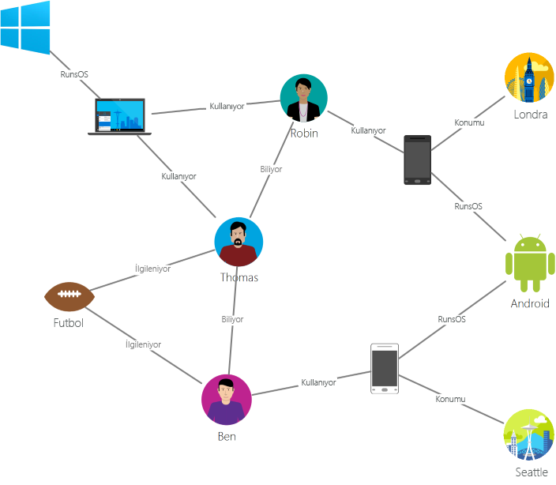
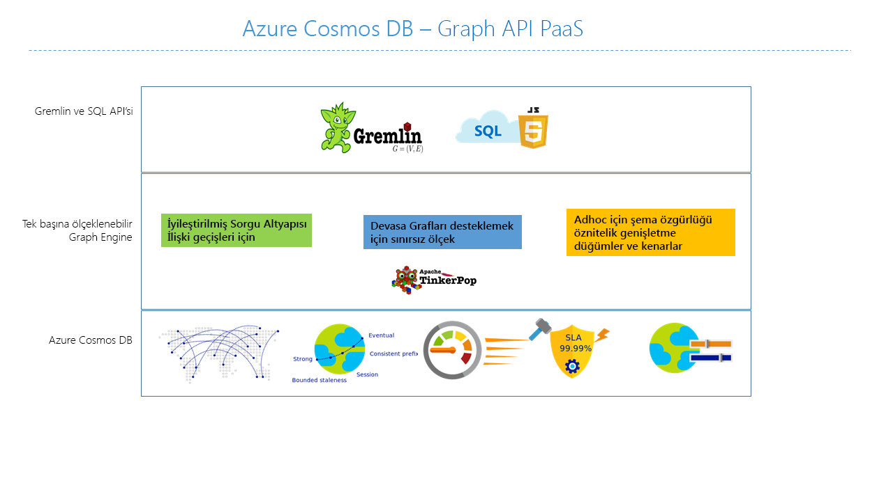

# Azure Cosmos DB’ye giriş: Gremlin API

[Azure Cosmos DB](introduction.md) görev açısından kritik uygulamalar için Microsoft'un Global olarak dağıtılmış çok modelli veritabanı hizmeti. Bu, çok modelli bir veritabanıdır ve belge, anahtar-değer, grafik ve sütunlu veri modellerini destekler. Grafik verilerini depolamak ve üzerinde çalışmak için Azure Cosmos DB Gremlin API’si kullanılır. Gremlin API, Grafik verilerini modellemeyi destekler ve grafik verilerinde dolaşmak için API’ler sağlar.

Bu makale, Azure Cosmos DB Gremlin API'ye genel bir bakış sağlar ve milyarlarca köşesi ve kenarı olan yoğun grafikleri depolamak için bunu nasıl kullanabileceğinizi açıklar. Grafikleri milisaniyelik gecikme süresi ile sorgulayabilir, grafik yapısını ve şemasını kolayca geliştirebilirsiniz. Azure Cosmos DB'yi sorgulamak için [Apache TinkerPop](https://tinkerpop.apache.org) grafik içinde dolaşma dilini veya [Gremlin](https://tinkerpop.apache.org/docs/current/reference/#graph-traversal-steps)'i kullanabilirsiniz.

## Grafik veritabanı nedir
Gerçek dünyada görünen veriler doğal olarak bağlıdır. Geleneksel veri modelleme, varlıklara odaklanır. Birçok uygulamada aynı zamanda modelleme veya hem varlıkları hem de ilişkileri doğal olarak modelleme gereksinimi söz konusudur.

[Grafikler](http://mathworld.wolfram.com/Graph.html), [köşelerden](http://mathworld.wolfram.com/GraphVertex.html) ve [kenarlardan](http://mathworld.wolfram.com/GraphEdge.html) oluşan yapılardır. Köşelerin ve kenarların rastgele bir sayıda özellikleri olabilir. 

* **Köşeler** - Köşeler bir kişi, yer veya etkinlik gibi kesin nesneleri gösterir. 

* **Kenarlar** - Kenarlar, köşeler arasındaki ilişkileri gösterir. Bir kişinin başka bir kişiyi tanıması, bir etkinliğe katılması veya kısa süre önce bir konumda bulunması bağlantılar buna örnek gösterilebilir. 

* **Özellikler** - Özellikler, köşeler ve kenarlar hakkında bilgi ifade eder. Örnek özellikler, adı ve geçerlilik süresi olan bir köşe içerir. Zaman damgası ve/veya ağırlığı olan bir kenar. Bu modele [özellik grafiği](https://tinkerpop.apache.org/docs/current/reference/#intro) de denir. Azure Cosmos DB, özellik grafiği modelini destekler.

Aşağıdaki örnek grafik kişiler, mobil cihazlar, ilgi alanları ve işletim sistemleri arasındaki ilişkileri gösterir:

Grafikleri doğal ve verimli bir şekilde modellemenizi ve depolamanızı sağlayan grafik veritabanları, birçok senaryoda işe yarar. Bu kullanım örnekleri için çoğu zaman şema esnekliği ve hızlı yineleme gerektiğinden, grafik veritabanları genelde NoSQL veritabanlarıdır.

Sosyal ağ, içerik yönetimi, jeo-uzamsal ve öneriler gibi çeşitli etki alanlarındaki sorunları çözmek için grafik veritabanlarının sağladığı hızlı dolaşımları derinlik öncelikli arama, genişlik öncelikli arama ve Dijkstra’nın algoritması gibi grafik algoritmalarıyla birleştirebilirsiniz.

## Azure Cosmos DB grafik veritabanının özellikleri
 
Azure Cosmos DB; genel dağıtım, depolama ve aktarım hızında esnek ölçeklendirme, otomatik dizinleme ve sorgu, ayarlanabilir tutarlılık düzeyleri ve TinkerPop standardı desteği sunan, tam olarak yönetilen bir grafik veritabanıdır.

Azure Cosmos DB pazardaki diğer grafik veritabanlarıyla karşılaştırıldığında aşağıdaki farklı özellikleri sunar:

* Aktarım hızı ve depolamayı esnek bir şekilde ölçeklendirme

  Gerçek dünyadaki grafiklerin, tek bir sunucunun kapasitesinin yetmeyeceği biçimde ölçeklendirilmesi gerekir. Azure Cosmos DB ile grafikleri sorunsuz bir şekilde birden çok sunucu arasında ölçeklendirebilirsiniz. Erişim düzenlerinize dayalı olarak grafiğinizin aktarım hızını da bağımsız biçimde ölçeklendirebilirsiniz. Azure Cosmos DB, neredeyse sınırsız depolama boyutlarına ve sağlanmış aktarım hızına ölçeklenebilen grafik veritabanlarını destekler.

* Çok bölgeli çoğaltma

  Azure Cosmos DB, grafik verilerinizi hesabınızla ilişkilendirdiğiniz tüm bölgelere saydam olarak çoğaltır. Çoğaltma, verilere genel erişim gerektiren uygulamalar geliştirmenize olanak sağlar. Tutarlılık, kullanılabilirlik, performans ve karşılık gelen garanti alanlarında bazı kayıplar olabilir. Azure Cosmos DB, birden çok girişli API’ler için saydam bölgesel yük devretme teklifleri sağlar. Aktarım hızı ve depolamayı esnek bir şekilde ölçeklendirebilirsiniz.

* Bildiğiniz Gremlin sözdizimi ile hızlı sorguları ve çapraz geçişlerine

  Heterojen köşeleri ve kenarları depolayın ve bildiğiniz bir Gremlin söz dizimiyle bu belgeleri sorgulayın. Azure Cosmos DB, tüm içeriğin otomatik olarak dizinini oluşturmak için yüksek derecede eşzamanlı, kilitsiz, günlük yapılı bir dizin oluşturma teknolojisi kullanır. Bu özellik şema ipuçları, ikincil dizinler veya görünümler belirtmek gerekmeden gerçek zamanlı zengin sorgulara ve geçişlere olanak sağlar. Daha fazla bilgi için bkz. [Gremlin kullanarak sorgu grafikleri](gremlin-support.md).

* Tam olarak yönetilir

  Azure Cosmos DB, veritabanı ve makine kaynaklarını yönetme ihtiyacını ortadan kaldırır. Bu tam olarak yönetilen bir Microsoft Azure hizmeti olduğundan sanal makineleri yönetmeniz, yazılımları dağıtıp yapılandırmanız, ölçeklendirmeyi yönetmeniz veya karmaşık veri katmanı yükseltmeleriyle uğraşmanız gerekmez. Tüm grafikler otomatik olarak yedeklenir ve bölgesel arızalara karşı korunur. İhtiyacınız oldukça kolaylıkla bir Azure Cosmos DB hesabı ve sağlama kapasitesi ekleyebilirsiniz, böylece veritabanınızı çalıştırmak ve yönetmek yerine uygulamanıza odaklanmanız sağlanır.

* Otomatik dizin oluşturma

  Azure Cosmos DB, varsayılan olarak grafiğin düğümlerindeki ve kenarlarındaki tüm özelliklerin otomatik olarak dizinini oluşturur ve herhangi bir şemayı ya da ikincil dizinlerin oluşturulmasını beklemez veya gerektirmez.

* Apache TinkerPop ile uyumluluk

  Azure Cosmos DB, yerel olarak Apache TinkerPop standart desteği sunar ve TinkerPop’un etkinleştirildiği diğer grafik sistemleriyle tümleştirilebilir. Bu sayede kolayca Titan veya Neo4j gibi başka bir grafik veritabanından geçiş yapabilir veya Azure Cosmos DB’yi Apache Spark GraphX gibi grafik analizi çerçeveleriyle kullanabilirsiniz.

* Ayarlanabilir tutarlılık düzeyleri

  Tutarlılık ve performans arasında en iyi dengeyi elde etmek için iyi tanımlanmış beş tutarlılık düzeyi arasından seçim yapın. Azure Cosmos DB sorgular ve okuma işlemleri için beş farklı tutarlılık düzeyi sunar: güçlü, sınırlanmış eskime durumu, oturum, tutarlı ön ek ve son. Bu ayrıntılı ve iyi tanımlanmış tutarlılık düzeyleri tutarlılık, kullanılabilirlik ve gecikme süresi arasında sağlam bir denge kurmanıza olanak sağlar. [Azure Cosmos DB'deki ayarlanabilir tutarlılık düzeyleri](consistency-levels.md) sayfasına giderek daha fazla bilgi edinin.

Azure Cosmos DB, aynı kapsayıcıların/veritabanlarının içinde belge ve grafik gibi birden çok modeli de kullanabilir. Grafik verilerini belgelerle yan yana depolamak için bir belge kapsayıcısı kullanabilirsiniz. Aynı verileri grafik olarak sorgulamak için JSON üzerinden SQL sorgularını ve Gremlin sorgularını kullanabilirsiniz.

## başlarken

Azure Cosmos DB Gremlin API hesapları oluşturmak ve bunlara erişim sağlamak için Azure komut satırı arabirimini (CLI), Azure PowerShell’i veya Azure portalı kullanabilirsiniz. Hesap oluşturduktan sonra Gremlin için bir WebSocket ön ucu sunan Gremlin API hizmet uç noktası `https://<youraccount>.gremlin.cosmosdb.azure.com` kullanarak hesapta bulunan grafik veritabanlarına erişebilirsiniz. Uç noktasına bağlanmak ve Java, Node.js veya herhangi bir Gremlin istemci sürücüsünde uygulama oluşturmak için [Gremlin Konsolu](https://tinkerpop.apache.org/docs/current/reference/#gremlin-console) gibi TinkerPop ile uyumlu araçlarınızı yapılandırabilirsiniz.

Aşağıdaki tabloda Azure Cosmos DB’ye karşı kullanabileceğiniz popüler Gremlin sürücüleri gösterilir:

| İndirme | Belgeler | Başlarken | Desteklenen bağlayıcı sürümü |
| --- | --- | --- | --- |
| [.NET](https://tinkerpop.apache.org/docs/3.3.1/reference/#gremlin-DotNet) | [GitHub’da Gremlin.NET](https://github.com/apache/tinkerpop/tree/master/gremlin-dotnet) | [.NET kullanarak Grafik oluşturma](create-graph-dotnet.md) | 3.4.0-RC2 |
| [Java](https://mvnrepository.com/artifact/com.tinkerpop.gremlin/gremlin-java) | [Gremlin JavaDoc](https://tinkerpop.apache.org/javadocs/current/full/) | [Java kullanarak Grafik oluşturma](create-graph-java.md) | 3.2.0+ |
| [Node.js](https://www.npmjs.com/package/gremlin) | [GitHub’da Gremlin-JavaScript](https://github.com/jbmusso/gremlin-javascript) | [Node.js kullanarak Grafik oluşturma](create-graph-nodejs.md) | 2.6.0|
| [Python](https://tinkerpop.apache.org/docs/3.3.1/reference/#gremlin-python) | [Gremlin-Python on GitHub](https://github.com/apache/tinkerpop/tree/master/gremlin-python) | [Python kullanarak Grafik oluşturma](create-graph-python.md) | 3.2.7 |
| [PHP](https://packagist.org/packages/brightzone/gremlin-php) | [Github'da Gremlin-PHP](https://github.com/PommeVerte/gremlin-php) | [PHP kullanarak Grafik oluşturma](create-graph-php.md) | 3.1.0 |
| [Gremlin konsolu](https://tinkerpop.apache.org/downloads.html) | [TinkerPop belgeleri](https://tinkerpop.apache.org/docs/current/reference/#gremlin-console) |  [Gremlin konsolunu kullanarak Grafik oluşturma](create-graph-gremlin-console.md) | 3.2.0 + |

## Grafik veritabanı tasarımında dikkat edilmesi gerekenler

Grafik tasarımı sırasında bir varlık olarak kendi, başlangıcı yerine sonundan özelliği diğer köşe varlıklar olarak bir köşe modelleme kararı, performans ve maliyet etkilere sahiptir. Bu konuda verilecek kararın temel dayanağı, verilerin sorgulanma şekli ile modelin kendisinin ölçeklenebilirlik özelliğidir.

Varlığın nasıl modelleneceğini planlamadan önce aşağıdaki soruları göz önünde bulundurun:

* Sorgularımın çoğu için köşeler olarak alınması gereken varlıklar nelerdir?

* Veri filtreleme amacıyla eklenen grafiğe dahil ettiğim bilgiler nedir?

* Hangi varlıklar yalnızca, daha sonra değerleri için alınan başka varlıklara bağlantıdan ibarettir?

* Sorgumun hangi bilgileri alması gerek ve bunların oluşturacağı RU ücreti nedir?

Örneğin, aşağıdaki grafik tasarımını varsayın:

* Sorgulara bağlı olarak, Depolama köşelerinin filtrelenmesi için, Bölge->Depolama ilişkisinin benzersiz şekilde kullanılması mümkündür. Örneğin, sorgular “belirli bir bölgeye ait tüm depoları al” biçimindeyse. Bu durumda Bölge varlığını kendi köşesinden, Depo köşesinin bir özelliğine daraltmayı dikkate almaya değer. 

* Bu yaklaşım, bir seferde (Bölge, Bölge->Depo, Depo) üç grafik nesnesi edinmekten gelen her Depo köşesini tek bir Depo köşesine alma maliyetini azaltma avantajına sahiptir. Bu, sorgu başına azaltılmış maliyetin yanı sıra performans geliştirmesi de sağlayabilir.

* Çünkü Depo köşesi iki farklı varlığa bağlıdır; Çalışan ve Ürün. Dolaşma için ek olasılıklar sağlayabildiğinden Depoyu gerekli bir köşe yapar.  

## Gremlin API kullanabilen senaryolar
Azure Cosmos DB’nin grafik desteğinin kullanılabileceği bazı senaryolar aşağıda verilmiştir:

* Sosyal ağlar

  Müşterileriniz ve diğer kişilerle etkileşimleri hakkındaki verileri birleştirerek kişiselleştirilmiş deneyimleri geliştirebilir, müşteri davranışını tahmin edebilir veya kişileri benzer ilgi alanlarına sahip başkalarına bağlayabilirsiniz. Azure Cosmos DB, sosyal ağları yönetmek ve müşteri tercihlerini ve verilerini izlemek için kullanılabilir.

* Öneri altyapıları

  Bu senaryo, perakende sektöründe yaygın olarak kullanılır. Ürünler, kullanıcılar ve satın alma, gözatma veya bir öğeyi derecelendirme gibi kullanıcı etkileşimleri hakkındaki bilgileri birleştirerek özelleştirilmiş öneriler oluşturabilirsiniz. Azure Cosmos DB’nin düşük gecikme süresi, esnek ölçek ve yerel grafik desteği, bu etkileşimleri modelleme için idealdir.

* Jeo-uzamsal

  Telekomünikasyon, lojistik ve seyahat planlama alanlarındaki birçok uygulamanın, bir bölgede ilgi çekici bir konum bulması veya iki konum arasındaki en kısa/en uygun yolu belirlemesi gerekir. Azure Cosmos DB, bu sorunları için idealdir.

* Nesnelerin İnterneti

  IOT cihazları arasındaki ağ ve bağlantılar bir grafik olarak modellendiğinde, cihazlarınızın ve varlıklarınızın durumunu daha iyi kavrayabilirsiniz. Ayrıca ağın bir bölümündeki değişikliklerin başka bir bölümü nasıl etkileyebileceğini de öğrenebilirsiniz.

## Sonraki adımlar
Azure Cosmos DB’de grafik desteği hakkında daha fazla bilgi için bkz.

* [Azure Cosmos DB grafik öğreticisi](create-graph-dotnet.md) ile çalışmaya başlayın.
* [Azure Cosmos DB’de Gremlin kullanarak grafikleri sorgulamayı](gremlin-support.md) öğrenin.
