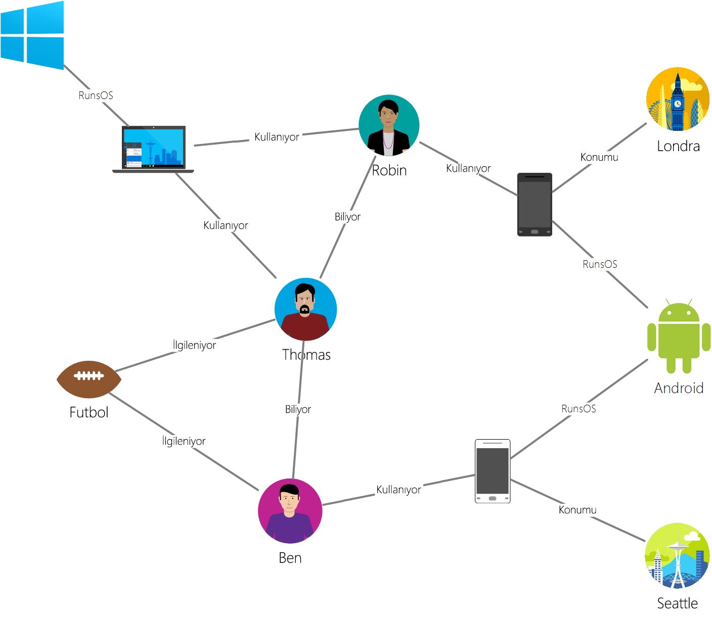

# <a name="azure-cosmos-db-gremlin-graph-support"></a>Azure Cosmos DB Gremlin grafik desteği
Azure Cosmos DB destekler [Apache Tinkerpop'ın](https://tinkerpop.apache.org) grafik olarak bilinen, çapraz dil [Gremlin](https://tinkerpop.apache.org/docs/current/reference/#graph-traversal-steps). Grafik varlıkları (köşeler ve kenarlar) oluşturmak, bu varlıkların içindeki özellikleri değiştirmek, sorgu ve geçiş işlemleri gerçekleştirmek ve varlıkları silmek için Gremlin dilini kullanabilirsiniz. 

Azure Cosmos DB, kurumsal kullanıma hazır özellikleri grafik veritabanlarına getirir. Bu özellikler genel dağıtım, ölçeklendirme depolama ve aktarım hızı, tahmin edilebilir Tek haneli milisaniyelik gecikme süreleri, bağımsız okuma veritabanı hesaplarında iki veya daha fazla Azure bölgesini kapsayan için kullanılabilirlik SLA'ları, otomatik dizin. Azure Cosmos DB TinkerPop/Gremlin desteklediğinden, başka bir uyumlu bir grafik veritabanını kullanarak yazılmış uygulamaları kolayca geçiş yapabilirsiniz. Azure Cosmos DB, Gremlin desteği sayesinde [Apache Spark GraphX](https://spark.apache.org/graphx/) gibi TinkerPop etkin analitik çerçevelerle de sorunsuz bir şekilde tümleşir. 

Bu makalede Gremlin ilişkin hızlı bir kılavuz sağlar ve Gremlin API'sı tarafından desteklenmeyen Gremlin özellikleri listeleme.

## <a name="gremlin-by-example"></a>Örneğe göre Gremlin
Sorguların Gremlin’de nasıl ifade edildiğini anlamak için örnek bir grafik kullanalım. Aşağıdaki şekilde kullanıcılar, ilgi alanları ve cihazlar hakkındaki verileri yöneten bir iş uygulaması grafik biçiminde gösterilir.  

 

Bu grafikte aşağıdaki köşe türleri (Gremlin’de “etiket” olarak adlandırılır) vardır:

- Kişiler: Grafiği bir kez deneme Thomas ve Ben üç kişi vardır
- İlgi alanları: Bu örnekte, oyunu futbol kendi ilgi alanlarına
- Cihazlar: Kullanımı cihazlar
- İşletim sistemleri: Cihaz üzerinde çalışan işletim sistemleri

Aşağıdaki kenar türleri/etiketleri üzerinden bu varlıklar arasındaki ilişkiyi temsil ediyoruz:

- Bilir: Örneğin, "Thomas Robin bilir"
- İster misiniz: Bizim Graph'te kişiler, örneğin, "Ben futbol ilgilenmektedir" ilgi alanları göstermek için
- RunsOS: Dizüstü bilgisayar Windows işletim sistemi çalıştırır.
- Kullanır: Bir kişi hangi cihaz göstermek için kullanır. Örneğin Robin, seri numarası 77 olan bir Motorola telefon kullanır

Şimdi [Gremlin Console](https://tinkerpop.apache.org/docs/current/reference/#gremlin-console)’u kullanarak bu grafiğe yönelik birkaç işlem yapalım. Dilerseniz bu işlemleri, tercih ettiğiniz platformdaki (Java, Node.js, Python veya .NET) Gremlin sürücülerini kullanarak da gerçekleştirebilirsiniz.  Azure Cosmos DB’de nelerin desteklendiğine bakmadan önce söz dizimine hakkında bilgi edinmek için birkaç örneğe bakalım.

İlk olarak CRUD’a bakalım. Aşağıdaki Gremlin deyimi “Thomas” köşesini grafiğe ekler:

```
:> g.addV('person').property('id', 'thomas.1').property('firstName', 'Thomas').property('lastName', 'Andersen').property('age', 44)
```

Daha sonra aşağıdaki Gremlin deyimi, Thomas ve Robin arasına bir “Tanıma” kenarı ekler.

```
:> g.V('thomas.1').addE('knows').to(g.V('robin.1'))
```

Aşağıdaki sorgu, “kişiler” köşesini ilk adlarına göre azalan sırada döndürür:
```
:> g.V().hasLabel('person').order().by('firstName', decr)
```

Grafiklerin asıl iyi olduğu kısımlar, “Thomas’ın arkadaşları hangi işletim sistemini kullanıyor?” gibi sorular sorduğunuzda ortaya çıkıyor. Grafikten ilgili bilgi almak için bu Gremlin geçişi çalıştırabilirsiniz:

```
:> g.V('thomas.1').out('knows').out('uses').out('runsos').group().by('name').by(count())
```
Şimdi de Azure Cosmos DB’nin Gremlin geliştiricilerine neler sunduğuna bakalım.

## <a name="gremlin-features"></a>Gremlin özellikleri
TinkerPop, çeşitli grafik teknolojilerini kapsayan bir standarttır. Bu nedenle bir grafik sağlayıcısı tarafından sağlanan özellikleri tanımlamaya yönelik standart bir terminolojisi vardır. Azure Cosmos DB kalıcı, yüksek eşzamanlılığa sahip, birden çok sunucu ve kümeye ayrılabilen yazılabilir bir grafik veritabanı sağlar. 

Aşağıdaki tabloda Azure Cosmos DB tarafından uygulanan TinkerPop özellikleri listelenmektedir: 

| Kategori | Azure Cosmos DB uygulaması |  Notlar | 
| --- | --- | --- |
| Grafik özellikleri | Kalıcılık ve EşzamanlıErişim sağlar. İşlemleri desteklemek için tasarlanmıştır | Bilgisayar yöntemleri, Spark bağlayıcısı tarafından uygulanabilir. |
| Değişken özellikleri | Boolean, Tamsayı, Bayt, Çift, Kayan Sayı, Uzun, Dize destekler | İlkel türleri destekler ve veri modeli aracılığıyla oluşan karmaşık türlerle uyumludur |
| Köşe özellikleri | RemoveVertices, MetaProperties, AddVertices, MultiProperties, StringIds, UserSuppliedIds, AddProperty, RemoveProperty işlevlerini destekler  | Köşe oluşturma, değiştirme ve silmeyi destekler |
| Köşe özellikleri | StringIds, UserSuppliedIds, AddProperty, RemoveProperty, BooleanValues, ByteValues, DoubleValues, FloatValues, IntegerValues, LongValues, StringValues işlevlerini destekler | Köşe özelliklerini oluşturma, değiştirme ve silmeyi destekler |
| Kenar özellikleri | AddEdges, RemoveEdges, StringIds, UserSuppliedIds, AddProperty, RemoveProperty | Kenar oluşturma, değiştirme ve silmeyi destekler |
| Kenar özellikleri | Properties, BooleanValues, ByteValues, DoubleValues, FloatValues, IntegerValues, LongValues, StringValues | Kenar özelliklerini oluşturma, değiştirme ve silmeyi destekler |

## <a name="gremlin-wire-format-graphson"></a>Gremlin kablo biçimi: GraphSON

Azure Cosmos DB, Gremlin işlemlerinden sonuçları döndürürken [GraphSON biçimini](https://github.com/thinkaurelius/faunus/wiki/GraphSON-Format) kullanır. GraphSON köşeleri, kenarları ve özellikleri (tek ve birden çok değerli özellikleri) JSON kullanarak temsil etmeye yönelik standart Gremlin biçimidir. 

Örneğin aşağıdaki kod parçacığında Azure Cosmos DB’den *istemciye döndürülen* bir köşenin temsili gösterilir. 

```json
  {
    "id": "a7111ba7-0ea1-43c9-b6b2-efc5e3aea4c0",
    "label": "person",
    "type": "vertex",
    "outE": {
      "knows": [
        {
          "id": "3ee53a60-c561-4c5e-9a9f-9c7924bc9aef",
          "inV": "04779300-1c8e-489d-9493-50fd1325a658"
        },
        {
          "id": "21984248-ee9e-43a8-a7f6-30642bc14609",
          "inV": "a8e3e741-2ef7-4c01-b7c8-199f8e43e3bc"
        }
      ]
    },
    "properties": {
      "firstName": [
        {
          "value": "Thomas"
        }
      ],
      "lastName": [
        {
          "value": "Andersen"
        }
      ],
      "age": [
        {
          "value": 45
        }
      ]
    }
  }
```

Köşe için GraphSON tarafından kullanılan özellikleri aşağıda verilmiştir:

| Özellik | Açıklama | 
| --- | --- | --- |
| `id` | Köşenin kimliği. Benzersiz olmalıdır (değeriyle birlikte `_partition` varsa). Hiçbir değer sağlanmışsa, otomatik olarak bir GUID ile sağlanır | 
| `label` | Köşenin etiketi. Bu varlık türü tanımlamak için kullanılır. |
| `type` | Grafik olmayan belgelerdeki köşeleri ayırt etmek için kullanılır |
| `properties` | Köşe ile ilişkili, kullanıcı tanımlı özellikler paketi. Her bir özellik birden çok değere sahip olabilir. |
| `_partition` | Köşenin bölüm anahtarı. İçin kullanılan [grafik bölümleme](graph-partitioning.md). |
| `outE` | Bu özellik, bir köşe kenarlarından çıkış bir listesini içerir. Komşuluk bilgilerini köşeyle birlikte depolamak, geçişlerin hızla yürütülmesini sağlar. Kenarlar etiketlerine göre gruplandırılır. |

Kenar, grafiğin diğer bölümlerine gezintiyi kolaylaştırmak için aşağıdaki bilgiyi içerir.

| Özellik | Açıklama |
| --- | --- |
| `id` | Kenarın kimliği. Benzersiz olmalıdır (değeriyle birlikte `_partition` varsa) |
| `label` | Kenarın etiketi. Bu özellik isteğe bağlıdır ve ilişki türünü tanımlamak için kullanılır. |
| `inV` | Bu özellik bir kenar için köşe listesinde içerir. Komşuluk bilgilerini kenarla birlikte depolamak, geçişlerin hızla yürütülmesini sağlar. Köşeler etiketlerine göre gruplandırılır. |
| `properties` | Kenar ile ilişkili, kullanıcı tanımlı özellikler paketi. Her bir özellik birden çok değere sahip olabilir. |

Her bir özellik, bir dizi içinde birden çok değer depolayabilir. 

| Özellik | Açıklama |
| --- | --- |
| `value` | Özelliğin değeri

## <a name="gremlin-steps"></a>Gremlin adımları
Şimdi de Azure Cosmos DB tarafından desteklenen Gremlin adımlarına bakalım. Gremlin hakkında eksiksiz bir başvuru için bkz. [TinkerPop başvurusu](https://tinkerpop.apache.org/docs/current/reference).

| adım | Açıklama | TinkerPop 3.2 Belgeleri |
| --- | --- | --- |
| `addE` | İki köşe arasına kenar ekler | [addE step](https://tinkerpop.apache.org/docs/current/reference/#addedge-step) |
| `addV` | Grafiğe bir köşe ekler | [addV step](https://tinkerpop.apache.org/docs/current/reference/#addvertex-step) |
| `and` | Tüm geçişlerin bir değer döndürmesini sağlar | [and step](https://tinkerpop.apache.org/docs/current/reference/#and-step) |
| `as` | Bir adımın çıktısına değişken atanmasını sağlayan adım modülatörü | [as step](https://tinkerpop.apache.org/docs/current/reference/#as-step) |
| `by` | `group` ve `order` ile kullanılan bir adım modülatörü | [by step](https://tinkerpop.apache.org/docs/current/reference/#by-step) |
| `coalesce` | Sonuç döndüren ilk geçişi döndürür | [coalesce step](https://tinkerpop.apache.org/docs/current/reference/#coalesce-step) |
| `constant` | Sabit bir değer döndürür. `coalesce` ile kullanılır| [constant step](https://tinkerpop.apache.org/docs/current/reference/#constant-step) |
| `count` | Geçiş sayımını döndürür | [count step](https://tinkerpop.apache.org/docs/current/reference/#count-step) |
| `dedup` | Yinelenenlerin kaldırıldığı değerleri döndürür | [dedup step](https://tinkerpop.apache.org/docs/current/reference/#dedup-step) |
| `drop` | Değerleri (köşe/kenar) bırakır | [drop step](https://tinkerpop.apache.org/docs/current/reference/#drop-step) |
| `executionProfile` | Yürütülen Gremlin adımı tarafından oluşturulan tüm işlemler açıklamasını oluşturur | [executionProfile adım](graph-execution-profile.md) |
| `fold` | Sonuçların toplamını hesaplayan bir engel gibi davranır| [fold step](https://tinkerpop.apache.org/docs/current/reference/#fold-step) |
| `group` | Belirtilen etiketleri temel alarak değerleri gruplandırır| [group step](https://tinkerpop.apache.org/docs/current/reference/#group-step) |
| `has` | Özellikleri, köşeleri ve kenarları filtrelemek için kullanılır. `hasLabel`, `hasId`, `hasNot` ve `has` değişkenlerini destekler. | [has step](https://tinkerpop.apache.org/docs/current/reference/#has-step) |
| `inject` | Değerleri bir akışa ekler| [inject step](https://tinkerpop.apache.org/docs/current/reference/#inject-step) |
| `is` | Boole ifadesi kullanarak bir filtre uygulamak için kullanılır | [is step](https://tinkerpop.apache.org/docs/current/reference/#is-step) |
| `limit` | Geçişteki öğelerin sayısını sınırlamak için kullanılır| [limit step](https://tinkerpop.apache.org/docs/current/reference/#limit-step) |
| `local` | Alt sorgu gibi, geçişin bir bölümünü yerel olarak sarmalar | [local step](https://tinkerpop.apache.org/docs/current/reference/#local-step) |
| `not` | Filtre olumsuzlamayı üretmek için kullanılır | [not step](https://tinkerpop.apache.org/docs/current/reference/#not-step) |
| `optional` | Bir sonuç elde ettiği takdirde, belirtilen geçişin sonucunu döndürür; aksi takdirde çağıran öğeyi döndürür | [optional step](https://tinkerpop.apache.org/docs/current/reference/#optional-step) |
| `or` | En azından bir geçişin değer döndürmesini sağlar | [or step](https://tinkerpop.apache.org/docs/current/reference/#or-step) |
| `order` | Sonuçları, belirtilen sıralama düzeninde döndürür | [order step](https://tinkerpop.apache.org/docs/current/reference/#order-step) |
| `path` | Geçişin tam yolunu döndürür | [path step](https://tinkerpop.apache.org/docs/current/reference/#path-step) |
| `project` | Özellikleri bir Harita gibi projelendirir | [project step](https://tinkerpop.apache.org/docs/current/reference/#project-step) |
| `properties` | Belirtilen etiketlerin özelliklerini döndürür | [properties step](https://tinkerpop.apache.org/docs/current/reference/#properties-step) |
| `range` | Belirtilen değer aralığını filtreler| [range step](https://tinkerpop.apache.org/docs/current/reference/#range-step) |
| `repeat` | Adımı belirtilen sayıda tekrarlar. Döngü için kullanılır | [repeat step](https://tinkerpop.apache.org/docs/current/reference/#repeat-step) |
| `sample` | Sonuçları geçişten örneklendirmek için kullanılır | [sample step](https://tinkerpop.apache.org/docs/current/reference/#sample-step) |
| `select` | Sonuçları geçişten projelendirmek için kullanılır |  [select step](https://tinkerpop.apache.org/docs/current/reference/#select-step) |
| `store` | Geçişteki engelleyici olmayan toplamalar için kullanılır | [store step](https://tinkerpop.apache.org/docs/current/reference/#store-step) |
| `tree` | Bir köşeden ağaca yolları toplar | [tree step](https://tinkerpop.apache.org/docs/current/reference/#tree-step) |
| `unfold` | Adım olarak bir yineleyici açar| [unfold step](https://tinkerpop.apache.org/docs/current/reference/#unfold-step) |
| `union` | Birden çok geçişin sonuçlarını birleştirir| [union step](https://tinkerpop.apache.org/docs/current/reference/#union-step) |
| `V` | Köşe ve kenarlar arasında geçiş için gerekli olan adımları içerir: `V`, `E`, `out`, `in`, `both`, `outE`, `inE`, `bothE`, `outV`, `inV`, `bothV` ve `otherV`  | [vertex steps](https://tinkerpop.apache.org/docs/current/reference/#vertex-steps) |
| `where` | Geçişten alınan sonuçları filtrelemek için kullanılır. `eq`, `neq`, `lt`, `lte`, `gt`, `gte` ve `between` işleçlerini destekler  | [where step](https://tinkerpop.apache.org/docs/current/reference/#where-step) |

Azure Cosmos DB tarafından sağlanan, yazma için iyileştirilmiş altyapı, köşe ve kenarlar içindeki tüm özelliklerin dizinlerinin otomatik olarak oluşturulmasını varsayılan olarak destekler. Bu nedenle herhangi bir özellik üzerindeki sorgulu filtreler, aralık sorguları, sıralama veya toplamalar dizinden işlenir ve etkin bir biçimde sunulur. Azure Cosmos DB’de dizin oluşturmanın işleyişi hakkında daha fazla bilgi için [schema-agnostic dizin oluşturma](https://www.vldb.org/pvldb/vol8/p1668-shukla.pdf) makalemizi okuyun.

## <a name="next-steps"></a>Sonraki adımlar
* [SDK’larımızı kullanarak](create-graph-dotnet.md) bir grafik uygulaması oluşturmaya başlayın 
* Azure Cosmos DB’de [grafik desteği](graph-introduction.md) hakkında daha fazla bilgi edinin
