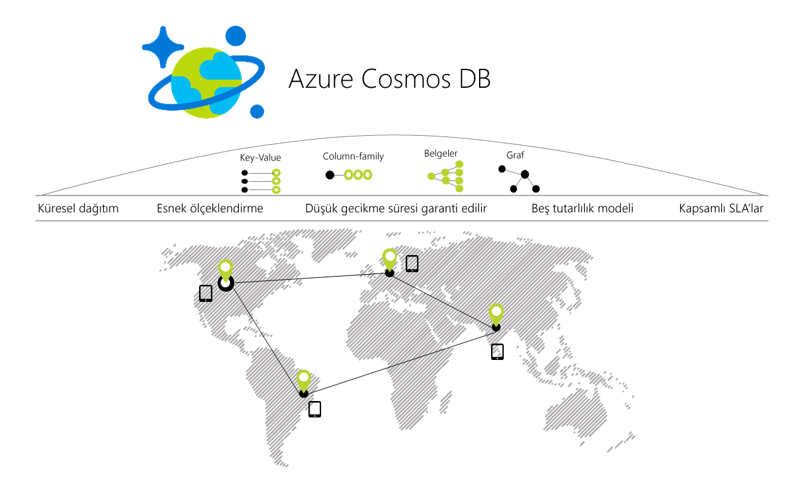

# Azure Cosmos DB’ye hoş geldiniz

Günümüzün uygulamaları yüksek derecede yanıt veren ve her zaman çevrimiçi olması gerekir. Düşük gecikme süresi ve yüksek kullanılabilirlik elde etmek için bu uygulamaların örnekleri kendi kullanıcılara yakın olan veri merkezlerinde dağıtılması gerekir. Uygulamaları yoğun saatlerde kullanım büyük değişiklikleri gerçek zamanlı olarak yanıt hacimlerinin veri depolamak ve bu verileri milisaniye cinsinden kullanıcılar için kullanılabilir hale.

Azure Cosmos DB, Microsoft'un Global olarak dağıtılmış çok modelli veritabanı hizmetidir. Bir düğmeye tıklayarak, Cosmos DB, esnek bir şekilde sağlar ve bağımsız olarak aktarım hızını ve depolamayı herhangi sayıda Azure bölgesinde bir şekilde ölçeklendirin. Esnek, aktarım hızını ve depolamayı ölçeklendirin ve SQL, MongoDB, Cassandra, tablo ve Gremlin dahil olmak üzere en sevdiğiniz API'nizi kullanarak hızlı, tek haneli milisaniye veri erişimi avantajlarından yararlanın. Cosmos DB sağlayan kapsamlı [hizmet düzeyi sözleşmeleri](https://aka.ms/acdbsla) (SLA'lar) aktarım hızı, gecikme süresi, kullanılabilirlik ve tutarlılık garantisi için bir şey başka bir veritabanı hizmeti sunar.

[Azure Cosmos DB’yi ücretsiz olarak](https://azure.microsoft.com/try/cosmosdb/) bir Azure aboneliği olmadan, ücretsiz ve herhangi bir taahhütte bulunmadan deneyebilirsiniz.

> [!div class="nextstepaction"]
> [Azure Cosmos DB’yi ücretsiz olarak deneyin](https://azure.microsoft.com/try/cosmosdb/)

## Önemli Avantajlar

### Anahtar teslim küresel dağıtım

Cosmos DB, hızlı yanıt veren katı oluşturmanızı ve dünya çapında yüksek kullanılabilirliğe sahip uygulamalar sağlar. Kullanıcılarınızın olursanız olun, kullanıcılarınıza en yakın olan verilerin bir çoğaltması ile etkileşim kurabilmesi cosmos DB verilerinizi şeffaf biçimde çoğaltır.

Cosmos DB veya Cosmos hesabınıza Azure bölgelerinden birini bir düğmeye tıklayarak herhangi bir zamanda kaldırılamıyor sağlar. Cosmos DB sorunsuz bir şekilde bir çoğaltılacağını verilerinizi uygulamanızı yararlanabilirsiniz için yüksek oranda kullanılabilir olmaya devam ederken, Cosmos hesabınızla ilişkili tüm bölgelere *çoklu yönlendirmeyi* hizmetinin özellikleri. Daha fazla bilgi için [genel dağıtım](distribute-data-globally.md) makalesi.

### Her Zaman Açık

Azure altyapısıyla kapsamlı tümleştirme sayesinde ve [saydam çok yöneticili çoğaltma](global-dist-under-the-hood.md), Cosmos DB sağlar [% 99,999 yüksek kullanılabilirlik](high-availability.md) hem okur ve yazar. Cosmos DB ayrıca programlı olarak (veya Portal aracılığıyla) Cosmos hesabınızın bölgesel yük devretme çağırma yeteneği sağlar. Bu özellik, uygulamanızın bölgesel bir olağanüstü durum olması durumunda yük devretme için tasarlandığından emin olun yardımcı olur.

### Aktarım hızını ve depolamayı dünya çapında elastik ölçeklenebilirliği

Cosmos DB saydam yatay bölümleme ve çok yöneticili çoğaltma ile tasarlanmış, dünya çapındaki tüm okuma ve yazma işlemleri için esnek görülmemiş boyutta ölçeklenebilirlik sunar. Esnek, yüz milyonlarca İsteği/sn, tek bir API çağrısı ile dünya çapındaki binlerce gelen ölçeği artırma ve yalnızca ihtiyacınız aktarım hızı (ve depolama için) ödeme yaparsınız. Bu özellik iş yüklerinizi beklenmedik artışları için yoğun işlemi, fazladan sağlama yapmak zorunda kalmadan başa çıkmanıza yardımcı olur. Daha fazla bilgi için [Cosmos DB'de bölümleme](partitioning-overview.md), [kapsayıcılar ve veritabanları sağlanan aktarım hızını](set-throughput.md), ve [sağlanan aktarım hızı küresel olarak ölçekleme](scaling-throughput.md).

### Dünya çapında 99. yüzdebirlik dilimde düşük gecikme süresi garanti edilir

Oluşturabileceğinizi Cosmos DB'yi kullanarak yüksek derecede yanıt veren, çok büyük ölçekli uygulamalar. Yeni çok yöneticili çoğaltma protokolü ve Mandal ve [yazma için iyileştirilmiş veritabanı altyapısı](index-policy.md), Cosmos DB her ikisi için de 10 MS'den, yazmalarda sayısından az garanti okur ve (dizini oluşturulmuş yazmalar, tüm dünyada 99. yüzdebirlik) . Bu özellik, veri ve İnanılmaz derecede hızlı sorgular yüksek derecede yanıt veren uygulamalar için sürekli alımı sağlar.

### Tam olarak tanımlı, birden çok tutarlılık seçenekleri

Dağıtılmış uygulamalar Cosmos DB'de küresel olarak oluşturmak, artık aşırı yapmak zorunda [tutarlılık, kullanılabilirlik, gecikme süresi ve aktarım hızı bir denge](consistency-levels-tradeoffs.md). Cosmos DB'nin çok yöneticili çoğaltma Protokolü sunmak üzere tasarlanmış dikkatle [beş iyi tanımlanmış tutarlılık seçeneği](consistency-levels.md) - *güçlü*, *sınırlanmış eskime durumu*, *oturumu*, *tutarlı ön ek*, ve *nihai* — düşük gecikme süresi ve yüksek kullanılabilirliğe sahip kullanımı kolay bir programlama modeli için genel Dağıtılmış uygulama.

### Şema veya dizin yönetimi yok

Veritabanı şema ve dizinlerinizi tutma küresel olarak dağıtılan uygulamalar için özellikle sıkıntılı bir uygulamanın şema ile eşitlenmiş durumda. Cosmos DB ile şema veya dizin yönetimiyle ilgilenmenize gerek yoktur. Veritabanı altyapısı tam olarak şemadan bağımsızdır.  Şema ve dizin yönetimi yok gerekli olduğundan, ayrıca uygulama kapalı kalma süresi hakkında endişelenmek zorunda olmadığınız şemaları geçirirken. Cosmos DB [otomatik olarak tüm verilerin dizinini oluşturur](index-policy.md) ve hızlı sorgular sunar.

### Zorlu koşullarda test edilmiştir veritabanı hizmeti

Cosmos DB, azure'da temel bir hizmettir. Neredeyse on yıl için Cosmos DB birçok Microsoft ürünlerinin tarafından Skype, Xbox, Office 365, Azure ve diğer birçok dahil olmak üzere küresel ölçekte görev açısından kritik uygulamalar için kullanıldı. Bugün, azure'da çok sayıda dış müşterileri ve esnek ölçek, anahtar teslim küresel dağıtım, birden çok yöneticili çoğaltma için düşük gecikme süresi ve yüksek kullanılabilirlik hem gerektiren görev açısından kritik uygulamalar tarafından kullanılan en hızlı gelişen hizmetlerden biri Cosmos DB Okuma ve yazma işlemleri.

### Her yerde bulunan bölgesel varlığı

Cosmos DB, kullanılabilir tüm Azure bölgelerinde genel bulutta 54 fazla bölgenin dahil dünya çapında [Azure Çin 21Vianet](https://www.azure.cn/en-us/), Azure Almanya, Azure kamu ve Azure kamu Savunma Bakanlığı (DoD). Bkz: [Cosmos DB'nin bölgesel varlığı](regional-presence.md).

### Varsayılan ve kurumsal kullanıma hazır tarafından güvenli hale getirme

Cosmos DB için sertifikalı bir [çeşit uyumluluk standartlarını](compliance.md). Ayrıca, Cosmos DB'deki tüm veriler şifrelenir, bekleyen ve Hareket halindeki. Cosmos DB, satır düzeyinde yetkilendirme sağlar ve katı güvenlik standartlarına uyar.

### Toplam sahip olma Maliyetini önemli ölçüde tasarruf

Cosmos DB tamamen yönetilen bir hizmet olduğundan, artık yönetmek ve karmaşık çoklu veri merkezi dağıtımları ve yükseltme işlemleri sırasında veritabanı yazılım, destek, lisans veya işlemleri için ödeme veya en yoğun iş yükü için veritabanınızı sağlamak sahip gerekir. Daha fazla bilgi için [maliyet Cosmos DB ile en iyi duruma](total-cost-ownership.md).

### Sektör lideri kapsamlı SLA'lar

Cosmos DB, ilk ve tek hizmettir sunmak olduğundan [sektör lideri kapsamlı SLA'lar](https://azure.microsoft.com/support/legal/sla/cosmos-db/) % 99,999 yüksek kullanılabilirlik denetimine, okuma ve yazma aktarım hızı ve tutarlılık garantisi 99. yüzdebirlik dilimde düşük gecikme süresi.

### Spark ile Global olarak dağıtılmış işlem analizi

Çalıştırabileceğiniz [Spark](spark-connector.md) doğrudan Cosmos DB'de depolanan veriler. Bu özellik, doğrudan Cosmos DB'de işletim işlemsel iş yüklerini etkilemeden küresel ölçekte düşük gecikme süreli, operasyonel analiz gerçekleştirmenize olanak tanır. Daha fazla bilgi için [Global olarak dağıtılmış bir işlem analizi](lambda-architecture.md).

### Cosmos DB, popüler NoSQL API'lerini kullanarak uygulamalar geliştirin

Cosmos DB, verilerinizi Cosmos veritabanınızda depolanan çalışmak için bir seçim API'leri sunar. Varsayılan olarak, [SQL kullanabileceğiniz](how-to-sql-query.md) (çekirdek API), Cosmos veritabanı'nı sorgulamak için. Cosmos DB API'leri için de uygular [Cassandra](cassandra-introduction.md), [MongoDB](mongodb-introduction.md), [Gremlin](graph-introduction.md) ve [Azure tablo depolama](table-introduction.md). Sık kullanılan NoSQL (örneğin, Cassandra, MongoDB Gremlin) doğrudan Cosmos veritabanınız istemci sürücüleri (ve araçlar) gösterebilir. Sık kullanılan NoSQL API kablo protokollerin destekleyerek, Cosmos DB sağlar:

* Uygulama mantığınızın önemli kısımları korurken Cosmos DB uygulamanıza kolayca geçirin.
* Uygulamanızı taşınabilir tutun ve bulut satıcısı belirsiz durumda kalır.
* Sektör tam olarak yönetilen bulut hizmetiyle ortak NoSQL API için önde gelen, mali olarak desteklenen SLA'ları alın. 
* Esnek bir şekilde sağlanan aktarım hızı ve depolama için veritabanlarınızı ihtiyaçlarınıza göre ölçeklendirin ve yalnızca aktarım hızını ve ihtiyacınız olan depolama için ödeme yaparsınız. Bu, önemli maliyet tasarrufları yol açar.

## Azure Cosmos DB'den yararlanan çözümler

Tüm [web, mobil, oyun ve IOT uygulaması](use-cases.md) büyük miktarda veri okuma işlemesi gerektiğini ve yazma bir [küresel ölçek](distribute-data-globally.md) ile neredeyse gerçek yanıt süreleri çeşitli veriler için Cosmos'dan Kurum için avantaj sağlayacaktır DB [garantili yüksek kullanılabilirlik](https://azure.microsoft.com/support/legal/sla/cosmos-db/), yüksek aktarım hızı, düşük gecikme süresi ve ayarlanabilir tutarlılığından yararlanır. Nasıl Azure Cosmos DB oluşturmak için kullanılabilir hakkında bilgi edinin [IOT ve telematik](use-cases.md#iot-and-telematics), [perakende ve pazarlama](use-cases.md#retail-and-marketing), [oyun](use-cases.md#gaming) ve [web ve mobil uygulamaları](use-cases.md#web-and-mobile-applications).

## Sonraki adımlar

Cosmos DB hakkında daha fazla temel kavramları [anahtar teslim küresel dağıtım](distribute-data-globally.md) ve [bölümleme](partitioning-overview.md) ve [sağlanan aktarım hızı](request-units.md).

Dört hızlı başlangıçtan biriyle Azure Cosmos DB kullanmaya başlayın:

* [Azure Cosmos DB SQL API’yi kullanmaya başlama](create-sql-api-dotnet.md)
* [MongoDB için Azure Cosmos DB'nin API'sini kullanmaya başlama](create-mongodb-nodejs.md)
* [Azure Cosmos DB Cassandra API’yi kullanmaya başlama](create-cassandra-dotnet.md)
* [Azure Cosmos DB Graph API’yi kullanmaya başlama](create-graph-dotnet.md)
* [Azure Cosmos DB Tablo API’yi kullanmaya başlama](create-table-dotnet.md)

> [!div class="nextstepaction"]
> [Azure Cosmos DB’yi ücretsiz deneyin](https://azure.microsoft.com/try/cosmosdb/)
