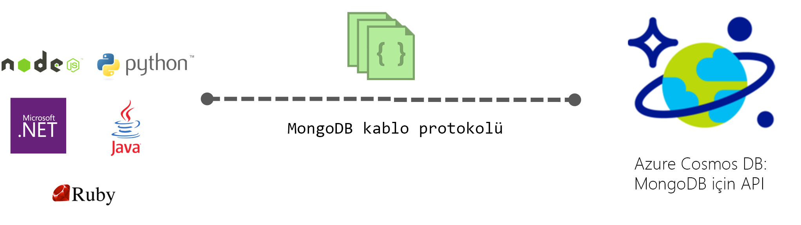

# MongoDB için Azure Cosmos DB API'si

[Azure Cosmos DB](introduction.md), Microsoft'un görev açısından kritik uygulamalar için genel olarak dağıtılmış çok modelli veritabanı hizmetidir. Azure Cosmos DB, [kullanıma hazır genel dağıtım](distribute-data-globally.md), dünya çapında [aktarım hızı ve depolama için esnek ölçeklendirme](partition-data.md), 99. yüzdebirlik dilimde tek haneli milisaniyelik gecikme süreleri ve garantili yüksek kullanılabilirlik olanakları sunar ve bunların tümü [sektör lideri SLA’lar](https://azure.microsoft.com/support/legal/sla/cosmos-db/) ile desteklenir. Azure Cosmos DB, şema ve dizin yönetimiyle ilgilenmenize gerek kalmadan [otomatik olarak verilerin dizinini oluşturur](https://www.vldb.org/pvldb/vol8/p1668-shukla.pdf). Çok modelli olan bu hizmet belge, anahtar-değer, grafik ve sütunlu veri modellerini destekler. Varsayılan olarak, Cosmos DB SQL API'sini kullanarak ile etkileşim kurabilir. Ayrıca, Cosmos DB hizmetinin, Cassandra, MongoDB, Gremlin ve Azure tablo depolama gibi sık kullanılan NoSQL API'leri için kablo protokollerini kullanır. Bu, Cosmos veritabanıyla etkileşim kurmanıza imkan tanıdık NoSQL istemci sürücüleri ve araçlarını kullanmanıza olanak sağlar.

## Kablo protokolü uyumluluğu

Azure Cosmos DB Cassandra, MongoDB, Gremlin ve Azure tablo depolama da dahil olmak üzere sık kullanılan NoSQL veritabanları kablo protokolleri uygular. Yerel bir uygulama kablo protokolünü verimli bir şekilde ve doğrudan Cosmos DB içinde vererek, mevcut istemci SDK'ları, sürücüler ve NoSQL veritabanları araçlarının Cosmos DB ile saydam bir şekilde etkileşim kurmak sağlar. Cosmos DB, kablo ile uyumlu API'leri herhangi bir NoSQL veritabanı sağlamak için herhangi bir kaynak kod veritabanı kullanmaz.

Varsayılan olarak, Azure Cosmos DB'nin MongoDB API'si, Mongodb'nin kablo protokolünü 3.2 sürümü ile uyumludur. Bir önizleme özelliği olarak şu anda özellikleri veya kablo protokolünü 3.4 sürümünde eklenen sorgu işleçleri kullanılabilir. Bu protokol sürümleri anlayan herhangi bir MongoDB istemcisi sürücüsünü yerel olarak Cosmos DB'ye bağlanmak görebilmeniz gerekir.

 

## Önemli avantajlar

Cosmos DB, hizmet olarak tam olarak yönetilen, küresel olarak dağıtılan bir veritabanı olarak öne çıkan avantajları açıklanmıştır [burada](introduction.md). Ayrıca, popüler NoSQL API kablo protokolleri yerel olarak uygulayarak, Cosmos DB aşağıdaki avantajları sağlar:

* Uygulama mantığınızın önemli kısımları korurken Cosmos DB uygulamanıza kolayca geçirin.
* Uygulamanızı taşınabilir tutun ve bulut satıcısı belirsiz durumda kalır.
* Sektör ortak NoSQL Cosmos DB tarafından desteklenen API'ler için önde gelen, mali olarak desteklenen SLA'ları alın.
* Sağlanan aktarım hızı elastik olarak ölçeklendirmenize ve Cosmos veritabanlarınız için depolama ihtiyaçlarınıza göre ve yalnızca aktarım hızını ve ihtiyacınız olan depolama için ödeme yaparsınız. Bu, önemli maliyet tasarrufları yol açar.
* Çok yöneticili çoğaltma ile kullanıma hazır, küresel dağıtım.

## Cosmos DB'nin MongoDB API'si

Cosmos hesap oluşturma ve Azure Cosmos DB kullanmak için mevcut MongoDB uygulamanızı geçirmek için hızlı başlangıç kılavuzları takip edin veya yeni bir tane oluşturun:

* [Bir mevcut MongoDB Node.js web uygulamasını geçirme](create-mongodb-nodejs.md).
* [MongoDB ve .NET SDK'sı için Azure Cosmos DB'nin API'sini kullanarak bir web uygulaması derleme](create-mongodb-dotnet.md)
* [MongoDB ve Java SDK'sı için Azure Cosmos DB'nin API'sini kullanarak bir konsol uygulaması oluşturma](create-mongodb-java.md)

## Sonraki adımlar

İşte başlamanıza yardımcı olacak birkaç ipucu:

* İzleyin [bir MongoDB uygulamasını Azure Cosmos DB'ye bağlanmak](connect-mongodb-account.md) hesabı bağlantı dizesi bilgilerinizi alın hakkında bilgi edinmek için öğretici.
* İzleyin [Azure Cosmos DB ile kullanım Studio 3T](mongodb-mongochef.md) 3 t Studio'da Cosmos veritabanı ile MongoDB uygulaması arasında bir bağlantı oluşturma hakkında bilgi edinmek için öğretici
* İzleyin [alma MongoDB verilerini Azure Cosmos DB](mongodb-migrate.md) verilerinizi Cosmos veritabanına içeri aktarmak için öğretici.
* Bir Cosmos hesap kullanarak bağlanmak [Robo 3T](mongodb-robomongo.md).
* Bilgi nasıl [yapılandırma okuma küresel olarak dağıtılan uygulamalar için tercihlerini](../cosmos-db/tutorial-global-distribution-mongodb.md).

Not: Bu makalede, Azure Cosmos DB'nin MongoDB veritabanları kablo protokolü uyum sağlayan bir özellik açıklanmaktadır. Microsoft bu hizmeti sağlamak için MongoDB veritabanları çalıştırmaz. Azure Cosmos DB ile MongoDB, Inc.'e bağlı değil
