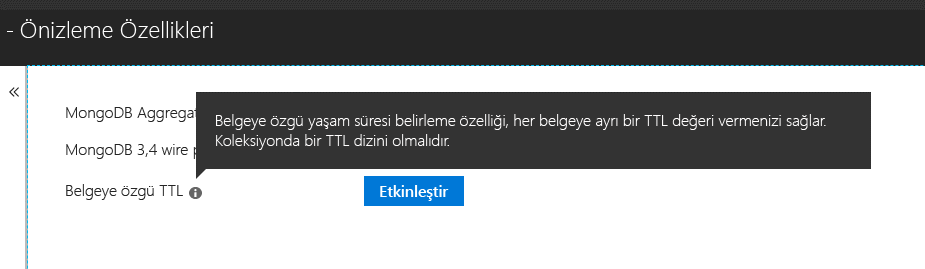

# <a name="expire-data-with-azure-cosmos-dbs-api-for-mongodb"></a>MongoDB için Azure Cosmos DB'nin API'si ile verileri süresi dolacak

Yaşam süresi (TTL) işlevi, veritabanının verilerin süresini otomatik olarak sonlandırmasını sağlar. Azure Cosmos DB'nin MongoDB API'si, Cosmos DB'nin temel TTL özellikleri kullanır. İki mod desteklenir: koleksiyonun tamamı için varsayılan TTL değeri ayarlama ve her belge için ayrı bir TTL değeri ayarlama. MongoDB için TTL dizini ve belge başına TTL düzenleyen mantıksal değerler Cosmos DB'nin API'SİNDE [Cosmos DB olduğu gibi aynı](../cosmos-db/mongodb-indexing.md).

## <a name="ttl-indexes"></a>TTL dizinleri
TTL'yi bir koleksiyonun tamamında etkinleştirmek için bir ["TTL dizini" (yaşam süresi dizini)](../cosmos-db/mongodb-indexing.md) oluşturulması gerekir. TTL dizini, _ts alanında "expireAfterSeconds" değerini içeren bir dizindir.

Örnek:
```JavaScript
globaldb:PRIMARY> db.coll.createIndex({"_ts":1}, {expireAfterSeconds: 10})
{
        "_t" : "CreateIndexesResponse",
        "ok" : 1,
        "createdCollectionAutomatically" : true,
        "numIndexesBefore" : 1,
        "numIndexesAfter" : 4
}
```

Yukarıdaki örnekte verilen komut, TTL işlevine sahip bir dizin oluşturur. Dizin oluşturulduktan sonra veritabanı koleksiyon içinde bulunan ve son 10 saniyede değiştirilmemiş olan belgeleri otomatik olarak siler. 

> [!NOTE]
> **_ts**, Cosmos DB’ye özel bir alandır ve MongoDB istemcilerinden erişilemez. Belgenin son değiştirme tarihinin zaman damgasını içeren ayrılmış (sistem) bir özelliktir.
>

C# örneği de aşağıda belirtilmiştir: 

```csharp
var options = new CreateIndexOptions {ExpireAfter = TimeSpan.FromSeconds(10)}; 
var field = new StringFieldDefinition<BsonDocument>("_ts"); 
var indexDefinition = new IndexKeysDefinitionBuilder<BsonDocument>().Ascending(field); 
await collection.Indexes.CreateOneAsync(indexDefinition, options); 
``` 

## <a name="set-time-to-live-value-for-a-document"></a>Bir belge için yaşam süresi değeri belirleme 
Belge başına TTL değerleri de desteklenir. Belgelerde "ttl" (küçük harfle) kök düzey özellik olması ve bulunduğu koleksiyon için yukarıda anlatılan TTL dizini oluşturulmalıdır. Bir belge için ayarlanan TTL değerleri, koleksiyonunun TTL değerini geçersiz kılacaktır.

TTL değeri bir int32 olmalıdır. Alternatif olarak int32 aralığına sığan bir int64 değeri veya int32 aralığına sığan ve ondalık basamağı olmayan bir çift değer de kullanılabilir. Bu kurallara uymayan TTL özelliklerine izin verilir ancak bu değerler anlamlı bir belge TTL değeri olarak işlenmez.

Belge için TTL değeri isteğe bağlıdır; TTL değeri bulunmayan belgeler de aynı koleksiyona eklenebilir.  Bu durumda koleksiyonun TTL değeri kullanılacaktır. 

Aşağıdaki belgeler geçerli TTL değerlerine sahiptir. Belgeleri eklendikten sonra belge TTL değerleri koleksiyonun TTL değerleri yok sayın. Bu nedenle belgeler 20 saniye sonra kaldırılır.   

```JavaScript 
globaldb:PRIMARY> db.coll.insert({id:1, location: "Paris", ttl: 20.0}) 
globaldb:PRIMARY> db.coll.insert({id:1, location: "Paris", ttl: NumberInt(20)}) 
globaldb:PRIMARY> db.coll.insert({id:1, location: "Paris", ttl: NumberLong(20)}) 
```

Aşağıdaki belgeler geçersiz TTL değerlerine sahiptir. Bu belgeler eklenir ancak belgenin TTL değeri kullanılmaz. Bu nedenle belgeler koleksiyonun TTL değeri olan 10 saniye sonra kaldırılır. 

```JavaScript 
globaldb:PRIMARY> db.coll.insert({id:1, location: "Paris", ttl: 20.5}) //TTL value contains non-zero decimal part. 
globaldb:PRIMARY> db.coll.insert({id:1, location: "Paris", ttl: NumberLong(2147483649)}) //TTL value is greater than Int32.MaxValue (2,147,483,648). 
``` 

## <a name="how-to-activate-the-per-document-ttl-feature"></a>Belgeye özgü TTL özelliğini etkinleştirme

<!-- Verify successfully on mongodb TTL-->
Belge başına TTL özelliği, Azure Cosmos DB API'si ile MongoDB için etkinleştirilebilir.

 

## <a name="next-steps"></a>Sonraki adımlar
* [Yaşam süresi otomatik olarak Azure Cosmos DB'de verilerle süresi dolacak](../cosmos-db/time-to-live.md)
* [MongoDB için Azure Cosmos DB API'si ile yapılandırılan, Cosmos veritabanı dizini oluşturma](../cosmos-db/mongodb-indexing.md)

<!-- Update_Description: update meta properties, wording update -->