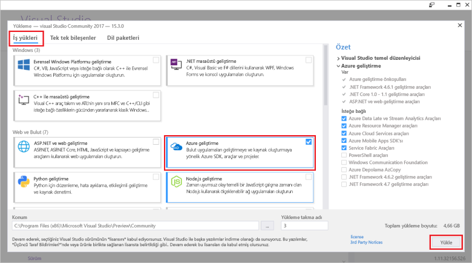

# <a name="create-an-azure-functions-http-trigger-with-an-azure-cosmos-db-input-binding"></a>Azure Cosmos DB giriş bağlama işlemiyle Azure İşlevleri HTTP Tetikleyicisi oluşturma

Azure Cosmos DB global olarak dağıtılmış, hem şemasız hem de sunucusuz çok modelli bir veritabanıdır. Azure İşlevi isteğe bağlı olarak kod çalıştırmanıza olanak sağlayan sunucusuz bir işlem hizmetidir. Bu iki Azure hizmetini eşleştirdiğinizde harika uygulamalar oluşturmaya odaklanmanızın yanı sıra işlem ve veritabanı gereksinimleriniz için sunucu sağlama ve sürdürme konusunda endişe duymamanızı sağlayan sunucusuz mimariye yönelik bir altyapıya sahip olursunuz.

Bu öğreticide [.NET için Graph API Hızlı Başlangıcı](create-graph-dotnet.md)’nda oluşturulan kod temel alınır. Bu öğreticide [HTTP tetikleyicisi](https://github.com/MicrosoftDocs/azure-docs-pr/azure-functions/functions-bindings-http-webhook.md#http-trigger) içeren bir Azure İşlevi eklenir. HTTP tetikleyicisi, hızlı başlangıçta oluşturulan grafik veritabanından veri almak için Azure Cosmos DB [giriş bağlama işlemini](https://github.com/MicrosoftDocs/azure-docs-pr/azure-functions/functions-triggers-bindings.md) kullanır. Bu HTTP tetikleyicisi, veriler için Azure Cosmos DB’yi sorgular ancak işlevinizin gereksinimine göre veri girişi verilerinin alınması için Azure Cosmos DB’deki giriş bağlama işlemleri kullanılabilir.

Bu öğretici aşağıdaki görevleri kapsar:

> [!div class="checklist"]
> * Azure İşlevi projesi oluşturma 
> * HTTP tetikleyicisi oluşturma
> * Azure İşlevini yayımlama
> * Azure İşlevini Azure Cosmos DB veritabanına bağlama

## <a name="prerequisites"></a>Ön koşullar

- **Azure geliştirme** iş yükü dahil [Visual Studio 2017 sürüm 15.3](https://www.visualstudio.com/vs/preview/).

    
    
- Visual Studio 2017 sürüm 15.3’ü yükledikten veya bu sürüme yükseltme yaptıktan sonra Azure İşlevleri için Visual Studio 2017 araçlarını el ile güncelleştirmeniz gerekir. Araçları **Uzantılar ve Güncelleştirmeler...** > **Güncelleştirmeler** > **Visual Studio Market** > **Azure İşlevleri ve Web İş Araçları** > **Güncelleştir** bölümündeki **Araçlar** menüsünden güncelleştirebilirsiniz.

- [Graph API’yi kullanarak bir .NET uygulaması oluşturma](tutorial-develop-graph-dotnet.md) öğreticisini tamamlayın veya [azure-cosmos-db-graph-dotnet-getting-started](https://github.com/Azure-Samples/azure-cosmos-db-graph-dotnet-getting-started) GitHub deposundan örnek kodu alın ve projeyi oluşturun.
 
## <a name="build-a-function-in-visual-studio"></a>Visual Studio'da işlev oluşturma

1. **Çözüm Gezgini**’ndeki çözüm düğümüne sağ tıklayarak çözümünüze bir **Azure İşlevi** ekleyin ve sonra **Ekle** > **Yeni Proje** seçeneğini belirleyin. İletişim kutusundan **Azure İşlevleri**’ni seçin ve bunu **PeopleDataFunctions** olarak adlandırın.

   

2. Azure İşlevleri projesini oluşturduktan sonra gerçekleştirmeniz gereken, NuGet ile ilgili birkaç güncelleştirme ve yükleme işlemi söz konusudur. 

    a. En yeni İşlev SDK'sını sahip olduğunuzdan emin olmak amacıyla **Microsoft.NET.Sdk.Functions** paketini güncelleştirmek için NuGet Yöneticisi’ni kullanın. **Çözüm Gezgini**’nde projeye sağ tıklayın ve **NuGet Paketlerini Yönet**’i seçin. **Yüklendi** sekmesinde Microsoft.NET.Sdk.Functions seçeneğini belirleyin ve sonra **Güncelleştir** seçeneğine tıklayın.

   

    b. **Gözat** sekmesinde **azure.graphs** ifadesini girerek **Microsoft.Azure.Graphs** paketini bulun ve daha sonra **Yükle** seçeneğine tıklayın. Bu paket, Graph API .NET İstemci SDK'sını içerir.

   

    c. **Gözat** sekmesinde **mono.csharp** ifadesini girerek **Mono.CSharp** paketini bulun ve daha sonra **Yükle** seçeneğine tıklayın.

   

3. Artık burada gösterildiği gibi Çözüm Gezgininiz yüklediğiniz paketleri içerir. 
   
   Bir sonraki adımda kod yazmamız gerekiyor, bu nedenle projeye yeni bir **Azure İşlevi** öğesi ekleyeceğiz. 

    a. **Çözüm Gezgini**'nde proje düğümüne sağ tıklayın, ardından **Ekle** > **Yeni Öğe** seçeneğini belirleyin.   
    b. **Yeni Öğe Ekle** iletişim kutusunda **Visual C# Öğeleri**’ni ve **Azure İşlevi**’ni seçin, projenizin adı olarak **Arama** yazın, daha sonra **Ekle**’ye tıklayın.  
 
   

4. Azure İşlevi, HTTP isteklerini yanıtlar, bu nedenle burada HTTP tetikleyici şablonu uygundur.
   
   **Yeni Azure İşlevi** kutusunda **HTTP tetikleyicisi**’ni seçin. Bu Azure İşlevinin de "tamamen açık" olmasını istiyoruz, bu nedenle **Erişim haklarını** herkese izin veren **Anonim** seçeneğine ayarlıyoruz. **Tamam**’a tıklayın.

   

5. Azure İşlevi projesine Arama.cs dosyasını ekledikten sonra bu **using** deyimlerini mevcut using deyimlerinin üzerine kopyalayın:

   ```csharp
   using Microsoft.Azure.Documents;
   using Microsoft.Azure.Documents.Client;
   using Microsoft.Azure.Documents.Linq;
   using Microsoft.Azure.Graphs;
   using Microsoft.Azure.WebJobs;
   using Microsoft.Azure.WebJobs.Extensions.Http;
   using Microsoft.Azure.WebJobs.Host;
   using System;
   using System.Collections.Generic;
   using System.Configuration;
   using System.Linq;
   using System.Net;
   using System.Net.Http;
   using System.Threading.Tasks;
   ```

6. Daha sonra, Azure İşlevinin sınıfı kodunu aşağıdaki kodla değiştirin. Kod, tüm kişiler veya yalnızca `name` sorgu dizesi parametresi tarafından tanımlanan belirli bir kişi için Graph API’yi kullanarak Azure Cosmos DB veritabanında arama yapar.

   ```csharp
   public static class Search
   {
       static string endpoint = ConfigurationManager.AppSettings["Endpoint"];
       static string authKey = ConfigurationManager.AppSettings["AuthKey"];

       [FunctionName("Search")]
       public static async Task<HttpResponseMessage> Run(
           [HttpTrigger(AuthorizationLevel.Anonymous, "get", "post", Route = null)]HttpRequestMessage req,
           TraceWriter log)
       {
           log.Info("C# HTTP trigger function processed a request.");

           // the person objects are free-form in structure
           List<dynamic> results = new List<dynamic>();

           // open the client's connection
           using (DocumentClient client = new DocumentClient(
               new Uri(endpoint),
               authKey,
               new ConnectionPolicy
               {
                   ConnectionMode = ConnectionMode.Direct,
                   ConnectionProtocol = Protocol.Tcp
               }))
           {
               // get a reference to the database the console app created
               Database database = await client.CreateDatabaseIfNotExistsAsync(
                   new Database
                   {
                       Id = "graphdb"
                   });

               // get an instance of the database's graph
               DocumentCollection graph = await client.CreateDocumentCollectionIfNotExistsAsync(
                   UriFactory.CreateDatabaseUri("graphdb"),
                   new DocumentCollection { Id = "graphcollz" },
                   new RequestOptions { OfferThroughput = 1000 });

               // build a gremlin query based on the existence of a name parameter
               string name = req.GetQueryNameValuePairs()
                   .FirstOrDefault(q => string.Compare(q.Key, "name", true) == 0)
                   .Value;

               IDocumentQuery<dynamic> query = (!String.IsNullOrEmpty(name))
                   ? client.CreateGremlinQuery<dynamic>(graph, string.Format("g.V('{0}')", name))
                   : client.CreateGremlinQuery<dynamic>(graph, "g.V()");

               // iterate over all the results and add them to the list
               while (query.HasMoreResults)
                   foreach (dynamic result in await query.ExecuteNextAsync())
                       results.Add(result);
           }

           // return the list with an OK response
           return req.CreateResponse<List<dynamic>>(HttpStatusCode.OK, results);
       }
   }
   ```

   Kod temel olarak, eşleşen kayıtları almak için basit bir sorgu ile veritabanının çekirdeğini oluşturan özgün konsol uygulamasındaki bağlantı mantığıyla aynıdır.

## <a name="debug-the-azure-function-locally"></a>Azure işlevinde yerel olarak hata ayıklama

Kod tamamlandığına göre artık kodu yerel olarak çalıştırıp test etmek için Azure İşlevinin yerel hata ayıklama araçlarını ve öykünücüsü kullanabilirsiniz.

1. Kodun düzgün çalışması için bunu Azure Cosmos DB bağlantı bilgilerinizle yerel yürütmeye yönelik olarak yapılandırmanız gerekir. Özgün konsol uygulamasını yürütme için yapılandırmak amacıyla App.config dosyasını kullanmanızla hemen hemen aynı şekilde Azure İşlevini yerel yürütme için yapılandırmak amacıyla da local.settings.json dosyasını kullanabilirsiniz.

    Bunu yapmak aşağıdaki kod satırlarını local.settings.json dosyasına ekleyin ve sonra aşağıdaki resimde gösterildiği gibi GraphGetStarted projesindeki App.Config dosyasında yer alan Endpoint ve AuthKey değerlerini kopyalayın.

   ```json
    "Endpoint": "",
    "AuthKey": ""
    ```

   

2. Başlangıç projesini yeni İşlevler uygulaması olarak değiştirin. **Çözüm Gezgini**’nde, **PeopleDataFunctions**’a sağ tıklayın ve **Başlangıç Projesi Olarak Ayarla**’yı seçin.

3. **Çözüm Gezgini**’nde **PeopleDataFunctions** projesindeki **Bağımlılıklar**’a sağ tıklayın ve sonra **Başvuru Ekle**’ye tıklayın. Listeden System.Configuration seçeneğini belirleyin ve sonra **Tamam**’a tıklayın.

3. Şimdi uygulamayı çalıştıralım. Barındırılan ve kullanıma hazır Azure İşlevi kodu ile yerel hata ayıklama aracı func.exe’yi başlatmak için F5 tuşuna basın.

   func.exe’nin ilk çıkışının sonunda Azure İşlevi’nin localhost:7071 içinde barındırıldığını görüyoruz. Bu, bir istemcide test etmek için yararlıdır.

   

4. Azure İşlevini test etmek için Huachao Mao'nun uzantısı [REST İstemcisi](https://marketplace.visualstudio.com/items?itemName=humao.rest-client) ile [Visual Studio Code](http://code.visualstudio.com/)’u kullanın. REST İstemcisi, tek bir sağ tıklamayla yerel ve uzak HTTP isteği özelliği sunar. 

    Bunu yapmak için test-function-locally.http adında yeni bir dosya oluşturun ve aşağıdaki kodu ekleyin:

    ```http
    get http://localhost:7071/api/Search

    get http://localhost:7071/api/Search?name=ben
   ```

    Şimdi kodun ilk satırına sağ tıklayın ve sonra aşağıdaki resimde gösterildiği gibi **İsteği Gönder**’i seçin.

   

   Size yerel olarak çalışan Azure İşlevi üstbilgileri, JSON gövde içeriği ve daha birçok kaynaktan ham HTTP yanıtı sunulur.

   

5. Şimdi ikinci kod satırını seçin ve **İsteği Gönder** seçeneğini belirleyin. `name` sorgu dizesi parametresini veritabanında olduğu bilinen bir değerle birlikte ekleyerek Azure İşlevinin döndürdüğü sonuçları filtreleyebiliriz.

   

Azure İşlevi doğrulandıktan ve düzgün çalıştığı anlaşıldıktan sonraki adım bunu Azure App Service'te yayımlayıp bulutta çalışacak şekilde yapılandırmaktır.

## <a name="publish-the-azure-function"></a>Azure işlevini yayımlama

1. **Çözüm Gezgini**'nde projeye sağ tıklayın ve **Yayımla**'yı seçin.

   

2. Biz bunu genel kullanıma açık bir senaryoda test etmek için bulutta yayımlamaya hazırız. **Yayımla** sekmesinde **Azure İşlev Uygulaması**’nı seçin, Azure aboneliğinizde bir Azure İşlevi oluşturmak için **Yeni Oluştur**’u seçin ve daha sonra **Yayımla**’ya tıklayın.

   

3. **Yayımla** iletişim kutusunda aşağıdakileri yapın:
   
    a. **Uygulama Adı** kısmında işleve benzersiz bir ad verin.

    b. **Abonelik** kısmında, kullanılacak Azure aboneliğini seçin.
   
    c. **Kaynak Grubu** kısmında, yeni bir kaynak grubu oluşturun ve uygulama adı olarak aynı adı kullanın.
   
    d. Sunucusuz Azure İşlevi için kullanıma göre öde fatura yöntemini kullanmak istediğimizden, **App Service Planı** için **Yeni**’ye tıklayarak kullanıma dayalı yeni bir App Service Planı oluşturun. **App Service Planını Yapılandır** sayfasındaki varsayılanları kullanıp **Tamam**’a tıklayın.
   
    e. Başka işlevlerin yürütülmesini tetiklemeye yönelik Bloblar, Tablolar veya Kuyruklar için desteğe ihtiyaç duymamız durumunda Azure İşlevi ile birlikte kullanmak amacıyla yeni bir Depolama Hesabı oluşturmak üzere **Depolama Hesabı** kısmında **Yeni**’ye tıklayın. **Depolama Hesabı** sayfasındaki varsayılanları kullanın ve sonra **Tamam**’a tıklayın.

    f. Daha sonra Azure aboneliğinizde tüm kaynakları oluşturmak için iletişim kutusunda **Oluştur** düğmesine tıklayın. Visual Studio, bir sonraki Azure İşlevi kodu yayımlama işleminizde kullanacağı bir yayımlama profili (basit bir XML dosyası) indirir.

   

    Daha sonra Visual Studio, İşlevde değişiklik yapmanız durumunda bunu yeniden yayımlamanız gerektiğinde kullanabileceğiniz bir Yayımlama sayfası görüntüler. Bu sayfada şu an için herhangi bir eylemde bulunmanız gerekmez.

4. Azure İşlevi yayımlandıktan sonra Azure İşleviniz için [Azure portalı](https://portal.azure.com/) sayfasına gidebilirsiniz. Burada, Azure İşlevinin **Uygulama ayarlarının** bir bağlantısını görebilirsiniz. Canlı Azure İşlevini Kişi verilerinizle Azure Cosmos DB veritabanına bağlantıya yönelik olarak yapılandırmak için bu bağlantıyı açın.

   

5. Daha önce konsol uygulamasının App.config dosyasında ve Azure İşlevi uygulamasının local.settings.json dosyasında yaptığınız gibi Azure Cosmos DB veritabanındaki Endpoint ve AuthKey değerlerini yayımlanan işleve eklemeniz gerekir. Bu şekilde, hiçbir zaman anahtarlarınızı içeren yapılandırma kodunu kontrol etmeniz gerekmez, bunları portalda yapılandırarak kaynak denetiminde depolanmadıklarından emin olabilirsiniz. Her değeri eklemek için **Yeni ayar ekle** düğmesine tıklayın, **Endpoint** değerini ve app.config’den kendi değerinizi ekleyin, daha sonra tekrar **Yeni ayar ekle**’ye tıklayıp **AuthKey** değerini ve özel değerinizi ekleyin. Değerleri ekledikten ve kaydettikten sonra ayarlarınız aşağıdaki gibi görünür.

   

6. Azure İşlevi, Azure aboneliğinizde düzgün şekilde yapılandırıldıktan sonra genel kullanıma açık Azure İşlevi URL’sini sorgulamak için Visual Studio Code REST İstemci uzantısını yeniden kullanabilirsiniz. Bu iki kod satırını test-function-locally.http dosyasına ekleyin ve bu işlevi test etmek için her satırı çalıştırın. URL'deki işlevin adını işlevinizin adıyla değiştirin.

    ```json
    get https://peoplesearchfunction.azurewebsites.net/api/Search

    get https://peoplesearchfunction.azurewebsites.net/api/Search?name=thomas
    ```

    İşlev Azure Cosmos DB’den alınan verilerle yanıt verir.

    


## <a name="next-steps"></a>Sonraki adımlar

Bu öğreticide aşağıdakileri yaptınız:

> [!div class="checklist"]
> * Azure İşlevi projesi oluşturma 
> * HTTP tetikleyicisi oluşturma
> * Azure işlevini yayımlama
> * İşlevi Azure Cosmos DB veritabanına bağlama

Şimdi Cosmos DB hakkında daha fazla bilgi için Kavramlar bölümüne geçebilirsiniz.

> [!div class="nextstepaction"]
> [Genel dağıtım](distribute-data-globally.md) 

Bu makalede, [Brady Gaster'ın Şemasız ve Sunucusuz](http://www.bradygaster.com/category/%20Serverless%20&%20Schemaless) blog serisinden bir blog temel alınmıştır. Serideki diğer gönderiler için Brady Gaster’ın blogunu ziyaret edin.
