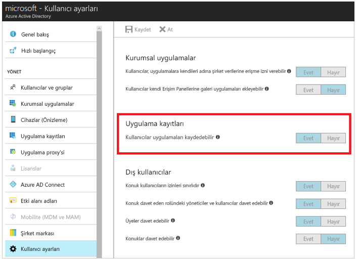
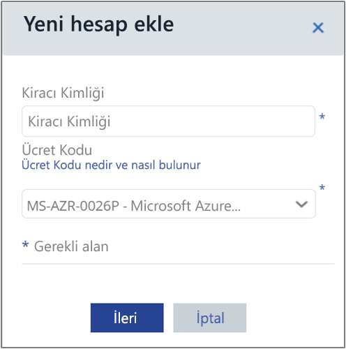
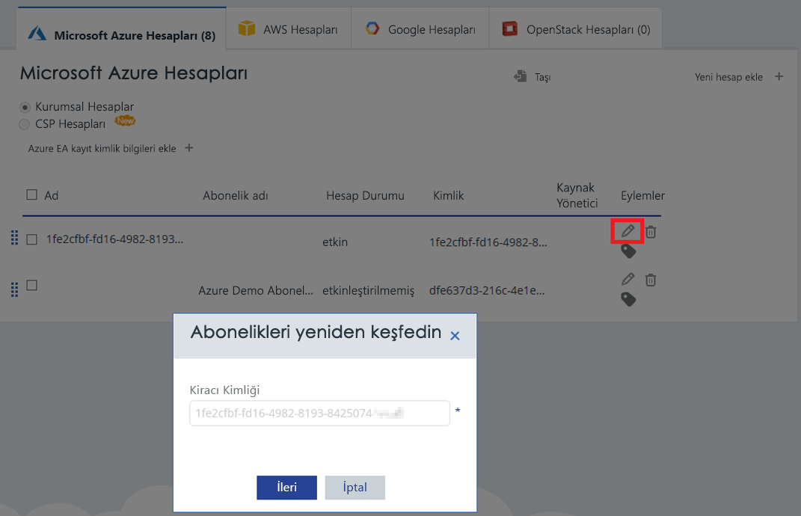

# <a name="activate-azure-subscriptions-and-accounts-with-cloudyn"></a>Azure aboneliklerini ve hesaplarını Cloudyn ile etkinleştirme

Azure Resource Manager kimlik bilgilerinizi eklemeniz veya güncelleştirmeniz Cloudyn'in Azure Kiracınızdaki tüm hesapları ve abonelikleri keşfetmesini sağlar. Sanal makinelerinizde Azure Tanılama da etkinse, Cloudyn, CPU ve bellek gibi genişletilmiş ölçümleri toplayabilir. Bu makalede, yeni ve mevcut hesaplar için Azure Resource Manager API'leri kullanılarak erişimin nasıl etkinleştirileceği açıklanmaktadır. Ayrıca genel hesap sorunlarının nasıl çözümleneceği de açıklanmaktadır.

Cloudyn, abonelik _etkinleştirilmediğinde_ Azure abonelik verilerinizin çoğuna erişemez. _Etkinleştirilmemiş_ hesapları Cloudyn'in bunlara erişebilmesi için düzenlemelisiniz.

## <a name="required-azure-permissions"></a>Gerekli Azure izinleri

Bu makaledeki yordamları tamamlamak için belirli izinler gerekir. Sizin veya kiracı yöneticinizin aşağıdaki izinlerin ikisine de sahip olmanız gerekir:

- CloudynCollector uygulamasını Azure AD kiracınıza kaydetme izni.
- Azure aboneliklerinizdeki bir role uygulamayı atayabilme özelliği.

Azure aboneliklerinizde hesaplarınızın CloudynCollector uygulamasını atamak için `Microsoft.Authorization/*/Write` erişimine sahip olması gerekir. Bu eylemin izni, [Sahip](../role-based-access-control/built-in-roles.md#owner) rolüyle veya [Kullanıcı Erişimi Yöneticisi](../role-based-access-control/built-in-roles.md#user-access-administrator) rolüyle verilir.

Hesabınıza **Katkıda Bulunan** rolü atandıysa, uygulamayı atamak için yeterli izniniz yoktur. Azure aboneliğinize CloudynCollector uygulamasını atamaya çalışırken bir hata alırsınız.

### <a name="check-azure-active-directory-permissions"></a>Azure Active Directory izinlerini denetleme

1. [Azure portalda](https://portal.azure.com) oturum açın.
2. Azure portalında **Azure Active Directory** seçeneğini belirleyin.
3. Azure Active Directory’de **Kullanıcı ayarları**’nı seçin.
4. **Uygulama kayıtları** seçeneğini işaretleyin.
    - Bu **Evet** olarak ayarlanırsa, yönetici olmayan kullanıcılar AD uygulamalarını kaydedebilir. Bu ayar, Azure AD kiracısı içindeki herhangi bir kullanıcının bir uygulamayı kaydedebileceği anlamına gelir.  
    
    - **Uygulama kayıtları** seçeneği **Hayır** olarak ayarlanırsa, yalnızca kiracı yönetici kullanıcıları Azure Active Directory uygulamalarını kaydedebilir. Kiracı yöneticinizin, CloudynCollector uygulamasını kaydetmesi gerekir.


## <a name="add-an-account-or-update-a-subscription"></a>Hesap ekleme veya aboneliği güncelleştirme

Bir aboneliğe hesap güncelleştirme eklediğinizde, Cloudyn'e Azure verilerinize erişim verirsiniz.

### <a name="add-a-new-account-subscription"></a>Yeni hesap ekleme (abonelik)

1. Cloudyn portalında, sağ üst kısımdaki dişli simgesine tıklayın ve **Bulut Hesapları**'nı seçin.
2. **Yeni hesap ekle**’ye tıklayın, böylece **Yeni hesap ekle** kutusu görüntülenir. Gerekli bilgileri girin.  
    

### <a name="update-a-subscription"></a>Aboneliği güncelleştirme

1. Cloudyn’de önceden mevcut olan _etkinleştirilmemiş_ bir aboneliği güncelleştirmek istiyorsanız, üst _kiracı GUID'si_'nin sağındaki düzenleme kalemi simgesine tıklayın. Abonelikler bir üst kiracı altında gruplanır, bu nedenle abonelikleri tek tek etkinleştirmekten kaçının.
    
2. Gerekirse Kiracı Kimliğini girin. Kiracı Kimliğinizi bilmiyorsanız, bulmak için aşağıdaki adımları kullanın:
    1. [Azure Portal](https://portal.azure.com) oturum açın.
    2. Azure portalında **Azure Active Directory** seçeneğini belirleyin.
    3. Kiracı kimliğini almak için Azure AD kiracınızda **Özellikler**'i seçin.
    4. Dizin Kimliği GUID’ini kopyalayın. Bu değer kiracı kimliğinizdir.
    Daha fazla bilgi için bkz. [Kiracı kimliğini alma](../active-directory/develop/howto-create-service-principal-portal.md#get-tenant-id).
3. Gerekirse, Ücret Kimliğinizi seçin. Ücret kimliğinizi bilmiyorsanız, bulmak için aşağıdaki adımları kullanın.
    1. Azure portalının sağ üst kısmında kullanıcı bilgilerinize tıklayın ve sonra **Faturamı görüntüle**’ye tıklayın.
    2. **Faturalama Hesabı** bölümünde **Abonelikler**’e tıklayın.
    3. **Aboneliklerim** bölümünde aboneliği seçin.
    4. Ücret kimliğiniz, **Teklif kimliği** bölümünde gösterilir. Abonelik için Teklif Kimliğini kopyalayın.
4. Yeni hesap ekle (veya Aboneliği Düzenle) kutusunda, **Kaydet**’e (veya **İleri**’ye) tıklayın. Azure portalına yeniden yönlendirilirsiniz.
5. Portalda oturum açın. Cloudyn Collector'a Azure hesabınıza erişim yetkisi vermek için **Kabul Et**'e tıklayın.

    Cloudyn Hesapları yönetim sayfasına yeniden yönlendirilirsiniz ve aboneliğiniz **etkin** Hesap Durumu ile güncelleştirilir. Resource Manager sütununun altında yeşil bir onay işareti simgesi görüntülenmelidir.

    Aboneliklerden biri veya daha fazlası için yeşil bir onay işareti simgesi görmezseniz bu, abonelik için okuyucu uygulamasını (CloudynCollector) oluşturma izninizin olmadığı anlamına gelir. Abonelik için daha yüksek izinleri olan bir kullanıcının bu işlemi yinelemesi gerekir.

Adımları gösteren [Cloudyn ile Azure Resource Manager'a Bağlanma](https://youtu.be/oCIwvfBB6kk) videosunu izleyin.

>[!VIDEO https://www.youtube.com/embed/oCIwvfBB6kk?ecver=1]

## <a name="resolve-common-indirect-enterprise-set-up-problems"></a>Genel dolaylı kurumsal kurulum sorunlarını çözümleme

Cloudyn portalını ilk kullandığınızda, Kurumsal Anlaşma veya Bulut Çözümü Sağlayıcı (CSP) kullanıcısıysanız şu iletileri görebilirsiniz:

- **Cloudyn'i Kurma** sihirbazında *Belirtilen API anahtarı, üst düzey bir kayıt anahtarı değil* iletisi görüntülenir.
- Kurumsal Anlaşma portalında *Doğrudan Kayıt - Hayır* görüntülenir.
- Azure Maliyet Yönetimi portalında *Son 30 gün için kullanım verisi bulunamadı. Cloudyn portalında, Azure hesabınız için işaretlemenin etkinleştirildiğinden emin olmak için lütfen dağıtımcınızla görüşün* iletisi görüntülenir.

Önceki ileti, bir kurumsal bayi veya CSP aracılığıyla Azure Kurumsal Anlaşma satın aldığınızı belirtir. Cloudyn'de verilerinizi görüntüleyebilmeniz için satıcınızın veya CSP’nin Azure hesabınız için _işaretlemeyi_ etkinleştirmesi gerekir.

Sorunların çözümü:

1. Kurumsal bayinin hesabınız için _işaretlemeyi_ etkinleştirmesi gerekir. Yönergeler için bkz. [Dolaylı Müşteri Ekleme Kılavuzu](https://ea.azure.com/api/v3Help/v2IndirectCustomerOnboardingGuide).
2. Cloudyn ile kullanılmak için Azure Kurumsal Anlaşma anahtarını üretirsiniz. Yönergeler için bkz. [Azure Kurumsal Anlaşma kaydetme ve maliyet verilerini görüntüleme](https://docs.microsoft.com/azure/cost-management/quick-register-ea).

Cloudyn'i kurmak için Azure Kurumsal Anlaşma API anahtarını oluşturabilmeniz için aşağıda belirtilen kaynaklarda yer alan yönergeleri izleyerek Azure Faturalama API’sini etkinleştirmeniz gerekir:

- [Kurumsal müşteriler için Raporlama API’lerine genel bakış](../billing/billing-enterprise-api.md)
- **API’lere veri erişimini etkinleştirme** bölümünde [Microsoft Azure kurumsal portal Raporlama API’si](https://ea.azure.com/helpdocs/reportingAPI)

Departman yöneticilerine, hesap sahiplerine ve kurumsal yöneticilere Faturalama API’si ile _ücretleri görüntüleme_ izni vermeniz de gerekebilir.

Yalnızca bir Azure hizmet yöneticisi Cloudyn'i etkinleştirebilir. Ortak yönetici izinleri yeterli değil. Ancak, yönetici gereksinimine geçici bir çözüm sunabilirsiniz. Azure Active Directory yöneticinizin PowerShell betiği ile **CloudynAzureCollector**’ı yetkilendirme izni vermesini isteyebilirsiniz. Aşağıdaki betik, **CloudynAzureCollector** adlı Azure Active Directory Hizmet Sorumlusu’nu kaydetme izni verir.


```powershell
#THE SOFTWARE IS PROVIDED "AS IS", WITHOUT WARRANTY OF ANY KIND, EXPRESS OR IMPLIED, INCLUDING BUT NOT LIMITED TO THE WARRANTIES OF MERCHANTABILITY, FITNESS FOR A PARTICULAR PURPOSE AND NONINFRINGEMENT. IN NO EVENT SHALL THE AUTHORS OR COPYRIGHT HOLDERS BE LIABLE FOR ANY CLAIM, DAMAGES OR OTHER LIABILITY, WHETHER IN AN ACTION OF CONTRACT, TORT OR OTHERWISE, ARISING FROM, OUT OF OR IN CONNECTION WITH THE SOFTWARE OR THE USE OR OTHER DEALINGS IN THE SOFTWARE.

#Tenant - enter your tenant ID or Name
$tenant = "<ReplaceWithYourTenantID>"

#Cloudyn Collector application ID
$appId = "83e638ef-7885-479f-bbe8-9150acccdb3d"

#URL to activate the consent screen
$url = "https://login.windows.net/"+$tenant+"/oauth2/authorize?api-version=1&response_type=code&client_id="+$appId+"&redirect_uri=http%3A%2F%2Flocalhost%3A8080%2FCloudynJava&prompt=consent"

#Choose your browser, the default is Internet Explorer

#Chrome
#[System.Diagnostics.Process]::Start("chrome.exe", "--incognito $url")

#Firefox
#[System.Diagnostics.Process]::Start("firefox.exe","-private-window $url" )

#IExplorer
[System.Diagnostics.Process]::Start("iexplore.exe","$url -private" )

```

## <a name="next-steps"></a>Sonraki adımlar

- Cloudyn için ilk öğreticiyi önceden tamamlamadıysanız, [Kullanım ve maliyetleri gözden geçirme](tutorial-review-usage.md) bölümünden bilgi edinin.
