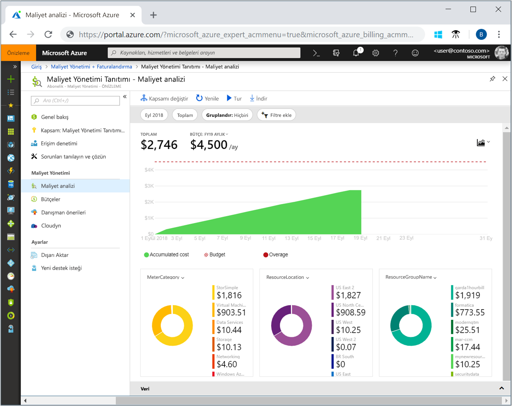
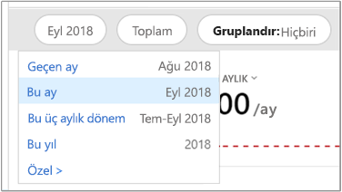
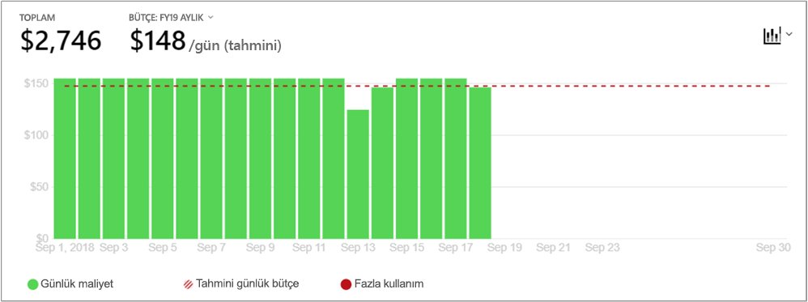
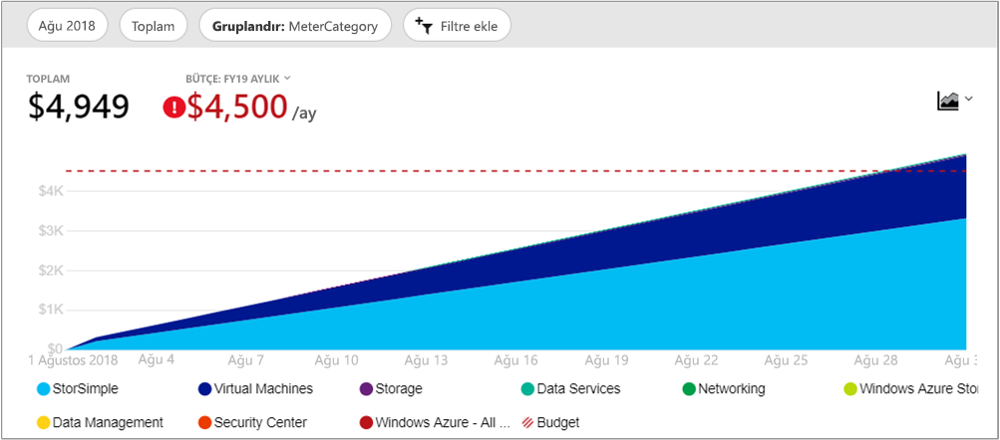
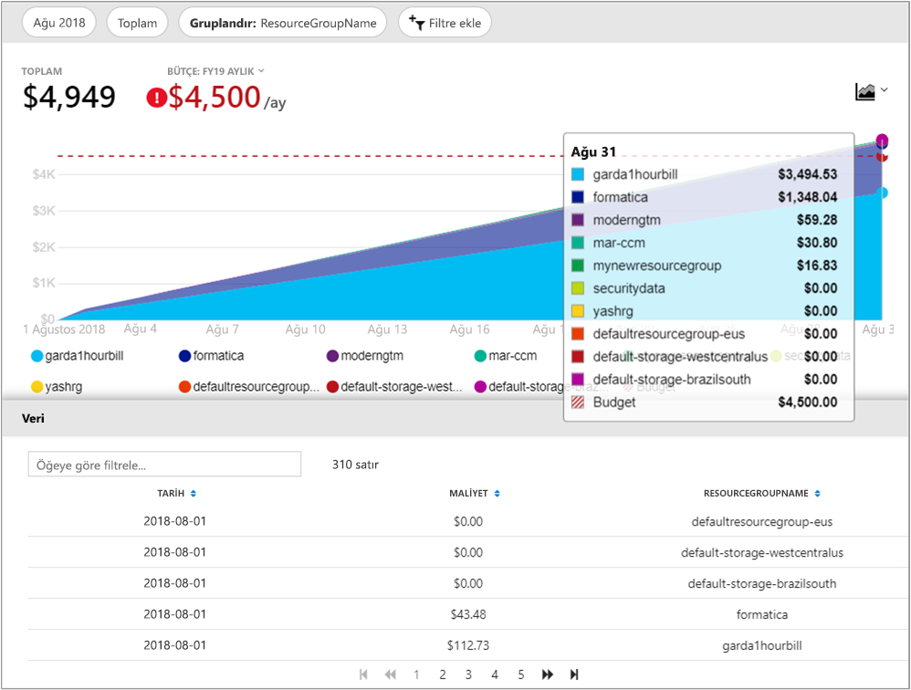

# <a name="quickstart-explore-and-analyze-costs-with-cost-analysis"></a>Hızlı Başlangıç: Maliyet Analizi ile maliyetleri analiz

Azure maliyetlerinizi düzgün bir şekilde denetlemeden ve iyileştirmeden önce maliyetlerin kuruluşunuzun neresinden kaynaklandığını anlamanız gerekir. Ayrıca, hizmetlerinizi, maliyet ve hangi ortamları ve sistemleri desteklemek üzere ne kadar tasarruf bilmek de yararlı olabilir. Maliyetlerin tüm kapsamıyla görünür olması kuruluşun harcama desenlerini doğru anlamak için önemlidir. Harcama desenleri, maliyet denetimi düzenekleri bütçelerini gibi uygulamak için kullanabilirsiniz.

Bu hızlı başlangıçta, kurumsal maliyetlerinizi keşfetmek ve analiz etmek için maliyet analizini kullanırsınız. Maliyetlerin zaman içinde nerede oluştuğunu anlamak ve harcama eğilimlerini tanımlamak için kuruluşa göre toplanmış maliyetleri görüntüleyebilirsiniz. Bütçeye göre aylık, üç aylık, hatta yıllık maliyet eğilimlerini tahmin etmek için zaman içinde tahakkuk eden maliyetleri görüntüleyebilirsiniz. Bütçe, mali kısıtlamalara uymaya yardımcı olur. Bütçe, harcama düzensizliklerini yalıtmak amacıyla günlük veya aylık maliyetleri görüntülemek için de kullanılır. Dahası, geçerli raporun verilerini daha fazla analiz etmek için veya dış sistemde kullanmak üzere indirebilirsiniz.

Bu hızlı başlangıçta şunları yapmayı öğrenirsiniz:

- Maliyet analizinde maliyetleri gözden geçirme
- Maliyet görünümlerini özelleştirme
- Maliyet analizi verilerini indirme


## <a name="prerequisites"></a>Önkoşullar

Maliyet analizi, Azure hesap türleri için farklı türde destekler. Desteklenen bir hesap türleri için tam listesini görüntülemek için bkz: [anlamak maliyet Yönetimi verilerine](understand-cost-mgt-data.md). Maliyet verilerini görüntülemek için bir Azure hesabınız için en azından okuma erişimi gerekir.

İçin [Kurumsal Anlaşma (EA)](https://azure.microsoft.com/pricing/enterprise-agreement/) müşteriler, okuma olması gerekir en az bir veya daha fazla maliyet verilerini görüntülemek için aşağıdaki kapsamları erişim.

- Fatura hesabı
- Bölüm
- Kayıt hesabı
- Yönetim grubu
- Abonelik
- Resource group

Azure maliyet Yönetimi verilerine erişim atama hakkında daha fazla bilgi için bkz. [verilerine erişim atama](assign-access-acm-data.md).

## <a name="sign-in-to-azure"></a>Azure'da oturum açma

- [https://portal.azure.com](https://portal.azure.com ) adresinden Azure portalında oturum açın.

## <a name="review-costs-in-cost-analysis"></a>Maliyet analizinde maliyetleri gözden geçirme

Maliyetlerinizi maliyet analizi gözden geçirmek için Azure portal ve select kapsamı açın **maliyet analizi** menüsünde. Örneğin, Git **abonelikleri**listeden aboneliği seçin ve ardından **maliyet analizi** menüsünde. Kullanım **kapsam** zehirli maliyet analizi farklı bir kapsam penceresine geçin. Kapsamlar hakkında daha fazla bilgi için bkz: [anlayın ve kapsamlı iş](understand-work-scopes.md).

Seçtiğiniz kapsam maliyet yönetimi, maliyet bilgilerini veri birleştirme ve Denetim erişim sağlamak için kullanılır. Kapsamları kullandığınızda, birden çok kapsam seçemezsiniz. Bunun yerine, başkalarının kadar Top, daha büyük bir kapsam seçin ve daha sonra ihtiyacınız iç içe geçmiş kapsamlar aşağı filtre. Bu yaklaşım, birden çok iç içe kapsam kapsayan ve tek bir üst kapsam için bazı kişiler erişimi olmayabilir çünkü anlamak önemlidir.

Başlangıç maliyeti analiz görünümü aşağıdaki alanları içerir.

**Birikmiş maliyetini görünümü**: Önceden tanımlanmış maliyet analizi görünüm yapılandırmasını temsil eder. Her görünüm tarih aralığı, ayrıntı düzeyi, grupla içerir ve filtre ayarları. Varsayılan görünüm, geçerli fatura dönemi için birikmiş maliyetlerini gösterir, ancak diğer yerleşik görünümlerle değiştirebilirsiniz. Daha fazla bilgi için [maliyet görünümleri Özelleştir](#customize-cost-views).

**Gerçek maliyet**: Tahakkuk ve, faturanızda toplam kullanım ve satın alma maliyetleri geçerli ay için gösterilir.

**Tahmini**: Seçtiğiniz zaman aralığı için toplam tahmini maliyeti gösterir. (Tahmin Önizleme aşamasındadır.)

**Bütçe**: Seçilen kapsam için planlanan harcama limiti varsa gösterir.

**Birikmiş ayrıntı düzeyi**: Toplam Birleşik Günlük maliyetleri, fatura döneminizin başından gösterilir. Fatura hesabınız veya aboneliğiniz için [bütçe oluşturduktan](tutorial-acm-create-budgets.md) sonra, bütçeye göre harcama eğiliminizi hemen görebilirsiniz. Tarihin üzerine gelerek o gün için birikmiş maliyeti görüntüleyebilirsiniz.

**Özet (halka) grafikler**: Toplam maliyeti ortak bir standart özellikler kümesi tarafından bölmek dinamik özetleri sağlar. Bunlar büyük en küçük maliyetlerine geçerli ay için gösterir. İstediğiniz zaman farklı bir özet seçerek özet grafikleri değiştirebilirsiniz. Maliyetleri, varsayılan olarak hizmet (ölçüm kategorisi), konum (bölge) ve alt kapsamı tarafından kategorilere ayrılmıştır. Örneğin, kayıt hesaplarıdır hesapları faturalama altında aboneliklerinin altında kaynak grupları ve altında kaynak grupları kaynaklardır.



## <a name="customize-cost-views"></a>Maliyet görünümlerini özelleştirme

Maliyet analizi en yaygın hedefler için en iyi duruma getirilmiş dört yerleşik görünümleri sahiptir:

Görünüm | Şunun gibi sorular sorun
--- | ---
Birikmiş maliyeti | Bu ay şimdiye kadar kullanmış olduğunuz? Bütçemin dışına çıkar mıyım?
Günlük maliyet | Son 30 gün için günde maliyetlerinde herhangi bir artış var. neydi?
Hizmete göre maliyet | Aylık kullanımı son üç faturaya farklılık ne var?
Kaynağa göre maliyet | Hangi kaynakların en kadar bu ay maliyeti?


Öte yandan, birçok durumda daha derin analizler gerekir. Özelleştirme, seçilen tarihle sayfanın en üstünde başlatılır.

Maliyet analizi, varsayılan olarak geçerli ayın verilerini gösterir. Genel Tarih aralıklarına kolayca geçiş yapmak için tarih seçiciyi kullanın. Son yedi gün, geçtiğimiz ay, yıl veya özel bir tarih aralığı örneklerindendir. Kullandıkça Öde Abonelikleri, Takvim ayına son fatura ve geçerli fatura dönemi gibi bağlı olmayan, fatura dönemi göre tarih aralıkları de içerir. Kullanım **< önceki** ve **İleri >** sırasıyla önceki veya sonraki dönemini atlamak için menünün üst bağlantılar. Örneğin, **< önceki** geçmek **son 7 günde** için **8-14 gün önce** veya **15-21 gün önce**.



Maliyet analizi varsayılan olarak **birikmiş** maliyetleri gösterir. Ek olarak önceki gün günlük toplama maliyetlerinizi sürekli büyüyen bir görünümünü her gün için tüm maliyetler birikmiş maliyetlerini içerir. Bu görünüm, seçilen zaman aralığı için bütçeye göre nasıl bir eğilim gösterdiğinizi ortaya koymak için iyileştirilmiştir.

Bütçe olası ihlallerini belirlemeye için tahmin grafik görünümünü kullanın. Tahmini harcama potansiyel bütçeyi ihlal olduğunda kırmızı renkte gösterilir. Gösterge simgesi da grafikte gösterilir. Simgenin geldiğinizde, bütçe ihlal tahmini tarihini gösterir.


Ayrıca, her günün maliyetlerini gösteren bir **günlük** görünüm vardır. Günlük görünüm büyüme eğilimini göstermez. Görünüm, günden güne maliyet sıçrama yaptığında veya iyice düştüğünde ortaya çıkan düzensizlikleri gösterecek şekilde tasarlanmıştır. Bütçe seçtiyseniz, günlük görünümü ayrıca günlük bütçenizi tahmini gösterir.

Günlük maliyetlerinizi tahmini günlük bütçe tutarlı bir şekilde olduğunda aylık bütçenizi aşılması bekleyebilirsiniz. Tahmini günlük bütçe, bütçenizi daha düşük bir düzeyde görselleştirmenize yardımcı olmak için bir araçtır. Günlük maliyetlerinizde dalgalanmalar olduğunda tahmini günlük bütçenin aylık bütçeyle karşılaştırılması daha az kesinlik sağlar.

Son harcama tahmini açık harcama ile günlük bir görünümünü aşağıdadır.


Harcama kapalı olduğunda tahmin etkinleştirin, tahmini gelecek tarihler için harcama görmüyorum. Ayrıca, geçmiş zaman dilimlerindeki maliyeti baktığınızda, maliyet tahmini maliyetleri göstermez.

Genel olarak, veri ya da bildirimler tüketilen kaynaklar için 8 ila 12 saat içinde görmeyi bekleyebilirsiniz.


**Gruplandırma ölçütü** maliyetleri de azaltın Kes ve tanımlamak için ortak özellikler, Katkıda Bulunanlar üst. Kaynak etiketlerine göre gruplandırmak için örneğin, göre gruplandırmak istediğiniz etiket anahtarı seçin. Maliyetleri uygulanan bir etiketi olmayan kaynaklar için ek bir segment ile her bir etiket değeri tarafından ayrılır.

Çoğu [destek Azure kaynakları etiketleme](../azure-resource-manager/tag-support.md). Ancak, bazı etiketler, faturalandırma ve maliyet Yönetimi'nde kullanılabilir değildir. Ayrıca, kaynak grubu etiketleri desteklenmez. Maliyet yönetimi, etiketler kaynağa doğrudan uygulanan tarihten itibaren kaynak etiketleri yalnızca destekler. İzleme [Azure maliyet yönetimi ile etiketi ilkeleri gözden geçirmek nasıl](https://www.youtube.com/watch?v=nHQYcYGKuyw) video maliyet veri görünürlüğünü artırmak için Azure etiketi ilke kullanma hakkında bilgi edinin.

Geçerli ay için bir Azure hizmet maliyetlerini görünümünü aşağıdadır.



Doğan ve faturanızı üzerinde olarak da bilinen gösterecek şekilde varsayılan olarak, maliyet analizi tüm kullanım ve satın alma maliyetleri gösterir. **gerçek maliyet**. Gerçek maliyet görüntüleme, faturanızı karşılaştırma için idealdir. Ancak, göz önünde anomalileri ve diğer değişiklikler maliyet harcama için tutuyorsanız, satın alma maliyeti artış açılan kutuyla olabilir. Rezervasyon satın alma maliyetleri neden ani düzleştirmek için geçiş **amorti edilmiş maliyet**. 


Amorti edilmiş maliyet rezervasyon satın alma işlemleri günlük öbeklere ayırır ve bunları ayırma dönemi süresince yayılır. Örneğin, bir $ 1 Ocak'ta satın 365 görmek yerine bir günde Ocak 1 – 31 Aralık satın 1 USD görürsünüz. Temel itfa ek olarak, bu maliyetleri de yeniden ve ayırma kullanılan belirli kaynakları kullanarak ilişkili. Örneğin, bu $1 günlük ücret arasında iki sanal makine bölmeniz güne ait iki 0,50 ABD Doları ücret bakın. Ayırma parçası gün için kullanılan değil, bir ücretlendirme uygulanabilir sanal makineyle ilişkili 0,50 ve başka bir ücret türüyle ücret 0,50 görür `UnusedReservation`. Kullanılmamış ayırma maliyetleri yalnızca zaman görüntüleme maliyet amorti edilmiş görülebilir unutmayın.

Maliyetleri nasıl temsil edildiğini, değişiklik nedeniyle, gerçek maliyet dikkate almak önemlidir ve amorti edilmiş maliyet görünümleri farklı sayıların toplamı gösterilir. Genel olarak, amorti edilmiş maliyet görüntülerken bir rezervasyon satın alma ile aylık toplam maliyeti azaltır ve bir rezervasyon satın alma aşağıdaki ay artacaktır. İtfa yalnızca ayırma satın alma işlemleri için kullanılabilir ve şu anda Azure Marketi satın alma için geçerli değildir.

Aşağıdaki görüntüde, kaynak grubu adlarını gösterir. Etiket başına toplam maliyetleri görüntüleyebilir veya etikete göre gruplandırabilirsiniz **kaynağı ile maliyet** belirli bir kaynak için tüm etiketleri görüntüleyin.



Belirli bir öznitelik tarafından maliyetleri gruplandırma, en çok 10 Maliyet katkıda bulunanları yüksekten düşüğe doğru gösterilmektedir. 10'dan fazla varsa, dokuz top maliyete katkıda gösterilen bir **başkalarının** grubu. Bu grup, tüm geri kalan grupların birlikte kapsar. Etiketlere göre gruplandırırken bir **Untagged** grup, uygulanan etiket anahtarı olmayan maliyetlerini görünür. **Etiketlenmemiş** etiketlenmemiş maliyetleri etiketli maliyetlerinden daha yüksek olsa bile her zaman en son olur. Etiketlenmemiş maliyetleri parçası olması **başkalarının**, 10 veya daha fazla etiket değeri varsa.

Klasik sanal makineleri, ağ ve depolama kaynaklarını ayrıntılı faturalama verileri paylaşmayın. Olarak birleştirilmiş **Klasik Hizmetleri** maliyetleri gruplandırırken.

Özet grafiklerin altında filtreler ve seçilen zaman aralığı için genel maliyetleri, daha geniş bir resmini verir ana grafiğin Göster farklı gruplandırmaları. Bir özellik ya da herhangi bir boyuta göre toplanmış maliyetleri görüntülemek üzere etiketi seçin.


Herhangi bir görünüm için tam veri kümesini görüntüleyebilirsiniz. Hangi seçimleri veya uyguladığınız filtreler sunulan verileri etkiler. Tam veri kümesini görmek için seçin **grafik türü** listeleyin ve ardından **tablo** görünümü.


## <a name="understanding-grouping-and-filtering-options"></a>Anlama gruplandırma ve filtreleme seçenekleri

Aşağıdaki tablo bazı yaygın gruplandırma ve seçenekleri ve ne zaman kullanmanız gerektiği filtreleme listeler.

| Özellik | Kullanılması gereken durumlar |
| --- | --- |
| **Fatura dönemi** | Maliyetleri de azaltın, fatura aya göre bölün. Bu seçenek, Takvim ayı bağlı değilseniz, Kullandıkça Öde ve geliştirme ve test abonelikleri için önemlidir. EA/MCA hesapları Takvim ayı tarih seçici veya aylık ayrıntı düzeyi ve aynı hedefe ulaşmak için kullanabilirsiniz. |
| **Ücret türü** | Kullanım, satın alma, iade ve kullanılmamış ayırma maliyetleri bölün. Rezervasyon satın alma ve para iadesi yalnızca eylem maliyetleri kullanırken ve amorti edilmiş maliyet kullanmadığınız durumlarda kullanılabilir. Amorti edilmiş maliyeti ararken kullanılmamış ayırma maliyetleri kullanılabilir. |
| **Bulut** | AWS ve Azure maliyetlerini bölün. AWS maliyetlerinden yalnızca yönetim grupları, fatura dış hesaplar ve dış abonelikleri kullanılabilir. |
| **Departman** / **fatura bölümü** | EA departmanı veya MCA fatura bölüm maliyetlerini bölün. Bu seçenek, yalnızca EA/MCA fatura hesapları ve profilleri faturalama MCA için kullanılabilir. |
| **Kayıt hesabı** | EA hesap sahibi tarafından maliyetlerini bölün. Bu seçenek, yalnızca Kurumsal Anlaşma fatura hesapları ve Departmanlar için kullanılabilir. |
| **Sıklık** | Kullanım tabanlı, tek seferlik ve yinelenen maliyetleri de azaltın bölün. |
| **Ölçer** | Azure kullanım ölçümü tarafından maliyetleri de azaltın bölün. Bu seçenek, yalnızca Azure kullanımı için kullanılabilir. Tüm satın alma ve Market kullanım olarak görünür **belirtilmemiş** veya **atanmamış**. |
| **Yayımcı türü** | AWS ve Azure Market maliyetleri de azaltın bölün. |
| **Ayırma** | Maliyetleri de azaltın, rezervasyon bölün. Rezervasyon içermeyen tüm kullanımlar olarak görünür **belirtilmemiş**. |
| **Kaynak** | Kaynak maliyetleri de azaltın bölün. Tüm satın alımlar olarak görünür **belirtilmemiş**, bir EA/PAYG Faturalama hesabı uygulanan çünkü veya profili düzeyi faturalama MCA.  |
| **Kaynak grubu** | Maliyetlerini kaynak grubuna göre bölümlere ayırmak. Bu seçenek, yalnızca klasik olmayan kullanım için kullanılabilir. Klasik kaynak kullanımı gösterilir **diğer**, ve satın alma işlemleri gösterilir **belirtilmemiş**. |
| **Kaynak türü** | Kaynak türüne göre maliyetlerini bölün. Bu seçenek, yalnızca klasik olmayan kullanım için kullanılabilir. Klasik kaynak kullanımı gösterilir **diğer**, ve satın alma işlemleri gösterilir **belirtilmemiş**. |
| **Hizmet adı** veya **ölçüm kategorisi** | Azure hizmeti tarafından maliyet bölün. Bu seçenek, yalnızca Azure kullanımı için kullanılabilir. Tüm satın alma ve Market kullanım olarak görünür **belirtilmemiş** veya **atanmamış**. |
| **Hizmet katmanı** veya **ölçüm alt kategorisi** | Maliyet ile Azure kullanım ölçüm subclassification bölün. Bu seçenek, yalnızca Azure kullanımı için kullanılabilir. Tüm satın alma ve Market kullanım olarak görünür **belirtilmemiş** veya **atanmamış**. |
| **Abonelik** | Aboneliğe göre maliyetleri de azaltın bölün. Tüm satın alımlar gösterme **belirtilmemiş**. |
| **Tag** | Özel Etiket anahtarı için etiket değerlerini tarafından maliyetleri de azaltın bölün. |

Koşulları hakkında daha fazla bilgi için bkz. [Azure kullanım ve Ücret dosyasında kullanılan terimler anlamak](../billing/billing-understand-your-usage.md).


## <a name="saving-and-sharing-customized-views"></a>Özelleştirilmiş görünümleri kaydetme ve paylaşma

Kaydetme ve maliyet analizi Azure portal panoya sabitleme veya maliyet analizi için bir bağlantı kopyalayarak özelleştirilmiş görünümleri başkalarıyla paylaşma. 

Maliyet analizi sabitlemek için sağ üst köşedeki Raptiye simgesini seçin. Maliyet analizi sabitleme yalnızca ana grafiğe veya tabloya görünüm kaydeder. Başkalarının kutucuğu erişim vermek için panoyu paylaşın. Bu Pano yapılandırma paylaşır ve diğer temel alınan veri erişim izni olmayan unutmayın. Maliyetleri erişiminiz yoksa, ancak paylaşılan bir panoya erişebilir, bir "erişim engellendi" iletisi görürsünüz.

Maliyet analizi için bir bağlantıyı paylaşmak için seçin **paylaşmak** dikey penceresinin üstünde. Özel bir URL gösterir, bu belirli bir kapsam için bu belirli görünüm açılır. Erişim ve bu URL'sini alma maliyeti yoksa, bir "erişim engellendi" iletisi görürsünüz. 

Desteklenen her kapsam için maliyetleri için erişim verme hakkında daha fazla bilgi edinmek için [anlayın ve kapsamlı iş](understand-work-scopes.md).

## <a name="automation-and-offline-analysis"></a>Otomasyon ve çevrimdışı analiz

Ne zaman gerektiğinde daha fazla analiz için verileri indirmek için kendi verilerinizle birleştirmek veya kendi sistemlerinde tümleştirme zamanlar vardır. Maliyet yönetimi, birkaç farklı seçenekler sunar. Maliyet analizi içinde alma gibi geçici bir üst düzey Özet, gerekiyorsa bir başlangıç noktası olarak sizin için görünümü oluşturun. Seçerek indirme **dışarı** seçerek **CSV'ye veri indirme** veya **verileri Excel'e indirin**. Excel indirme oluşturulan kapsamı gibi karşıdan yükleme, oluşturma, yapılandırma, toplam, sorgu ve tarih için kullanılan görünüm ek bağlam sağlar.

Tam, unaggregated veri kümesine ihtiyacınız varsa fatura hesabındaki indirin. Portalın sol gezinti bölmesindeki hizmetler listesinden sonra gidin **maliyet Yönetimi + faturalandırma**. Fatura hesabınıza (varsa) seçin. Git **kullanım ve Ücret**ve ardından **indirme** istenen fatura dönemi için simge.

Alıcı maliyet verilerini otomatikleştirmek için benzer bir yaklaşımı benimseyin. Kullanma [sorgu API'si](/rest/api/cost-management/query) dinamik filtreleme, gruplama ve toplama veya kullanımı ile daha zengin analiz [UsageDetails API](/rest/api/consumption/usageDetails) veri kümesi için tam, unaggregated. Bu API'leri genel kullanıma (GA) sürümünü 2019-01-01 ' dir. Kullanım **2019-04-01-preview** ayırması ve bu API'leri içinde Market alışverişleri önizlemesiyle erişim elde etmek için. 

Örneğin, ücret türüne göre (kullanım, satın alma veya iade), yayımcı türü (Azure veya Market), kaynak grubu (boş satın alma işlemleri için) ve ayırma (uygulanabilir değilse boş) ayrılmış amorti edilmiş maliyet toplu bir görünümünü aşağıdadır.

```
POST https://management.azure.com/{scope}/providers/Microsoft.CostManagement/query?api-version=2019-04-01-preview
Content-Type: application/json
 
{
  "type": "AmortizedCost",
  "timeframe": "Custom",
  "timePeriod": { "from": "2019-04-01", "to": "2019-04-30" },
  "dataset": {
    "granularity": "None",
    "aggregation": {
      "totalCost": { "name": "PreTaxCost", "function": "Sum" }
    },
    "grouping": [
      { "type": "dimension", "name": "ChargeType" },
      { "type": "dimension", "name": "PublisherType" },
      { "type": "dimension", "name": "Frequency" },
      { "type": "dimension", "name": "ResourceGroup" },
      { "type": "dimension", "name": "SubscriptionName" },
      { "type": "dimension", "name": "SubscriptionId" },
      { "type": "dimension", "name": "ReservationName" },
      { "type": "dimension", "name": "ReservationId" },
    ]
  },
}
```

Ve toplama ihtiyacınız yoksa ve tam ve ham veri kümesi tercih edin:

```
GET https://management.azure.com/{scope}/providers/Microsoft.Consumption/usageDetails?metric=AmortizedCost&$filter=properties/usageStart+ge+'2019-04-01'+AND+properties/usageEnd+le+'2019-04-30'&api-version=2019-04-01-preview
```

Bunlar doğan olarak satın alımları Göster, değiştirmek için gerçek maliyetlerini gerekiyorsa **türü**/**ölçüm** için **ActualCost**. Bu API hakkında daha fazla bilgi için bkz: [sorgu](/rest/api/cost-management/query) ve [UsageDetails](/rest/api/consumption/usageDetails) API belgeleri. Yayımlanmış belgelere GA sürümü olduğunu unutmayın. Bununla birlikte, ikisi için aynı çalışma *2019-04-01-preview* dışında değiştirilmiş özellik adları ve yeni türü/ölçüm özniteliği API sürümü. (Hakkında daha fazla özellik adları.)
 
Tüm kapsamlar kaynakları yukarıda arasında yönetim API'leri iş Maliyet: kaynak grubu ve Abonelik Yönetim grubu aracılığıyla Azure RBAC erişim, EA fatura hesapları (kayıtlar), bölümler ve EA portalı üzerinden kayıt hesapları. Kapsam Kimliğinizi belirlemek veya erişimi yönetmek nasıl dahil olmak üzere, kapsamları hakkında daha fazla bilgi [anlayın ve kapsamlı iş](understand-work-scopes.md).

## <a name="next-steps"></a>Sonraki adımlar

Bütçelerin nasıl oluşturulduğunu ve yönetildiğini öğrenmek için ilk öğreticiye ilerleyin.

> [!div class="nextstepaction"]
> [Bütçe oluşturma ve yönetme](tutorial-acm-create-budgets.md)
