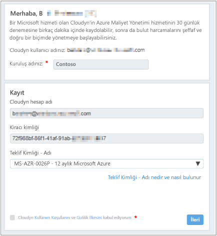
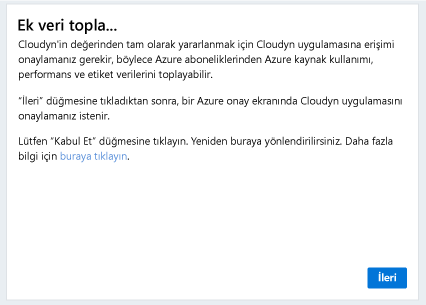
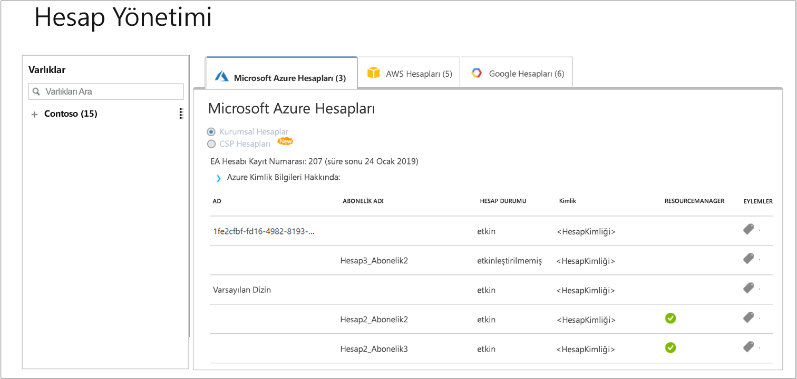

# Ayrı bir Azure aboneliğini kaydetme ve maliyet verilerini görüntüleme

Cloudyn’e kaydolmak için Azure aboneliğinizi kullanırsınız. Kaydınız Cloudyn portalına erişim sağlar. Bu hızlı başlangıçta bir Cloudyn deneme aboneliği oluşturmak ve Cloudyn portalında oturum açmak için gereken kayıt işlemleri açıklanmaktadır. Ayrıca nasıl maliyet verilerini hemen görüntülemeye başlayabileceğinizi gösterir.

## Azure'da oturum açma

- https://portal.azure.com adresinden Azure portalında oturum açın.

## Cloudyn’e kaydolma

1. Azure portalında, hizmetler listesinde **Maliyet Yönetimi + Faturalama**’ya tıklayın.
2. **Genel Bakış** altında, **Cloudyn**’e tıklayın  
    
3. **Maliyet Yönetimi** sayfasında, Cloudyn kayıt sayfasını yeni bir pencerede açmak için **Cloudyn’e git**’e tıklayın.
4. Cloudyn portal deneme kayıt sayfasında, şirketinizin adını yazıp **Azure Bireysel Abonelik Sahibi**’ni seçin ve daha sonra **İleri**’ye tıklayın. Hesap adınız ve Kiracı Kimliğiniz forma otomatik olarak eklenir.  
    
5. Aboneliğinizle ilişkili **Teklif Kimliği - Ad**’ı seçin. Aboneliğinizin Oran Kimliğinin ne olduğundan emin değilseniz, Azure faturanızı görüntüleyerek **Teklif Kimliği**’ni arayabilirsiniz.
6. Kullanım Koşulları’nı kabul edip bilgilerinizi doğrulayın ve ardından **İleri**’ye tıklayın.
7. **Ek veri topla** sayfasında, Cloudyn’i Azure kaynak verilerini toplamak için yetkilendirmek üzere **İleri**’ye tıklayın. Toplanan veriler aboneliklerinizden kullanım, performans, faturalama ve etiket verilerini içerir.  
    
8. Tarayıcınız sizi Cloudyn oturum açma sayfasına götürür. Azure abonelik kimlik bilgilerinizle oturum açın.
9. Cloudyn portalını açmak için **Cloudyn’e git**’e tıklayın, **Hesap Yönetimi** sayfasında, Azure abonelik hesap bilgilerinizi görmeniz gerekir.  
    

Azure aboneliğinizi kaydetme hakkında öğretici bir video izlemek için, bkz. [Cloudyn’de Dizin GUID’i ve Oran Kimliğinizi bulma](https://youtu.be/PaRjnyaNGMI).

[!INCLUDE [cost-management-create-account-view-data](../../includes/cost-management-create-account-view-data.md)]

## Sonraki adımlar

Bu hızlı başlangıçta, Cloudyn ile kaydolmak için Azure aboneliğinizi kullandınız. Ayrıca Cloudyn portalında oturum açarak maliyet verilerini görüntülemeye başladınız. Cloudyn hakkında daha fazla bilgi için Cloudyn öğreticisine geçin.

> [!div class="nextstepaction"]
> [Kullanımı ve maliyetleri gözden geçirme](./tutorial-review-usage.md)
