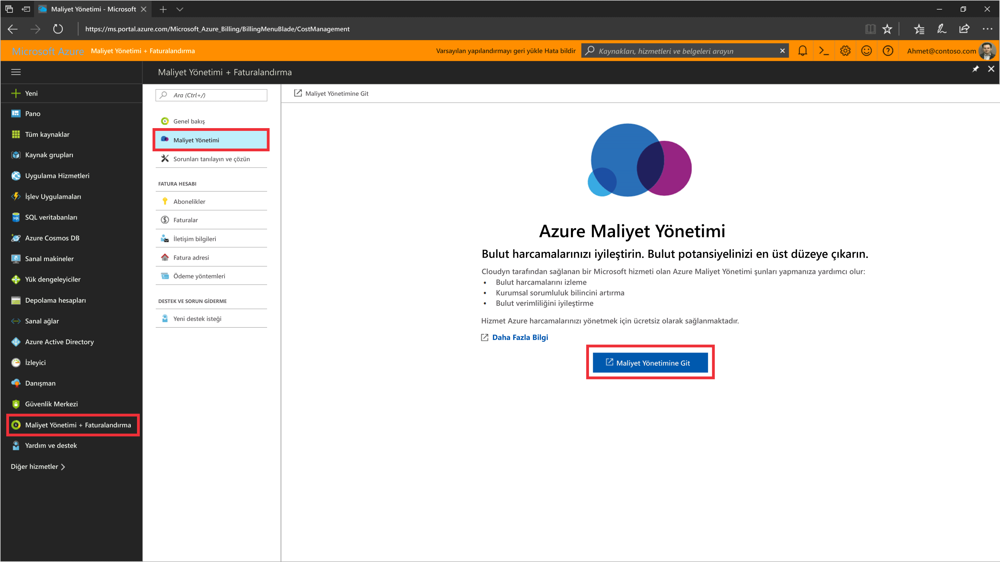
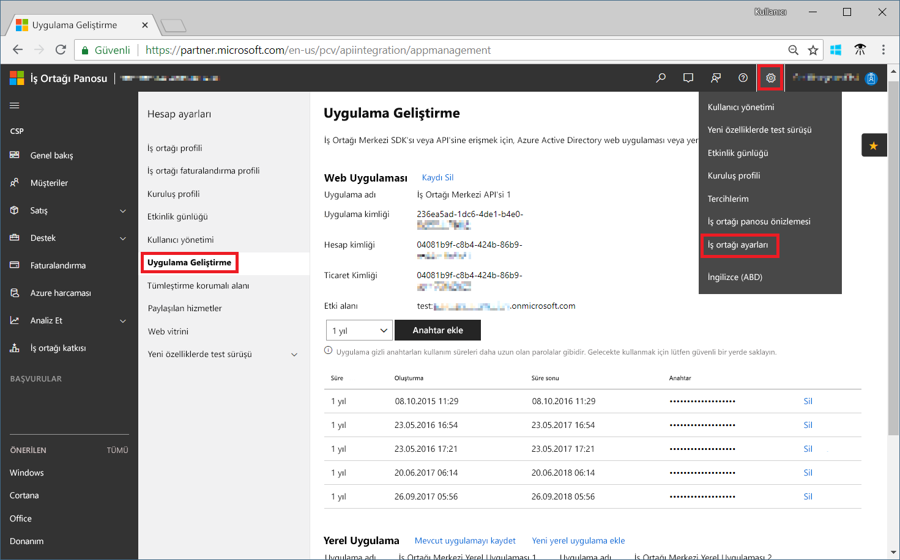

# CSP İş Ortağı programına kaydolun ve maliyetle ilgili verileri görüntüleyin

CSP iş ortağı olarak, Cloudyn’e kaydolabilirsiniz. Kaydınız Cloudyn portalına erişim sağlar. Bu hızlı başlangıçta bir Cloudyn deneme aboneliği oluşturmak ve Cloudyn portalında oturum açmak için gereken kayıt işlemleri açıklanmaktadır. Ayrıca nasıl maliyet verilerini hemen görüntülemeye başlayabileceğinizi gösterir.

> [!NOTE]
>
> Cloudyn kaydını yalnızca CSP Doğrudan iş ortakları ve CSP Dolaylı Sağlayıcıları tamamlayabilir.
>
> İş Ortağı Merkezi API’sini yapılandırmak, kimlik doğrulaması ve verilere erişim için gereklidir. API erişimini sağlamak için, İş Ortağı Merkezi Genel Yöneticisi hesabı gereklidir.
> Daha fazla bilgi için bkz. [İş Ortağı Merkezi API’sine bağlanma](https://msdn.microsoft.com/library/partnercenter/mt709136.aspx).
>
> Cloudyn’e erişim izni, CSP Dolaylı Sağlayıcısı Cloudyn’e kaydolduktan sonra CSP Dolaylı Satıcılarına sağlanabilir. Daha sonra, CSP Dolaylı Satıcıları,Azure müşterileri ile aboneliklerine Cloudyn erişimi sunabilir.

## Azure'da oturum açma

- https://portal.azure.com adresinden Azure portalında oturum açın.

## Cloudyn’e kaydolma

1. Azure portalında, hizmetler listesinde **Maliyet Yönetimi + Faturalama**’ya tıklayın.
2. **Genel Bakış** altında, **Cloudyn**’e tıklayın  
    
3. **Cloudyn** sayfasında, Cloudyn kayıt sayfasını yeni bir pencerede açmak için **Cloudyn’e git**’e tıklayın.
4. Cloudyn portal deneme kayıt sayfasında, şirketinizin adını yazıp **Microsoft CSP İş Ortağı Programı Yöneticisi**’ni seçin ve daha sonra **İleri**’ye tıklayın.  
5. **Uygulama Kimliği**, **Ticari Kimlik** veya **Uygulama Gizli Anahtarı** girin ve **Varsayılan Fiyatlandırma Planı**’nı seçin. Elinizde gerekli bilgiler yoksa, birincil yönetici hesabınızla [https://partnercenter.microsoft.com](https://partnercenter.microsoft.com) adresindeki İş Ortağı Merkezi portalında oturum açın ve aşağıdaki adımları izleyin:
   1. **Pano**'ya gidin, **Ayarlar** simgesine tıklayın, **İş ortağı ayarları**'na ve ardından **Uygulama yönetimi**'ne tıklayın.
   2. Daha önce bir Web Uygulaması oluşturduysanız bu adımı atlayabilirsiniz. Aksi durumda, **Web Uygulaması** bölümünde **Yeni web uygulaması ekle** seçeneğine tıklayın.
   3. Web uygulamanızın **Uygulama Kimliği** GUID’ini kopyalayın.
   4. Web uygulamanızın **Ticari Kimlik** GUID’ini kopyalayın.
   5. Anahtar geçerlilik süresini, gereksiniminize göre bir veya iki yıl olarak belirleyin. **Anahtar ekle** seçeneğini belirleyin ve sonra gizli anahtar değerini kopyalayıp kaydedin.  
    
   6. Cloudyn kayıt sayfasına dönüp bilgileri yapıştırın.  
      
6. Kullanım Koşulları’nı kabul edip bilgilerinizi doğrulayın. Cloudyn’i Azure kaynak verilerini toplamak için yetkilendirmek üzere **İleri**’ye tıklayın. Toplanan veriler aboneliklerinizden kullanım, performans, faturalama ve etiket verilerini içerir.  
7. **Diğer paydaşları davet et** altında, e-posta adreslerini yazarak kullanıcıları ekleyebilirsiniz. İşlem tamamlandığında **İleri**’ye tıklayın. Tüm faturalama verilerinizin Cloudyn’e aktarılması yaklaşık iki saat sürer.
8. Cloudyn portalını açmak için **Cloudyn’e git**’e tıklayın, **Bulut Hesap Yönetimi** sayfasında, kayıtlı CSP hesap bilgilerinizi görmeniz gerekir.

## Cloudyn’de dolaylı CSP erişimini yapılandırma

İş Ortağı Merkezi API’sine, varsayılan olarak yalnızca CSP’ler erişebilir. Ancak, doğrudan bir CSP sağlayıcısı, Cloudyn’ndeki varlık gruplarını kullanarak dolaylı CSP müşterileri veya iş ortakları için erişim yapılandırabilir.

Dolaylı CSP müşterileri veya iş ortakları için erişimi etkinleştirmek için adımları [kaydetme Cloudyn'e](#register-with-cloudyn) bir deneme kaydı oluşturun. Şimdi, aşağıdaki adımları izleyerek Cloudyn varlık gruplarını kullanarak dolaylı CSP verilerini gruplandıracağız. Sonra, varlık gruplarına uygun kullanıcı izinlerini atayacağız.

1. [Varlık oluşturma ](tutorial-user-access.md#create-and-manage-entities) konusundaki bilgilerle varlık grubu oluşturun.
2. [Maliyet Varlıklarına abonelik atama](https://www.youtube.com/watch?v=d9uTWSdoQYo) konusundaki adımları izleyin. Dolaylı CSP müşterisinin hesabını ve önceden oluşturduğunuz varlıkla ilgili Azure aboneliğini ilişkilendirin.
3. Yönetici erişimine sahip bir kullanıcı hesabı oluşturmak için [Yönetici erişimine sahip bir kullanıcı oluşturma](tutorial-user-access.md#create-a-user-with-admin-access) konusuna göz atın. Sonra, kullanıcı hesabının dolaylı hesap için daha önce oluşturduğunuz belirli varlıklara erişimi olduğundan emin olun.

Dolaylı CSP iş ortakları, Cloudyn portalında, kendileri için oluşturduğunuz hesapları kullanarak oturum açar.

[!INCLUDE [cost-management-create-account-view-data](../../includes/cost-management-create-account-view-data.md)]

## Sonraki adımlar

Bu hızlı başlangıçta, Cloudyn’e kaydolmak için CSP bilgilerinizi kullandınız. Ayrıca Cloudyn portalında oturum açarak maliyet verilerini görüntülemeye başladınız. Cloudyn hakkında daha fazla bilgi için Cloudyn öğreticisine geçin.

> [!div class="nextstepaction"]
> [Kullanımı ve maliyetleri gözden geçirme](./tutorial-review-usage.md)
