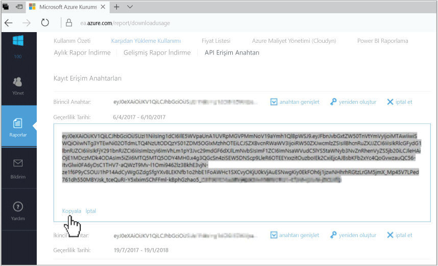
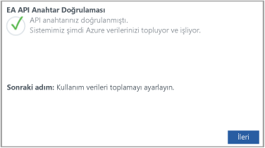

# Azure Kurumsal Anlaşma kaydetme ve maliyet verilerini görüntüleme

Cloudyn’e kaydolmak için Azure Kurumsal Anlaşmanızı kullanırsınız. Kaydınız Cloudyn portalına erişim sağlar. Bu hızlı başlangıçta bir Cloudyn deneme aboneliği oluşturmak ve Cloudyn portalında oturum açmak için gereken kayıt işlemleri açıklanmaktadır. Ayrıca nasıl maliyet verilerini hemen görüntülemeye başlayabileceğinizi gösterir.

Azure Maliyet Yönetimi, Cloudyn'e benzer işlevler sunar. Azure Maliyet Yönetimi, yerel Azure maliyet yönetimi çözümüdür. Maliyet analizi yapmanıza, bütçe oluşturup yönetmenize, verileri dışarı aktarmanıza ve tasarruf önerilerini gözden geçirip gerekli eylemleri gerçekleştirmenize yardımcı olur. Daha fazla bilgi için bkz. [Azure Maliyet Yönetimi](overview-cost-mgt.md).

## Azure'da oturum açma

- http://portal.azure.com adresinden Azure portalında oturum açın.

## Cloudyn’e kaydolma

1. Azure portalında, hizmetler listesinde **Maliyet Yönetimi + Faturalama**’ya tıklayın.
2. **Genel Bakış** altında, **Cloudyn**’e tıklayın  
    
3. **Cloudyn** sayfasında, Cloudyn kayıt sayfasını yeni bir pencerede açmak için **Cloudyn’e git**’e tıklayın.
4. Cloudyn portal deneme kayıt sayfasında, şirketinizin adını yazıp **Azure Kuruluş Kayıt Yöneticisi**’ni seçin.  
    
5. Kurumsal Portal kayıt API anahtarınızı girin. Anahtarınız elinizin altında değilse, [Kurumsal Portal](https://ea.azure.com) bağlantısına tıklayıp aşağıdaki adımları uygulayın:
  1. Azure Kurumsal web sitesinde oturum açıp **Raporlar**’a ve ardından **API Erişim Anahtarı**’na tıklayın ve birincil anahtarınızı kopyalayın.  
    
  3. Kayıt sayfasına dönüp API anahtarınızı yapıştırın.
6. Kullanım Koşulları’nı kabul edip anahtarınızı doğrulayın. Cloudyn’i Azure kaynak verilerini toplamak için yetkilendirmek üzere **İleri**’ye tıklayın. Toplanan veriler aboneliklerinizden kullanım, performans, faturalama ve etiket verilerini içerir.  
    
7. **Diğer paydaşları davet et** altında, e-posta adreslerini yazarak kullanıcıları ekleyebilirsiniz. İşlem tamamlandığında **İleri**’ye tıklayın. Azure kaydınızın boyutuna bağlı olarak, tüm faturalandırma verilerinizin Cloudyn’e eklenmesi 24 saat kadar sürebilir.
8. Cloudyn portalını açmak için **Cloudyn’e git**’e tıklayın, **Bulut Hesap Yönetimi** sayfasında, kayıtlı EA hesap bilgilerinizi görmeniz gerekir.

Kurumsal Anlaşmanızı kaydetme hakkında öğretici bir video izlemek için, bkz. [Cloudyn’de Kullanmak için EA Kayıt Kimliğinizi ve API Anahtarınızı Bulma](https://youtu.be/u_phLs_udig).

[!INCLUDE [cost-management-create-account-view-data](../../includes/cost-management-create-account-view-data.md)]

## Sonraki adımlar

Bu hızlı başlangıçta, Cloudyn ile kaydolmak için Azure Kurumsal Anlaşmanızı kullandınız. Ayrıca Cloudyn portalında oturum açarak maliyet verilerini görüntülemeye başladınız. Cloudyn hakkında daha fazla bilgi için Cloudyn öğreticisine geçin.

> [!div class="nextstepaction"]
> [Kullanımı ve maliyetleri gözden geçirme](./tutorial-review-usage.md)
