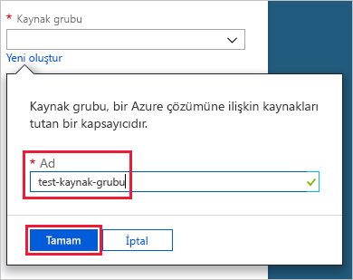
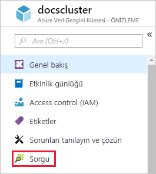
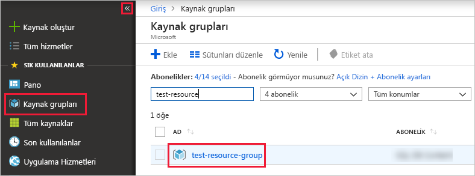

# Hızlı başlangıç: Azure Veri Gezgini kümesi ve veritabanı oluşturma

Azure Veri Gezgini, günlük ve telemetri verileri için hızlı ve yüksek oranda ölçeklenebilir veri keşfetme hizmetidir. Azure Veri Gezgini'ni kullanmak için öncelikle bir *küme* ve bu kümenin içinde bir veya daha fazla *veritabanı* oluşturmanız gerekir. Ardından veritabanına veri *alarak* (yükleyerek) sorgu çalıştırabilirsiniz. Bu hızlı başlangıçta bir küme ve bir veritabanı oluşturacaksınız. Veri alma adımları sonraki makalelerde gösterilecektir.

Azure aboneliğiniz yoksa başlamadan önce [ücretsiz bir Azure hesabı](https://azure.microsoft.com/free/) oluşturun.

## Azure portalında oturum açın

[Azure Portal](https://portal.azure.com/) oturum açın.

## Küme oluşturma

Azure Veri Gezgini kümesini işlem ve depolama kaynakları belirlenmiş olan bir Azure kaynak grubunda oluşturabilirsiniz.

1. Portalın sol üst köşesinde bulunan **Kaynak oluştur** düğmesini (+) seçin.

1. *Azure Veri Gezgini*'ni aratın ve sonuçlardan **Azure Veri Gezgini**'ni seçin.

   

1. Sağ alt köşede **Oluştur**’u seçin.

1. Kümeniz için benzersiz bir ad girin, aboneliğinizi seçin ve *test-resource-group* adlı bir kaynak grubu oluşturun.

    

1. Formu aşağıdaki bilgilerle doldurun.

   

    **Ayar** | **Önerilen değer** | **Alan açıklaması**
    |---|---|---|
    | Küme adı | Benzersiz küme adı | Kümenizi tanımlayan benzersiz bir ad seçin. Örneğin, *mytestcluster*. Girdiğiniz küme adının sonuna *[bölge].servicebus.windows.net* etki alanı adı eklenir. Ad yalnızca küçük harf ve sayı içerebilir. 3-22 karakter arası uzunlukta olmalıdır.
    | Abonelik | Aboneliğiniz | Kümeniz için kullanmak istediğiniz Azure aboneliğini seçin.|
    | Kaynak grubu | *test-resource-group* | Yeni bir kaynak grubu oluşturun. |
    | Konum | *Batı ABD* | Bu hızlı başlangıç için *Batı ABD* değerini seçin. Üretim sisteminde ihtiyaçlarınıza en uygun bölgeyi seçmeniz gerekir.
    | İşlem özelliği | *D13_v2* | Bu hızlı başlangıç için en düşük fiyatlı özelliği seçin. Üretim sisteminde ihtiyaçlarınıza en uygun özelliği seçmeniz gerekir.
    | | |

1. Kümeyi sağlamak için **Oluştur**’u seçin. Sağlama işlemi genellikle on dakika kadar sürer. Araç çubuğunda **Bildirimler**’i (zil simgesi) seçip sağlama işlemini izleyin.

1. İşlem tamamlandığında **Bildirimler**'i ve ardından **Kaynağa git**'i seçin.

    

## Veritabanı oluşturma

Artık işlemin ikinci adımı olan veritabanı oluşturma bölümüne geçebilirsiniz.

1. **Genel bakış** sekmesinde **Veritabanı oluştur**'u seçin.

    

1. Formu aşağıdaki bilgilerle doldurun.

    

    **Ayar** | **Önerilen değer** | **Alan açıklaması**
    |---|---|---|
    | Veritabanı adı | *TestDatabase* | Veritabanı adı küme içinde benzersiz olmalıdır.
    | Bekletme süresi | *3650* | Verilerin sorgu için kullanılabilir durumda tutulacağının garanti olduğu süre. Zaman aralığı verilerin alındığı andan itibaren hesaplanır.
    | Önbellek süresi | *31* | Sık sorgulanan verilerin uzun süreli depolama alanı yerine SSD depolama veya RAM üzerinde tutulacağı süre.
    | | | |

1. Veritabanını oluşturmak için **Kaydet**'i seçin. Oluşturma işlemi genellikle bir dakikadan kısa sürer. İşlem tamamlandığında yeniden **Genel bakış** sekmesi açılır.

## Veritabanında temel komutları çalıştırma

Artık bir kümeye ve veritabanına sahip olduğunuza göre sorgu ve komut çalıştırabilirsiniz. Veritabanında henüz veri yok ancak yine de araçları nasıl çalıştığını görebilirsiniz.

1. Kümenizde **Sorgu**'yu seçin.

    

1. Şu komutu sorgu penceresine kopyalayın: `.show databases`, ardından **Çalıştır**'ı seçin.

    

    Sonuç kümesi, kümedeki tek veritabanı olan **TestDatabase** veritabanını gösterir.

1. Şu komutu sorgu penceresine kopyalayın: `.show tables`, ardından pencerede komutu seçin. **Çalıştır**'ı seçin.

    Henüz bir tablonuz olmadığı için bu komut boş sonuç kümesi döndürür. Bu dizinin bir sonraki makalesinde tablo ekleyeceksiniz.

## Kümeyi durdurma ve yeniden başlatma

İhtiyaç duymanız halinde kümeyi durdurup yeniden başlatabilirsiniz.

1. Kümeyi durdurmak için **Genel bakış** sekmesinin en üstünden **Durdur**'u seçin.

    Küme durdurulduğunda veriler sorgulanamaz ve yeni veri alınamaz.

1. Kümeyi yeniden başlatmak için **Genel bakış** sekmesinin en üstünden **Başlat**'ı seçin.

    Küme yeniden başlatıldığında kullanılabilir duruma gelmesi yaklaşık on dakika sürebilir (ilk sağlandığında olduğu gibi). Verilerin sık erişim önbelleğine yüklenmesi daha uzun zaman alabilir.  

## Kaynakları temizleme

Diğer hızlı başlangıçlarımızı ve öğreticilerimizi izlemeyi planlıyorsanız, oluşturduğunuz kaynakları tutun. Aksi takdirde maliyet oluşmasını önlemek için **test-resource-group** adlı grubu silin.

1. Azure portalında, en solda bulunan **Kaynak grupları**’nı ve ardından oluşturduğunuz kaynak grubunu seçin.  

    Soldaki menü daraltılmışsa, genişletmek için  öğesine tıklayın.

   

1. **test-resource-group** altında **Kaynak grubunu sil**'i seçin.

1. Yeni pencerede silinecek kaynak grubunun adını yazın (*test-resource-group*) ve **Sil**'i seçin.

## Sonraki adımlar

> [!div class="nextstepaction"]
> [Hızlı başlangıç: Verileri Event Hub'dan Azure Veri Gezgini'ne alma](ingest-data-event-hub.md)

