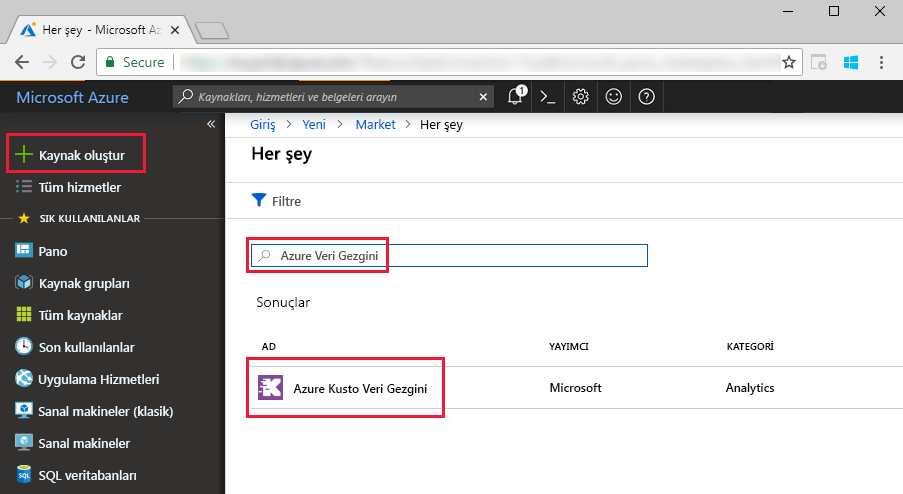
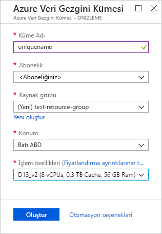
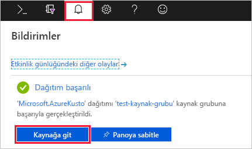
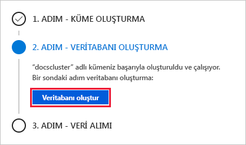
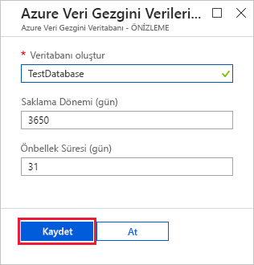
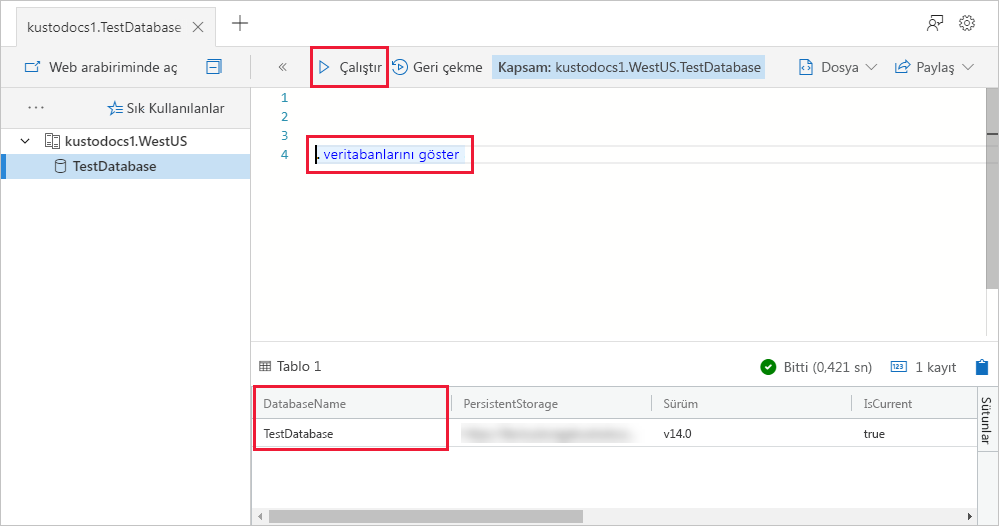

# Hızlı Başlangıç: Bir Azure Veri Gezgini kümesi ile veritabanı oluşturma

> [!div class="op_single_selector"]
> * [Portal](create-cluster-database-portal.md)
> * [CLI](create-cluster-database-cli.md)
> * [PowerShell](create-cluster-database-powershell.md)
> * [C#](create-cluster-database-csharp.md)
> * [Python](create-cluster-database-python.md)
>  

Azure Veri Gezgini, günlük ve telemetri verileri için hızlı ve yüksek oranda ölçeklenebilir veri keşfetme hizmetidir. Azure veri gezginini kullanmak için ilk küme oluşturma ve bu kümede bir veya daha fazla veritabanı oluşturun. Ardından karşı sorgular çalıştırabileceği şekilde onlara bir veritabanına (yükle) veri alın. Bu hızlı başlangıçta bir küme ve bir veritabanı oluşturacaksınız.

Azure aboneliğiniz yoksa başlamadan önce [ücretsiz bir Azure hesabı](https://azure.microsoft.com/free/) oluşturun.

## Azure portalında oturum açın

[Azure Portal](https://portal.azure.com/) oturum açın.

## Küme oluşturma

Bir Azure kaynak grubu işlem ve depolama kaynakları tanımlı bir dizi ile bir Azure Veri Gezgini kümesi oluşturun.

1. Portalın sol üst köşesinde bulunan **Kaynak oluştur** düğmesini (+) seçin.

1. *Azure Veri Gezgini* için arama yapın.

   

1. **Azure Veri Gezgini**'nin altında, ekranın en alt bölümünde **Oluştur**'u seçin.

1. Temel küme ayrıntıları aşağıdaki bilgilerle doldurun.

   

    **Ayar** | **Önerilen değer** | **Alan açıklaması**
    |---|---|---|
    | Abonelik | Aboneliğiniz | Kümeniz için kullanmak istediğiniz Azure aboneliğini seçin.|
    | Kaynak grubu | *test-resource-group* | Mevcut bir kaynak grubunu kullanın veya yeni bir kaynak grubu oluşturun. |
    | Küme adı | Benzersiz küme adı | Kümenizi tanımlayan benzersiz bir ad seçin. Örneğin, *mydataexplorercluster*. Girdiğiniz küme adının sonuna *[bölge].servicebus.windows.net* etki alanı adı eklenir. Ad yalnızca küçük harf ve sayı içerebilir. 3-22 karakter arası uzunlukta olmalıdır.
    | Location | *Batı ABD* | Bu hızlı başlangıç için *Batı ABD* değerini seçin. Üretim sisteminde ihtiyaçlarınıza en uygun bölgeyi seçmeniz gerekir.
    | İşlem belirtimleri | *D13_v2* | Bu hızlı başlangıç için en düşük fiyatlı özelliği seçin. Üretim sisteminde ihtiyaçlarınıza en uygun özelliği seçmeniz gerekir.
    | | |

1. Seçin **gözden + Oluştur** , küme ayrıntıları gözden geçirmek ve **Oluştur** kümesi sağlamak için. Sağlama genellikle yaklaşık 10 dakika sürer.

1. Dağıtım tamamlandığında seçin **kaynağa Git**.

    

## Veritabanı oluşturma

Artık işlemin ikinci adımı olan veritabanı oluşturma bölümüne geçebilirsiniz.

1. **Genel bakış** sekmesinde **Veritabanı oluştur**'u seçin.

    

1. Formu aşağıdaki bilgilerle doldurun.

    

    **Ayar** | **Önerilen değer** | **Alan açıklaması**
    |---|---|---|
    | Veritabanı adı | *TestDatabase* | Veritabanı adı küme içinde benzersiz olmalıdır.
    | Bekletme süresi | *3650* | Kendisi için bu verileri sorgulamak kullanılabilen tutulur sağlanır zaman aralığı (gün cinsinden). Zaman aralığı verilerin alındığı andan itibaren hesaplanır.
    | Önbellek süresi | *31* | Zaman aralığı (gün) SSD depolama veya RAM, sık sık sorgulanan veriler kullanılabilir tutmak istediğiniz yerine daha uzun vadeli depolama.
    | | | |

1. Seçin **Oluştur** veritabanını oluşturmak için. Oluşturma işlemi genellikle bir dakikadan kısa sürer. İşlem tamamlandığında yeniden kümenin **Genel bakış** sekmesi görüntülenir.

## Veritabanında temel komutları çalıştırma

Artık bir kümeye ve veritabanına sahip olduğunuza göre sorgu ve komut çalıştırabilirsiniz. Veritabanında henüz veri yok ancak yine de araçların nasıl çalıştığını görebilirsiniz.

1. Kümenizde **Sorgu**'yu seçin. Komutu yapıştırın `.show databases` sorgu penceresine seçip **çalıştırma**.

    

    Sonuç kümesi, kümedeki tek veritabanı olan **TestDatabase** veritabanını gösterir.

1. Komutu yapıştırın `.show tables` seçin ve sorgu penceresi içine **çalıştırma**.

    Henüz bir tablonuz olmadığı için bu komut boş sonuç kümesi döndürür. Bu dizinin bir sonraki makalesinde tablo ekleyeceksiniz.

## Kümeyi durdurma ve yeniden başlatma

İhtiyaç duymanız halinde kümeyi durdurup yeniden başlatabilirsiniz.

1. Kümeyi durdurmak için **Genel bakış** sekmesinin en üstünden **Durdur**'u seçin.

    Küme durdurulduğunda veriler sorgulanamaz ve yeni veri alınamaz.

1. Kümeyi yeniden başlatmak için **Genel bakış** sekmesinin en üstünden **Başlat**'ı seçin.

    Küme yeniden başlatıldığında, (ne zaman, başlangıçta sağlanan gibi) kullanılabilir hale gelmesi için yaklaşık 10 dakika sürer. Verilerin sık erişim önbelleğine yüklenmesi daha uzun zaman alabilir.  

## Kaynakları temizleme

Diğer hızlı başlangıçlar ve öğreticilerle takip etmeyi planlıyorsanız, oluşturduğunuz kaynakları tutun. Aksi takdirde, kaynak grubu yinelenen maliyetler oluşmasını önlemek için temizleyin.

1. Azure portalında **kaynak grupları** en solda bulunan sol ve sonra kaynak grubu, Veri Gezgini'ni kümenizi içerir.  

1. Seçin **kaynak grubunu Sil** kaynak grubunun tamamını silmek için. Mevcut bir kaynak grubu kullanıyorsanız, yalnızca Veri Gezgini kümeyi silmek isteyebilirsiniz.

## Sonraki adımlar

> [!div class="nextstepaction"]
> [Hızlı Başlangıç: Azure veri Gezgini'ne olay Hub'ından veri alma](ingest-data-event-hub.md)

