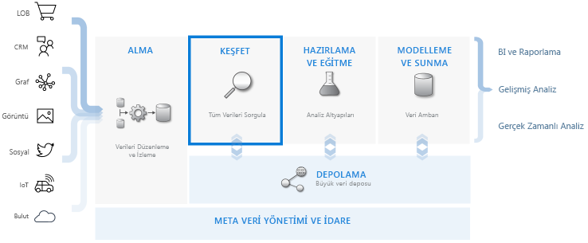
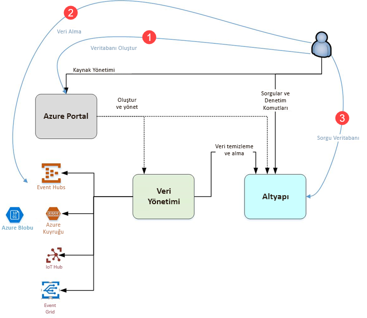

# Azure Veri Gezgini nedir?

Azure Veri Gezgini, günlük ve telemetri verileri için hızlı ve üst düzeyde ölçeklenebilir veri keşfetme hizmetidir. Modern yazılımlar tarafından oluşturulan birçok veri akışını işleyerek verileri toplamanıza, depolamanıza ve analiz etmenize yardımcı olur. Azure Veri Gezgini web siteleri, uygulamalar, IoT cihazları ve benzeri veri kaynaklarından gelen yüksek miktarlardaki çeşitli verileri analiz etmek için idealdir. Bu veriler tanılama, izleme, raporlama, makine öğrenmesi ve ek analiz özellikleri için kullanılır. Azure Veri Gezgini, bu verileri almak basit hale getirir ve saniyeler içinde veri üzerinde karmaşık geçici sorgular gerçekleştirmenizi sağlar.

## Azure Veri Gezgini'ni benzersiz yapan nedir?

- Dakikalar içinde hızla terabaytlarca veriye ölçeklendirilir ve uygun içgörüleri keşfetmek için veri incelemesini hızla yinelemeye olanak tanır.

- Yüksek performanslı veri analizi için iyileştirilmiş, yenilikçi bir sorgu dili sunar.

- Büyük hacimli heterojen verilerin (yapılandırılmış ve yapılandırılmamış) analizini destekler.

- Kapsayıcı, güçlü ve etkileşimli bir veri analizi çözümü sunmak için diğer hizmetlerle birleşerek tam olarak ihtiyacınız olanları oluşturmanızı ve dağıtmanızı sağlar.

## Veri ambarı iş akışı

Azure Veri Gezgini diğer önemli hizmetlerle tümleştirilir ve veri toplama, veri alımı, depolama, dizin oluşturma, sorgulama ve görselleştirmeyi içeren uçtan uca bir çözüm sağlanır. Veri ambarı iş akışında birbirinden faklı terabaytlarca ham verinin akışında **ARAŞTIRMA** adımını yürüterek çok önemli bir ol oynar.

Azure Veri Gezgini; Event Hub gibi yaygın kullanılan hizmetlerin bağlayıcıları, .NET ve Python gibi SDK'ları kullanarak program aracılığıyla alma ve araştırma amacıyla altyapıya doğrudan erişim de dahil olmak üzere çeşitli veri alımı yöntemlerini destekler. Azure Veri Gezgini ek analiz ve görselleştirme verileri için analiz ve modelleme hizmetleriyle tümleştirilir.

## Azure Veri Gezgini akışı

Aşağıdaki diyagram Azure Veri Gezgini ile çalışmanın farklı yönlerini gösterir.

Azure Veri Gezgini'nde çalışma genellikle şu desene uyar:

1. **Veritabanı oluşturun:** Oluşturma bir *küme* ve ardından bir veya daha fazla oluşturun *veritabanları* kümedeki. [Hızlı Başlangıç: Bir Azure Veri Gezgini kümesi ile veritabanı oluşturma](create-cluster-database-portal.md)

1. **Veri alma:** Böylece karşı sorgular çalıştırabilirsiniz veritabanı tablolarına veri yükleme. [Hızlı Başlangıç: Azure veri Gezgini'ne olay Hub'ından veri alma](ingest-data-event-hub.md)

1. **Veritabanını sorgula:** Web uygulamamızı çalıştırmak, gözden geçirin ve sorgular ve sonuçları paylaşmak için kullanın. Bu uygulama Azure portalında ve tek başına bir uygulama olarak sağlanır. Ayrıca, sorguları program aracılığıyla (SDK kullanarak) veya REST API uç noktasına da gönderebilirsiniz. [Hızlı Başlangıç: Azure veri Gezgini'nde verileri Sorgulama](web-query-data.md)

## Sorgu deneyimi

Azure Veri Gezgini'nde sorgu, verileri veya meta verileri değiştirmeden verilerin işlenmesine ve bu işlemenin sonuçlarının döndürülmesine yönelik salt okunur bir istektir. Analizinizi tamamlayana kadar sorgularınızı iyileştirmeye devam edersiniz. Azure Veri Gezgini bu işlemi nedeniyle, çok hızlı geçici sorgu deneyimi kolay hale getirir.

Azure Veri Gezgini çok büyük miktarlarda yapılandırılmış, yarı yapılandırılmış (JSON benzeri iç içe türler) ve yapılandırılmamış (serbest metin) verileri ayırt etmeden iyi bir şekilde işler. Metinde belirli terimleri aramanıza, belirli olayları bulmanıza, yapılandırılmış veriler üzerinde ölçüm stilinde hesaplamalar yapmanıza olanak tanır. Azure Veri Gezgini, çalışma zamanında serbest biçimli metin alanlarındaki değerleri ayıklayarak, yapılandırılmamış metin günlükleri ile yapılandırılmış sayılar ve boyutlar arasında köprü işlevi görür. Hızlı metin dizinleri oluşturma, sütun deposu ve zaman serisi işlemleri birleştirilerek veri keşfi basitleştirilir.

Azure Veri Gezgini özellikleri genişletilmiş yerleşik, güçlü sorgu dili, diğer hizmetler tarafından da dahil olmak üzere [Azure İzleyici günlükleri](/azure/log-analytics/), [Application Insights](/azure/application-insights/), [Time Series Insights ](/azure/time-series-insights/), ve [Windows Defender Gelişmiş tehdit koruması](/windows/security/threat-protection/windows-defender-atp/windows-defender-advanced-threat-protection/).

## Geri Bildirim

Azure Veri Gezgini ve onun sorgu dili ile ilgili geri bildirimlerinizi şu adreslerde sabırsızlıkla bekliyoruz:

- Soru sorun
  - [Stack Overflow](https://stackoverflow.com/questions/tagged/azure-data-explorer)
  - [Microsoft Teknoloji Topluluğu](https://techcommunity.microsoft.com/t5/Azure-Data-Explorer/bd-p/Kusto)
  - [MSDN](https://social.msdn.microsoft.com/Forums/en-US/home?forum=AzureKusto)
- [User Voice'te ürün önerilerinde bulunun](https://aka.ms/AzureDataExplorer.UserVoice)

## Sonraki adımlar

[Hızlı Başlangıç: Bir Azure Veri Gezgini kümesi ile veritabanı oluşturma](create-cluster-database-portal.md)

[Hızlı Başlangıç: Azure veri Gezgini'ne olay Hub'ından veri alma](ingest-data-event-hub.md)

[Hızlı Başlangıç: Azure veri Gezgini'nde verileri Sorgulama](web-query-data.md)
