# <a name="quickstart-ingest-data-from-event-hub-into-azure-data-explorer"></a>Hızlı Başlangıç: Azure veri Gezgini'ne olay Hub'ından veri alma

Azure Veri Gezgini, günlük ve telemetri verileri için hızlı ve yüksek oranda ölçeklenebilir veri keşfetme hizmetidir. Azure Veri Gezgini, büyük veri akış platformu ve olay ekleme hizmeti olan Event Hubs'dan veri eklemeyi (veri yüklemeyi) destekler. [Olay hub'ları](/azure/event-hubs/event-hubs-about) neredeyse gerçek zamanlı saniyede milyonlarca işleyebilir. Bu hızlı başlangıçta bir olay hub'ı oluşturacak, Azure Veri Gezgini'nden bağlanacak ve sistemdeki veri akışını inceleyeceksiniz.

## <a name="prerequisites"></a>Önkoşullar

* Azure aboneliğiniz yoksa başlamadan önce [ücretsiz bir Azure hesabı](https://azure.microsoft.com/free/) oluşturun.

* [Test kümesi ve veritabanı](create-cluster-database-portal.md)

* [Örnek bir uygulama](https://github.com/Azure-Samples/event-hubs-dotnet-ingest) veri üretir ve olay hub'ına gönderir. Örnek uygulamayı sisteminize indirin.

* Örnek uygulamayı çalıştırmak için [Visual Studio 2017 sürüm 15.3.2 veya üzeri](https://www.visualstudio.com/vs/)

## <a name="sign-in-to-the-azure-portal"></a>Azure portalında oturum açın

[Azure Portal](https://portal.azure.com/) oturum açın.

## <a name="create-an-event-hub"></a>Olay hub’ı oluşturma

Bu hızlı başlangıçta örnek veri oluşturacak ve bir olay hub'ına göndereceksiniz. İlk adım bir olay hub'ı oluşturmaktır. Bunun için Azure portalda bir Azure Resource Manager şablonu kullanacaksınız.

1. Bir olay hub'ı oluşturmak için dağıtımı başlatmak için aşağıdaki düğmeyi kullanın. Sağ tıklayıp **yeni pencerede aç**, geri kalanını bu makaledeki adımları izleyebilirsiniz.

    [](https://portal.azure.com/#create/Microsoft.Template/uri/https%3A%2F%2Fraw.githubusercontent.com%2FAzure%2Fazure-quickstart-templates%2Fmaster%2F201-event-hubs-create-event-hub-and-consumer-group%2Fazuredeploy.json)

    **Azure'a dağıtma** düğmesi Azure portalda doldurmanız gereken bir form sayfasını açar.

    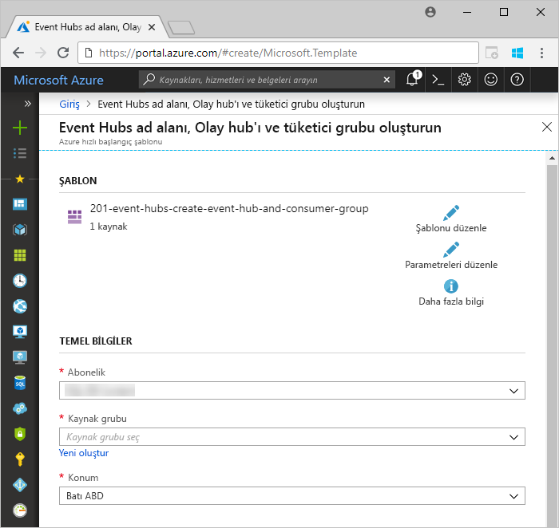

1. Olay hub'ının oluşturulmasını istediğiniz aboneliği seçin ve *test-hub-rg* adlı bir kaynak grubu oluşturun.

    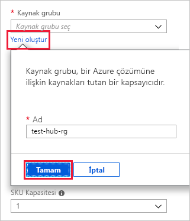

1. Formu aşağıdaki bilgilerle doldurun.

    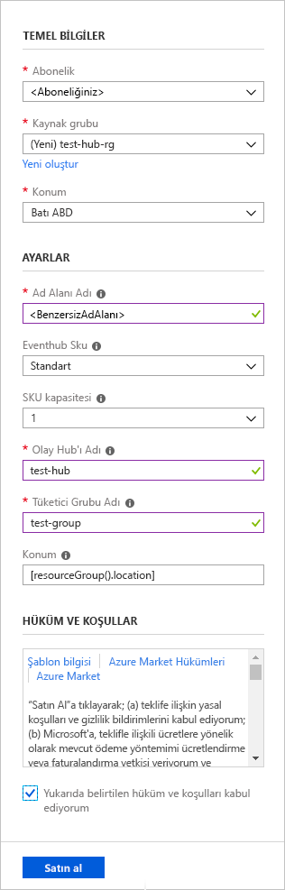

    Aşağıdaki tabloda yer almayan ayarlar için varsayılan değerleri kullanın.

    **Ayar** | **Önerilen değer** | **Alan açıklaması**
    |---|---|---|
    | Abonelik | Aboneliğiniz | Olay hub'ınız için kullanmak istediğiniz Azure aboneliğini seçin.|
    | Kaynak grubu | *test-hub-rg* | Yeni bir kaynak grubu oluşturun. |
    | Konum | *Batı ABD* | Bu hızlı başlangıç için *Batı ABD* değerini seçin. Üretim sisteminde ihtiyaçlarınıza en uygun bölgeyi seçmeniz gerekir. Olay hub'ı ad alanı en iyi performans için Kusto kümesi ile aynı konumda (en yüksek aktarım hızı olay hub'ı ad alanları için önemli) oluşturun.
    | Ad alanı adı | Benzersiz bir ad alanı adı | Ad alanınızı tanımlayan benzersiz bir ad seçin. Örneğin, *mytestnamespace*. Girdiğiniz adın sonuna *servicebus.windows.net* etki alanı adı eklenir. Ad yalnızca küçük harf, sayı ve kısa çizgi içerebilir. Ad bir harf ile başlamalı ve harf veya sayı ile bitmelidir. Değer uzunluğu 6 ile 50 karakter arasında olmalıdır.
    | Olay hub'ı adı | *test-hub* | Olay hub'ı benzersiz bir kapsayıcı kapsamı sunan ad alanında bulunur. Olay hub'ı adının ad alanında benzersiz olması gerekir. |
    | Tüketici grubu adı | *test-group* | Tüketici grupları birden fazla tüketici uygulamasının ayrı olay akışı görünümüne sahip olmasını sağlar. |
    | | |

1. **Satın al**'ı seçerek aboneliğinizde kaynak oluşturduğunuzu onaylayın.

1. Araç çubuğunda **Bildirimler**’i seçip sağlama işlemini izleyin. Dağıtımın başarıyla tamamlanması birkaç dakika sürebilir ancak beklemeden bir sonraki adıma geçebilirsiniz.

    

## <a name="create-a-target-table-in-azure-data-explorer"></a>Azure Veri Gezgini'nde hedef tablo oluşturma

Şimdi Azure Veri Gezgini'nde Event Hubs tarafından gönderilen verilerin ekleneceği tabloyu oluşturacaksınız. Tabloyu **Önkoşullar** bölümünde sağlanan kümede ve veritabanında oluşturacaksınız.

1. Azure portalda kümenize gidip **Sorgu**'yu seçin.

    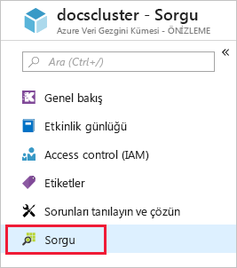

1. Pencere ı seçin aşağıdaki komutu kopyalayın **çalıştırma** alınan verileri alır (TestTable) tablo oluşturun.

    ```Kusto
    .create table TestTable (TimeStamp: datetime, Name: string, Metric: int, Source:string)
    ```

    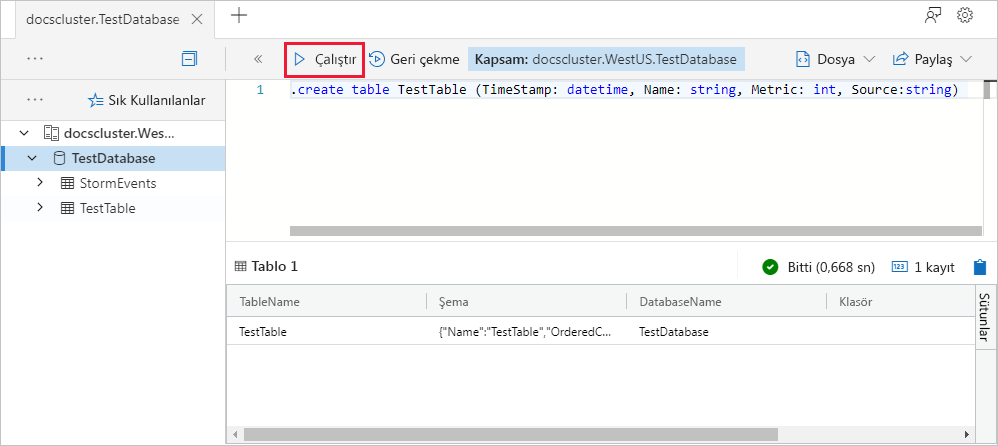

1. Pencere ı seçin aşağıdaki komutu kopyalayın **çalıştırma** gelen JSON verileri sütun adları ve veri türleri tablosu (TestTable) için eşleme.

    ```Kusto
    .create table TestTable ingestion json mapping 'TestMapping' '[{"column":"TimeStamp","path":"$.timeStamp","datatype":"datetime"},{"column":"Name","path":"$.name","datatype":"string"},{"column":"Metric","path":"$.metric","datatype":"int"},{"column":"Source","path":"$.source","datatype":"string"}]'
    ```

## <a name="connect-to-the-event-hub"></a>Olay hub'ına bağlanma

Şimdi Azure Veri Gezgini'nden olay hub'ına bağlanabilirsiniz. Bağlantı kurulduğunda olay hub'ına giden veriler bu makalede oluşturduğunuz test tablosuna iletilir.

1. Olay hub'ı dağıtımının başarılı olduğundan emin olmak için araç çubuğunda **Bildirimler**'i seçin.

1. Oluşturduğunuz kümenin altında **Veritabanları**'nı ve ardından **TestDatabase** girişini seçin.

    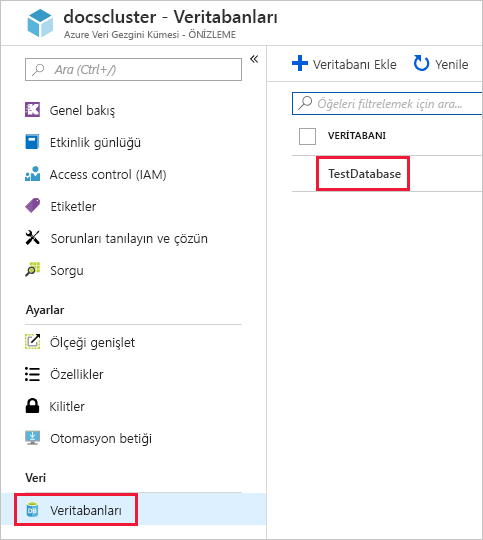

1. Seçin **veri alımı** ve **veri bağlantısı ekleme**. Ardından formu aşağıdaki bilgilerle doldurun. Seçin **Oluştur** işiniz bittiğinde.

    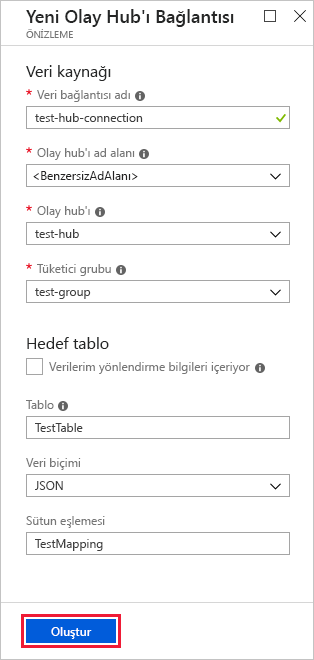

    Veri kaynağı:

    **Ayar** | **Önerilen değer** | **Alan açıklaması**
    |---|---|---|
    | Veri bağlantısı adı | *test-hub-connection* | Azure Veri Gezgini'nde oluşturmak istediğiniz bağlantının adı.|
    | Olay hub’ı ad alanı | Benzersiz bir ad alanı adı | Önceden seçtiğiniz ve ad alanınızı tanımlayan ad. |
    | Olay hub'ı | *test-hub* | Oluşturduğunuz olay hub'ı. |
    | Tüketici grubu | *test-group* | Oluşturduğunuz olay hub'ında tanımlanan tüketici grubu. |
    | | |

    Hedef Tablo:

    İki yönlendirme seçeneği vardır: *statik* ve *dinamik*. Bu hızlı başlangıçta tablo adını, dosya biçimini ve eşlemeyi belirterek statik yönlendirme (varsayılan) gerçekleştireceksiniz. Bu nedenle, bırakın **verilerimi yönlendirme bilgilerini içeren** seçilmemiş.
    Verilerinizde gerekli yönlendirme bilgilerinin bulunduğu dinamik yönlendirme seçeneğini de kullanabilirsiniz.

     **Ayar** | **Önerilen değer** | **Alan açıklaması**
    |---|---|---|
    | Tablo | *TestTable* | **TestDatabase** içinde oluşturduğunuz tablo. |
    | Veri biçimi | *JSON* | Avro, CSV, JSON, çok SATIRLI JSON, PSV, SOH, SCSV, TSV ve TXT desteklenen biçimler:. |
    | Sütun eşleme | *TestMapping* | **TestDatabase** içinde oluşturduğunuz ve gelen JSON verilerini **TestTable** tablosunun sütun adları ve veri türleriyle eşleyen eşleme.|
    | | |

## <a name="copy-the-connection-string"></a>Bağlantı dizesini kopyalayın

Önkoşullarda listelenen [örnek uygulamayı](https://github.com/Azure-Samples/event-hubs-dotnet-ingest) çalıştırdığınızda olay hub'ı ad alanının bağlantı dizesine ihtiyacınız olacaktır.

1. Oluşturduğunuz olay hub'ı ad alanında **Paylaşılan erişim ilkeleri**'ni ve ardından **RootManageSharedAccessKey** girişini seçin.

    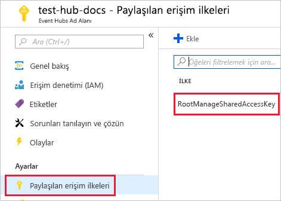

1. **Bağlantı dizesi - birincil anahtar** değerini kopyalayın. Bir sonraki bölümde bunu yapıştıracaksınız.

    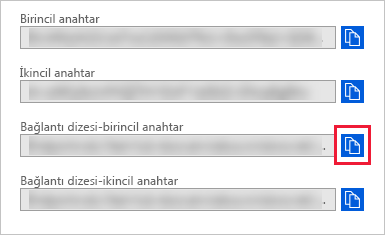

## <a name="generate-sample-data"></a>Örnek veri oluşturma

Kullanım [örnek uygulaması](https://github.com/Azure-Samples/event-hubs-dotnet-ingest) verileri oluşturmak için indirilen.

1. Örnek uygulama çözümünü Visual Studio'da açın.

1. *program.cs* dosyasında `connectionString` sabitini kopyaladığınız olay hub'ı ad alanı bağlantı dizesi ile güncelleştirin.

    ```csharp
    const string eventHubName = "test-hub";
    // Copy the connection string ("Connection string-primary key") from your Event Hub namespace.
    const string connectionString = @"<YourConnectionString>";
    ```

1. Uygulamayı derleyin ve çalıştırın. Uygulama olay hub'ına ileti gönderir ve o da on saniyede bir durumu yazdırır.

1. Uygulama birkaç ileti gönderdikten sonra bir sonraki adıma geçerek olay hub'ına ve test tablosuna veri akışını inceleyin.

## <a name="review-the-data-flow"></a>Veri akışını inceleme

Uygulama tarafından oluşturulan verilerin olay hub'ından kümenizdeki tabloya iletildiğini görebilirsiniz.

1. Uygulama çalışırken Azure portalda olay hub'ınızın etkinliğinin zirve yaptığını görürsünüz.

    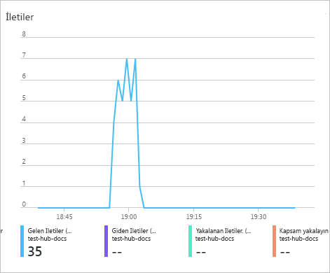

1. Veritabanına ulaşan ileti sayısını denetlemek için test veritabanınızda aşağıdaki sorguyu çalıştırın.

    ```Kusto
    TestTable
    | count
    ```

1. İleti içeriği görmek için aşağıdaki sorguyu çalıştırın:

    ```Kusto
    TestTable
    ```

    Sonuç kümesi, aşağıdaki gibi görünmelidir:

    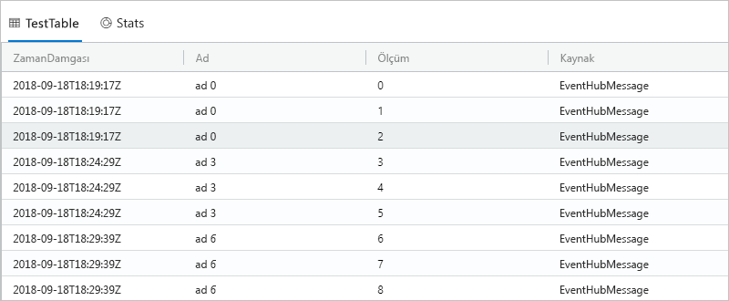

    > [!NOTE]
    > Azure Veri Gezgini, bir toplama (toplu) ilke alma işlemi optimize etmek için tasarlanan, veri alımı için vardır. Bir gecikme karşılaşabileceğiniz şekilde ilkeyi 5 dakika ile yapılandırılır.

## <a name="clean-up-resources"></a>Kaynakları temizleme

Olay hub'ınızı daha sonra kullanmayı planlamıyorsanız ek maliyet oluşmasını önlemek için **test-hub-rg** adlı kaynak grubunu kaldırın.

1. Azure portalında, en solda bulunan **Kaynak grupları**’nı ve ardından oluşturduğunuz kaynak grubunu seçin.  

    Soldaki menü daraltılmışsa, genişletmek için  öğesine tıklayın.

   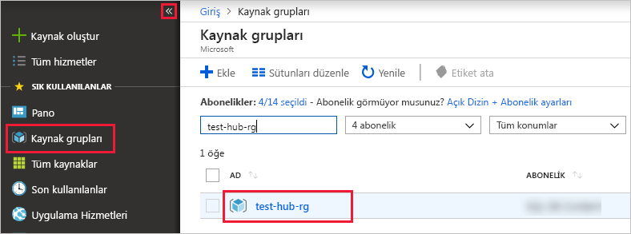

1. **test-resource-group** altında **Kaynak grubunu sil**'i seçin.

1. Yeni pencerede silinecek kaynak grubunun adını yazın (*test-hub-rg*) ve **Sil**'i seçin.

## <a name="next-steps"></a>Sonraki adımlar

> [!div class="nextstepaction"]
> [Hızlı Başlangıç: Azure veri Gezgini'nde verileri Sorgulama](web-query-data.md)
