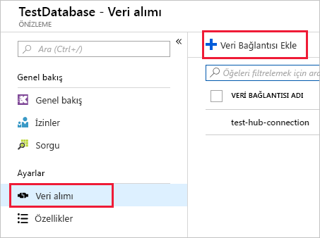

# <a name="quickstart-ingest-data-from-event-hub-into-azure-data-explorer"></a>Hızlı başlangıç: Verileri Event Hub'dan Azure Veri Gezgini'ne alma

Azure Veri Gezgini, günlük ve telemetri verileri için hızlı ve yüksek oranda ölçeklenebilir veri keşfetme hizmetidir. Azure Veri Gezgini, büyük veri akış platformu ve olay ekleme hizmeti olan Event Hubs'dan veri eklemeyi (veri yüklemeyi) destekler. Event Hubs, saniyede milyonlarca etkinliği neredeyse gerçek zamanlı olarak işleyebilir. Bu hızlı başlangıçta bir olay hub'ı oluşturacak, Azure Veri Gezgini'nden bağlanacak ve sistemdeki veri akışını inceleyeceksiniz.

Azure aboneliğiniz yoksa başlamadan önce [ücretsiz bir Azure hesabı](https://azure.microsoft.com/free/) oluşturun.

## <a name="prerequisites"></a>Ön koşullar

Bu hızlı başlangıcı tamamlamak için Azure aboneliğine ek olarak aşağıdakilere de ihtiyacınız vardır:

* [Test kümesi ve veritabanı](create-cluster-database-portal.md)

* Veri oluşturan [örnek uygulama](https://github.com/Azure-Samples/event-hubs-dotnet-ingest)

* Örnek uygulamayı çalıştırmak için [Visual Studio 2017 sürüm 15.3.2 veya üzeri](https://www.visualstudio.com/vs/)

## <a name="sign-in-to-the-azure-portal"></a>Azure portalında oturum açın

[Azure Portal](https://portal.azure.com/) oturum açın.

## <a name="create-an-event-hub"></a>Olay hub’ı oluşturma

Bu hızlı başlangıçta örnek veri oluşturacak ve bir olay hub'ına göndereceksiniz. İlk adım bir olay hub'ı oluşturmaktır. Bunun için Azure portalda bir Azure Resource Manager (ARM) şablonu kullanacaksınız.

1. Dağıtımı başlatmak için aşağıdaki düğmeyi seçin.

    [](https://portal.azure.com/#create/Microsoft.Template/uri/https%3A%2F%2Fraw.githubusercontent.com%2FAzure%2Fazure-quickstart-templates%2Fmaster%2F201-event-hubs-create-event-hub-and-consumer-group%2Fazuredeploy.json)

    **Azure'a dağıtma** düğmesi Azure portalda doldurmanız gereken bir form sayfasını açar.

    

1. Olay hub'ının oluşturulmasını istediğiniz aboneliği seçin ve *test-hub-rg* adlı bir kaynak grubu oluşturun.

    

1. Formu aşağıdaki bilgilerle doldurun.

    

    Aşağıdaki tabloda yer almayan ayarlar için varsayılan değerleri kullanın.

    **Ayar** | **Önerilen değer** | **Alan açıklaması**
    |---|---|---|
    | Abonelik | Aboneliğiniz | Olay hub'ınız için kullanmak istediğiniz Azure aboneliğini seçin.|
    | Kaynak grubu | *test-hub-rg* | Yeni bir kaynak grubu oluşturun. |
    | Konum | *Batı ABD* | Bu hızlı başlangıç için *Batı ABD* değerini seçin. Üretim sisteminde ihtiyaçlarınıza en uygun bölgeyi seçmeniz gerekir.
    | Ad alanı adı | Benzersiz bir ad alanı adı | Ad alanınızı tanımlayan benzersiz bir ad seçin. Örneğin, *mytestnamespace*. Girdiğiniz adın sonuna *servicebus.windows.net* etki alanı adı eklenir. Ad yalnızca küçük harf, sayı ve kısa çizgi içerebilir. Ad bir harf ile başlamalı ve harf veya sayı ile bitmelidir. Değer uzunluğu 6 ile 50 karakter arasında olmalıdır.
    | Olay hub'ı adı | *test-hub* | Olay hub'ı benzersiz bir kapsayıcı kapsamı sunan ad alanında bulunur. Olay hub'ı adının ad alanında benzersiz olması gerekir. |
    | Tüketici grubu adı | *test-group* | Tüketici grupları birden fazla tüketici uygulamasının ayrı olay akışı görünümüne sahip olmasını sağlar. |
    | | |

1. **Satın al**'ı seçerek aboneliğinizde kaynak oluşturduğunuzu onaylayın.

1. Araç çubuğunda **Bildirimler**’i (zil simgesi) seçip sağlama işlemini izleyin. Dağıtımın başarıyla tamamlanması birkaç dakika sürebilir ancak beklemeden bir sonraki adıma geçebilirsiniz.

## <a name="create-a-target-table-in-azure-data-explorer"></a>Azure Veri Gezgini'nde hedef tablo oluşturma

Şimdi Azure Veri Gezgini'nde Event Hubs tarafından gönderilen verilerin ekleneceği tabloyu oluşturacaksınız. Tabloyu **Önkoşullar** bölümünde sağlanan kümede ve veritabanında oluşturacaksınız.

1. Azure portalda kümenizin altında **Sorgu**'yu seçin.

    

1. Aşağıdaki komutu pencereye kopyalayıp **Çalıştır**'ı seçin.

    ```Kusto
    .create table TestTable (TimeStamp: datetime, Name: string, Metric: int, Source:string)
    ```

    

1. Aşağıdaki komutu pencereye kopyalayıp **Çalıştır**'ı seçin.

    ```Kusto
    .create table TestTable ingestion json mapping 'TestMapping' '[{"column":"TimeStamp","path":"$.timeStamp","datatype":"datetime"},{"column":"Name","path":"$.name","datatype":"string"},{"column":"Metric","path":"$.metric","datatype":"int"},{"column":"Source","path":"$.source","datatype":"string"}]'
    ```
    Bu komut gelen JSON verilerini tablo oluştururken kullanılan sütun adları ve veri türleriyle eşler.

## <a name="connect-to-the-event-hub"></a>Olay hub'ına bağlanma

Artık Azure Veri Gezgini'nden olay hub'ına bağlanarak olay hub'ına akışı yapılan verilerin test tablosuna aktarılmasını sağlayabilirsiniz.

1. Olay hub'ı dağıtımının başarılı olduğundan emin olmak için araç çubuğunda **Bildirimler**'i seçin.

1. Oluşturduğunuz kümenin altında **Veritabanları**'nı ve ardından **TestDatabase** girişini seçin.

    

1. **Veri alımı**'nı ve ardından **Veri bağlantısı ekle**'yi seçin.

    

1. Formu aşağıdaki bilgilerle doldurun ve ardından **Oluştur**'u seçin.

    

    **Ayar** | **Önerilen değer** | **Alan açıklaması**
    |---|---|---|
    | Veri bağlantısı adı | *test-hub-connection* | Azure Veri Gezgini'nde oluşturmak istediğiniz bağlantının adı.|
    | Olay hub’ı ad alanı | Benzersiz bir ad alanı adı | Önceden seçtiğiniz ve ad alanınızı tanımlayan ad. |
    | Olay hub'ı | *test-hub* | Oluşturduğunuz olay hub'ı. |
    | Tüketici grubu | *test-group* | Oluşturduğunuz olay hub'ında tanımlanan tüketici grubu. |
    | Tablo | *TestTable* | **TestDatabase** içinde oluşturduğunuz tablo. |
    | Veri biçimi | *JSON* | JSON ve CSV biçimleri desteklenir. |
    | Sütun eşleme | *TestMapping* | **TestDatabase** içinde oluşturduğunuz eşleme. |

    Bu hızlı başlangıçta tablo adını, dosya biçimini ve eşlemeyi belirterek olay hub'ından *statik yönlendirme* gerçekleştireceksiniz. Bu özelliklerin uygulama tarafından ayarlandığı dinamik yönlendirme seçeneğini de kullanabilirsiniz.

## <a name="copy-the-connection-string"></a>Bağlantı dizesini kopyalayın

Örnek veri oluşturmak için uygulamayı çalıştırdığınızda olay hub'ı ad alanının bağlantı dizesine ihtiyacınız olacaktır.

1. Oluşturduğunuz olay hub'ı ad alanında **Paylaşılan erişim ilkeleri**'ni ve ardından **RootManageSharedAccessKey** girişini seçin.

    

1. **Bağlantı dizesi - birincil anahtar** değerini kopyalayın.

    

## <a name="generate-sample-data"></a>Örnek veri oluşturma

Azure Veri Gezgini ve olay hub'ı arasında bağlantı kurulduğunda göre indirdiğiniz örnek uygulamayı kullanarak veri oluşturmaya başlayabilirsiniz.

1. Örnek uygulama çözümünü Visual Studio'da açın.

1. *program.cs* dosyasında `connectionString` sabitini kopyaladığınız olay hub'ı ad alanı bağlantı dizesi ile güncelleştirin.

    ```csharp
    const string eventHubName = "test-hub";
    // Copy the connection string ("Connection string-primary key") from your Event Hub namespace.
    const string connectionString = @"<YourConnectionString>";
    ```

1. Uygulamayı derleyin ve çalıştırın. Uygulama olay hub'ına ileti gönderir ve o da on saniyede bir durumu yazdırır.

1. Uygulama birkaç ileti gönderdikten sonra bir sonraki adıma geçerek olay hub'ına ve test tablosuna veri akışını inceleyin.

## <a name="review-the-data-flow"></a>Veri akışını inceleme

1. Uygulama çalışırken Azure portalda olay hub'ınızın etkinliğinin zirve yaptığını görürsünüz.

    

1. Uygulamaya dönün ve 99 ileti gönderdikten sonra durdurun.

1. Veritabanına ulaşan ileti sayısını denetlemek için test veritabanınızda aşağıdaki sorguyu çalıştırın.

    ```Kusto
    TestTable
    | count
    ```

1. İletilerin içeriğini görmek için aşağıdaki sorguyu çalıştırın.

    ```Kusto
    TestTable
    ```

    Sonuç kümesi aşağıdakine benzer olmalıdır.

    

## <a name="clean-up-resources"></a>Kaynakları temizleme

Olay hub'ınızı daha sonra kullanmayı planlamıyorsanız ek maliyet oluşmasını önlemek için **test-hub-rg** adlı kaynak grubunu kaldırın.

1. Azure portalında, en solda bulunan **Kaynak grupları**’nı ve ardından oluşturduğunuz kaynak grubunu seçin.  

    Soldaki menü daraltılmışsa, genişletmek için  öğesine tıklayın.

   

1. **test-resource-group** altında **Kaynak grubunu sil**'i seçin.

1. Yeni pencerede silinecek kaynak grubunun adını yazın (*test-hub-rg*) ve **Sil**'i seçin.

## <a name="next-steps"></a>Sonraki adımlar

> [!div class="nextstepaction"]
> [Hızlı başlangıç: Azure Veri Gezgini'ndeki verileri sorgulama](web-query-data.md)
