# <a name="quickstart-query-data-in-azure-data-explorer"></a>Hızlı Başlangıç: Azure veri Gezgini'nde verileri Sorgulama

Azure Veri Gezgini, günlük ve telemetri verileri için hızlı ve yüksek oranda ölçeklenebilir veri keşfetme hizmetidir. Azure Veri Gezgini, sorgu çalıştırmanızı ve paylaşmanızı sağlayan bir web uygulaması sunar. Bu uygulama Azure portalda ve tek başına bir web uygulaması olarak sağlanır. Bu makalede uygulamanın birden fazla kümeye bağlanmanızı ve sorgularınızın ayrıntılı bağlantılarını paylaşmanızı sağlayan tek başına sürümünde çalışacaksınız.

Azure aboneliğiniz yoksa başlamadan önce [ücretsiz bir Azure hesabı](https://azure.microsoft.com/free/) oluşturun.

## <a name="prerequisites"></a>Önkoşullar

Bu hızlı başlangıcı tamamlamak için Azure aboneliğine ek olarak [bir test kümesine ve veritabanına](create-cluster-database-portal.md) ihtiyacınız vardır.

## <a name="sign-in-to-the-application"></a>Uygulamada oturum açma

[Uygulamada](https://dataexplorer.azure.com/) oturum açın.

## <a name="add-clusters"></a>Küme ekleme

Uygulamayı ilk açtığınızda herhangi bir bağlantı bulunmaz.


Sorgu çalıştırmaya başlamak için en az bir küme bağlantısı eklemeniz gerekir. Bu bölümde öğrenmenize yardımcı olmak için oluşturduğumuz Azure Veri Gezgini *help kümesine* bir önceki hızlı başlangıçta oluşturduğunuz test kümesine bağlantı ekleyeceksiniz.

1. Uygulamanın sol üst köşesinden **Küme ekle**'yi seçin.

1. İçinde **Ekle küme** iletişim kutusu, URI girin ve ardından **Ekle**.

   Yardım küme URI'si, kullanabilir `https://help.kusto.windows.net`. Kendi kümenizi varsa, kümenizin bir URI sağlayın. Örneğin, `https://mydataexplorercluster.westus.kusto.windows.net` aşağıdaki görüntüde gösterildiği gibi:

    

1. Sol taraftaki bölmede **help** kümesini görmeniz gerekir. Erişebileceğiniz örnek tabloları görmek için **Samples** veritabanını genişletin.

    

    Bu hızlı başlangıcın ilerleyen bölümlerinde ve diğer Azure Veri Gezgini makalelerinde **StormEvents** tablosunu kullanacağız.

Şimdi oluşturduğunuz test kümesini ekleyin.

1. **Küme ekle**'yi seçin.

1. **Küme ekle** iletişim kutusunda test kümenizin URL'sini `https://<ClusterName>.<Region>.kusto.windows.net/` biçiminde girin ve **Ekle**'yi seçin.

    Aşağıdaki örnekte **help** kümesini ve **docscluster.westus** adlı yeni kümeyi (tam URL: `https://docscluster.westus.kusto.windows.net/`) görebilirsiniz.

    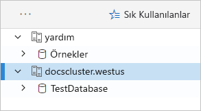

## <a name="run-queries"></a>Sorgu çalıştırma

Artık bağlı olduğunuz kümelerden istediğiniz birinde sorgu çalıştırabilirsiniz (test kümenizde veri olduğunu kabul ediyoruz). Burada **help** kümesine odaklanacağız.

1. Sol taraftaki bölmede **help** kümesinin altında **Samples** veritabanını seçin.

1. Aşağıdaki sorguyu kopyalayıp sorgu penceresine yapıştırın. Pencerenin en üstünde **Çalıştır**’ı seçin.

    ```Kusto
    StormEvents
    | sort by StartTime desc
    | take 10
    ```
    Bu sorgu **StormEvents** tablosundaki en yeni on kaydı döndürür. Sonucun sol tarafı aşağıdaki tabloya benzer olmalıdır.

    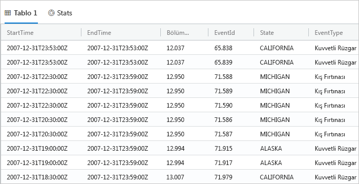

    Aşağıdaki görüntüde eklenmiş kümeler ve sorgu sonucuyla uygulamanın bulunduğu durum gösterilmektedir.

    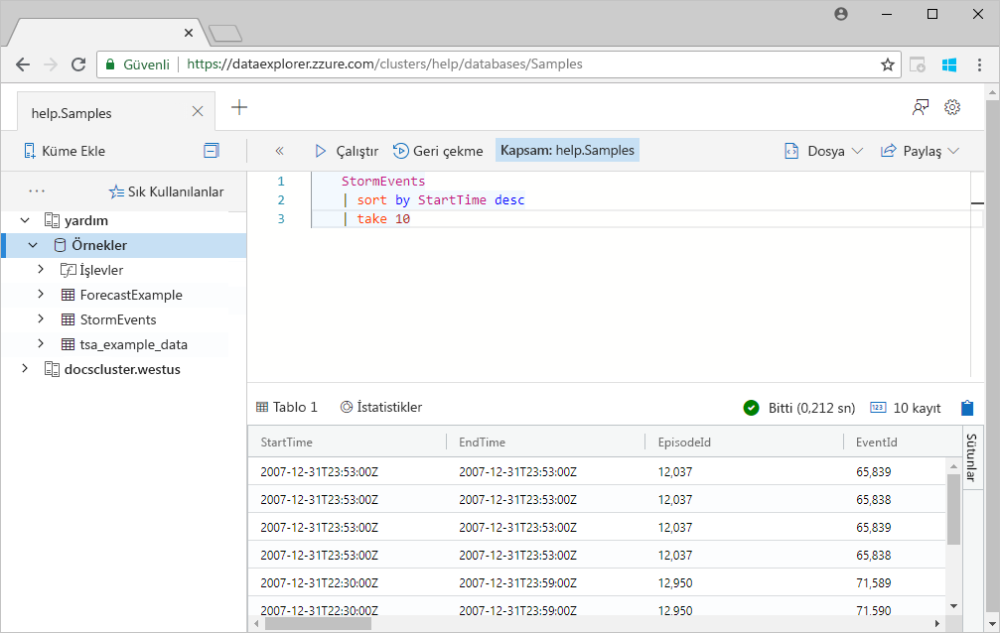

1. Aşağıdaki sorguyu kopyalayıp sorgu penceresinde ilk sorgunun altına yapıştırın. İlk sorgu gibi ayrı satırlar halinde biçimlendirilmemiş olduğuna dikkat edin.

    ```Kusto
    StormEvents | sort by StartTime desc | project StartTime, EndTime, State, EventType, DamageProperty, EpisodeNarrative | take 10
    ```

1. Penceredeki yeni sorguya tıklayarak sorguyu seçin. Shift+Alt+F tuşlarına basarak sorguyu aşağıda gösterilen şekilde biçimlendirin.

    

1. Sorgu çalıştırma kısayolu olan Shift+Enter tuşlarına basın.

   Bu sorgu da ilk sorguyla aynı kayıtları döndürür ancak yalnızca `project` deyiminde belirtilen sütunları dahil eder. Sonuç aşağıdaki tabloya benzer olmalıdır.

    

1. Pencerenin en üstündeki **Hatırla**’yı seçin.

    Sorgu penceresi artık sorguyu yeniden çalıştırmak zorunda kalmadan ilk sorgunun sonuç kümesini gösterir. Analiz sırasında genellikle birden fazla sorgu çalıştırılır ve **Hatırla** özelliği önceki sorguların sonuçlarını yeniden görüntülemenizi sağlar.

1. Şimdi farklı bir çıkış türü görmek için bir sorgu daha çalıştıralım.

    ```Kusto
    StormEvents
    | summarize event_count=count(), mid = avg(BeginLat) by State
    | sort by mid
    | where event_count > 1800
    | project State, event_count
    | render columnchart
    ```
    Sonuç aşağıdaki grafiğe benzer olmalıdır.

    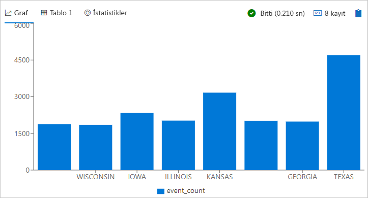

## <a name="work-with-the-table-grid"></a>Tablo kılavuzuyla çalışma

Temel sorguların nasıl çalıştığını gördünüz. Şimdi sonuçları özelleştirmek ve ek analiz gerçekleştirmek için tablo kılavuzunu nasıl kullanabileceğinize bakalım.

1. İlk sorguyu yeniden çalıştırın. Farenizle **State** sütununun üzerine gelin, menüyü seçin ve **Gruplandırma ölçütü: State** girişini seçin.

    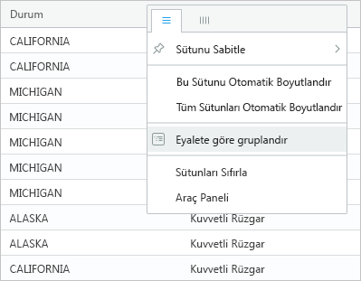

1. Kılavuzda **California**'yı genişleterek bu eyalete ait sonuçları inceleyin.

    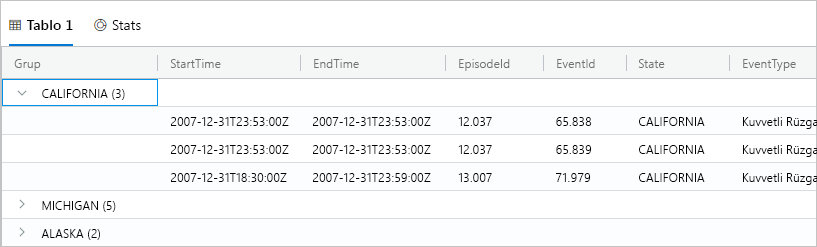

    Bu gruplandırma türü keşif analizi sırasında kullanışlı olabilir.

1. Farenizi **Group** sütununun üzerine getirip **Sütunları sıfırla**'yı seçin.

    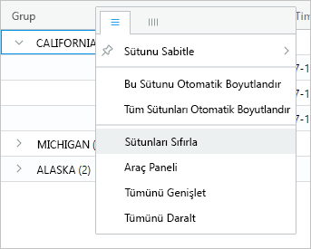

    Bu işlem kılavuzu özgün durumuna döndürür.

1. Aşağıdaki sorguyu çalıştırın.

    ```Kusto
    StormEvents
    | sort by StartTime desc
    | where DamageProperty > 5000
    | project StartTime, State, EventType, DamageProperty, Source
    | take 10
    ```

1. Kılavuzun sağ tarafında **Sütunlar**'ı seçerek araç panelini açın.

    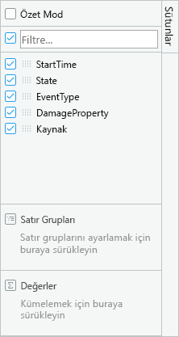

    Bu panel Excel'deki özet tablo alan listesine benzerdir ve doğrudan kılavuzda daha ayrıntılı analiz gerçekleştirmenizi sağlar.

1. Seçin **Pivot modu**, sütunları'ı şu şekilde sürükleyin: **Durum** için **satır grupları**; **DamageProperty** için **değerleri**; ve **EventType** için **sütun etiketleri**.  

    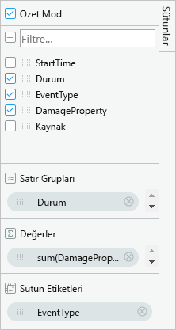

    Sonuç aşağıdaki özet tabloya benzer olmalıdır.

    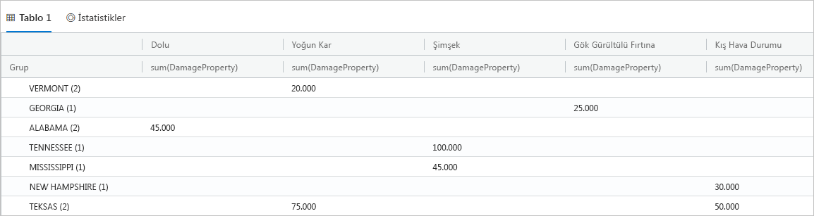

    Vermont ve Alabama'nın aynı kategoride iki olaya, Texas'ın ise farklı kategorilerde iki olaya sahip olduğunu göreceksiniz. Özet tablolar buna benzer durumları hızla fark etmenizi sağlar. Hızlı analiz için ideal araçlardır.

## <a name="share-queries"></a>Sorguları paylaşma

Çoğu zaman oluşturduğunuz sorguları paylaşmak istersiniz. Kümeye erişimi olan diğer kullanıcıların sorguları çalıştırabilmesi için ayrıntılı bağlantı sunabilirsiniz.

1. Sorgu penceresinde kopyaladığınız ilk sorgu seçin.

1. Pencerenin en üstündeki **Paylaş**’ı seçin.

1. **Bağlantı, panoya kopyala**'yı seçin.

1. Bağlantıyı ve sorguyu bir metin dosyasına kopyalayın.

1. Bağlantıyı yeni bir tarayıcı penceresine yapıştırın. Sorgu çalıştıktan sonra sonuç aşağıdakine benzer olmalıdır.

    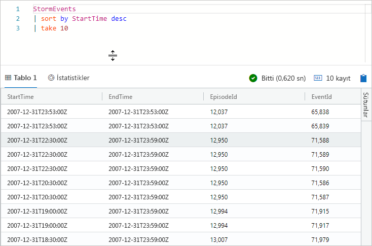

## <a name="provide-feedback"></a>Geri bildirimde bulunma

Veri Gezgini şu anda önizleme aşamasında ve deneyimlerinizle ilgili geri bildirimleriniz bizim için çok önemli. Geri bildirimlerinizi hemen veya uygulamayla biraz daha zaman geçirdikten sonra gönderebilirsiniz.

1. Uygulamanın sağ üst köşesindeki geri bildirim simgesini seçin: .

1. Geri bildiriminizi girin ve ardından **Gönder**'i seçin.

## <a name="clean-up-resources"></a>Kaynakları temizleme

Bu hızlı başlangıçta herhangi bir kaynak oluşturmadınız ancak kümelerden birini veya ikisini birden uygulamadan kaldırmak isterseniz kümeye sağ tıklayıp **Bağlantıyı kaldır**'ı seçin.

## <a name="next-steps"></a>Sonraki adımlar

> [!div class="nextstepaction"]
> [Azure Veri Gezgini için sorgu yazma](write-queries.md)
