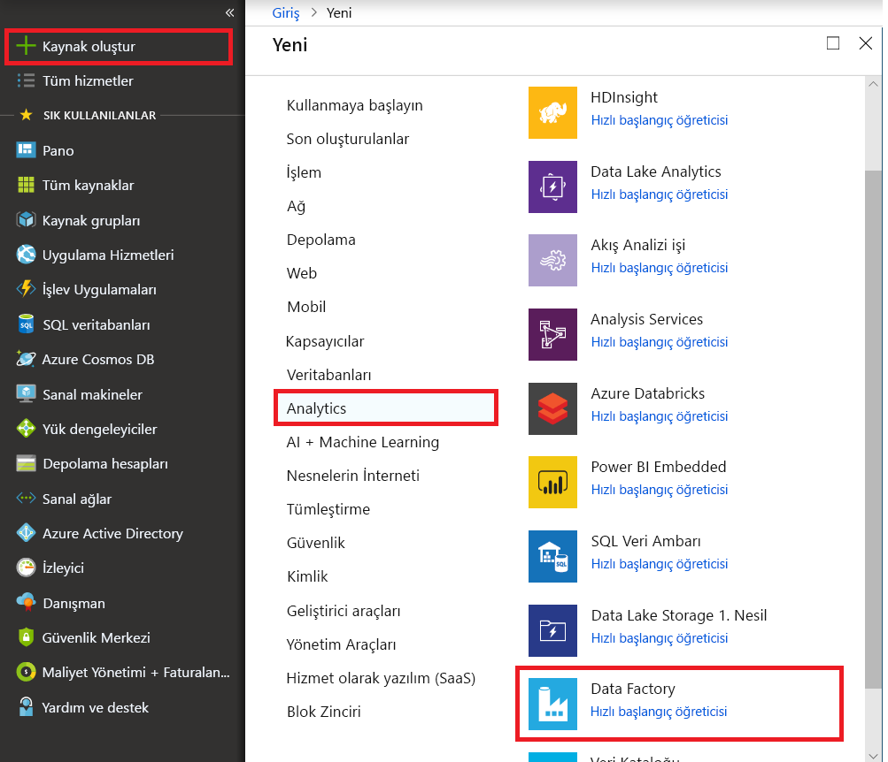

# Azure Data Lake depolama Gen2 Azure Data Factory ile veri yükleme

Azure Data Lake depolama Gen2 yerleşik, büyük veri analizi için ayrılmış özellikleri kümesidir [Azure Blob Depolama](../storage/blobs/storage-blobs-introduction.md). Her iki dosya sistemi ve nesne depolama paradigmalarını kullanarak verilerinizi ile arabirim oluşturmasını sağlar.

Azure Data Factory (ADF), tam olarak yönetilen bulut tabanlı veri tümleştirme hizmetidir. Hizmet lake zengin bir şirket içi verilerle doldurmak için kullanabileceğiniz bulut tabanlı veri depoları ve zamandan tasarruf edin ve analiz çözümlerinizi oluştururken. Desteklenen bağlayıcılar ayrıntılı bir listesi için tablosuna bakın [desteklenen veri depoları](copy-activity-overview.md#supported-data-stores-and-formats).

Azure Data Factory, ölçeği genişletme, yönetilen veri taşıma çözümü sunar. ADF genişleme mimarisi nedeniyle, verileri yüksek bir işleme alın. Ayrıntılar için bkz [kopyalama etkinliği performansı](copy-activity-performance.md).

Bu makalede Data Factory-veri kopyalama aracını kullanarak verileri gösterilmektedir _Amazon Web Services S3 hizmeti_ içine _Azure Data Lake depolama Gen2_. Diğer türlerden veri depolarının veri kopyalamak için benzer adımları izleyebilirsiniz.

>[!TIP]
>Gen2'ye Azure Data Lake depolama Gen1 veri kopyalamak için başvurmak [belirli sunduğumuz](load-azure-data-lake-storage-gen2-from-gen1.md).

## Önkoşullar

* Azure aboneliği: Azure aboneliğiniz yoksa başlamadan önce [ücretsiz bir hesap](https://azure.microsoft.com/free/) oluşturun.
* Azure depolama hesabı ile Data Lake depolama Gen2'ye etkin: Bir depolama hesabı yoksa [hesap oluşturma](https://ms.portal.azure.com/#create/Microsoft.StorageAccount-ARM).
* AWS hesabı verileri içeren bir S3 demetini ile: Bu makalede, Amazon S3'ten veri kopyalama gösterilmektedir. Benzer adımları izleyerek diğer veri depolarına kullanabilirsiniz.

## Veri fabrikası oluşturma

1. Sol menüden **kaynak Oluştur** > **veri ve analiz** > **Data Factory**:
   
   

2. İçinde **yeni veri fabrikası** sayfasında, aşağıdaki görüntüde gösterilen alanlar için değerleri sağlayın: 
      
   
 
    * **Ad**: Azure data factory'nizi için genel olarak benzersiz bir ad girin. Hatasını alırsanız "veri fabrikası adı \"LoadADLSDemo\" kullanılabilir değil," veri fabrikası için farklı bir ad girin. Örneğin, adı kullanabilirsiniz  _**adınız**_ **ADFTutorialDataFactory**. Veri Fabrikası oluşturmayı yeniden deneyin. Data Factory yapıtlarını adlandırma kuralları için bkz. [Data Factory adlandırma kuralları](naming-rules.md).
    * **Abonelik**: Veri fabrikasının oluşturulacağı Azure aboneliğini seçin. 
    * **Kaynak grubu**: Aşağı açılan listeden mevcut bir kaynak grubunu seçin ya da seçin **Yeni Oluştur** seçenek ve bir kaynak grubu adını girin. Kaynak grupları hakkında daha fazla bilgi için bkz. [Azure kaynaklarınızı yönetmek için kaynak gruplarını kullanma](../azure-resource-manager/resource-group-overview.md).  
    * **Sürüm**: Seçin **V2**.
    * **Konum**: Veri fabrikasının konumunu seçin. Açılan listede yalnızca desteklenen konumlar görüntülenir. Veri fabrikası tarafından kullanılan veri depoları başka konumlarda ve bölgelerde olabilir. 

3. **Oluştur**’u seçin.
4. Oluşturma işlemi tamamlandıktan sonra veri fabrikanıza gidin. Gördüğünüz **Data Factory** aşağıdaki görüntüde gösterildiği gibi bir giriş sayfası: 
   
   

   Seçin **yazar ve İzleyici** veri tümleştirme uygulaması ayrı bir sekmede başlatmak için.

## Azure Data Lake depolama Gen2 yük verileri

1. İçinde **başlama** sayfasında **veri kopyalama** veri kopyalama aracını başlatmak için: 

   
2. İçinde **özellikleri** sayfasında, belirtin **CopyFromAmazonS3ToADLS** için **görev adı** alan ve seçim **sonraki**:

    
3. İçinde **kaynak veri deposu** sayfasında **+ yeni bağlantı oluştur**:

    
    
    Seçin **Amazon S3** bağlayıcı galeri ve select **devam et**
    
    
    
4. İçinde **belirtin Amazon S3 bağlantı** sayfasında, aşağıdaki adımları uygulayın:

   1. Belirtin **erişim anahtarı kimliği** değeri.
   2. Belirtin **gizli erişim anahtarı** değeri.
   3. Tıklayın **Bağlantıyı Sına** ayarlarını doğrulamak için seçip **son**.
   4. Yeni bir bağlantı oluşturulduğunu görürsünüz. **İleri**’yi seçin.
   
      
      
5. İçinde **girdi dosyasını veya klasörünü seçin** sayfasında, üzerinden kopyalamak istediğiniz dosya ve klasör gözatın. Klasör/dosya seçin, **Seç**:

    

6. Kopyalama davranışını kontrol ederek belirtin **dosyaları yinelemeli olarak kopyalama** ve **ikili kopya** seçenekleri. Seçin **sonraki**:

    
    
7. İçinde **hedef veri deposuna** sayfasında **+ yeni bağlantı oluştur**ve ardından **Azure Data Lake depolama Gen2'ye**seçip **devam**:

    

8. İçinde **belirtin Azure Data Lake Storage bağlantı** sayfasında, aşağıdaki adımları uygulayın:

   1. "Depolama hesabı adı" özellikli hesabından açılır listenizi, Data Lake depolama Gen2'ı seçin.
   2. Seçin **son** bağlantı oluşturmak için. Sonra **İleri**’yi seçin.
   
   

9. İçinde **çıktı dosyasını veya klasörünü seçin** want **copyfroms3** çıkış klasörü adı ' nı seçip olarak **sonraki**. Yoksa ADF kopyalama sırasında karşılık gelen ADLS 2. nesil dosya sistemini ve alt klasör oluşturun.

    

10. İçinde **ayarları** sayfasında **sonraki** varsayılan ayarları kullanmak için:

    
11. İçinde **özeti** sayfasında, ayarları gözden geçirin ve seçin **sonraki**:

    
12. İçinde **dağıtım sayfası**seçin **İzleyici** işlem hattını izlemek için:

    
13. Soldaki **İzleyici** sekmesinin otomatik olarak seçildiğine dikkat edin. **Eylemleri** sütununda etkinlik çalıştırması ayrıntılarını görüntüleme ve işlem hattını yeniden çalıştırma bağlantılarını içerir:

    

14. İşlem hattı çalıştırması ile ilişkili etkinlik çalıştırmalarını görüntülemek için seçin **etkinlik çalıştırmalarını görüntüle** bağlantısını **eylemleri** sütun. İşlem hattında yalnızca bir etkinlik (kopyalama etkinliği) olduğundan tek bir girdi görürsünüz. İşlem hattı çalıştırmaları görünümüne dönmek için seçin **işlem hatları** üstündeki bağlantısı. Listeyi yenilemek için **Yenile**’yi seçin. 

    

15. Her bir kopyalama etkinliği için yürütme ayrıntıları izlemek için **ayrıntıları** bağlantısını (gözlük resmi) altında **eylemleri** izleme görünümü etkinlik. Veri kaynağından kopyalanan havuz, veri aktarım hızı, yürütme adımları karşılık gelen süre ve yapılandırmaları kullanılan gibi ayrıntıları izleyebilirsiniz:

    

16. Verileri Data Lake depolama Gen2 hesabınızda kopyalandığını doğrulayın.

## Sonraki adımlar

* [Kopyalama etkinliği'ne genel bakış](copy-activity-overview.md)
* [Azure Data Lake depolama Gen2 Bağlayıcısı](connector-azure-data-lake-storage.md)
