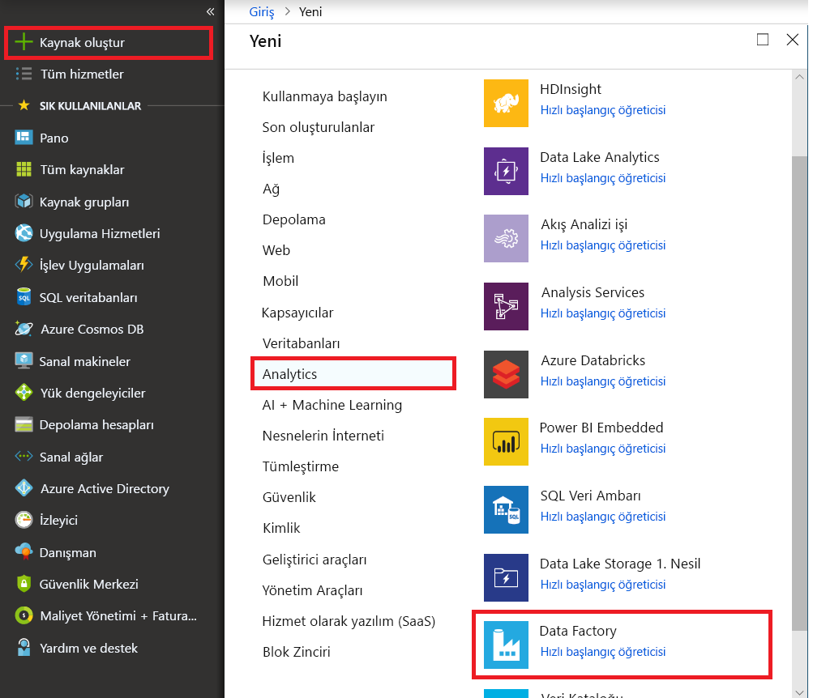
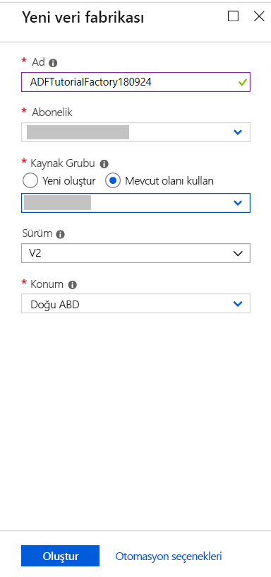
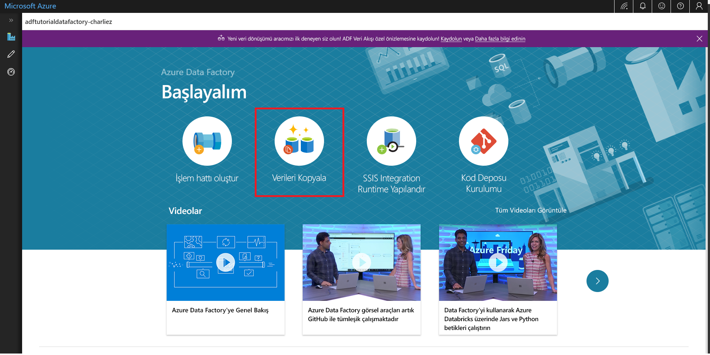

# Hızlı Başlangıç: Veri Kopyalama aracını kullanarak veri kopyalama

> [!div class="op_single_selector" title1="Select the version of Data Factory service that you are using:"]
> * [Sürüm 1](v1/data-factory-copy-data-from-azure-blob-storage-to-sql-database.md)
> * [Geçerli sürüm](quickstart-create-data-factory-copy-data-tool.md)

Bu hızlı başlangıçta Azure portalını kullanarak bir veri fabrikası oluşturursunuz. Sonra, Veri Kopyalama aracını kullanarak Azure Blob depolama alanındaki bir klasörde bulunan verileri başka bir klasöre kopyalarsınız. 

> [!NOTE]
> Azure Data Factory'yi kullanmaya yeni başlıyorsanız, bu hızlı başlangıçtaki işlemleri gerçekleştirmeden önce [Azure Data Factory'ye giriş](data-factory-introduction.md) konusuna bakın. 

[!INCLUDE [data-factory-quickstart-prerequisites](../../includes/data-factory-quickstart-prerequisites.md)] 

## Veri fabrikası oluşturma

1. Soldaki menüden **Yeni**’yi, sonra **Veri ve Analiz**’i ve ardından **Data Factory**’i seçin. 
   
   
1. **Yeni veri fabrikası** sayfasında **Ad** için **ADFTutorialDataFactory** girin. 
      
   
 
   Azure data factory adı *küresel olarak benzersiz* olmalıdır. Aşağıdaki hatayı alırsanız veri fabrikasının adını değiştirin (örneğin **&lt; adınız&gt;ADFTutorialDataFactory**) ve veri fabrikası oluşturmayı yeniden deneyin. Data Factory yapıtlarının adlandırma kuralları için [Data Factory - adlandırma kuralları](naming-rules.md) makalesini inceleyin.
  
   
1. **Abonelik** için, veri fabrikasını oluşturmak istediğiniz Azure aboneliğini seçin. 
1. **Kaynak Grubu** için aşağıdaki adımlardan birini uygulayın:
     
   - **Var olanı kullan**’ı ve ardından listeden var olan bir kaynak grubunu seçin. 
   - **Yeni oluştur**’u seçin ve bir kaynak grubunun adını girin.   
         
   Kaynak grupları hakkında daha fazla bilgi için bkz. [Azure kaynaklarınızı yönetmek için kaynak gruplarını kullanma](../azure-resource-manager/resource-group-overview.md).  
1. **Sürüm** bölümünde **V2**'yi seçin.
1. **Konum** için, veri fabrikasının konumunu seçin. 

   Listede yalnızca Data Factory tarafından desteklenen ve Azure Data Factory meta verilerinizin depolanacağı konumlar gösterilir. Data Factory tarafından kullanılan veri depolarının (Azure Depolama ve Azure SQL Veritabanı gibi) ve işlemlerin (Azure HDInsight gibi) başka konumlarda veya bölgelerde çalışabileceğini unutmayın.

1. **Oluştur**’u seçin.
1. Oluşturma işlemi tamamlandıktan sonra, **Data Factory** sayfasını görürsünüz. Azure Data Factory kullanıcı arabirimi (UI) uygulamasını ayrı bir sekmede başlatmak için **Yazar ve İzleyici** kutucuğunu seçin.
   
   

## Veri Kopyalama aracını başlatma

1. **Başlayalım** sayfasında, Veri Kopyalama aracını başlatmak için **Veri Kopyala** kutucuğunu seçin. 

   

1. Veri Kopyalama aracının **Özellikler** sayfasında işlem hattı için bir ad ve açıklama belirtip **İleri**'yi seçebilirsiniz. 

   
1. **Kaynak veri deposu** sayfasında aşağıdaki adımları tamamlayın:

    a. Bağlantı eklemek için **+ Yeni bağlantı oluştur**'a tıklayın.

    

    b. Galeriden **Azure Blob Depolama**'yı ve ardından **İleri**'yi seçin.

    

    c. **Azure Blob depolama hesabı belirtin** sayfasında, **Depolama hesabı adı** listesinden depolama hesabınızı ve sonra **Son**’u seçin. 

   

   d. Kaynak olarak yeni oluşturulan bağlantılı hizmeti seçin ve **İleri**'ye tıklayın.

   

1. **Girdi dosyasını veya klasörünü seçin** sayfasında aşağıdaki adımları uygulayın:

   a. **Göz at**'a tıklayarak **adftutorial/input** klasörüne gidin, **emp.txt** dosyasını seçin ve **Seç**'e tıklayın. 

   

   d. Dosyayı olduğu gibi kopyalamak için **İkili kopya**'a tıklayıp **İleri**'yi seçin. 

   

1. **Hedef veri deposu** sayfasında yeni oluşturduğunuz bağlantılı **Azure Blob Depolama** hizmetini ve sonra **İleri**'yi seçin. 

   

1. **Çıkış dosyasını veya klasörünü seçin** sayfasında klasör yolu olarak **adftutorial/output** girip **İleri**'yi seçin. 

    

1. **Ayarlar** sayfasında varsayılan yapılandırmaları kullanmak için **İleri**'yi seçin. 

1. **Özet** sayfasında tüm ayarları gözden geçirin ve **İleri**'yi seçin. 

    

1. **Dağıtım tamamlandı** sayfasında, oluşturduğunuz işlem hattını izlemek için **İzleyici**’yi seçin. 

    

1. Uygulama **İzleyici** sekmesine geçer. Bu sekmede işlem hattının durumunu görürsünüz. Listeyi yenilemek için **Yenile**’yi seçin. 
    
    

1. **Eylemler** sütununda **Etkinlik Çalıştırma İşlemlerini Görüntüle**’yi seçin. İşlem hattı, **Kopyalama** türünde tek bir etkinlik içerir. 

    
    
1. Kopyalama işlemiyle ilgili ayrıntıları görüntülemek için **Eylemler** sütunundaki **Ayrıntılar**’ı (gözlük resmi) seçin. Özelliklerle ilgili ayrıntılar için bkz. [Kopyalama Etkinliğine genel bakış](copy-activity-overview.md).

    

1. **adftutorial** kapsayıcısının **çıktı** klasöründe **emp.txt** dosyasının oluşturulduğunu doğrulayın. Çıkış klasörü yoksa, Data Factory hizmeti tarafından otomatik olarak oluşturulur. 

1. Bağlantılı hizmetleri, veri kümelerini ve işlem hatlarını düzenlemek için sol panelde **İzleyici** sekmesinin üzerindeki **Yazar** sekmesine geçin. Bunları Data Factory kullanıcı arabiriminde düzenleme hakkında bilgi edinmek için bkz. [Azure portalını kullanarak veri fabrikası oluşturma](quickstart-create-data-factory-portal.md).

## Sonraki adımlar
Bu örnekteki işlem hattı, verileri bir konumdan Azure Blob depolama alanındaki başka bir konuma kopyalar. Data Factory’yi daha fazla senaryoda kullanma hakkında bilgi almak için [öğreticileri](tutorial-copy-data-portal.md) okuyun. 