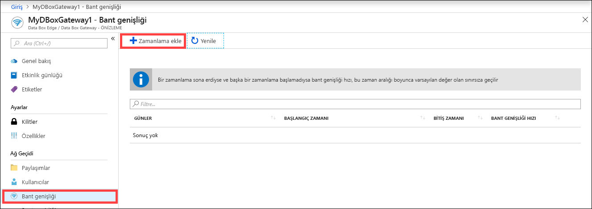
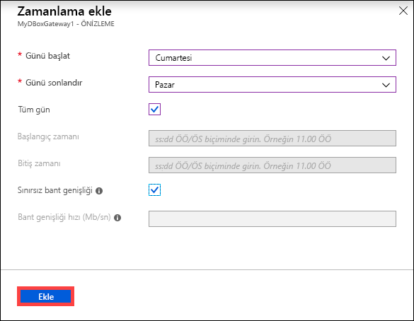
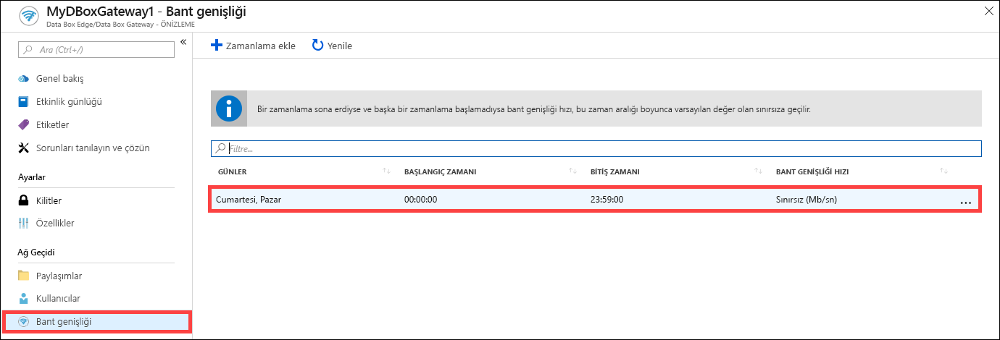
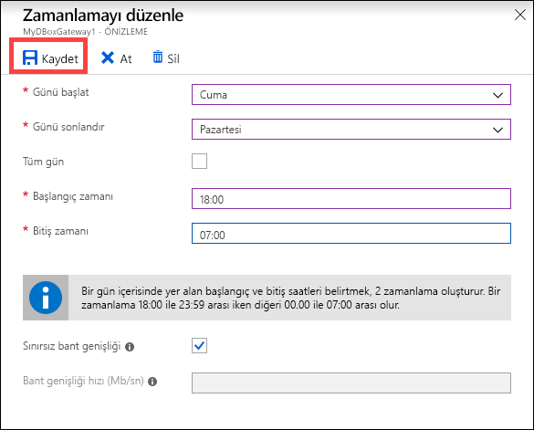
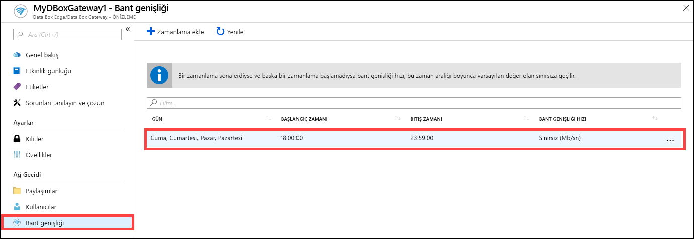
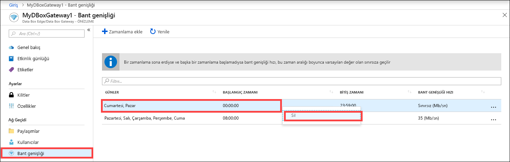

# Azure Data Box Gateway bant genişliği zamanlamalarını yönetmek için Azure portalı kullanma  

Bu makalede Azure Data Box Gateway kullanıcılarını yönetme adımları açıklanmaktadır. Bant genişliği zamanlamaları, ağ bant genişliği kullanımını birden çok zamanlamaya göre yapılandırmanızı sağlar. Bu zamanlamalar, cihazınızla bulut arasında gerçekleştirilen yükleme ve indirme işlemlerine uygulanabilir. 

Data Box Gateway cihazınız için bant genişliği zamanlaması ekleme, değiştirme veya silme işlemlerini Azure portaldan gerçekleştirebilirsiniz.

Bu makalede şunları öğreneceksiniz:

> [!div class="checklist"]
> * Zamanlama ekleme
> * Zamanlamayı değiştirme
> * Zamanlamayı silme 

## Zamanlama ekleme

Kullanıcı eklemek için Azure portalda aşağıdaki adımları gerçekleştirin.

1. Data Box Gateway kaynağınızın Azure portal sayfasında **Bant genişliği** bölümüne gidin.
2. Sağdaki bölmede **+ Zamanlama ekle**'ye tıklayın.

    

3. **Zamanlama ekle** sayfasında: 

   1. Zamanlamanın **Başlangıç günü**, **Bitiş günü**, **Başlangıç saati** ve **Bitiş saati** değerlerini belirleyin. 
   2. Zamanlama gün boyu çalışıyorsa **Tüm gün** seçeneğini işaretleyebilirsiniz. 
   3. **Bant genişliği hızı**, cihazınızda gerçekleştirilen bulutla ilgili işlemler (yükleme ve indirme) için kullanılan bant genişliğidir ve saniye başına megabit (Mb/sn) cinsinden ölçülür. Bu alana 1 ile 1000 arasında bir sayı girin. 
   4. Veri yükleme ve indirme işlemlerini kısıtlamak istemiyorsanız **Sınırsız** bant genişliğini seçin. 
   5. **Ekle**'ye tıklayın.

      

3. Belirtilen parametrelerle bir zamanlama oluşturulur. Bu zamanlama daha sonra portaldaki bant genişliği zamanlamaları listesinde görüntülenir.

## Zamanlamayı düzenleme

Bir bant genişliği zamanlamasını düzenlemek için aşağıdaki adımları gerçekleştirin. 

1. Data Box Gateway kaynağınızın Azure portal sayfasında Bant genişliği bölümüne gidin. 
2. Bant genişliği zamanlaması listesinden değiştirmek istediğiniz zamanlamayı seçin ve tıklayın.
    

3. İstediğiniz değişiklikleri yapın ve değişiklikleri kaydedin.

    

4. Zamanlama değiştirildikten sonra zamanlama listesi değiştirilen zamanlamayı gösterecek şekilde güncelleştirilir.

    

## Zamanlamayı silme

Data Box Gateway cihazınızla ilişkilendirilmiş bant genişliği zamanlamasını silmek için aşağıdaki adımları gerçekleştirin.

1. Data Box Gateway kaynağınızın Azure portal sayfasında **Bant genişliği** bölümüne gidin.  

2. Bant genişliği zamanlaması listesinden silmek istediğiniz zamanlamayı seçin. Sağ tıklayın ve açılan bağlam menüsünde **Sil**'e tıklayın. 

   

3.  Zamanlama silindikten sonra zamanlama listesi güncelleştirilir.

## Sonraki adımlar

- [Bant genişliğini yönetmeyi](data-box-gateway-manage-bandwidth-schedules.md) öğrenin.
