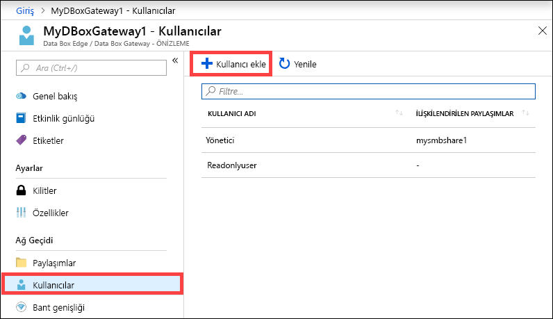
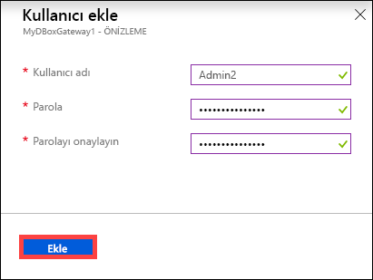
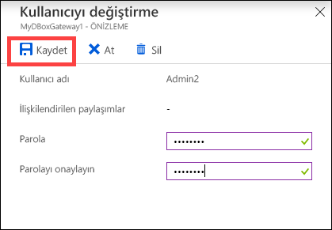
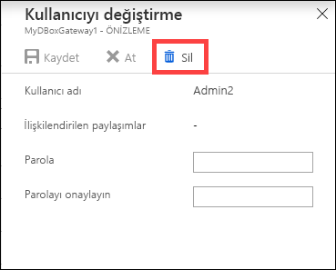
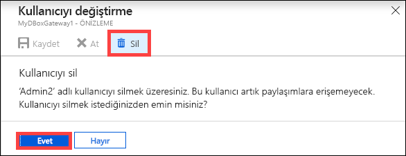
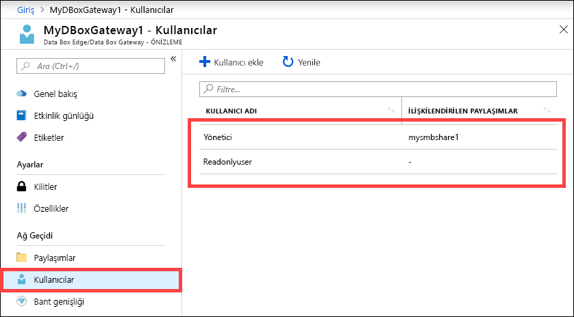

# Azure portalı kullanarak Azure Data Box Gateway kullanıcılarını yönetme 

Bu makalede Azure Data Box Gateway kullanıcılarını yönetme adımları açıklanmaktadır. Azure Data Box Gateway’i Azure portal veya yerel web kullanıcı arabirimiyle yönetebilirsiniz. Kullanıcı ekleme, değiştirme ve silme işlemleri için Azure portalı kullanın.

Bu makalede şunları öğreneceksiniz:

> [!div class="checklist"]
> * Kullanıcı ekleme
> * Kullanıcıyı değiştirme
> * Kullanıcı silme 

## Kullanıcılar hakkında

Kullanıcılara salt okunur erişim veya tam ayrıcalık verilebilir. Adından anlaşılacağı üzere salt okunur kullanıcılar paylaşım verilerini yalnızca görüntüleyebilir. Tam ayrıcalık sahibi kullanıcılar paylaşım verilerini okuyabilir, bu paylaşımlara veri yazabilir, paylaşım verilerini değiştirebilir veya silebilir. 

 - **Tam ayrıcalıklı kullanıcı**: Tam erişime sahip yerel kullanıcıdır. 
 - **Salt okunur kullanıcı**: Salt okunur erişime sahip yerel kullanıcıdır. Bu kullanıcılar yalnızca salt okunur işlemlere izin veren paylaşımlarla ilişkilendirilir.

Kullanıcı izinleri, paylaşım oluşturma sırasında kullanıcı oluşturulurken tanımlanır. Bir kullanıcıya atanan izinler Dosya Gezgini kullanılarak değiştirilebilir. 

## Kullanıcı ekleme

Kullanıcı eklemek için Azure portalda aşağıdaki adımları gerçekleştirin.

1. Data Box Gateway kaynağınızın Azure portal sayfasında **Genel bakış** bölümüne gidin. Komut çubuğunda **+ Kullanıcı ekle**'ye tıklayın.

    

2. Eklemek istediğiniz kullanıcının kullanıcı adını ve parolasını belirtin. Parolayı onaylayın ve **Ekle**'ye tıklayın.

    

    > [!IMPORTANT] 
    > Bu kullanıcılar, sistem tarafından ayrılmıştır ve kullanılmamalıdır: Yönetici, EdgeUser, EdgeSupport, HcsSetupUser, WDAGUtilityAccount, CLIUSR, DefaultAccount, konuk.  

3. Kullanıcı oluşturma işlemi başladığında ve tamamlandığında bildirim alırsınız. Kullanıcı oluşturulduktan sonra komut çubuğunda **Yenile**'ye tıklayarak güncel kullanıcı listesini görüntüleyebilirsiniz.

## Kullanıcıyı değiştirme

Kullanıcı oluşturulduktan sonra parolasını değiştirebilirsiniz. Kullanıcı listesinden seçin ve tıklayın. Yeni parolayı girin ve onaylayın. Değişiklikleri kaydedin.
 

## Kullanıcı silme

Kullanıcı silmek için Azure portalda aşağıdaki adımları gerçekleştirin.

1. Kullanıcı listesinden bir kullanıcı seçin ve **Sil**'e tıklayın.  

   

2. Sorulduğunda silme işlemini onaylayın. 

   

Kullanıcı listesi silinen kullanıcıya göre güncelleştirilir.

## Sonraki adımlar

- [Bant genişliğini yönetmeyi](data-box-gateway-manage-bandwidth-schedules.md) öğrenin.
