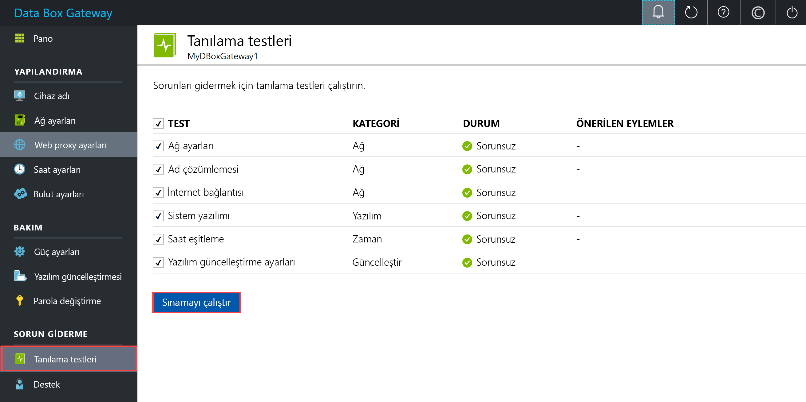
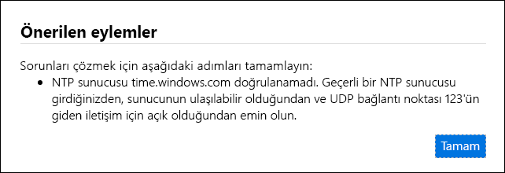
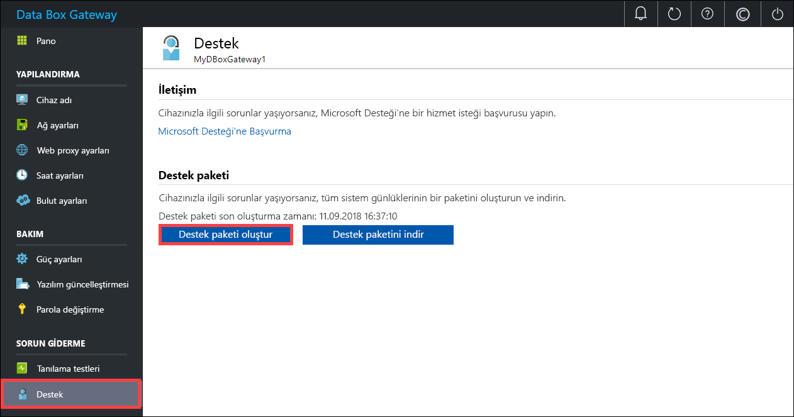
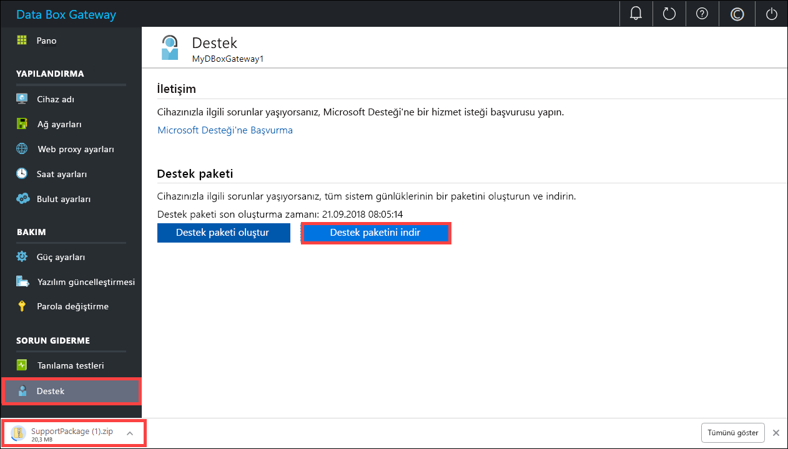
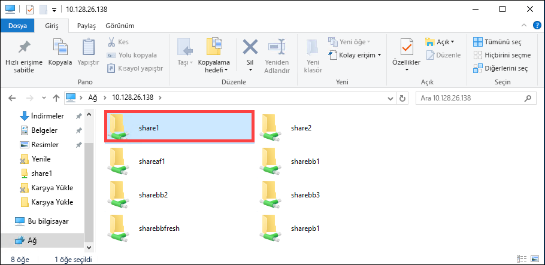

# <a name="troubleshoot-your-azure-data-box-gateway-issues"></a>Azure Data Box Gateway sorunlarınızı giderme 

Bu makalede Azure Data Box Gateway sorunlarını giderme adımları açıklanmaktadır. Bu makalede şunları öğreneceksiniz:

> [!div class="checklist"]
> * Tanılama çalıştırma
> * Destek paketi toplama
> * Sorun gidermek için günlükleri kullanma


## <a name="run-diagnostics"></a>Tanılama çalıştırma

Cihaz hatalarını tanılamak ve gidermek için tanılama testlerini çalıştırabilirsiniz. Tanılama testlerini çalıştırmak için cihazınızın yerel web arabiriminde aşağıdaki adımları gerçekleştirin.

1. Yerel web arabiriminde **Sorun giderme > Tanılama testleri** sayfasına gidin. Çalıştırmak istediğiniz testi seçip **Testi çalıştır** öğesine tıklayın. Bunu yaptığınızda ağ, cihaz, web proxy, saat veya bulut ayarlarınızdaki sorunların tanılanmasına yönelik testler çalıştırılır. Cihazın testleri çalıştırdığı bildirilir.

    
 
2. Testler tamamlandıktan sonra sonuçlar görüntülenir. Test başarısız olursa önerilen eylem URL'si gösterilir. URL'ye tıklayarak önerilen eylemi görüntüleyebilirsiniz. 
 
    


## <a name="collect-support-package"></a>Destek paketi toplama

Günlük paketi, Microsoft Desteğinin cihaz sorunlarını giderme konusunda yardımcı olabilmesi için ihtiyaç duyabileceği günlüklerin tamamını içerir. Günlük paketi oluşturmak için yerel web arabirimini kullanabilirsiniz.

Destek paketi toplamak için aşağıdaki adımları gerçekleştirin. 

1. Yerel web arabiriminde **Sorun giderme > Destek** sayfasına gidin. **Destek paketi oluştur** öğesine tıklayın. Sistem, destek paketini toplamaya başlar. Paketin toplanması birkaç dakika sürebilir.

    
 
2. Destek paketi oluşturulduktan sonra **Destek paketini indir**'e tıklayın. Seçtiğiniz yola .zip uzantılı bir paket indirilir. Paketin sıkıştırmasını açın.

    

## <a name="use-logs-to-troubleshoot"></a>Sorun gidermek için günlükleri kullanma

Yükleme ve yenileme işlemlerinde karşılaşılan hatalar ilgili hata dosyalarına yazılır.

1. Hata dosyalarını görüntülemek için paylaşımınıza gidin ve içeriği görüntülemek için paylaşıma tıklayın. 

      

2. _Microsoft Data Box Gateway klasörü_'ne tıklayın. Bu klasör iki alt klasör içerir:

   - Karşıya yükleme hatalarının bulunduğu Upload klasörü.
   - Yenileme sırasında karşılaşılan hataların bulunduğu Refresh klasörü.

     Yenileme günlük dosyası örneği burada gösterilmiştir.

     ```
     <root container="brownbag1" machine="VM15BS020663" timestamp="07/18/2018 00:11:10" />
     <file item="test.txt" local="False" remote="True" error="16001" />
     <summary runtime="00:00:00.0945320" errors="1" creates="2" deletes="0" insync="3" replaces="0" pending="9" />
     ``` 

3. Bu dosyada bir hata gördüğünüzde (örnekte vurgulanmıştır) hata kodunu yazın (burada 16001). Hata kodunun açıklamasını aşağıdaki hata başvurusu bölümünde bulabilirsiniz.

    |     Hata kodu     |     Özel durum adı                                         |     Hata açıklaması                                                                                                                                                                                                                     |
    |--------------------|------------------------------------------------------------|-------------------------------------------------------------------------------------------------------------------------------------------------------------------------------------------------------------------------------------------|
    |    100             |    ERROR_CONTAINER_OR_SHARE_NAME_LENGTH                    |    Kapsayıcı veya paylaşım adı 3 ile 63 karakter arasında olmalıdır.                                                                                                                                                                     |
    |    101             |    ERROR_CONTAINER_OR_SHARE_NAME_ALPHA_NUMERIC_DASH        |    Kapsayıcı veya paylaşım adında yalnızca harf, rakam veya kısa çizgi bulunmalıdır.                                                                                                                                                       |
    |    102             |    ERROR_CONTAINER_OR_SHARE_NAME_IMPROPER_DASH             |    Kapsayıcı veya paylaşım adında yalnızca harf, rakam veya kısa çizgi bulunmalıdır.                                                                                                                                                       |
    |    103             |    ERROR_BLOB_OR_FILE_NAME_CHARACTER_CONTROL               |    Blob veya dosya adında desteklenmeyen denetim karakterleri var.                                                                                                                                                                       |
    |    104             |    ERROR_BLOB_OR_FILE_NAME_CHARACTER_ILLEGAL               |    Blob veya dosya adında geçersiz karakterler var.                                                                                                                                                                                   |
    |    105             |    ERROR_BLOB_OR_FILE_NAME_SEGMENT_COUNT                   |    Blob veya dosya adında çok fazla bölüm var (bölümler eğik çizgi -/ ile ayrılır).                                                                                                                                              |
    |    106             |    ERROR_BLOB_OR_FILE_NAME_AGGREGATE_LENGTH                |    Blob veya dosya adı çok uzun.                                                                                                                                                                                                     |
    |    107             |    ERROR_BLOB_OR_FILE_NAME_COMPONENT_LENGTH                |    Blob veya dosya adı bölümlerinden biri çok uzun.                                                                                                                                                                            |
    |    108             |    ERROR_BLOB_OR_FILE_SIZE_LIMIT                           |    Dosya boyutu karşıya yüklenebilecek maksimum dosya boyutunu aşıyor.                                                                                                                                                                              |
    |    109             |    ERROR_BLOB_OR_FILE_SIZE_ALIGNMENT                       |    Blob veya dosya hatalı hizalanmış.                                                                                                                                                                                               |
    |    110             |    ERROR_NAME_NOT_VALID_UNICODE                            |    Unicode kodlamalı dosya adı veya blob adı geçerli değil.                                                                                                                                                                                  |
    |    111             |    ERROR_RESERVED_NAME_NOT_ALLOWED                         |    Dosyanın veya blobun adında ya da ön ekinde desteklenmeyen ayrılmış ad kullanılıyor (örneğin, COM1).                                                                                                                             |
    |    2000            |    ERROR_ETAG_MISMATCH                                     |    Etag uyumsuzluğu buluttaki blok blobu ile cihazdaki blok blobu arasında çakışma olduğunu belirtir. Bu çakışmayı çözmek için dosyalardan birini (buluttaki sürümü veya cihazdaki sürümü) silin.    |
    |    2001            |    ERROR_UNEXPECTED_FINALIZE_FAILURE                       |    Karşıya yüklenen bir dosyayı işleme sırasında beklenmeyen bir sorun oluştu.    Bu hatayı görürseniz ve hata 24 saatten uzun bir süre devam ederse destek ile iletişim kurun.                                                      |
    |    2002            |    ERROR_ALREADY_OPEN                                      |    Dosya başka bir işlemde açık ve işleyici kapatılana kadar karşıya yüklenemez.                                                                                                                                       |
    |    2003            |    ERROR_UNABLE_TO_OPEN                                    |    Dosya karşıya yükleme için açılamadı. Bu hatayı görürseniz Microsoft Desteği ile iletişim kurun.                                                                                                                                                |
    |    2004            |    ERROR_UNABLE_TO_CONNECT                                 |    Veri yüklemek için kapsayıcı bağlantısı kurulamadı.                                                                                                                                                                             |
    |    2005            |    ERROR_INVALID_CLOUD_CREDENTIALS                         |    Hesap izinleri yanlış olduğundan veya güncel olmadığından kapsayıcı bağlantısı kurulamadı. Erişiminizi kontrol edin.                                                                                                               |
    |    2006            |    ERROR_CLOUD_ACCOUNT_DISABLED                            |    Hesap veya paylaşım devre dışı olduğundan hesaba veri yüklenemedi.                                                                                                                                                            |
    |    2007            |    ERROR_CLOUD_ACCOUNT_PERMISSIONS                         |    Hesap izinleri yanlış olduğundan veya güncel olmadığından kapsayıcı bağlantısı kurulamadı. Erişiminizi kontrol edin.                                                                                                               |
    |    2008            |    ERROR_CLOUD_CONTAINER_SIZE_LIMIT_REACHED                |    Kapsayıcı dolu olduğundan yeni veri eklenemedi. Türe göre desteklenen kapsayıcı boyutları için Azure özelliklerine bakın. Örneğin Azure Dosyaları en fazla 5 TB büyüklüğündeki dosyaları kabul eder.                                     |
    |    2009            |    ERROR_CLOUD_CONTAINER_MISSING                |     Veri paylaşımı ile ilişkili olan kapsayıcıya mevcut olmadığından karşıya yükleyemedik.                                     |    
    |    2997            |    ERROR_ITEM_CANCELED                                     |    Beklenmeyen bir hata oluştu. Kendi geçici bir hatadır.                                                                           |
    |    2998            |    ERROR_UNMAPPED_FAILURE                                  |    Beklenmeyen bir hata oluştu. Bu hata kendiliğinden çözülebilir ancak 24 saatten uzun bir süre devam ederse Microsoft Desteği ile iletişim kurun.                                                                                                     |
    |    16000           |    RefreshException                                        |    Bu dosya indirilemedi.                                                                                                                                                                                                        |
    |    16001           |    RefreshAlreadyExistsException                           |    Yerel sisteminizde mevcut olduğundan bu dosya indirilemedi.                                                                                                                                                         |
    |    16002           |    RefreshWorkNeededException                              |    Bu dosya tam olarak yüklenmediğinden yenilenemedi.                                                                                                                                                                          | 


## <a name="next-steps"></a>Sonraki adımlar

- [Bu sürümdeki bilinen sorunlar](data-box-gateway-release-notes.md) hakkında daha fazla bilgi edinin.
