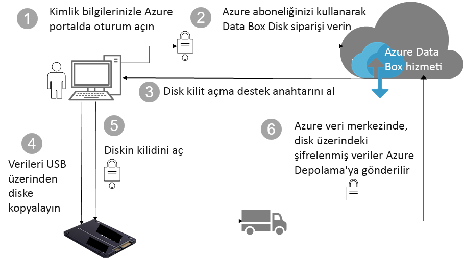

# Azure Data Box Disk güvenlik ve veri koruması

Bu makalede, Data Box çözümü bileşenlerinden her birini ve buralarda depolanan verileri korumaya yardımcı olan Azure Data Box Disk güvenliği açıklanır. 

## Bileşenler arasında veri akışı

Microsoft Azure Data Box çözümü birbiriyle etkileşimde olan dört ana bileşenden oluşur:

- **Azure’da barındırılan Azure Data Box hizmeti** – Disk sırası oluşturmak, diskleri yapılandırmak ve tamamlanması için sırayı izlemek amacıyla kullandığınız yönetim hizmeti.
- **Data Box Disk'ler** – Şirket içi verilerinizi Azure’a aktarmanız için size gönderilen fiziksel diskler. 
- **Disklere bağlı istemciler/konaklar** – Altyapınızda USB üzerinden Data Box diskine bağlanan ve korunması gereken verileri içeren istemciler.
- **Bulut depolama** – Azure bulutunda verilerin depolandığı konum. Bu genellikle, oluşturduğunuz Azure Data Box kaynağına bağlanan depolama hesabıdır.

Aşağıdaki diyagram, Azure Data Box Disk çözümü aracılığıyla şirket içinden Azure’a veri akışını gösterir.

## Güvenlik özellikleri

Data Box Disk, verilerinizi yalnızca yetkili varlıkların görüntüleyebilmesini, değiştirebilmesini veya silebilmesini sağlayarak veri koruma için güvenli çözüm getirir. Bu çözümle ilgili güvenlik özellikleri hem diske hem de hizmete yöneliktir ve burada depolanan verilerin güvenliğini sağlar. 

### Data Box Disk koruması

Data Box Disk aşağıdaki özelliklerle korunur:

- Her zaman BitLocker AES-128 bit şifrelemesi.
- Diskler için güvenli güncelleştirme özelliği.
- Diskler kilitli durumda gönderilir ve yalnızca Data Box Disk kilidi açma aracıyla kilidi açılabilir. Kilit açma aracına Data Box Disk hizmet portalından ulaşılabilir.

### Data Box Disk veri koruması

Data Box Disk içine ve dışına akıtılan veriler şu özelliklerle korunur:

- Her zaman verilerin BitLocker şifrelemesi. 
- Verilerin Azure’a yüklenmesi tamamlandıktan sonra diskteki verilerin güvenli bir şekilde silinmesi. Verilerin silinmesi NIST 800-88r1 standartlarıyla uyumludur.

### Data Box hizmeti koruması

Data Box hizmeti aşağıdaki özelliklerle korunur.

- Data Box Disk hizmetine erişim için kuruluşunuzun Data Box Disk içeren bir Azure aboneliği olmalıdır. Aboneliğiniz, Azure portalında erişebildiğiniz özellikleri yönetir.
- Data Box hizmeti Azure’da barındırıldığından, Azure güvenlik özellikleriyle korunur. Microsoft Azure tarafından sağlanan güvenlik özellikleri hakkında daha fazla bilgi için [Microsoft Azure Güven Merkezi](https://www.microsoft.com/TrustCenter/Security/default.aspx)’ne gidin. 
- Data Box Disk’te, hizmetteki diskin kilidini açmak için kullanılan disk destek anahtarı depolanır. 
- Data Box Disk hizmeti, hizmetteki sipariş ayrıntılarını ve durumunu depolar. Sipariş silindiğinde bu bilgiler de silinir. 

## Kişisel verileri yönetme

[!INCLUDE [GDPR-related guidance](../../includes/gdpr-intro-sentence.md)]

Azure Data Box Disk, hizmette şu anahtar örneklerde kişisel bilgileri toplar ve görüntüler:

- **Bildirim ayarları** - Sipariş oluşturduğunuzda, bildirim ayarlarının altında kullanıcıların e-posta adreslerini yapılandırırsınız. Bu bilgiler yönetici tarafından görüntülenebilir. Bu bilgiler, iş terminal duruman ulaştığında veya siparişi sildiğinizde hizmet tarafından silinir.

- **Sipariş ayrıntıları** – Sipariş oluşturulduktan sonra, kullanıcının teslimat adresi, e-postası, kişi bilgileri Azure portalında depolanır. Kaydedilen bilgiler:

  - Kişi adı
  - Telefon numarası
  - Email
  - Açık adres
  - Şehir
  - Posta kodu
  - Durum
  - Ülke/İl/Bölge
  - Sürücü kimliği
  - Taşıyıcı hesap numarası
  - Kargo takip numarası

    Sipariş ayrıntıları, iş tamamlandığında veya siz siparişi sildiğinizde Data Box hizmeti tarafından silinir.

- **Teslimat adresi** – Sipariş verildikten sonra, Data Box hizmeti UPS veya DHL gibi üçüncü taraf taşıyıcılara teslimat adresini verir. 

Daha fazla bilgi için, [Güven Merkezi](https://www.microsoft.com/trustcenter)’nde Microsoft Gizlilik ilkesini gözden geçirin.

## Sonraki adımlar

- [Data Box Disk gereksinimlerini](data-box-disk-system-requirements.md) gözden geçirin.
- [Data Box Disk sınırlarını](data-box-disk-limits.md) anlayın.
- Azure portalında [Azure Data Box Disk](data-box-disk-quickstart-portal.md)’i hızlı dağıtın.
