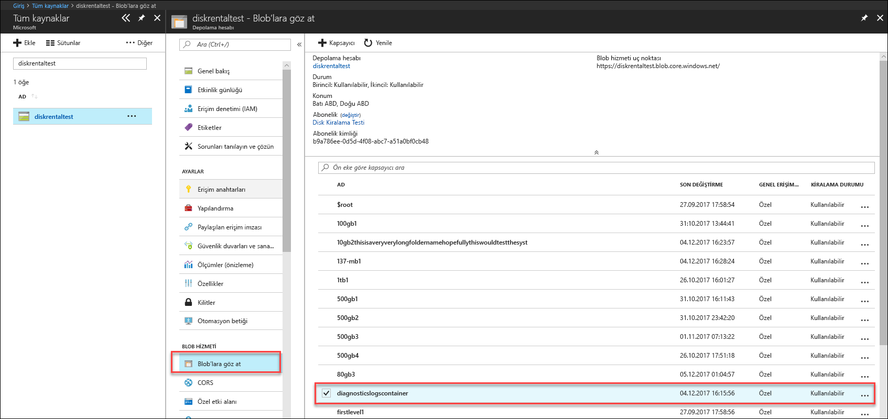

# Azure Data Box Disk de sorunlarını giderme

Bu makale, Microsoft Azure Data Box Disk için geçerlidir ve bu çözümü dağıttığınızda gördüğünüz sorunları gidermek için kullanılan iş akışları açıklanır. 

Bu makalede aşağıdaki bölümleri içerir:

- Tanılama günlüklerini indirme
- Etkinlik günlüklerini sorgulama
- Data Box Disk kilit açma aracı hataları
- Data Box Disk Split Copy aracı hataları

## Tanılama günlüklerini indirme

Veri kopyalama işlemi sırasında hata oluştursa portalda tanılama günlüklerinin bulunduğu klasörün yolu görüntülenir. 

Tanılama günlükleri şunlardan oluşabilir:
- Hata günlükleri
- Ayrıntılı günlükler  

Kopyalama günlüğünün yoluna gitmek için Data Box siparişinizle ilişkilendirilmiş olan depolama hesabına gidin. 

1.  **Genel > Sipariş ayrıntıları** sayfasına gidin ve siparişinizle ilişkilendirilmiş olan depolama hesabını not edin.
 

2.  **Tüm kaynaklar**'a gidin ve önceki adımda tanımlana depolama hesabını arayın. Depolama hesabını seçin ve üzerine tıklayın.

    

3.  **Blob hizmeti > Blob'lara göz atın** sayfasına gidin ve depolama hesabına karşılık gelen blobu bulun. **diagnosticslogcontainer > waies** sayfasına gidin. 

    

    Veri kopyalama işlemi için hem hata günlüklerini hem de ayrıntılı günlükleri görmeniz gerekir. Dosyaları seçip üzerine tıklayarak yerel kopyalarını indirin.

## Etkinlik günlüklerini sorgulama

Sorun giderme sırasında bir hata bulmak veya kuruluşunuzdaki kullanıcının bir kaynağı nasıl değiştirdiğini izlemek için etkinlik günlüklerini kullanın. Etkinlik günlükleri ile aşağıdakileri belirleyebilirsiniz:

- Aboneliğinizdeki kaynaklarda gerçekleştirilen işlem.
- İşlemi başlatandır. 
- İşlemin ne zaman oluştuğu.
- İşlemin durumu.
- İşlemi araştırmanıza yardımcı olabilecek diğer özelliklerin değerleri.

Etkinlik günlüğü, kaynaklarınız üzerinde gerçekleştirilen tüm yazma işlemlerini (PUT, POST, DELETE gibi) içerir, ancak okuma işlemlerini (GET gibi) içermez. 

Etkinlik günlükleri 90 gün boyunca saklanır. Başlangıç tarihi 90 günden eski olmamak şartıyla istediğiniz tarih aralığını sorgulayabilirsiniz. Yerleşik Insights sorgularını kullanarak da filtreleme yapabilirsiniz. Örneğin hataya tıklayıp belirli alt hataları seçerek kök nedeni anlayabilirsiniz.

## Data Box Disk kilit açma aracı hataları

| Hata iletisi/Aracın davranışı      | Öneriler                                                                                               |
|-------------------------------------------------------------------------------------------------------------------------------------|------------------------------------------------------------------------------------------------------|
| None  Data Box Disk kilit açma aracı kilitleniyor.                                                                            | BitLocker yüklü değil. Data Box Disk kilit açma aracının çalıştığı ana bilgisayarda BitLocker uygulamasının yüklü olduğundan emin olun.                                                                            |
| Güncel .NET Framework desteklenmez. 4.5 ve sonraki sürümler desteklenir.  Araç kapanıyor ve bir ileti açılıyor.  | .NET 4.5 yüklenmedi. Data Box Disk kilit açma aracının çalıştığı ana bilgisayara .NET 4.5 veya üzerini yükleyin.                                                                            |
| Birimlerin kilidi açılamadı veya birimler doğrulanamadı. Microsoft Desteği'ne başvurun.    Araç kilitli sürücülerin kilidini açamıyor veya bu sürücüleri doğrulayamıyor. | Araç verilen destek anahtarıyla kilitlenen sürücülerin kilidini açamıyor. Sonraki adımlar için Microsoft Desteği'ne başvurun.                                                |
| Aşağıdaki birimlerin kilidi açıldı ve bu birimler doğrulandı.  Birimin sürücü harflerini: E: Şu destek anahtarlarıyla birimlerin kilidi açılamadı: werwerqomnf, qwerwerqwdfda   Araç bazı sürücülerin kilidini açar, başarılı ve başarısız olan sürücü harflerini listeler.| Kısmen başarıldı. Kullanılan destek anahtarıyla bazı sürücülerin kilidi açılamadı. Sonraki adımlar için Microsoft Desteği'ne başvurun. |
| Kilitli birimler bulunamadı. Microsoft'tan alınan diskin düzgün bağlandığından ve kilitli durumda olduğundan emin olun.          | Araç kilitli sürücüleri bulamıyor. Sürücülerden birinin kilidi açılmış veya sürücü bulunamıyor. Sürücülerin bağlı ve kilitli olduğundan emin olun.                                                           |
| Önemli hata: Geçersiz parametre Parametre adı: invalid_arg KULLANIM: DataBoxDiskUnlock /PassKeys:<noktalı_virgülle_ayrılmış_destek_anahtarı_listesi>  Örnek: DataBoxDiskUnlock /PassKeys:passkey1;passkey2;passkey3 Örnek: DataBoxDiskUnlock /SystemCheck Örnek: DataBoxDiskUnlock/Help  / Parolalı:       Bu geçiş, Azure Data Box Disk Siparişiniz alın. Bu destek anahtarı disklerinizin kilidini açar. / Help:           Bu seçenek, cmdlet kullanım ve örnekleri Yardım sağlar. / SystemCheck:    Bu seçenek, sisteminizin aracı çalıştırmak için gereksinimleri karşılayıp karşılamadığını denetler.  Çıkmak için bir tuşa basın. | Geçersiz parametre girildi. Yalnızca izin verilen /SystemCheck /PassKey ve/Help parametrelerdir.                                                                            |

## Data Box Disk Split Copy aracı hataları

|Hata iletisi/Uyarılar  |Öneriler |
|---------|---------|
|[Bilgi] m: birimi için BitLocker parolası alınıyor  [Hata] m: birimi için BitLocker anahtarı alınırken özel durum oluştu  Sıra hiçbir öğe içermiyor.|Bu hata hedef Data Box Disk çevrimdışı olduğunda gösterilir.   Diskleri çevrimiçi duruma getirmek için `diskmgmt.msc` aracını kullanın.|
|[Hata] Özel durum: WMI işlemi başarısız oldu:  Method=UnlockWithNumericalPassword, ReturnValue=2150694965,  Win32Message=Girilen kurtarma parolası biçimi geçersiz.  BitLocker kurtarma parolaları 48 hanelidir.  Kurtarma parolasının doğru biçimde olduğunu doğrulayıp yeniden deneyin.|Data Box Disk kilit açma aracını kullanarak disklerin kilidini açın ve komutu yeniden deneyin. Daha fazla bilgi için bkz. <li> [Windows istemcileri için Data Box Disk kilidini açma](data-box-disk-deploy-set-up.md#unlock-disks-on-windows-client). </li><li> [Linux istemcileri için Data Box Disk kilidini açma](data-box-disk-deploy-set-up.md#unlock-disks-on-linux-client). </li>|
|[Hata] Özel durum: Hedef sürücüde DriveManifest.xml dosya var.   Bu durum hedef sürücünün farklı bir günlük dosyasıyla hazırlanmış olabileceğini gösterir.  Aynı sürücüye daha fazla veri eklemek için önceki günlük dosyasını kullanın. Var olan verileri silmek ve hedef sürücüyü yeni bir içeri aktarma işi için kullanmak istiyorsanız sürücüdeki DriveManifest.xml dosyasını silin. Bu komutu yeni bir günlük dosyasıyla yeniden çalıştırın.| Bu hata aynı sürücü kümesini birden fazla içeri aktarma oturumunda kullanmaya çalıştığınızda ortaya çıkar.   Bir sürücü kümesini yalnızca bir bölme ve kopyalama oturumu için kullanın.|
|[Hata] Özel durum: CopySessionId ImportData-Eylül-test-1, bir önceki kopyalama oturumu ifade eder ve yeni bir kopya oturumu için kullanılamayacak.|Bu hata yeni bir işe önceden başarıyla tamamlanan bir işin adının verilmeye çalışılması durumunda bildirilir.  Yeni işiniz için benzersiz bir ad atayın.|
|[Bilgi] Hedef dosya veya dizin adı NTFS uzunluk sınırını aşıyor. |Bu ileti hedef dosya uzun dosya yolu nedeniyle yeniden adlandırıldığında bildirilir.  Bu davranışı denetlemek için `config.json` dosyasındaki değerlendirme seçeneğini değiştirin.|
|[Hata] Özel durum: Hatalı JSON kaçış dizisi. |Bu ileti config.json dosyasında geçersiz biçim olduğunda bildirilir.   Dosyayı kaydetmeden önce [JSONlint](https://jsonlint.com/) kullanarak `config.json` için doğrulama gerçekleştirin.|

## Linux dağıtım sorunları

Bu bölümde Data Box Disk dağıtımı sırasında bir Linux istemcisi için veri kopyalama kullanılırken karşılaşılan en önemli sorunlardan bazıları açıklanmaktadır.

### Sorun: Sürücü salt okunur olarak bağlanmış
 
**Bunun nedeni** 

Bu, bir şekilde çoğaltamaması dosya sistemi nedeniyle olabilir. 

Bir sürücü okuma-yazma olarak kaldırmadan veri kutusu disk ile çalışmaz. Bu senaryo dislocker tarafından şifresi sürücülerle desteklenir. Aşağıdaki komutu kullanarak cihaz başarıyla yeniden: 

    `# mount -o remount, rw /mnt/DataBoxDisk/mountVol1`

Başarılı kaldırmadan rağmen verilerin kalıcı olmaz.

**Çözümleme**

Yukarıdaki hatasını görürseniz, aşağıdaki çözümlerden birini deneyebilirsiniz:

- Yükleme [ `ntfsfix` ](https://linux.die.net/man/8/ntfsfix) (kullanılabilir `ntfsprogs` paket) ve ilgili bölümü karşı çalıştırabilirsiniz.

- Windows sistemine erişimi varsa

    - Sürücü Windows sistemine yükleyin.
    - Yönetici ayrıcalıklarıyla bir komut istemi açın. Çalıştırma `chkdsk` birimde.
    - Güvenli bir şekilde birimi kaldırın ve yeniden deneyin.
 
### Sorun: Kopyalamadan sonra kalıcı değil verilerle hata
 
**Bunun nedeni** 

Sonra drive'ınızdaki verileri yok görürseniz (veri için kopyalandığı rağmen) sürücü salt okunur olarak oluşturulmasından sonra bir sürücü okuma-yazma olarak geri takılmazsa mümkündür, çıkarılamadı.

**Çözümleme**
 
Bu durumda, bakmalarını için [salt okunur olarak bağlanmış sürücüleri](#issue-drive-getting-mounted-as-read-only).

Bir durum değilse, günlükleri veri kutusu Disk kilidini aracın klasörüne kopyalayın ve [Microsoft Support başvurun](data-box-disk-contact-microsoft-support.md).

## Windows için dağıtım sorunları

Bu bölümde Data Box Disk dağıtımı sırasında bir Windows istemci için veri kopyalama kullanırken karşılaşılan en önemli sorunlardan bazıları açıklanmaktadır.

### Sorun: BitLocker sürücüsünden kilidi açılamadı
 
**Bunun nedeni** 

BitLocker'ı iletişim kutusunda veya kullanılan parolayı ve BitLocker'ı aracılığıyla disk kilidi açılmaya çalışılırken sürücüler iletişim kilidini açın. Bu çalışmaz. 

**Çözümleme**

Veri kutusu disk kilidini açmak için veri kutusu Disk kilidini aracını kullanın ve Azure portalından parolayı girmeniz gerekir. Daha fazla bilgi için Git [Öğreticisi: Cihazınızı kutusundan çıkarma, bağlama ve Azure Data Box Disk kilidini](data-box-disk-deploy-set-up.md#connect-to-disks-and-get-the-passkey).
 
### Sorun: Yüklenemedi kilidini veya bazı birimler doğrulayın. Microsoft Desteği'ne başvurun.
 
**Bunun nedeni** 

Hata günlüğünde yer alan aşağıdaki hatayı görebilirsiniz ve kilidini ya da bazı birimler doğrulamak mümkün değildir.

`Exception System.IO.FileNotFoundException: Could not load file or assembly 'Microsoft.Management.Infrastructure, Version=1.0.0.0, Culture=neutral, PublicKeyToken=31bf3856ad364e35' or one of its dependencies. The system cannot find the file specified.`
 
Bu, büyük olasılıkla uygun Windows PowerShell sürümünü Windows istemciniz üzerinde eksik olduğunu gösterir.

**Çözümleme**

Yükleyebileceğiniz [Windows PowerShell v 5.0](https://www.microsoft.com/download/details.aspx?id=54616) ve işlemi yeniden deneyin.
 
Birimlerin kilidini açması hala kaldıramıyorsanız, günlükleri veri kutusu Disk kilidini aracın klasörüne kopyalayın ve [Microsoft Support başvurun](data-box-disk-contact-microsoft-support.md).

## Sonraki adımlar

- [Azure portal aracılığıyla Data Box Disk'i yönetme](data-box-portal-ui-admin.md) hakkında bilgi edinin.
