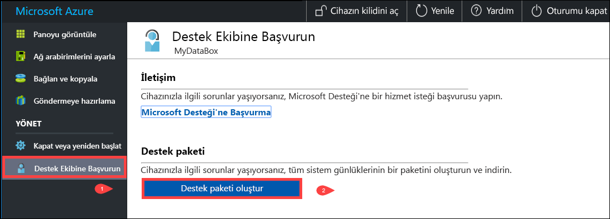
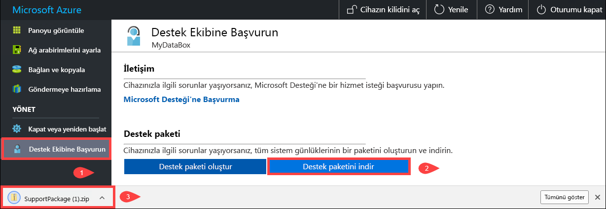
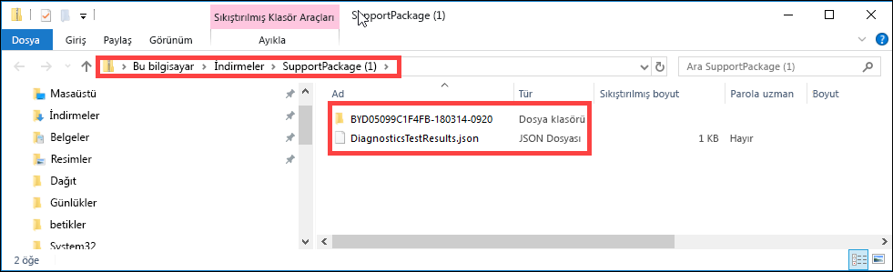
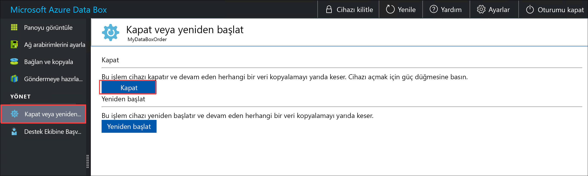
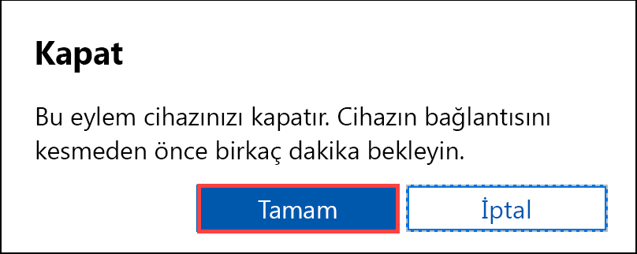
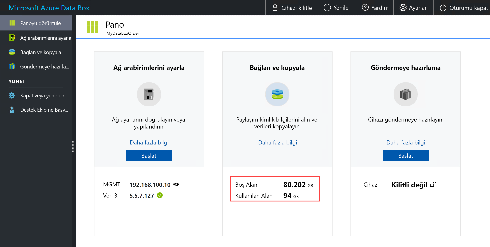
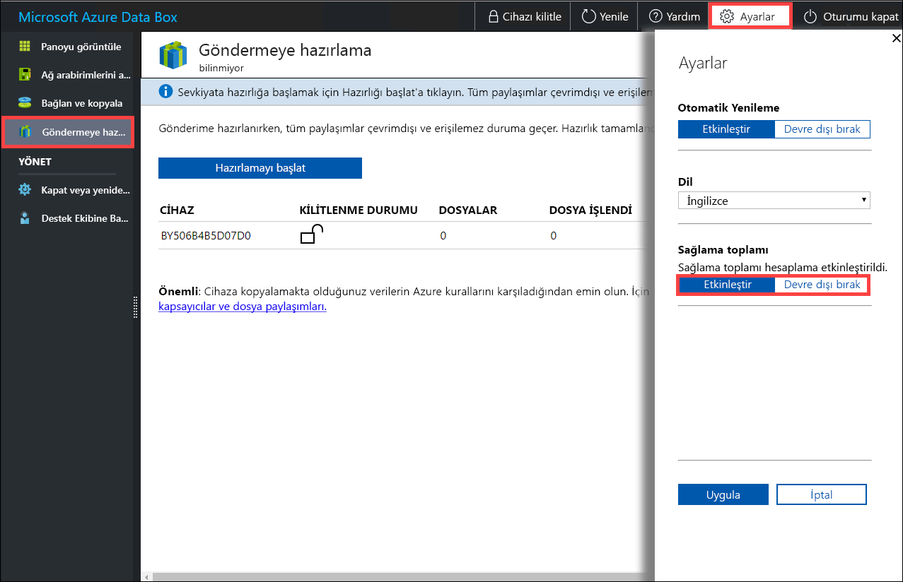

# Data Box'ınızı yönetmek için yerel web kullanıcı arabirimini kullanma

Bu makalede Data Box'ta gerçekleştirilebilen bazı yapılandırma ve yönetim görevleri anlatılmaktadır. Data Box'ı Azure portalı kullanıcı arabirimi ve cihazın yerel web kullanıcı arabirimi aracılığıyla yönetebilirsiniz. Bu makale, yerel web kullanıcı arabirimini kullanarak gerçekleştirebileceğiniz görevlere odaklanmaktadır.

Data Box için yerel web kullanıcı arabirimi cihazın başlangıç yapılandırması için kullanılır. Yerel web kullanıcı arabirimini ayrıca Data Box'ı kapatmak veya yeniden başlatmak, tanılama testleri çalıştırmak, yazılım güncelleştirmek, kopyalama günlüklerini görüntülemek ve Microsoft Destek için günlük paketi oluşturmak için de kullanabilirsiniz.

Bu makale aşağıdaki öğreticileri içerir:

- Destek paketi oluşturma
- Cihazınızı kapatma ya da yeniden başlatma
- Cihazın kullanılabilir kapasitesini görüntüleme
- Sağlama toplamı doğrulamasını atlama 

## Destek paketi oluşturma

Cihaz sorunları yaşarsanız, sistem günlüklerinden bir Destek paketi oluşturabilirsiniz. Microsoft Destek sorunu gidermek için bu paketi kullanır. Destek paketi oluşturmak için aşağıdaki adımları gerçekleştirin:

1. Yerel web kullanıcı arabiriminde **Desteğe Başvur**'a gidin ve **Destek paketi oluştur**'a tıklayın.

    

2. Bir Destek paketi toplanır. Bu işlem birkaç dakika sürer.

    

3. Destek paketi oluşturma işlemi tamamlandıktan sonra **Destek paketini indir**'e tıklayın. 

    

4. İndirme konumuna göz atıp konumu seçin. İçeriği görüntülemek için klasörü açın.

    

## Cihazınızı kapatma ya da yeniden başlatma

Data Box'ınızı yerel web kullanıcı arabirimini kullanarak kapatabilir ya da yeniden başlatabilirsiniz. Cihazı yeniden başlatmadan önce konaktaki paylaşımları sonra da cihazı çevrimdışına almanız önerilir. Bu, veri bozulması olasılığını en aza indirir. Cihazı kapatırken devam eden bir veri kopyalama işlemi olmadığından emin olun.

Data Box'ınızı kapatmak için aşağıdaki adımları gerçekleştirin.

1. Yerel web kullanıcı arabiriminde **Kapat ya da yeniden başlat**'a gidin.
2. **Kapat**'a tıklayın.

    

3. Onayınız istendiğinde devam etmek için **Tamam**'a tıklayın.

    

Cihaz kapatıldıktan sonra cihazı açmak için ön paneldeki güç düğmesini kullanın.

Data Box'ınızı yeniden başlatmak için aşağıdaki adımları gerçekleştirin.

1. Yerel web kullanıcı arabiriminde **Kapat ya da yeniden başlat**'a gidin.
2. **Yeniden Başlat**'a tıklayın.

    

3. Onayınız istendiğinde devam etmek için **Tamam**'a tıklayın.

   Cihaz kapatılır ve sonra yeniden başlatır.

## Cihazın kullanılabilir kapasitesini görüntüleme

Cihazın kullanılabilir ve kullanılan kapasitesini görüntülemek için cihaz panosunu kullanabilirsiniz. 

1. Yerel web kullanıcı arabiriminde **Panoyu görüntüle**'ye gidin.
2. **Bağlan ve kopyala**'nın altında cihazdaki boş ve kullanılan alan gösterilir.

    

## Sağlama toplamı doğrulamasını atlama

Cihaz gönderilmeye hazır olduğunda verileriniz için varsayılan olarak sağlama toplamı oluşturulur. Bazı ender durumlarda, veri türüne bağlı olarak (küçük dosya boyutu) performans çok yavaş olabilir. Bu gibi durumlarda sağlama toplamını atlayabilirsiniz. 

Performans ciddi şekilde etkilenmedikçe sağlama toplamını kesinlikle atlamamanızı öneririz.

1. Cihazınızın yerel web kullanıcı arabiriminin sağ üst köşesinde Ayarlar'a gidin.

    

2. Sağlama toplamı doğrulamasını **Devre dışı bırakma** 
3. **Uygula**'ya tıklayın.

## Sonraki adımlar

- [Data Box'ı Azure portalı aracılığıyla yönetme](data-box-portal-admin.md) hakkında bilgi edinin.

