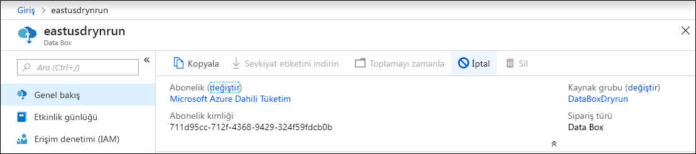
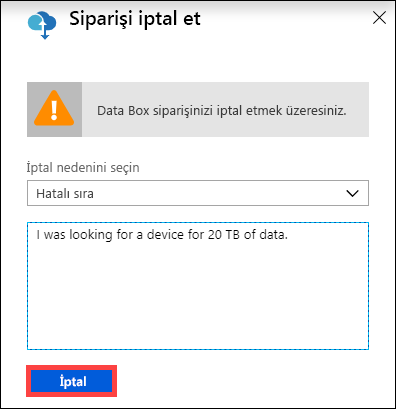
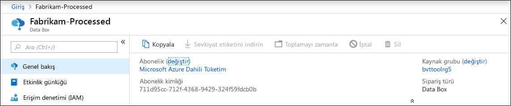
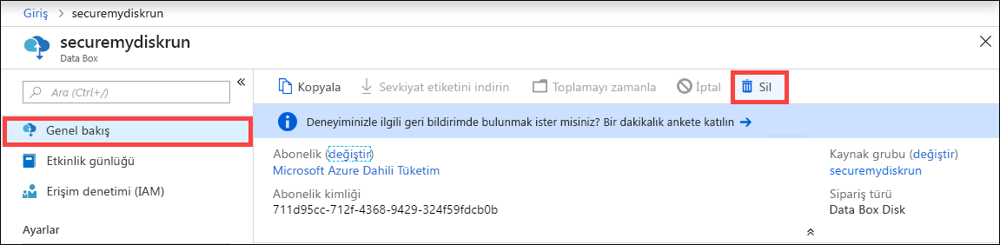
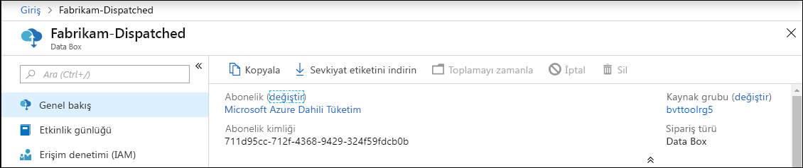
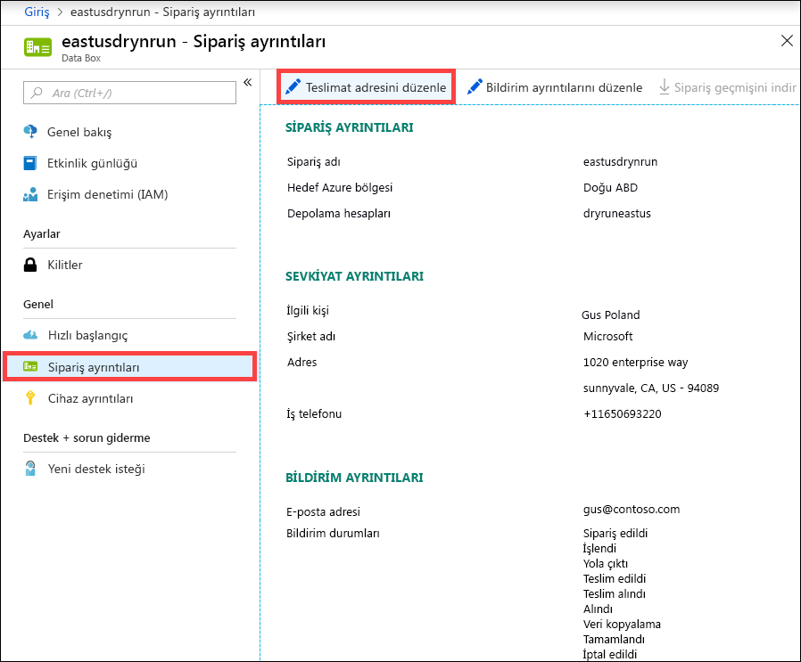
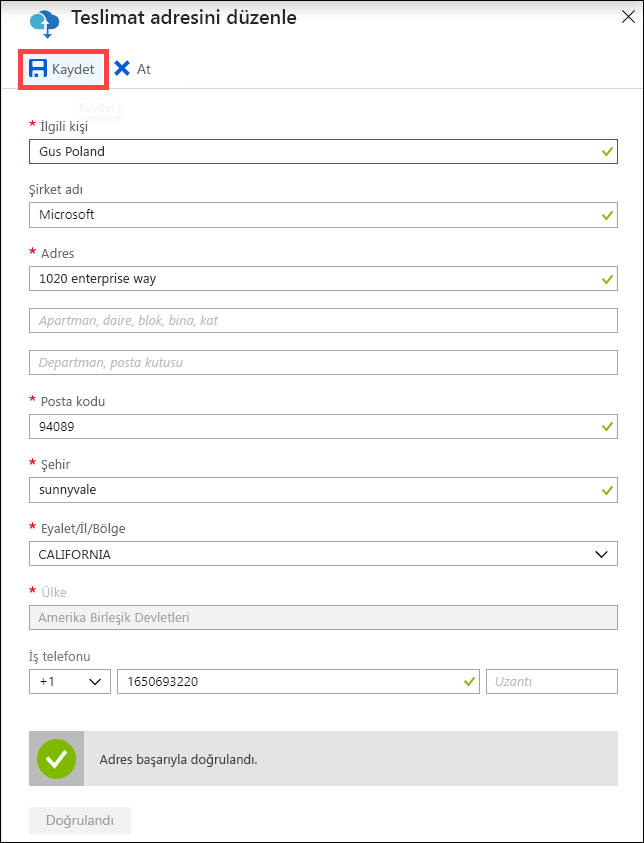
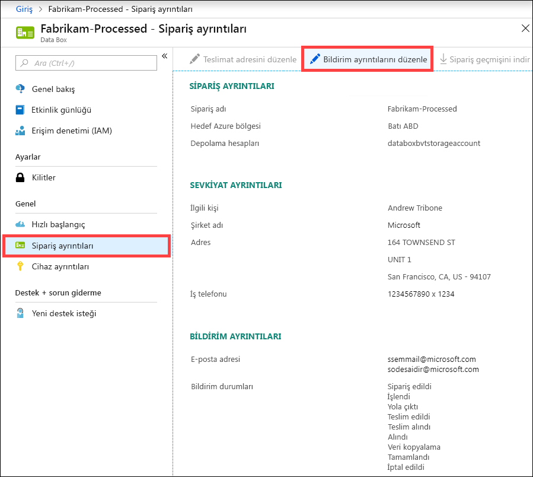
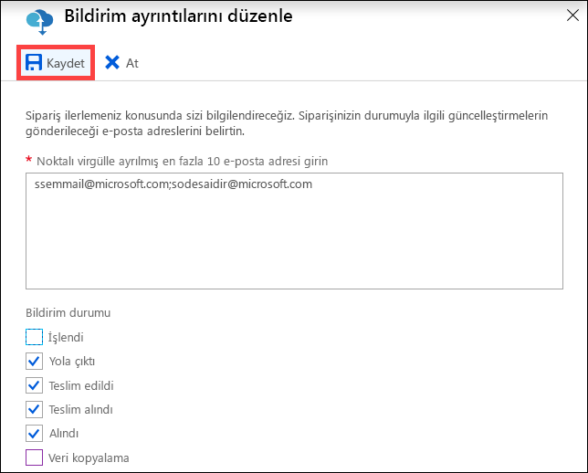

# <a name="use-the-azure-portal-to-administer-your-azure-data-box"></a>Azure Data Box'ınızı yönetmek için Azure portalını kullanma

Bu makalede Azure Data Box üzerinde gerçekleştirilebilen yönetim görevleri ve karmaşık iş akışları bazılarını açıklar. Data Box’ı Azure portal veya yerel web kullanıcı arabirimiyle yönetebilirsiniz.

Bu makale, Azure portalı kullanarak gerçekleştirebileceğiniz görevlere odaklanmaktadır. Azure portalı kullanarak siparişleri yönetebilir, Data Box’ı yönetebilir ve siparişin durumunu tamamlanana kadar takip edebilirsiniz.


## <a name="cancel-an-order"></a>Siparişi iptal etme

Siparişinizi verdikten sonra çeşitli nedenlerle iptal etmeniz gerekebilir. Siparişi yalnızca sipariş işleme alınmadan önce iptal edebilirsiniz. Sipariş işleme alınıp Data Box hazırlandığında siparişi iptal etmeniz mümkün değildir. 

Bir siparişi iptal etmek için aşağıdaki adımları gerçekleştirin.

1.  **Genel bakış > İptal**'e gidin. 

    

2.  Sipariş iptal etme nedenini belirtin.  

    

3.  Sipariş iptal edildikten sonra portaldaki durumu **İptal edildi** olarak görüntülenir. 

## <a name="clone-an-order"></a>Siparişi kopyalama

Kopyalama belirli durumlarda kullanışlıdır. Örneğin kullanıcı, veri aktarımı için daha önceden Data Box kullanmıştır. Yeni veriler üretildikçe Azure'a aktarmak için diğer bir Data Box’a daha ihtiyaç duyulur. Bu durumda aynı sipariş kopyalanabilir.

Siparişi kopyalamak için aşağıdaki adımları gerçekleştirin.

1.  **Genel bakış > Kopyala**'ya gidin. 

    

2.  Siparişin tüm ayrıntıları aynı şekilde korunur. Siparişin adı, özgün siparişin adına *-Kopya* eklenerek oluşturulur. Gizlilik bilgilerini gözden geçirdiğinizi onaylamak için onay kutusunu seçin. **Oluştur**’a tıklayın.

Kopya sipariş birkaç dakikada oluşturulur ve portal yeni siparişi gösterecek şekilde güncelleştirilir.


## <a name="delete-order"></a>Siparişi silme

Tamamlanan siparişleri silmek isteyebilirsiniz. Siparişte adınız, adresiniz ve iletişim bilgileriniz gibi kişisel bilgileriniz yer alır. Sipariş silindiğinde bu kişisel bilgiler de silinir.

Yalnızca tamamlanan veya iptal edilen siparişleri silebilirsiniz. Siparişi silmek için aşağıdaki adımları gerçekleştirin.

1. **Tüm kaynaklar**'a gidin. Siparişinizi arayın.

2. Silmek istediğiniz siparişe tıklayın ve **Genel bakış**'a gidin. Komut çubuğundan **Sil**'e tıklayın.

    

3. Siparişi silme işlemini onaylamanız istendiğinde siparişin adını girin. **Sil**'e tıklayın.

## <a name="download-shipping-label"></a>Sevkiyat etiketini indirme

Data Box’unuzun E-ink ekranı çalışmıyorsa ve iade gönderimi etiketini göstermiyorsa gönderim etiketini indirmeniz gerekebilir. 

Sevkiyat etiketini indirmek için aşağıdaki adımları gerçekleştirin.

1.  **Genel bakış > Sevkiyat etiketi indir** bölümüne gidin. Bu seçenek yalnızca cihaz gönderildikten sonra kullanılabilir. 

    

2.  Aşağıda gösterilen iade sevkiyat etiketi indirilir. Etiketi kaydedin ve yazdırın. Etiketi katlayıp cihazdaki şeffaf kılıfa koyun. Etiketin görünür olduğundan emin olun. Cihazdaki önceki gönderimden kalan tüm çıkartmaları sökün.

    

## <a name="edit-shipping-address"></a>Teslimat adresini düzenleme

Siparişi verdikten sonra teslimat adresini düzenlemeniz gerekebilir. Bu işlem yalnızca cihaz yola çıkana kadar kullanılabilir. Cihaz yola çıktıktan sonra bu seçenek kullanılamaz.

Siparişi düzenlemek için aşağıdaki adımları gerçekleştirin.

1. **Sipariş ayrıntıları > Teslimat adresini düzenle**'ye gidin.

    

2. Gönderim adresini düzenleyin ve doğrulayın ve sonra değişiklikleri kaydedin.

    

## <a name="edit-notification-details"></a>Bildirim ayrıntılarını düzenleme

Sipariş durumu e-postalarının gönderilmesini istediğiniz kullanıcıları değiştirmek isteyebilirsiniz. Örneğin cihaz teslim edildiğinde veya alındığında bir kullanıcının bilgilendirilmesi gerekebilir. Veriler kaynaktan silinmeden önce Azure depolama hesabındaki verileri doğrulanması amacıyla veri kopyalama işlemi tamamlandığında başka bir kullanıcıya bildirim gönderilmesini isteyebilirsiniz. Bu gibi durumlarda bildirim ayrıntılarını düzenleyebilirsiniz.

Bildirim ayrıntılarını düzenlemek için aşağıdaki adımları gerçekleştirin.

1. **Sipariş ayrıntıları > Bildirim ayrıntılarını düzenle**'ye gidin.

    

2. Bu sayfada bildirim ayrıntılarını düzenleyebilir ve yaptığınız değişiklikleri kaydedebilirsiniz.
 
    


## <a name="download-order-history"></a>Sipariş geçmişi indirme

Data Box siparişiniz tamamlandıktan sonra cihaz disklerindeki veriler silinir. Cihaz temizleme tamamlandığında, sipariş geçmişini Azure portalında indirebilirsiniz.

Sipariş geçmişini indirmek için aşağıdaki adımları uygulayın.

1. Data Box siparişinizde **Genel Bakış**'a gidin. Siparişin tamamlandığından emin olun. Sipariş ve cihaz temizleme tamamlandıysa, **Sipariş ayrıntıları**'na gidin. **Sipariş geçmişi indirme** seçeneği bulunur.

    

2. **Sipariş geçmişini indir**'e tıklayın. İndirilen geçmişte kurye takip günlüklerini bir kaydını görürsünüz. Bu günlüğün en altına giderseniz, aşağıdakilere giden bağlantıları görebilirsiniz:
    
   - **Kopyalama günlükleri** - Data Box'tan Azure depolama hesabınıza veri kopyalama sırasında hatalı çıkış veren dosyaların listesini içerir.
   - **Denetim günlükleri** - Azure veri merkezi dışında olduğunda Data Box üzerindeki açma ve paylaşın erişimi hakkında bilgi içerir.
   - **BOM dosyaları** - **Göndermeye hazırlama** sırasında indirebileceğiniz dosyaların listesini (dosya bildirimi olarak da bilinir) ve dosyaların adlarını, boyutlarını ve sağlama toplamlarını içerir.

       ```
       -------------------------------
       Microsoft Data Box Order Report
       -------------------------------
       Name                                               : DataBoxTestOrder                              
       StartTime(UTC)                                     : 10/31/2018 8:49:23 AM +00:00                       
       DeviceType                                         : DataBox                                           
       -------------------
       Data Box Activities
       -------------------
       Time(UTC)                 | Activity                       | Status          | Description  
       
       10/31/2018 8:49:26 AM     | OrderCreated                   | Completed       |                                                   
       11/2/2018 7:32:53 AM      | DevicePrepared                 | Completed       |                                                   
       11/3/2018 1:36:43 PM      | ShippingToCustomer             | InProgress      | Shipment picked up. Local Time : 11/3/2018 1:36:43        PM at AMSTERDAM-NLD                                                                                
       11/4/2018 8:23:30 PM      | ShippingToCustomer             | InProgress      | Processed at AMSTERDAM-NLD. Local Time : 11/4/2018        8:23:30 PM at AMSTERDAM-NLD                                                                        
       11/4/2018 11:43:34 PM     | ShippingToCustomer             | InProgress      | Departed Facility in AMSTERDAM-NLD. Local Time :          11/4/2018 11:43:34 PM at AMSTERDAM-NLD                                                               
       11/5/2018 1:38:20 AM      | ShippingToCustomer             | InProgress      | Arrived at Sort Facility LEIPZIG-DEU. Local Time :        11/5/2018 1:38:20 AM at LEIPZIG-DEU                                                                
       11/5/2018 2:31:07 AM      | ShippingToCustomer             | InProgress      | Processed at LEIPZIG-DEU. Local Time : 11/5/2018          2:31:07 AM at LEIPZIG-DEU                                                                            
       11/5/2018 4:05:58 AM      | ShippingToCustomer             | InProgress      | Departed Facility in LEIPZIG-DEU. Local Time :            11/5/2018 4:05:58 AM at LEIPZIG-DEU                                                                    
       11/5/2018 4:35:43 AM      | ShippingToCustomer             | InProgress      | Transferred through LUTON-GBR. Local Time :              11/5/2018 4:35:43 AM at LUTON-GBR                                                                         
       11/5/2018 4:52:15 AM      | ShippingToCustomer             | InProgress      | Departed Facility in LUTON-GBR. Local Time :              11/5/2018 4:52:15 AM at LUTON-GBR                                                                        
       11/5/2018 5:47:58 AM      | ShippingToCustomer             | InProgress      | Arrived at Sort Facility LONDON-HEATHROW-GBR.            Local Time : 10/5/2018 5:47:58 AM at LONDON-HEATHROW-GBR                                                
       11/5/2018 6:27:37 AM      | ShippingToCustomer             | InProgress      | Processed at LONDON-HEATHROW-GBR. Local Time :            11/5/2018 6:27:37 AM at LONDON-HEATHROW-GBR                                                            
       11/5/2018 6:39:40 AM      | ShippingToCustomer             | InProgress      | Departed Facility in LONDON-HEATHROW-GBR. Local          Time : 11/5/2018 6:39:40 AM at LONDON-HEATHROW-GBR                                                    
       11/5/2018 8:13:49 AM      | ShippingToCustomer             | InProgress      | Arrived at Delivery Facility in LAMBETH-GBR. Local        Time : 11/5/2018 8:13:49 AM at LAMBETH-GBR                                                         
       11/5/2018 9:13:24 AM      | ShippingToCustomer             | InProgress      | With delivery courier. Local Time : 11/5/2018            9:13:24 AM at LAMBETH-GBR                                                                               
       11/5/2018 12:03:04 PM     | ShippingToCustomer             | Completed       | Delivered - Signed for by. Local Time : 11/5/2018        12:03:04 PM at LAMBETH-GBR                                                                          
       1/25/2019 3:19:25 PM      | ShippingToDataCenter           | InProgress      | Shipment picked up. Local Time : 1/25/2019 3:19:25        PM at LAMBETH-GBR                                                                                       
       1/25/2019 8:03:55 PM      | ShippingToDataCenter           | InProgress      | Processed at LAMBETH-GBR. Local Time : 1/25/2019          8:03:55 PM at LAMBETH-GBR                                                                            
       1/25/2019 8:04:58 PM      | ShippingToDataCenter           | InProgress      | Departed Facility in LAMBETH-GBR. Local Time :            1/25/2019 8:04:58 PM at LAMBETH-GBR                                                                    
       1/25/2019 9:06:09 PM      | ShippingToDataCenter           | InProgress      | Arrived at Sort Facility LONDON-HEATHROW-GBR.            Local Time : 1/25/2019 9:06:09 PM at LONDON-HEATHROW-GBR                                                
       1/25/2019 9:48:54 PM      | ShippingToDataCenter           | InProgress      | Processed at LONDON-HEATHROW-GBR. Local Time :            1/25/2019 9:48:54 PM at LONDON-HEATHROW-GBR                                                            
       1/25/2019 10:30:20 PM     | ShippingToDataCenter           | InProgress      | Departed Facility in LONDON-HEATHROW-GBR. Local          Time : 1/25/2019 10:30:20 PM at LONDON-HEATHROW-GBR                                                   
       1/26/2019 2:17:10 PM      | ShippingToDataCenter           | InProgress      | Arrived at Sort Facility BRUSSELS-BEL. Local Time        : 1/26/2019 2:17:10 PM at BRUSSELS-BEL                                                              
       1/26/2019 2:31:57 PM      | ShippingToDataCenter           | InProgress      | Processed at BRUSSELS-BEL. Local Time : 1/26/2019        2:31:57 PM at BRUSSELS-BEL                                                                          
       1/26/2019 3:37:53 PM      | ShippingToDataCenter           | InProgress      | Processed at BRUSSELS-BEL. Local Time : 1/26/2019        3:37:53 PM at BRUSSELS-BEL                                                                          
       1/27/2019 11:01:45 AM     | ShippingToDataCenter           | InProgress      | Departed Facility in BRUSSELS-BEL. Local Time :          1/27/2019 11:01:45 AM at BRUSSELS-BEL                                                                 
       1/28/2019 7:11:35 AM      | ShippingToDataCenter           | InProgress      | Arrived at Delivery Facility in AMSTERDAM-NLD.            Local Time : 1/28/2019 7:11:35 AM at AMSTERDAM-NLD                                                     
       1/28/2019 9:07:57 AM      | ShippingToDataCenter           | InProgress      | With delivery courier. Local Time : 1/28/2019            9:07:57 AM at AMSTERDAM-NLD                                                                             
       1/28/2019 1:35:56 PM      | ShippingToDataCenter           | InProgress      | Scheduled for delivery. Local Time : 1/28/2019            1:35:56 PM at AMSTERDAM-NLD                                                                            
       1/28/2019 2:57:48 PM      | ShippingToDataCenter           | Completed       | Delivered - Signed for by. Local Time : 1/28/2019        2:57:48 PM at AMSTERDAM-NLD                                                                         
       1/29/2019 2:18:43 PM      | PhysicalVerification           | Completed       |                                              
       1/29/2019 3:49:50 PM      | DeviceBoot                     | Completed       | Appliance booted up successfully                  
       1/29/2019 3:49:51 PM      | AnomalyDetection               | Completed       | No anomaly detected.                               
       1/29/2019 4:55:00 PM      | DataCopy                       | Started         |                                                 
       2/2/2019 7:07:34 PM       | DataCopy                       | Completed       | Copy Completed.                                   
       2/4/2019 7:47:32 PM       | SecureErase                    | Started         |                                                  
       2/4/2019 8:01:10 PM      | SecureErase                    | Completed       | Azure Data Box:DEVICESERIALNO has been sanitized          according to NIST 800-88 Rev 1.                                                                       

       ------------------
       Data Box Log Links
       ------------------

       Account Name         : Gus                                                       
       Copy Logs Path       : databoxcopylog/DataBoxTestOrder_CHC533180024_CopyLog_73a81b2d613547a28ecb7b1612fe93ca.xml
       Audit Logs Path      : azuredatabox-chainofcustodylogs\7fc6cac9-9cd6-4dd8-ae22-1ce479666282\chc533180024
       BOM Files Path       : azuredatabox-chainofcustodylogs\7fc6cac9-9cd6-4dd8-ae22-1ce479666282\chc533180024      
       ```
     Daha sonra depolama hesabınıza gidebilir ve kopyalama günlüklerini görüntüleyebilirsiniz.


Ayrıca denetim günlüklerini ve BOM dosyalarını içeren gözetim günlükleri zincirini de görüntüleyebilirsiniz.


## <a name="view-order-status"></a>Sipariş durumunu görüntüleme

Cihaz durumu portalda değiştiğinde bu, size e-posta ile bildirilir.

|Sipariş durumu |Açıklama |
|---------|---------|
|Sipariş edildi     | Sipariş başarıyla oluşturuldu. <br>Cihaz kullanılabilir durumdaysa Microsoft tarafından gönderilecek cihaz belirlenir ve cihaz hazırlanır. <br> Cihaz o anda mevcut değilse sipariş cihaz mevcut olduğunda işleme alınır. Siparişin işleme alınması birkaç gün ile birkaç ay sürebilir. Sipariş 90 gün içinde gerçekleştirilemiyorsa sipariş iptal edilir ve bu size bildirilir.         |
|İşlendi     | Siparişin işlenmesi tamamlandı. Siparişiniz uyarınca cihaz gönderilmek üzere veri merkezinde hazırlanır.         |
|Yola çıktı     | Sipariş sevk edildi. Gönderiyi takip etmek için portalda, siparişinizde görüntülenen takip kimliğini kullanın.        |
|Teslim Edildi     | Gönderim, belirtilen adrese teslim edildi.        |
|Teslim alındı     |İade gönderiniz teslim alındı ve kurye tarafından tarandı.         |
|Alındı     | Cihazınız alındı ve Azure veri merkezinde tarandı. <br> Gönderi incelendikten sonra cihaz karşıya yüklemesi başlar.      |
|Veri kopyalama     | Veri kopyalama işlemi devam ediyor. Azure portal’da siparişinizin kopyalama ilerleme durumunu takip edin. <br> Veri kopyalama işlemi tamamlanana kadar bekleyin. |
|Tamamlandı       |Sipariş başarıyla tamamlandı.<br> Şirket içi verilerini sunuculardan silmeden önce verilerinizin Azure’a kopyalandığından emin olun.         |
|Hatalarla tamamlandı| Veri kopyalama tamamlandı ancak kopyalama sırasında hatalar oluştu. <br> Azure portalda belirtilen yolu kullanarak kopyalama günlüklerini gözden geçirin.   |
|İptal edildi            |Sipariş iptal edildi. <br> Siparişi iptal ettiniz veya bir hatayla karşılaşıldı ve sipariş, hizmet tarafından iptal edildi. Sipariş 90 gün içinde gerçekleştirilemiyorsa sipariş iptal edilir ve bu size bildirilir.     |
|Temizleme | Cihaz sürücülerindeki veriler silinir. Cihaz temizleme; sipariş geçmişi Azure portalından indirilmeye hazır olduğunda tamamlanmış olarak değerlendirilir.|


## <a name="next-steps"></a>Sonraki adımlar

- [Data Box sorunlarını giderme](data-box-faq.md) hakkında bilgi edinin.
