# Data Box'ınızı (Önizleme) yönetmek için Azure portalı kullanma

Bu makaledeki öğreticiler, Önizleme aşamasındaki Microsoft Azure Data Box Disk için geçerlidir. Bu makalede Data Box Disk ile gerçekleştirilebilen bazı karmaşık iş akışları ve yönetim görevleri anlatılmaktadır. 

Data Box Disk'i Azure portaldan yönetebilirsiniz. Bu makale, Azure portalı kullanarak gerçekleştirebileceğiniz görevlere odaklanmaktadır. Azure portalı kullanarak siparişleri yönetebilir, diskleri yönetebilir ve siparişin durumunu son aşamaya kadar takip edebilirsiniz.

> [!IMPORTANT]
> Data Box Disk önizleme aşamasındadır. Bu çözümü dağıtmadan önce [Önizleme için Azure hizmet şartlarını](https://azure.microsoft.com/support/legal/preview-supplemental-terms/) gözden geçirin.

## Siparişi iptal etme

Siparişinizi verdikten sonra çeşitli nedenlerle iptal etmeniz gerekebilir. Siparişi ancak disk hazırlığı başlamadan önce iptal edebilirsiniz. Diskler hazırlandıktan ve sipariş işleme alındıktan sonra iptal işlemi gerçekleştiremezsiniz. 

Bir siparişi iptal etmek için aşağıdaki adımları gerçekleştirin.

1.  **Genel bakış > İptal**'e gidin. 

    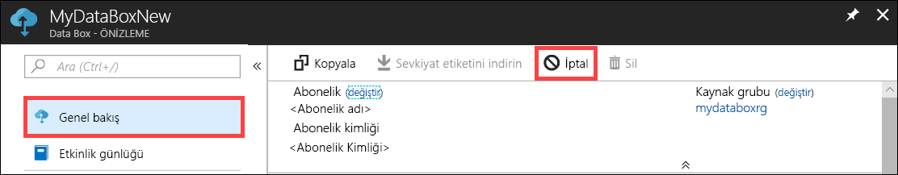

2.  Sipariş iptal etme nedenini belirtin.  

    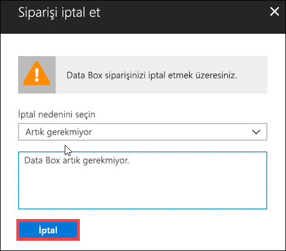

3.  Sipariş iptal edildikten sonra portaldaki durumu **İptal edildi** olarak görüntülenir.

    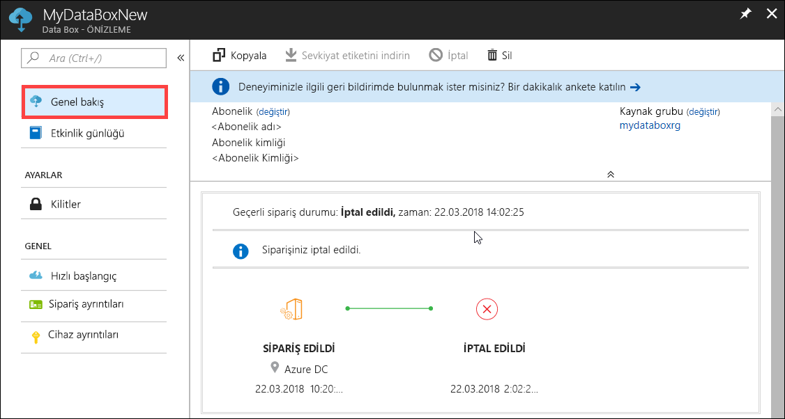

Sipariş iptal edildiğinde e-posta bildirimi gönderilmez.

## Siparişi kopyalama

Kopyalama belirli durumlarda kullanışlıdır. Örneğin kullanıcı, veri aktarımı için daha önceden Data Box Disk kullanmıştır. Yeni veriler üretildikçe Azure'a aktarmak için daha fazla diske ihtiyaç duyulur. Bu durumda aynı sipariş kopyalanabilir.

Siparişi kopyalamak için aşağıdaki adımları gerçekleştirin.

1.  **Genel bakış > Kopyala**'ya gidin. 

    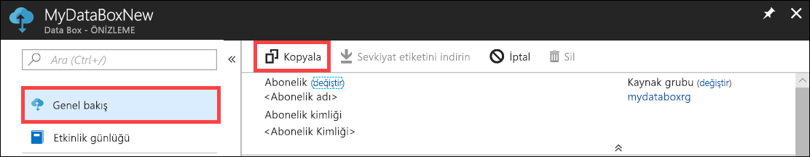

2.  Siparişin tüm ayrıntıları aynı şekilde korunur. Siparişin adı, özgün siparişin adına *-Kopya* eklenerek oluşturulur. Gizlilik bilgilerini gözden geçirdiğinizi onaylamak için onay kutusunu seçin. **Oluştur**’a tıklayın.    

Kopya sipariş birkaç dakikada oluşturulur ve portal yeni siparişi gösterecek şekilde güncelleştirilir.

[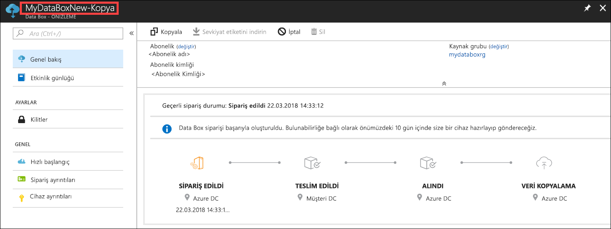](media/data-box-portal-ui-admin/clone-order3.png#lightbox) 

## Siparişi silme

Tamamlanan siparişleri silmek isteyebilirsiniz. Siparişte adınız, adresiniz ve iletişim bilgileriniz gibi kişisel bilgileriniz yer alır. Sipariş silindiğinde bu kişisel bilgiler de silinir.

Yalnızca tamamlanan veya iptal edilen siparişleri silebilirsiniz. Siparişi silmek için aşağıdaki adımları gerçekleştirin.

1. **Tüm kaynaklar**'a gidin. Siparişinizi arayın.

    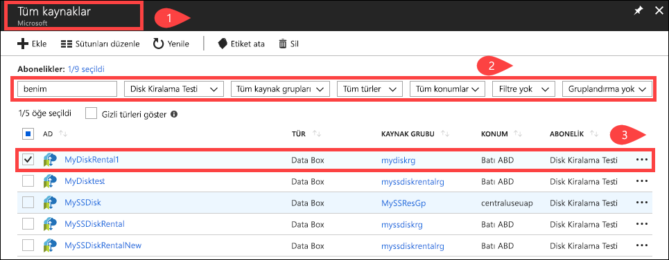

2. Silmek istediğiniz siparişe tıklayın ve **Genel bakış**'a gidin. Komut çubuğundan **Sil**'e tıklayın.

    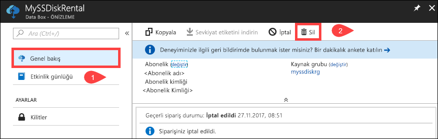

3. Siparişi silme işlemini onaylamanız istendiğinde siparişin adını girin. **Sil**'e tıklayın.

     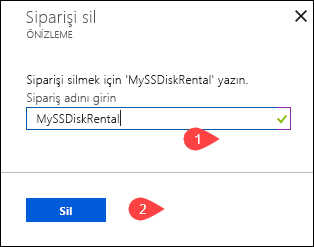

## Sevkiyat etiketini indirme

Disklerinizle birlikte gönderilen iade sevkiyat etiketi kaybolduysa sevkiyat etiketini indirmeniz gerekebilir. 

Sevkiyat etiketini indirmek için aşağıdaki adımları gerçekleştirin.
1.  **Genel bakış > Sevkiyat etiketi indir** bölümüne gidin. Bu seçenek yalnızca disk gönderildikten sonra kullanılabilir. 

    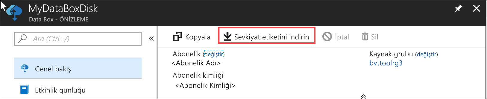

2.  Aşağıda gösterilen iade sevkiyat etiketi indirilir. Etiketi kaydedin, yazdırın ve iade edilen pakete yapıştırın.

    

## Teslimat adresini düzenleme

Siparişi verdikten sonra teslimat adresini düzenlemeniz gerekebilir. Bu işlem yalnızca disk yola çıkana kadar kullanılabilir. Disk yola çıktıktan sonra bu seçenek kullanılamaz.

Siparişi düzenlemek için aşağıdaki adımları gerçekleştirin.

1. **Sipariş ayrıntıları > Teslimat adresini düzenle**'ye gidin.

    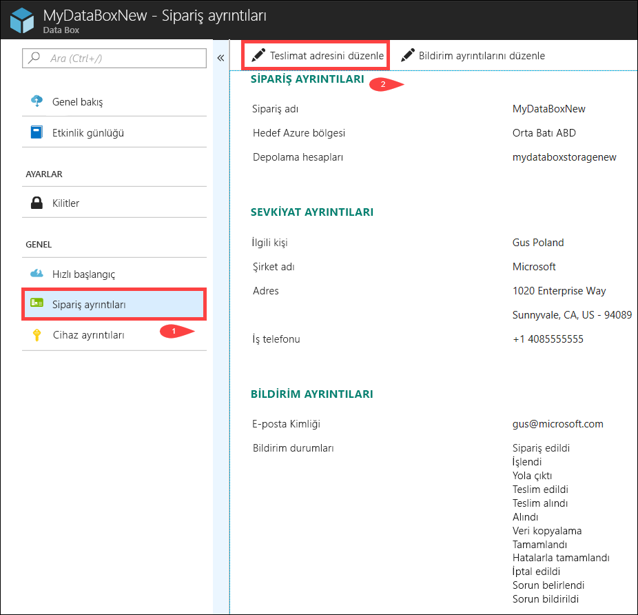

2. Bu sayfada gönderim adresini düzenleyebilir ve yaptığınız değişiklikleri kaydedebilirsiniz.

    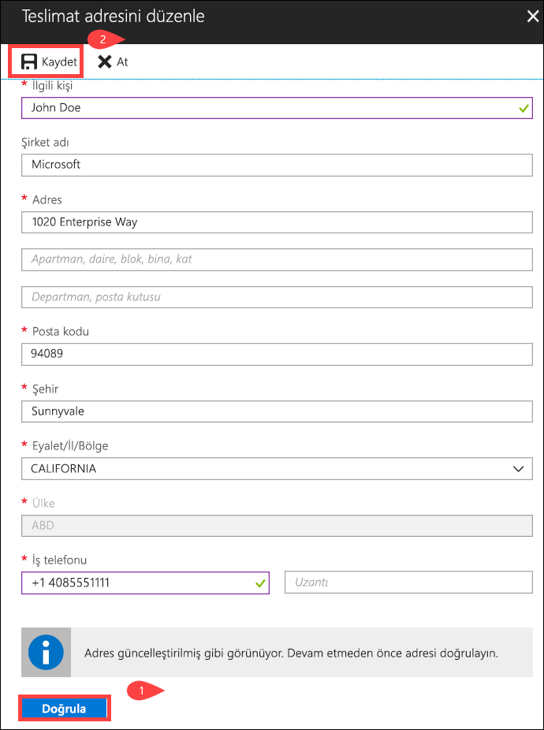

## Bildirim ayrıntılarını düzenleme

Sipariş durumu e-postalarının gönderilmesini istediğiniz kullanıcıları değiştirmek isteyebilirsiniz. Örneğin disk teslim edildiğinde veya alındığında bir kullanıcının bilgilendirilmesi gerekebilir. Veriler kaynaktan silinmeden önce Azure depolama hesabındaki verileri doğrulanması amacıyla veri kopyalama işlemi tamamlandığında başka bir kullanıcıya bildirim gönderilmesini isteyebilirsiniz. Bu gibi durumlarda bildirim ayrıntılarını düzenleyebilirsiniz.

Bildirim ayrıntılarını düzenlemek için aşağıdaki adımları gerçekleştirin.

1. **Sipariş ayrıntıları > Bildirim ayrıntılarını düzenle**'ye gidin.

    

2. Bu sayfada bildirim ayrıntılarını düzenleyebilir ve yaptığınız değişiklikleri kaydedebilirsiniz.
 
    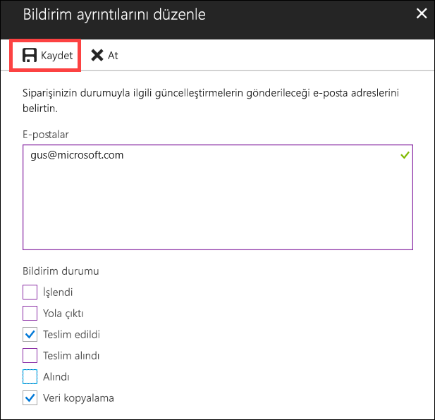

## Sipariş durumunu görüntüleme

|Sipariş durumu |Açıklama |
|---------|---------|
|Sipariş edildi     | Sipariş başarıyla oluşturuldu.   Diskler kullanılabilir durumda değilse bir bildirim gönderilir.  Diskler kullanılabilir durumdaysa Microsoft tarafından gönderilecek disk belirlenir ve disk paketi hazırlanır.        |
|İşlendi     | Siparişin işlenmesi tamamlandı.   Sipariş sırasında aşağıdaki eylemler gerçekleştirilir:<li>Diskler AES-128 BitLocker şifrelemesi kullanılarak şifrelenir. </li> <li>Data Box Disk, yetkisiz erişimi önlemek için kilitlenir.</li><li>Bu işlem sırasında disklerin kilidini açan destek anahtarı oluşturulur.</li>        |
|Yola çıktı     | Sipariş sevk edildi. Siparişin 1-2 gün içinde elinize geçmesi gerekir.        |
|Teslim Edildi     | Sipariş, belirtilen adrese teslim edildi.        |
|Teslim alındı     |İade gönderiniz teslim alındı.   Gönderi Azure veri merkezine ulaştığında otomatik olarak Azure'a yüklenir.         |
|Alındı     | Diskleriniz Azure veri merkezine alındı. Veri kopyalama işlemi yakında başlayacak.        |
|Veriler kopyalandı     |Veri kopyalama işlemi devam ediyor.  Veri kopyalama işlemi tamamlanana kadar bekleyin.         |
|Tamamlandı       |Sipariş başarıyla tamamlandı.  Şirket içi verileri sunuculardan silmeden önce verilerinizin Azure'a kopyalandığından emin olun.         |
|Hatalarla tamamlandı| Veri kopyalama işlemi tamamlandı ancak hatalar var.   **Genel bakış** sayfasında belirtilen yolu kullanarak kopyalama günlüklerini gözden geçirin. Daha fazla bilgi için [Tanılama günlüklerini indir](data-box-disk-troubleshoot.md#download-diagnostic-logs) sayfasına gidin.   |
|İptal edildi            |Sipariş iptal edildi.   Siparişi iptal ettiniz veya bir hatayla karşılaşıldı ve sipariş, hizmet tarafından iptal edildi.     |

## Sonraki adımlar

- [Data Box Disk sorunlarını giderme](data-box-disk-troubleshoot.md) hakkında bilgi edinin.
