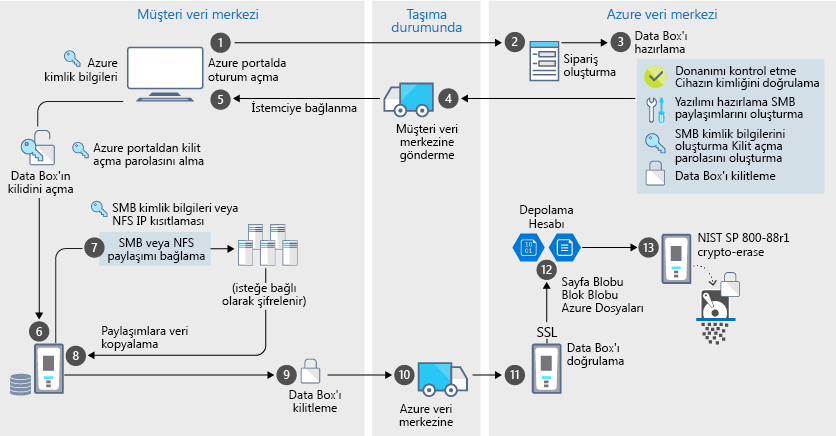

# Azure Data Box güvenliği ve veri koruması

Data Box, verilerinizi yalnızca yetkili varlıkların görüntüleyebilmesini, değiştirebilmesini veya silebilmesini sağlayarak veri koruma için güvenli çözüm getirir. Bu makalede, Data Box çözümü bileşenlerinden her birini ve buralarda depolanan verileri korumaya yardımcı olan Azure Data Box güvenliği açıklanır. 

[!INCLUDE [GDPR-related guidance](../../includes/gdpr-intro-sentence.md)]

## Bileşenler arasında veri akışı

Microsoft Azure Data Box çözümü birbiriyle etkileşimde olan dört ana bileşenden oluşur:

- **Azure’da barındırılan Azure Data Box hizmeti** – Cihaz sırası oluşturmak, cihazı yapılandırmak ve tamamlanması için sırayı izlemek amacıyla kullandığınız yönetim hizmeti.
- **Data Box cihazı** – Şirket içi verilerinizi Azure’a aktarmanız için size gönderilen aktarım cihazı. 
- **Cihaza bağlı istemciler/konaklar** – Altyapınızda Data Box cihazına bağlanan ve korunması gereken verileri içeren istemciler.
- **Bulut depolama** – Azure bulutunda verilerin depolandığı konum. Bu genellikle, oluşturduğunuz Azure Data Box kaynağına bağlanan depolama hesabıdır.

Aşağıdaki diyagram, Azure Data Box çözümü aracılığıyla şirket içinden Azure’a veri akışını gösterir.

Bu çözüm veri akışları gibi olayları günlüğe kaydedilir ve günlükleri üretilir. Daha fazla bilgi için Git [izleme ve Azure Data Box'ınızı için olay günlüğü](data-box-logs.md).

## Güvenlik özellikleri

Data Box, verilerinizi yalnızca yetkili varlıkların görüntüleyebilmesini, değiştirebilmesini veya silebilmesini sağlayarak veri koruma için güvenli çözüm getirir. Bu çözümle ilgili güvenlik özellikleri hem diske hem de hizmete yöneliktir ve burada depolanan verilerin güvenliğini sağlar. 

### Data Box cihazı koruması

Data Box cihazı aşağıdaki özelliklerle korunur:

- Şok, elverişsiz aktarım ve çevresel şartlara dayanıklı sağlam bir cihaz kasası. 
- Taşıma sırasında gerçekleşen kurcalamaları gösteren kurcalama karşıtı mühürler.
- Cihazın işlemesini engelleyen donanım ve yazılım kurcalama algılaması.
- Yalnızca Data Box’a özgün yazılım çalıştırır.
- Kilitli bir durumda önyüklenir.
- Cihaz erişimi, cihaz kilit açma şifresi ile kontrol edilir.
- Cihaz içine ve cihazdan dışarı veri kopyalamak için erişim kimlik bilgileri. Tüm erişim **cihaz kimlik bilgilerini** sayfasında Azure portalı olan oturum [etkinlik günlüklerini](data-box-logs.md#query-activity-logs-during-setup).

### Data Box veri koruması

Data Box içine ve dışına akıtılan veriler şu özelliklerle korunur:

- Bekleyen veriler için 256 bit AES şifreleme.
- Kullanım halindeki veriler için şifrelenmiş protokoller kullanılabilir.
- Azure’a yapılan yüklenme tamamlandıktan sonra cihazdaki verilerin güvenli bir şekilde silinmesi. Verilerin silinmesi NIST 800-88r1 standartlarıyla uyumludur. Veri silinme olayı kaydedilir [siparişi geçmişi](data-box-logs.md#download-order-history).

### Data Box hizmeti koruması

Data Box hizmeti aşağıdaki özelliklerle korunur.

- Data Box hizmetine erişim için kuruluşunuzun Data Box içeren bir Azure aboneliği olmalıdır. Aboneliğiniz, Azure portalında erişebildiğiniz özellikleri yönetir.
- Data Box hizmeti Azure’da barındırıldığından, Azure güvenlik özellikleriyle korunur. Microsoft Azure tarafından sağlanan güvenlik özellikleri hakkında daha fazla bilgi için [Microsoft Azure Güven Merkezi](https://www.microsoft.com/TrustCenter/Security/default.aspx)’ne gidin.
- Data Box Siparişiniz erişimi rollerinin kullanımı ve rol tabanlı erişim denetimi (RBAC) denetlenebilir. Daha fazla bilgi için [Data Box Siparişiniz için erişim denetimi ayarlama](data-box-logs.md#set-up-access-control-on-the-order)
- Data Box hizmeti, hizmette cihazın kilidini açmak için kullanılan kilit açma şifrelerini saklar.
- Data Box hizmeti, hizmetteki sipariş ayrıntılarını ve durumunu depolar. Sipariş silindiğinde bu bilgiler de silinir.

## Kişisel verileri yönetme

Azure Data Box, hizmette şu anahtar örneklerinde kişisel bilgileri toplar ve görüntüler:

- **Bildirim ayarları** - Sipariş oluşturduğunuzda, bildirim ayarlarının altında kullanıcıların e-posta adreslerini yapılandırırsınız. Bu bilgiler yönetici tarafından görüntülenebilir. Bu bilgiler, iş terminal duruman ulaştığında veya siparişi sildiğinizde hizmet tarafından silinir.

- **Sipariş ayrıntıları** – Sipariş oluşturulduktan sonra, kullanıcının teslimat adresi, e-postası, kişi bilgileri Azure portalında depolanır. Kaydedilen bilgiler:

  - Kişi adı
  - Telefon numarası
  - E-posta
  - Açık adres
  - Şehir
  - Posta kodu
  - Eyalet
  - Ülke/İl/Bölge
  - Taşıyıcı hesap numarası
  - Kargo takip numarası

    Sipariş ayrıntıları, iş tamamlandığında veya siz siparişi sildiğinizde Data Box hizmeti tarafından silinir.

- **Teslimat adresi** – Sipariş verildikten sonra, Data Box hizmeti UPS veya DHL gibi üçüncü taraf taşıyıcılara teslimat adresini verir. 

Daha fazla bilgi için, [Güven Merkezi](https://www.microsoft.com/trustcenter)’nde Microsoft Gizlilik ilkesini gözden geçirin.

## Güvenlik yönergeleri başvurusu

Data Box’da aşağıdaki güvenlik yönergeleri uygulanmıştır: 

|Yönerge   |Açıklama   |
|---------|---------|
|[IEC 60529 IP52](https://www.iec.ch/)    | Su ve toz koruması için         |
|[ISTA 2A](https://ista.org/docs/2Aoverview.pdf)     | Olumsuz taşıma koşullarına dayanıklılık için          |
|[NIST SP 800-147](https://nvlpubs.nist.gov/nistpubs/Legacy/SP/nistspecialpublication800-147.pdf)      | Güvenli cihaz yazılımı güncelleştirmesi için         |
|[FIPS 140-2 Level 2](https://csrc.nist.gov/csrc/media/publications/fips/140/2/final/documents/fips1402.pdf)      | Veri koruma için         |
|[NIST SP 800-88r1](https://nvlpubs.nist.gov/nistpubs/SpecialPublications/NIST.SP.800-88r1.pdf)      | Veri temizleme için         |

## Sonraki adımlar

- [Data Box gereksinimlerini](data-box-system-requirements.md) gözden geçirin.
- [Data Box sınırlarını](data-box-limits.md) anlayın.
- Azure portalda [Azure Data Box](data-box-quickstart-portal.md)’u hızla dağıtın.
