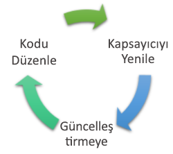

# <a name="get-started-on-azure-dev-spaces-with-java"></a>Java ile Azure geliştirme alanlarında çalışmaya başlama

Bu kılavuzda şunların nasıl yapıldığını öğreneceksiniz:

- Azure’da geliştirme için iyileştirilmiş Kubernetes tabanlı bir ortam (bir _dev space_) oluşturun.
- VS Code'u ve komut satırını kullanarak kapsayıcılarda yinelemeli kod geliştirin.
- Kodunuzu bir ekip ortamında verimli bir şekilde geliştirip test edin.

> [!Note]
> **Takılı kalarak,** herhangi bir zamanda bkz [sorun giderme](troubleshooting.md) bölümü.

## <a name="install-the-azure-cli"></a>Azure CLI'yı yükleme
Azure Dev Spaces, çok az yerel makine kurulumu gerektirir. Geliştirme ortamı yapılandırmanızın büyük bölümü bulutta depolanır ve diğer kullanıcılarla paylaşılabilir. İlk olarak [Azure CLI](/cli/azure/install-azure-cli?view=azure-cli-latest) indirip yükleyin.

### <a name="sign-in-to-azure-cli"></a>Azure CLI'da oturum açma
Azure'da oturum açın. Bir terminal penceresine aşağıdaki komutu yazın:

```cmd
az login
```

> [!Note]
> Azure aboneliğiniz yoksa [ücretsiz hesap](https://azure.microsoft.com/free) oluşturabilirsiniz.

#### <a name="if-you-have-multiple-azure-subscriptions"></a>Birden çok Azure aboneliğiniz varsa...
Şunu çalıştırarak aboneliklerinizi görüntüleyebilirsiniz: 

```cmd
az account list
```
JSON çıkışında `isDefault: true` bulunan aboneliği bulun.
Kullanmak istediğiniz abonelik bu değilse, varsayılan aboneliği değiştirebilirsiniz:

```cmd
az account set --subscription <subscription ID>
```

## <a name="create-a-kubernetes-cluster-enabled-for-azure-dev-spaces"></a>Azure Dev Spaces için bir Kubernetes kümesi oluşturma

Komut isteminde, kaynak grubunu oluşturma bir [Azure geliştirme alanları destekleyen bir bölge][supported-regions].

```cmd
az group create --name MyResourceGroup --location <region>
```

Şu komutu kullanarak bir Kubernetes kümesi oluşturun:

```cmd
az aks create -g MyResourceGroup -n MyAKS --location <region> --disable-rbac --generate-ssh-keys
```

Kümenin oluşturulması birkaç dakika sürer.

### <a name="configure-your-aks-cluster-to-use-azure-dev-spaces"></a>AKS kümenizi Azure Dev Spaces kullanacak şekilde yapılandırma

AKS kümenizi içeren kaynak grubuyla AKS kümesi adınızı kullanarak aşağıdaki Azure CLI komutunu girin. Komut, kümenizi Azure Dev Spaces desteğiyle yapılandırır.

   ```cmd
   az aks use-dev-spaces -g MyResourceGroup -n MyAKS
   ```

> [!IMPORTANT]
> Azure geliştirme alanları yapılandırma işlemini kaldıracak `azds` kümedeki varsa, ad alanı.

## <a name="get-kubernetes-debugging-for-vs-code"></a>VS Code için Kubernetes hata ayıklaması edinin
Kubernetes hata ayıklaması gibi zengin özellikler VS Code kullanarak .NET Core ve Node.js geliştiricileri için kullanılabilir.

1. Yüklü değilse, [VS Code](https://code.visualstudio.com/Download)’u yükleyin.
1. [VS Azure Dev Spaces uzantısını](https://marketplace.visualstudio.com/items?itemName=azuredevspaces.azds) indirip yükleyin. Uzantının Market sayfasında ve yeniden VS Code’da Yükle’ye bir kez tıklayın. 

Azure Dev Spaces ile Java uygulamalarında hata ayıklamak istiyorsanız VS Code [Azure Dev Spaces için Java Hata Ayıklayıcısı](https://marketplace.visualstudio.com/items?itemName=vscjava.vscode-java-debugger-azds) uzantısını indirin. Uzantının Market sayfasında ve yeniden VS Code’da Yükle’ye bir kez tıklayın.

## <a name="create-a-web-app-running-in-a-container"></a>Kapsayıcıda çalışan bir web uygulaması oluşturma

Bu bölümde bir Java web uygulaması oluşturacak ve Kubernetes’teki bir kapsayıcı içinde çalıştıracaksınız.

### <a name="create-a-java-web-app"></a>Java web uygulaması oluşturma
GitHub deposunu yerel ortamınıza indirmek için https://github.com/Azure/dev-spaces konumuna gidip **Kopyala veya İndir**’i seçerek GitHub’dan kodu indirin. Bu kılavuzun kodu `samples/java/getting-started/webfrontend` içindedir.

## <a name="preparing-code-for-docker-and-kubernetes-development"></a>Docker ve Kubernetes geliştirme için kod hazırlama
Şimdiye kadar, yerel olarak çalıştırılabilen temel bir web uygulamanız vardı. Şimdi uygulamanın kapsayıcısını tanımlayan varlıklar oluşturup Kubernetes’de nasıl dağıtılacağını belirleyerek uygulamayı kapsayıcılı hale getireceksiniz. Bu görev Azure Dev Spaces ile kolayca gerçekleştirilebilir: 

1. VS Code’u başlatın ve `webfrontend` klasörünü açın. (Hata ayıklama varlıkları eklemek veya projeyi geri yüklemek için tüm varsayılan istemleri yoksayabilirsiniz.)
1. VS Code’da Tümleşik Terminal’i açın (**Görünüm > Tümleşik Terminal** menüsünü kullanarak).
1. Şu komutu çalıştırın (geçerli klasörünüzün **webfrontend** olduğundan emin olun):

    ```cmd
    azds prep --public
    ```

Azure CLI’nin `azds prep` komutu varsayılan ayarlarla Docker ve Kubernetes varlıklarını oluşturur:
* `./Dockerfile`, uygulamanın kapsayıcı görüntüsünü açıklar, kaynak kodunun nasıl derlendiğini ve kapsayıcının içinde çalıştırıldığını belirtir.
* `./charts/webfrontend` altındaki [Helm grafiği](https://docs.helm.sh), kapsayıcının Kubernetes'de nasıl dağıtıldığını açıklar.

Şimdilik bu dosyaların tüm içeriğini anlamanız gerekli değildir. Bununla birlikte, **geliştirme aşamasından üretim aşamasına kadar aynı Kubernetes ve Docker kod yapılandırmalı varlıklarının kullanılabildiğini, bu şekilde farklı ortamlarda daha tutarlı sonuçlar sağlanabildiğini** belirtmek gerekir.
 
`prep` komutuyla `./azds.yaml` adlı bir dosya da oluşturulur ve bu dosya Azure Dev Spaces’in yapılandırma dosyasıdır. Azure’da yinelemeli bir geliştirme deneyimi sağlamak için Docker ve Kubernetes yapıtlarını ek yapılandırmayla tamamlar.

## <a name="build-and-run-code-in-kubernetes"></a>Kubernetes'de kodu oluşturma ve çalıştırma
Şimdi kodumuzu çalıştıralım! Terminal penceresinde, bu komutu webfrontend **kök kod klasöründen** çalıştırın:

```cmd
azds up
```

Komutun çıkışını gözden geçirin; ilerledikçe bazı şeyler göreceksiniz:
- Kaynak kod Azure Dev Space ile eşitlenir.
- Kod klasörünüzdeki Docker varlıkları tarafından belirtildiği gibi Azure'da bir kapsayıcı görüntüsü oluşturulur.
- Kod klasörünüzdeki Helm grafiği tarafından belirtildiği gibi kapsayıcı görüntüsünü kullanan Kubernetes nesneleri oluşturulur.
- Kapsayıcının uç noktaları hakkındaki bilgiler görüntülenir. Bizim örneğimizde, genel bir HTTP URL'si görmeyi bekleriz.
- Yukarıdaki aşamaların başarıyla tamamlandığını varsayarsak, kapsayıcı başlatılırken `stdout` (ve `stderr`) çıkışını görmeye başlamalısınız.

> [!Note]
> Bu adımlar, `up` komutu ilk kez çalıştırıldığında biraz uzun sürer ama izleyen çalıştırmalar daha hızlı olacaktır.

### <a name="test-the-web-app"></a>Web uygulamasını test etme
`up` komutu tarafından oluşturulan genel URL hakkındaki bilgiler için konsol çıkışını tarayın. Şu biçimde olacaktır: 

```
(pending registration) Service 'webfrontend' port 'http' will be available at <url>
Service 'webfrontend' port 'http' is available at http://webfrontend.1234567890abcdef1234.eus.azds.io/
Service 'webfrontend' port 80 (TCP) is available at 'http://localhost:<port>'
```

Çıktıda hizmeti için genel URL tanımlamak `up` komutu. İle biter `.azds.io`. Yukarıdaki örnekte, genel URL'dir `http://webfrontend.1234567890abcdef1234.eus.azds.io/`.

Web uygulamanızı görmek için genel URL, bir tarayıcıda açın. Ayrıca, fark `stdout` ve `stderr` çıkış akışı yapılan *azds izleme* terminal penceresinde aynı web uygulamanızla etkileşim. Ayrıca, sistemden ilerledikçe bilgi HTTP isteklerini izleme görürsünüz. Bu, karmaşık çoklu hizmet çağrıları geliştirme sırasında izlemek kolaylaştırır. Bu istek izleme geliştirme alanları tarafından eklenen izleme sağlar.

> [!Note]
> Genel URL yanı sıra diğer kullanabilirsiniz `http://localhost:<portnumber>` konsol çıkışında görüntülenen URL. Localhost URL'sini kullanırsanız kapsayıcı yerel olarak çalışıyor gibi görünebilir, ancak gerçekte AKS'de çalışıyordur. Azure geliştirme alanları Kubernetes kullanan *bağlantı noktası iletme* AKS'de çalışan kapsayıcıya localhost bağlantı noktasına eşlemek üzere işlevsellik. Bu, yerel makinenizde hizmetiyle etkileşim kolaylaştırır.

### <a name="update-a-content-file"></a>İçerik dosyası güncelleştirme
Azure Dev Spaces yalnızca kodu Kubernetes’te çalıştırmaya yönelik değildir; aynı zamanda kod değişikliklerinizin buluttaki bir Kubernetes ortamında uygulandığını hızlıca ve yinelenerek görmenizi sağlar.

1. Terminal penceresinde `Ctrl+C` düğmesine basın (`azds up` hizmetini durdurmak için).
1. Açık `src/main/java/com/ms/sample/webfrontend/Application.java`ve selamlama iletisi düzenlenme [satır 19](https://github.com/Azure/dev-spaces/blob/master/samples/java/getting-started/webfrontend/src/main/java/com/ms/sample/webfrontend/Application.java#L19):

    ```java
    return "Hello from webfrontend in Azure!";
    ```

1. Dosyayı kaydedin.
1. Terminal penceresinde `azds up` komutunu çalıştırın.

Bu komut, kapsayıcı görüntüsünü yeniden derler ve Helm grafiğini yeniden dağıtır. Kod değişikliklerinizin çalışan uygulamada etkili olup olmadığını görmek için tarayıcıyı yenileyin.

Bununla birlikte, kod geliştirmek için sonraki bölümde öğreneceğiniz daha da *hızlı bir yöntem* mevcuttur. 

## <a name="debug-a-container-in-kubernetes"></a>Kubernetes’te bir kapsayıcının hatalarını ayıklama

Bu bölümde, Azure'da çalıştırılan kapsayıcımızda doğrudan hata ayıklamak için VS Code kullanacaksınız. Ayrıca daha hızlı bir düzenleme-çalıştırma-test döngüsü elde etmeyi öğreneceksiniz.



> [!Note]
> Herhangi bir zamanda **kilitlenirseniz** [Sorun giderme](troubleshooting.md) bölümüne başvurun veya bu sayfada bir yorum paylaşın.

### <a name="initialize-debug-assets-with-the-vs-code-extension"></a>Hata ayıklama varlıklarını VS Code uzantısıyla başlatma
VS Code'un Azure Dev Space'imizle iletişim kurabilmesi için önce kod projenizi yapılandırmalısınız. Azure Dev Spaces için VS Code uzantısı hata ayıklama yapılandırmasını ayarlamak için yardımcı komutu sağlar. 

**Komut Paleti**'ni açın (**Görünüm | Komut Paleti** menüsünü kullanarak) ve otomatik tamamlama özelliğini kullanarak komutu yazın ve seçin: `Azure Dev Spaces: Prepare configuration files for Azure Dev Spaces`. 

Bu, `.vscode` klasörünün altında Azure Dev Spaces için hata ayıklama yapılandırması ekler. Bu komut, projeyi dağıtım için yapılandıran `azds prep` komutuyla karıştırılmamalıdır.


### <a name="select-the-azds-debug-configuration"></a>AZDS hata ayıklama yapılandırmasını seçme
1. Hata Ayıklama görünümünü açmak için VS Code’un yan tarafındaki **Etkinlik Çubuğu** içinde Hata Ayıklama simgesine tıklayın.
1. Etkin hata ayıklama yapılandırması olarak **Java Programını Başlat (AZDS)** öğesini seçin.


> [!Note]
> Komut Paletinde herhangi bir Azure Dev Spaces komutu görmüyorsanız, Azure Dev Spaces için VS Code uzantısını yüklediğinizden emin olun. VS Code'da açtığınız çalışma alanını içeren klasörü olduğundan emin olun `azds.yaml`.

### <a name="debug-the-container-in-kubernetes"></a>Kubernetes’te kapsayıcının hatalarını ayıklama
Kubernetes’te kodunuzun hatalarını ayıklamak için **F5**’e basın.

`up` komutunda olduğu gibi kod, geliştirme ortamıyla eşitlenir ve bir kapsayıcı derlenip Kubernetes’e dağıtılır. Elbette bu kez, hata ayıklayıcı uzak kapsayıcıya eklenir.

> [!Tip]
> VS Code durum çubuğunda turuncu kapatır belirten hata ayıklayıcı eklenir. Ayrıca, uygulamanızı açmak için kullanabileceğiniz bir tıklanabilir URL de görüntülenir.


Sunucu tarafı kod dosyasında (örneğin `src/main/java/com/ms/sample/webfrontend/Application.java` kaynak dosyasındaki `greeting()` işlevi içinde) bir kesme noktası belirleyin. Tarayıcı sayfasının yenilenmesi, kesme noktasına ulaşılmasına neden olur.

Kodun yerel olarak yürütülmesi durumunda olduğu gibi, çağrı yığını, yerel değişkenler, özel durum bilgileri vb. hata ayıklama bilgilerine tam erişiminiz vardır.

### <a name="edit-code-and-refresh"></a>Kod düzenleme ve yenileme
Hata ayıklayıcı etkinken bir kod düzenlemesi yapın. Örneğin `src/main/java/com/ms/sample/webfrontend/Application.java` karşılamasını değiştirin. 

```java
public String greeting()
{
    return "I'm debugging Java code in Azure!";
}
```

Dosyayı kaydedin ve buna **hata ayıklama Eylemler bölmesinde**, tıklayın **yeniden** düğmesi.


Azure Dev Spaces, her kod düzenlemesi yapıldığında yeni bir kapsayıcı görüntüsünü yeniden derleme ve yeniden dağıtmayı içeren uzun süreli işlem yerine, mevcut kapsayıcı içindeki kodu artımlı bir şekilde yeniden derleyerek daha hızlı bir düzenleme/hata ayıklama döngüsü sağlar.

Tarayıcıda web uygulamasını yenileyin. Özel iletinizin kullanıcı arabiriminde görüntülendiğini görürsünüz.

**Artık kod üzerinde hızlıca yineleme ve doğrudan Kubernetes’te hata ayıklamaya yönelik bir yönteminiz var!** Ardından, ikinci bir kapsayıcıyı nasıl oluşturabileceğinizi ve çağırabileceğinizi göreceksiniz.

## <a name="next-steps"></a>Sonraki adımlar

> [!div class="nextstepaction"]
> [Birden çok hizmet geliştirme hakkında bilgi edinin](multi-service-java.md)


[supported-regions]: about.md#supported-regions-and-configurations
