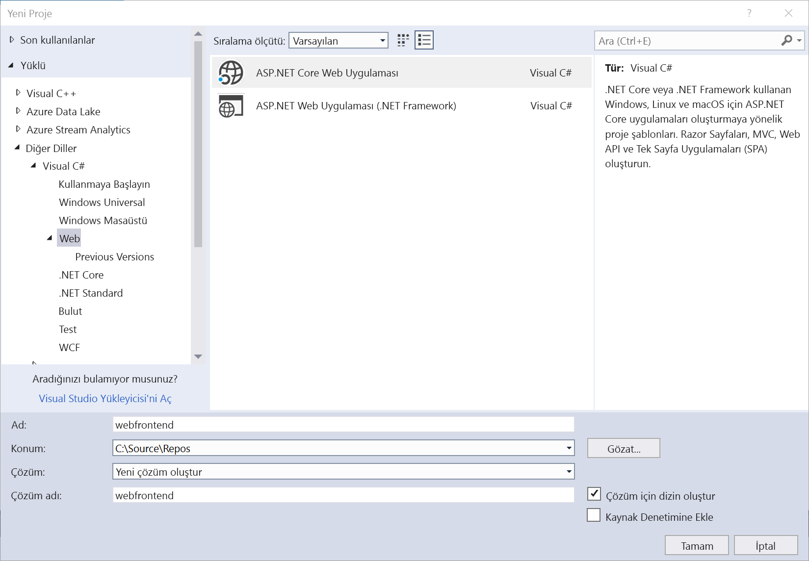
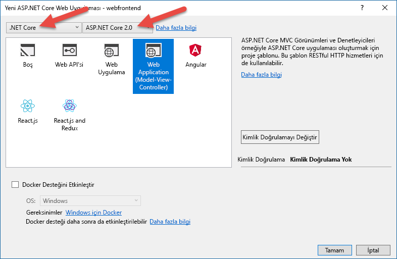
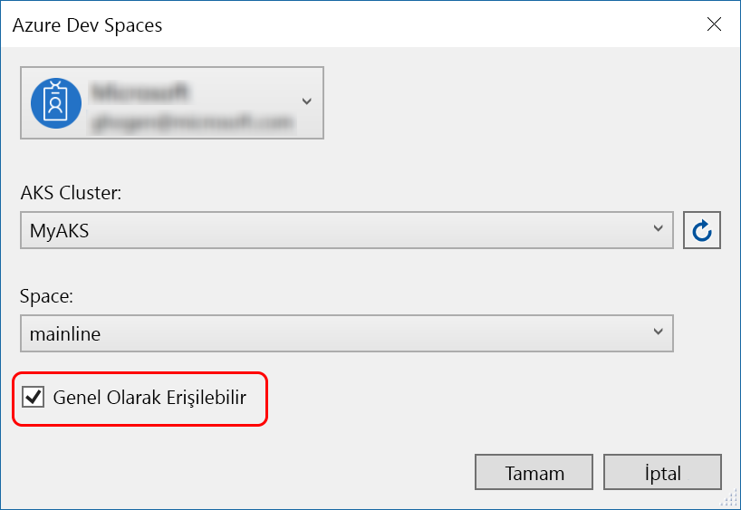
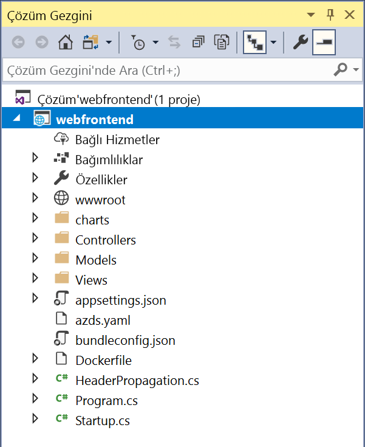

# Azure geliştirme alanları .NET Core ve Visual Studio ile çalışmaya başlama

Bu kılavuzda şunların nasıl yapıldığını öğreneceksiniz:

- Azure’da yönetilen bir Kubernetes ile Azure Dev Spaces’ı ayarlayın.
- Visual Studio kullanarak kapsayıcılarda yinelemeli kod geliştirin.
- İki ayrı hizmeti bağımsız olarak geliştirin ve Kubernetes’in DNS hizmet bulma yöntemini kullanarak başka bir hizmete çağrı yapın.
- Kodunuzu bir ekip ortamında verimli bir şekilde geliştirip test edin.

> [!Note]
> **Takılı kalarak,** herhangi bir zamanda bkz [sorun giderme](troubleshooting.md) bölümü.

## Azure Dev Spaces için bir Kubernetes kümesi oluşturma

1. https://portal.azure.com adresinden Azure portalında oturum açın.
1. **Kaynak oluştur**’u seçin > **Kubernetes** ifadesini arayın > **Kubernetes Hizmeti** > **Oluştur** seçeneğini belirleyin.

   Her başlığı altında aşağıdaki adımları tamamlayın *oluşturma Kubernetes kümesi* , seçtiğiniz doğrulayın ve form [bölge destekleyen Azure geliştirme alanları](https://docs.microsoft.com/azure/dev-spaces/#a-rapid,-iterative-kubernetes-development-experience-for-teams).

   - **PROJECT DETAILS**: bir Azure aboneliği ve yeni veya mevcut bir Azure kaynak grubu seçin.
   - **KÜME AYRINTILARI**: AKS kümesi için bir ad, bölge, sürüm ve DNS adı öneki girin.
   - **ÖLÇEK**: AKS aracısı düğümleri için bir VM boyutu ve düğüm sayısı seçin. Azure Dev Spaces kullanmaya yeni başlıyorsanız tüm özellikleri keşfetmek için bir düğüm yeterli olacaktır. Küme dağıtıldıktan sonra da dilediğiniz zaman düğüm sayısını kolayca ayarlayabilirsiniz. AKS kümesi oluşturulduktan sonra VM boyutunu değiştiremeyeceğinizi unutmayın. Ancak ölçeklendirmeniz gerekirse AKS kümesi dağıtıldıktan sonra kolayca daha büyük VM'lere sahip yeni bir AKS kümesi oluşturabilir ve Dev Spaces özelliğini kullanarak bu büyük kümeye yeniden dağıtabilirsiniz.

   

   Seçin **sonraki: Kimlik doğrulaması** tamamlandığında.

1. Rol Tabanlı Erişim Denetimi (RBAC) için dilediğiniz ayarı seçin. Azure Dev Spaces, RBAC'nin etkin veya devre dışı olduğu kümeleri destekler.

    

1. **Gözden geçir + oluştur**’u seçin ve sonra tamamlandığında **Oluştur**’a tıklayın.

## Visual Studio araçlarını edinme
1. En son [Visual Studio 2017](https://www.visualstudio.com/vs/) sürümünü yükleme
1. Visual Studio yükleyicisinde aşağıdaki İş Yükünün seçili olduğundan emin olun:
    * ASP.NET ve web geliştirme
1. [Kubernetes için Visual Studio Araçları](https://aka.ms/get-azds-visualstudio)'nı yükleme

## Kapsayıcıda çalışan bir web uygulaması oluşturma

Bu bölümde, bir ASP.NET Core web uygulaması oluşturma ve Kubernetes kapsayıcısında çalışan alın.

### ASP.NET web uygulaması oluşturma

Visual Studio 2017’de yeni bir proje oluşturun. Şu anda, projenin bir **ASP.NET Core Web Uygulaması** olması gerekir. Projeyi '**webfrontend**' olarak adlandırın.

**Web Uygulaması (Model-Görünüm-Denetleyici)** şablonunu seçin ve iletişim kutusunun üstündeki iki açılır listede **.NET Core** ve **ASP.NET Core 2.0**’ı hedeflediğinizden emin olun. Projeyi oluşturmak için **Tamam**'a tıklayın.

### AKS kümesi için Azure Dev Spaces'i etkinleştirme

Yeni oluşturduğunuz projede, aşağıda gösterildiği gibi başlatma ayarları açılır listesinden **Azure Dev Spaces** seçeneğini belirleyin.

Daha sonra gösterilen iletişim kutusunda, uygun hesapla oturum açtığınızdan emin olun ve ardından mevcut bir Kubernetes kümesini seçin.

**Alan** açılır listesini şimdilik varsayılan `default` değerinde bırakın. Daha sonra bu seçenek hakkında daha fazla bilgi edineceksiniz. Web uygulamasına bir genel uç noktadan erişilebilmesi için **Genel Erişime Açık** onay kutusunu işaretleyin. Bu ayar zorunlu değildir ancak bu kılavuzun sonraki kısımlarında bazı kavramları göstermeye yardımcı olacaktır. Yine de endişelenmeyin, her iki durumda da Visual Studio kullanarak web sitenizde hata ayıklayabilirsiniz.

Kümeyi seçmek veya oluşturmak için **Tamam**’a tıklayın.

Azure Dev Spaces ile çalışacak şekilde etkinleştirilmemiş bir küme seçerseniz, yapılandırmak isteyip istemediğinizi soran bir ileti görürsünüz.

**Tamam**’ı seçin.

> [!IMPORTANT]
> Azure geliştirme alanları yapılandırma işlemini kaldıracak `azds` kümedeki varsa, ad alanı.

 Bunu gerçekleştirmek için bir arka plan görevi başlatılır. Tamamlanması birkaç dakika sürer. Oluşturma işleminin devam edip etmediğini görmek için, aşağıdaki görüntüde gösterildiği gibi işaretçinizi durum çubuğunun sol alt köşesindeki **Arka plan görevleri** simgesinin üzerine getirin.

> [!Note]
> Geliştirme alanı başarıyla oluşturulana kadar uygulamanızda hata ayıklayamazsınız.

### Projeye eklenen dosyalara bakın
Geliştirme alanının oluşturulmasını beklerken, geliştirme alanını kullanmayı seçmeniz sırasında projenize eklenmiş dosyalara bakın.

İlk olarak, `charts` adlı bir klasörün eklendiğini ve bu klasörün içinde uygulamanız için bir [Helm grafiği](https://docs.helm.sh) oluşturulduğunu görebilirsiniz. Bu dosyalar, uygulamanızı geliştirme alanına dağıtmak için kullanılır.

`Dockerfile` adlı bir dosyanın eklendiğini görürsünüz. Bu dosya, uygulamanızı standart Docker biçiminde paketlemek için gereken bilgileri içerir.

Son olarak geliştirme alanının ihtiyaç duyduğu geliştirme zamanı yapılandırmasını içeren `azds.yaml` adlı dosyayı görürsünüz.

## Kubernetes’te bir kapsayıcının hatalarını ayıklama
Geliştirme alanı başarıyla oluşturulduktan sonra uygulamanızda hata ayıklayabilirsiniz. Kodda bir kesme noktası oluşturun. Örneğin, `Message` değişkeninin ayarlandığı `HomeController.cs` dosyasının 20. satırında. Hata ayıklamaya başlamak için **F5**’e tıklayın. 

Visual Studio, uygulamayı derleyip dağıtmak için geliştirme alanıyla iletişim kurar ve sonra web uygulaması çalışır durumdayken bir tarayıcı açar. Kapsayıcı yerel olarak çalışıyor gibi görünebilir, ancak gerçekte Azure’daki geliştirme ortamında çalışıyordur. Localhost adresinin nedeni, Azure Dev Spaces’in AKS’de çalışan kapsayıcıya geçici bir SSH tüneli oluşturmasıdır.

Kesme noktasını tetiklemek için sayfanın üst kısmındaki **Hakkında** bağlantısına tıklayın. Kodun yerel olarak yürütülmesi durumunda olduğu gibi, çağrı yığını, yerel değişkenler, özel durum bilgileri vb. hata ayıklama bilgilerine tam erişiminiz vardır.

## Kodu yinelemeli geliştirme

Azure Dev Spaces yalnızca kodu Kubernetes’te çalıştırmaya yönelik değildir; aynı zamanda kod değişikliklerinizin buluttaki bir Kubernetes ortamında uygulandığını hızlıca ve yinelenerek görmenizi sağlar.

### İçerik dosyası güncelleştirme
1. `./Views/Home/Index.cshtml` dosyasını bulun ve HTML dosyasında bir düzenleme yapın. Örneğin, `<h2>Application uses</h2>` olan 70. satırı `<h2>Hello k8s in Azure!</h2>` benzeri bir değerle değiştirin.
1. Dosyayı kaydedin.
1. Tarayıcınıza gidip sayfayı yenileyin. Web sayfasında güncelleştirilmiş HTML’in gösterildiğini görürsünüz.

Olanlar: HTML ve CSS gibi içerik dosyalarında düzenleme yapılması için bir .NET Core web uygulamasında yeniden derleme yapılması gerekmez; bu nedenle, etkin bir F5 oturumu değiştirilmiş içerik dosyalarını AKS’deki çalışan kapsayıcı ile otomatik olarak eşitler ve böylece içerik düzenlemelerinizi hemen görebilirsiniz.

### Kod dosyasını güncelleştirme
.NET Core uygulamasının güncelleştirilmiş uygulama ikili dosyalarını yeniden derleyip oluşturması gerektiğinden, kod dosyalarının güncelleştirilmesi biraz daha fazla iş gerektirir.

1. Visual Studio'daki hata ayıklayıcısını durdurun.
1. `Controllers/HomeController.cs` adlı kod dosyasını açın ve Hakkında sayfasında gösterilen iletiyi düzenleyin: `ViewData["Message"] = "Your application description page.";`
1. Dosyayı kaydedin.
1. Hata ayıklamaya yeniden başlamak için **F5**'e basın. 

Azure Dev Spaces, her kod düzenlemesi yapıldığında yeni bir kapsayıcı görüntüsünü yeniden derleme ve yeniden dağıtmayı içeren uzun süreli işlem yerine, mevcut kapsayıcı içindeki kodu artımlı bir şekilde yeniden derleyerek daha hızlı bir düzenleme/hata ayıklama döngüsü sağlar.

Tarayıcıda web uygulamasını yenileyin ve Hakkında sayfasına gidin. Özel iletinizin kullanıcı arabiriminde görüntülendiğini görürsünüz.

## Sonraki adımlar

> [!div class="nextstepaction"]
> [Birden çok hizmet geliştirme hakkında bilgi edinin](multi-service-netcore-visualstudio.md)
