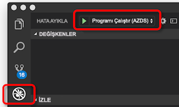

# <a name="how-azure-dev-spaces-works-and-is-configured"></a>Azure geliştirme alanları nasıl çalışır ve olan yapılandırılmış

Kubernetes uygulamasını geliştirmek zor olabilir. Docker ve Kubernetes yapılandırma dosyaları ihtiyacınız vardır. Uygulamanızı yerel olarak test etmek ve diğer bağımlı hizmetleri ile etkileşim kurmak nasıl ekleyeceğimi gerekir. Geliştirme ve test üzerinde aynı anda birden çok hizmet ve geliştiricilerin bir ekip ile işlemek gerekebilir.

Azure geliştirme alanları, geliştirmek, dağıtmak ve Kubernetes uygulamaları doğrudan Azure Kubernetes Service (AKS) hata ayıklama yardımcı olur. Azure geliştirme alanları takım geliştirme boşlukla paylaşmak de sağlar. Bir takımda geliştirme alanı paylaşımı, çoğaltma veya bağımlılıkları veya kümedeki diğer uygulamalar sahte zorunda kalmadan yalıtım modunda geliştirmek bireysel takım üyelerinin sağlar.

Azure geliştirme alanları oluşturur ve dağıtma, çalıştırma ve hata ayıklama aks'deki Kubernetes uygulamalarınız için bir yapılandırma dosyası kullanır. Bu yapılandırma dosyası ile uygulama kodu bulunur ve sürüm denetimi sisteminiz eklenebilir.

Bu makalede, işlemler, güç Azure geliştirme alanları ve bu işlemleri Azure geliştirme alanları yapılandırma dosyasında nasıl yapılandırılacağını açıklanır. Azure geliştirme hızlıca çalışmaya alanları alın ve uygulamada görmek için hızlı başlangıçları birini tamamlayın:

* [CLI ve Visual Studio Code ile Java](quickstart-java.md)
* [.NET core CLI ve Visual Studio Code ile](quickstart-netcore.md)
* [Visual Studio ile .NET core](quickstart-netcore-visualstudio.md)
* [CLI ve Visual Studio Code ile node.js](quickstart-nodejs.md)

## <a name="how-azure-dev-spaces-works"></a>Azure geliştirme alanları nasıl çalışır?

Azure geliştirme alanları ile etkileşimde bulunan iki farklı bileşene sahiptir: denetleyicisi ve istemci tarafı araçları.


Denetleyici, aşağıdaki eylemleri gerçekleştirir:

* Geliştirme alanı oluşturma ve seçim yönetir.
* Uygulamanızın Helm grafiği yükler ve Kubernetes nesnelerini oluşturur.
* Uygulamanızın kapsayıcı görüntüsü oluşturur.
* AKS uygulamanıza dağıtır.
* Artımlı derlemeleri duraklatmıyor ve kaynak kodunuz değiştiğinde yeniden başlatır.
* Günlükleri ve HTTP izlemeleri yönetir.
* STDOUT ve stderr istemci tarafı araçları iletir.
* Türetilmiş üst geliştirme alanından alt geliştirme alanları oluşturmak takım üyelerinin verir.
* Bir alanı içinde yanı sıra üst ve alt alanları genelinde uygulamalar için yönlendirme yapılandırır.

Denetleyici AKS dışında yer alıyor. Bu davranış ve iletişim istemci tarafı araçları ve AKS kümesi arasında sürücüleri. Azure geliştirme alanları kullanmak için küme hazırlama sırasında Azure CLI kullanarak denetleyici etkinleştirilir. Bu etkinleştirildikten sonra istemci tarafı araçları kullanarak onunla etkileşim kurabilir.

İstemci tarafı araçları kullanıcının izin verir:
* Oluşturmak bir Dockerfile, Helm grafiği ve uygulama için Azure geliştirme alanları yapılandırma dosyası.
* Üst ve alt geliştirme alanları oluşturun.
* Derleme ve uygulamanızı başlatmak için denetleyici söyleyin.

Uygulamanız, istemci tarafı araçları ayrıca çalışırken:
* Alır ve stdout ve stderr AKS'de çalışan uygulamanızdan görüntüler.
* Kullanan [bağlantı noktası iletme](https://kubernetes.io/docs/tasks/access-application-cluster/port-forward-access-application-cluster/) web http kullanarak uygulamanıza erişmesine izin vermek için:\//localhost.
* AKS çalışan uygulamanızda bir hata ayıklayıcı ekler.
* Artımlı derlemeleri, hızlı yineleme için izin vermek için bir değişiklik algıladığında eşitlemeler kaynak kodu geliştirme alanınıza.

İstemci tarafı komut satırından bir parçası olarak tooling kullanabileceğiniz `azds` komutu. İstemci tarafı ile araçları da kullanabilirsiniz:

* Visual Studio Code kullanarak [Azure geliştirme alanları uzantısı](https://marketplace.visualstudio.com/items?itemName=azuredevspaces.azds).
* Visual Studio ile [Kubernetes için Visual Studio Araçları](https://aka.ms/get-vsk8stools).

Ayarlama ve Azure Dev boşluklarla temel akışı şu şekildedir:
1. AKS kümenizi Azure geliştirme alanları için hazırlama
1. Kodunuzu Azure geliştirme alanları üzerinde çalıştırmak için hazırlama
1. Kodunuzu geliştirme boşluk çalıştırın
1. Kodunuzu geliştirme alanındaki hata ayıklama
1. Geliştirme boşlukla paylaşın

Azure geliştirme alanları her biri işleyişi hakkında daha fazla ayrıntı şu konulara değineceğiz bölümler altında.

## <a name="prepare-your-aks-cluster"></a>AKS kümenizi hazırlama

AKS kümenizi hazırlama içerir:
* Küme bir bölgede olduğu, AKS doğrulanıyor [Azure geliştirme alanları tarafından desteklenen][supported-regions].
* Kubernetes 1.10.3 çalıştığını doğrulama veya üzeri.
* Azure geliştirme alanları, küme kullanarak etkinleştirme `az aks use-dev-spaces`

Oluşturma ve Azure Dev alanları için bir AKS kümesi yapılandırma hakkında daha fazla bilgi için Başlarken kılavuzları birine bakın:
* [Java ile Azure geliştirme alanlarında çalışmaya başlama](get-started-java.md)
* [Azure geliştirme alanları .NET Core ve Visual Studio ile çalışmaya başlama](get-started-netcore-visualstudio.md)
* [Azure geliştirme alanlarında .NET Core ile çalışmaya başlama](get-started-netcore.md)
* [Node.js ile Azure geliştirme alanlarında çalışmaya başlama](get-started-nodejs.md)

Azure geliştirme alanları AKS kümenizde etkinleştirildiğinde, kümeniz için denetleyici yükler. Denetleyici, küme dışındaki ayrı bir Azure kaynağı ve kaynaklara, kümenizdeki aşağıdakileri yapar:

* Oluşturur veya bir geliştirme boşluk olarak kullanılacak bir Kubernetes ad alanı belirler.
* Tüm Kubernetes ad alanı adlı kaldırır *azds*, varsa ve yeni bir tane oluşturur.
* Kubernetes Web kancası yapılandırma dağıtır.
* Bir Web kancası giriş sunucuya dağıtır.
    

Ayrıca, diğer Azure geliştirme alanları bileşenleri hizmeti çağrı yapmak için AKS kümenizi kullanan aynı hizmet sorumlusu kullanır.


Azure geliştirme alanları kullanmak için en az bir geliştirme alanı olmalıdır. Azure geliştirme alanları AKS kümenizi içinde Kubernetes ad alanları için geliştirme alanları kullanır. Bir denetleyici yüklendikten sonra ilk geliştirme alanınızı kullanmak için mevcut bir ad alanı seçin veya yeni bir Kubernetes ad alanı oluşturma ister. Bir ad alanı bir geliştirme boşluk olarak belirlenmişse, denetleyici ekler *azds.io/space=true* geliştirme boşluk olarak tanımlamak için bu ad alanı için etiketi. Kümenizi hazırladıktan sonra ilk geliştirme alanı oluşturun veya belirleyin, varsayılan olarak seçilidir. Bir alan seçildiğinde, Azure geliştirme boşluklarla yeni iş yükleri oluşturmak için kullanılır.

Varsayılan olarak, adlı bir geliştirme alanı denetleyiciyi oluşturur *varsayılan* varolan yükselterek *varsayılan* Kubernetes ad alanı. Yeni geliştirme alanları oluşturmak ve mevcut geliştirme alanları kaldırmak için istemci tarafı Araçları'nı kullanabilirsiniz. Kubernetes, ilgili bir sınırlama nedeniyle *varsayılan* geliştirme alan kaldırılamaz. Denetleyici adlı mevcut tüm Kubernetes ad alanları da kaldırır *azds* ile çakışmalarını önlemek için `azds` istemci tarafı araçları tarafından kullanılan komutu.

Kubernetes Web kancası giriş sunucu pod'ları üç kapsayıcı ile izleme için dağıtım sırasında eklemesine kullanılır: proxy devspaces kapsayıcı devspaces proxy init kapsayıcı ve devspaces derleme kapsayıcı. **Bu kapsayıcıların üç AKS kümenizde kök erişimi ile çalıştırın.** Ayrıca, AKS kümenizin diğer Azure geliştirme alanları bileşenleri hizmeti çağrı yapmak için kullandığı aynı hizmet sorumlusu kullanırlar.


İçine ve dışına uygulama kapsayıcısı tüm TCP trafiği işleyen bir sepet kapsayıcısı devspaces proxy kapsayıcısıdır ve yönlendirme yardımcı gerçekleştirin. Belirli alanları kullanılıyorsa, proxy devspaces kapsayıcı HTTP iletileri yeniden yönlendirmeler. Örneğin, üst ve alt alanları uygulamalar arasında HTTP iletileri yönlendirmek yardımcı olabilir. Tüm HTTP olmayan trafiği devspaces değiştirilmemiş proxy geçirir. Proxy devspaces kapsayıcı ayrıca tüm gelen ve giden HTTP iletileri günlüğe kaydeder ve istemci tarafı araçları izlemeler olarak gönderir. Bu izlemeler, ardından uygulamanın davranışını denetlemek için geliştirici tarafından görüntülenebilir.

Devspaces proxy init kapsayıcı bir [init kapsayıcı](https://kubernetes.io/docs/concepts/workloads/pods/init-containers/) uygulamanızın kapsayıcı alanı hiyerarşiye göre ek yönlendirme kuralları ekler. Uygulama kapsayıcının güncelleştirerek yönlendirme kuralları ekler */etc/resolv.conf* başlamadan önce dosya ve iptables yapılandırma. Güncelleştirmeleri */etc/resolv.conf* üst alanları Hizmetleri'nde DNS çözümlemesini sağlamak. İptables yapılandırma güncelleştirmeleri tüm TCP trafiği halinde olun ve uygulamanın kapsayıcının dışına ancak yönlendirilen devspaces proxy. Tüm güncelleştirmeleri devspaces proxy başlangıç Kubernetes ekler kurallara ek olarak gerçekleşir.

Devspaces derleme kapsayıcısı init kapsayıcı ve proje kaynak kodu ve takılı Docker yuva vardır. Proje kaynak kodu ve Docker erişim, doğrudan pod tarafından oluşturulacak uygulama kapsayıcısı sağlar.

> [!NOTE]
> Azure geliştirme alanları aynı düğüm, uygulamanızın kapsayıcısı oluşturmak ve çalıştırmak için kullanır. Sonuç olarak, Azure geliştirme alanları bir dış kapsayıcı kayıt defteri oluşturmak ve uygulamanızı çalıştırmak için gerekli değildir.

Kubernetes Web kancası giriş sunucusu AKS kümesinde oluşturulan tüm yeni pod dinler. Bu pod herhangi bir ad alanı ile dağıtılırsa *azds.io/space=true* etiketi ek kapsayıcılar ile pod yerleştirir. İstemci tarafı araçları kullanarak uygulamanın kapsayıcı çalıştırırsanız devspaces derleme kapsayıcısı yalnızca eklenmiş olur.

AKS kümenizi hazırlandıktan sonra hazırlama ve geliştirme alanınızda kodunuzu çalıştırmak için istemci tarafı Araçları'nı kullanabilirsiniz.

## <a name="prepare-your-code"></a>Kodunuzu hazırlama

Bir geliştirme alanında uygulamanızı çalıştırmak için kapsayıcıya alınmış gerekir ve Kubernetes için nasıl dağıtılacağını tanımlamak gerekir. Uygulamanızı kapsayıcılı hale getirme için bir Dockerfile gerekir. Kubernetes için uygulamanızı nasıl dağıtılacağını tanımlar için ihtiyacınız bir [Helm grafiği](https://docs.helm.sh/). Uygulamanız için Dockerfile ve Helm grafiği oluştururken yardımcı olması için istemci tarafı araçları sağlayan `prep` komutu:

```cmd
azds prep --public
```

`prep` Komut dosyaları, projenizdeki bakmak ve Kubernetes'te uygulamanızı çalıştırmak için docker dosyası ve Helm grafiği oluşturmayı deneyin. Şu anda `prep` komut bir docker dosyası ve Helm grafiği aşağıdaki dilleri ile üretir:

* Java
* Node.js
* .NET Core

*Gerekir* çalıştırma `prep` kaynak kodu içeren bir dizine komutu. Çalışan `prep` komutu doğru dizininden dil belirleyin ve uygulamanızı kapsayıcılı hale getirme için uygun bir Dockerfile oluşturmak istemci tarafı araçları sağlar. Ayrıca çalıştırabileceğiniz `prep` içeren bir dizine komutunu bir *pom.xml* Java projeleri için dosya.

Çalıştırırsanız `prep` komut kaynak kodu, istemci tarafı araçları içermiyor dizinden bir Dockerfile üretmez. Ayrıca, bir hata bildiren da görüntülenir: *Dockerfile, desteklenmeyen dil nedeniyle üretilemedi*. İstemci tarafı araçları proje türünü tanımıyor değilse de bu hata oluşur.

Çalıştırdığınızda `prep` komutunu belirtme seçeneğiniz `--public` bayrağı. Bu bayrak, bu hizmet için İnternet'ten erişilebilen bir uç nokta oluşturmak için denetleyici söyler. Bu bayrak belirtmezseniz, hizmet yalnızca küme içinde erişilebilir veya localhost tünel kullanarak istemci tarafı araçları tarafından oluşturuldu. Etkinleştirebilir veya çalıştırdıktan sonra bu davranışı devre dışı bırakmak `prep` oluşturulan Helm grafiği güncelleştirerek komutu.

`prep` Komut değil projenizde sahip tüm mevcut dockerfile'ları veya Helm grafikleri değiştirin. Varolan bir Dockerfile veya Helm grafiği tarafından oluşturulan dosyalar olarak adlandırma kuralını kullanıyorsa `prep` komutu `prep` komut dosyaları üretme atlar. Aksi takdirde, `prep` komutu, kendi Dockerfile oluşturacağını veya Helm grafik tarafında var olan dosyaları.

`prep` Komut da oluşturacağını bir `azds.yaml` projenizin kök dosya. Azure geliştirme alanları, derleme, yükleme, yapılandırma ve uygulamanızı çalıştırmak için bu dosyayı kullanır. Bu yapılandırma dosyası, Dockerfile ve Helm grafiği konumunu listeler ve bu yapıtlar üstünde ek yapılandırma sağlar.

İşte bir örnek azds.yaml dosyası kullanılarak oluşturulan [.NET Core örnek uygulaması](https://github.com/Azure/dev-spaces/tree/master/samples/dotnetcore/getting-started/webfrontend):

```yaml
kind: helm-release
apiVersion: 1.1
build:
  context: .
  dockerfile: Dockerfile
install:
  chart: charts/webfrontend
  values:
  - values.dev.yaml?
  - secrets.dev.yaml?
  set:
    replicaCount: 1
    image:
      repository: webfrontend
      tag: $(tag)
      pullPolicy: Never
    ingress:
      annotations:
        kubernetes.io/ingress.class: traefik-azds
      hosts:
        # This expands to [space.s.][rootSpace.]webfrontend.<random suffix>.<region>.azds.io
        # Customize the public URL by changing the 'webfrontend' text between the $(rootSpacePrefix) and $(hostSuffix) tokens
        # For more information see https://aka.ms/devspaces/routing
        - $(spacePrefix)$(rootSpacePrefix)webfrontend$(hostSuffix)
configurations:
  develop:
    build:
      dockerfile: Dockerfile.develop
      useGitIgnore: true
      args:
        BUILD_CONFIGURATION: ${BUILD_CONFIGURATION:-Debug}
    container:
      sync:
      - "**/Pages/**"
      - "**/Views/**"
      - "**/wwwroot/**"
      - "!**/*.{sln,csproj}"
      command: [dotnet, run, --no-restore, --no-build, --no-launch-profile, -c, "${BUILD_CONFIGURATION:-Debug}"]
      iterate:
        processesToKill: [dotnet, vsdbg]
        buildCommands:
        - [dotnet, build, --no-restore, -c, "${BUILD_CONFIGURATION:-Debug}"]
```

`azds.yaml` Tarafından oluşturulan dosya `prep` komut basit, tek proje geliştirme senaryosu için düzgün çalışmalıdır. Belirli projenize karmaşıklık arttı, bu dosyayı çalıştırdıktan sonra güncelleştirmeniz gerekebilir `prep` komutu. Örneğin, projeniz gerektiren bazı derleme ince ayarlar yapma veya geliştirme tabanlı veya gereksinimlerini hata ayıklama işlemini başlatın. Birden çok derleme işlem ya da farklı bir derleme içeriği gerektirir, projenizdeki birden çok uygulama da olabilir.

## <a name="run-your-code"></a>Kodunuzu çalıştırmak

Bir geliştirme alanında kodunuzu çalıştırmak için sorunu `up` komutu aynı dizinde, `azds.yaml` dosyası:

```cmd
azds up
```

`up` Komutu, uygulamanızın kaynak dosyalarını ve derleme ve geliştirme alana projenizi çalıştırmak için gereken diğer yapıtları yükler. Burada, geliştirme alanınıza denetleyicisi:

1. Uygulamanızı dağıtmak için Kubernetes nesnelerini oluşturur.
1. Uygulamanız için bir kapsayıcı oluşturur.
1. Uygulamanızı geliştirme alanı dağıtır.
1. Yapılandırılmışsa, uygulama uç noktası için ortak olarak erişilebilen bir DNS adı oluşturur.
1. Kullanan *bağlantı noktası iletme* uç nokta kullanarak uygulamanızı erişim sağlamak için http://locahost.
1. STDOUT ve stderr istemci tarafı araçları iletir.


### <a name="starting-a-service"></a>Bir hizmeti başlatılıyor

Bir geliştirme alanında bir hizmeti başlattığınızda, denetleyici ve istemci tarafı araçları, kaynak dosyaları eşitlemek, kapsayıcı ve Kubernetes nesnelerini oluşturur ve uygulamanızı çalıştırmak için işbirliği içinde çalışın.

Daha ayrıntılı bir düzeyde çalıştırdığınızda şunlar olur `azds up`:

1. Dosyalar, kullanıcının AKS kümesi için benzersiz bir Azure dosya depolama alanına kullanıcının makineden eşitlenir. Kaynak kodu, Helm grafiği ve yapılandırma dosyalarını karşıya yüklenir. Eşitleme işlemi hakkında daha fazla ayrıntı, sonraki bölümde kullanılabilir.
1. Denetleyici, yeni bir oturum başlatmak için bir istek oluşturur. Bu istek, benzersiz bir kimlik, ad alanı, kaynak kodu yoluna ve hata ayıklama bayrağı dahil olmak üzere çeşitli özellikler içerir.
1. Denetleyici değiştirir *$(tag)* hizmetiniz için Helm grafik yükler ve benzersiz bir oturum kimliği ile Helm grafiği yer tutucusu. Kapsayıcı Helm grafiği için benzersiz bir oturum kimliği için bir başvuru sağlar oturumu isteğine birbirine bağlanması bu belirli bir oturum için AKS kümeye dağıtılan ekleyip bilgi ilişkili.
1. Helm grafiği yüklenmesi sırasında Kubernetes Web kancası giriş sunucu araçları ve projenizin kaynak koduna erişmeniz için uygulamanızın pod ek kapsayıcıları ekler. HTTP izleme ve yönlendirme alanı sağlamak için devspaces proxy init kapsayıcılar ve devspaces proxy eklenir. Pod proje kaynak kodu ve Docker örneği için uygulamanızın kapsayıcıyı erişim sağlamak için derleme devspaces kapsayıcısı eklenir.
1. Uygulamanın pod başlatıldığında devspaces derleme kapsayıcısı ve devspaces proxy init kapsayıcı uygulama kapsayıcısı oluşturmak için kullanılır. Uygulama kapsayıcısı ve devspaces proxy kapsayıcıları sonra başlatılır.
1. Uygulama kapsayıcısı başlatıldıktan sonra istemci tarafı işlevleri Kubernetes kullanan *bağlantı noktası iletme* üzerinden uygulamanızın HTTP erişim sağlamak için işlevsellik http://localhost. Bu bağlantı noktası iletme geliştirme makinenize geliştirme alanınıza hizmetine bağlanır.
1. Pod tüm kapsayıcılarda başlatıldığında hizmeti çalışıyor. Bu noktada, istemci tarafı işlevleri HTTP izlemeleri, stdout ve stderr akışı başlar. Bu bilgiler, istemci tarafı işlevleri geliştirici için görüntülenir.

### <a name="updating-a-running-service"></a>Çalışan bir hizmeti güncelleştirme

Hizmet çalışırken, Azure geliştirme alanları proje kaynak dosyalarının değiştirirseniz, bu hizmeti güncelleştirmek için özelliğine sahiptir. Değiştirilen dosya türüne bağlı olarak farklı hizmet güncelleştirme geliştirme alanları da işler. Çalışan bir hizmete geliştirme alanları güncelleştirebilirsiniz üç yolu vardır:

* Doğrudan bir dosyası güncelleştiriliyor
* Yeniden oluşturma ve çalışan uygulamanın kapsayıcının içinde uygulamanın işlem yeniden başlatılıyor
* Yeniden oluşturma ve uygulama kapsayıcı yeniden dağıtılıyor


Cshtml dosyaları, html ve css gibi statik varlıklar bazı proje dosyaları, her şeyi yeniden başlatmadan doğrudan uygulama kapsayıcısında güncelleştirilebilir. Statik bir varlık değişirse, yeni dosya geliştirme alanına eşitlenir ve ardından çalışmakta olan kapsayıcıyı tarafından kullanılan.

Değişiklikleri gibi kaynak kodu dosyaları ya da uygulama yapılandırma dosyaları, uygulamanın işlemi içinde çalışmakta olan kapsayıcıyı yeniden başlatarak uygulanabilir. Bu dosyaların eşitlenmesini sonra uygulamanın işlem içinde çalışan kullanarak kapsayıcıdaki yeniden *devhostagent* işlem. Denetleyici başlangıçta uygulamanın kapsayıcı oluştururken, uygulama için başlangıç komutu adlı başka bir işlem ile değiştirir. *devhostagent*. Ardından uygulamanın gerçek işlem altında bir alt işlemi olarak çalıştırılır *devhostagent*, ve çıktısını kullanarak yöneltilen *devhostagent*çıktı. *Devhostagent* işlemi ayrıca geliştirme alanları parçasıdır ve komutları içinde çalışmakta olan kapsayıcıyı geliştirme alanları adına çalıştırabilirsiniz. Bir restart gerçekleştirirken *devhostagent*:

* Geçerli işlem ya da uygulama ile ilişkili işlemler durdurur
* Uygulamayı yeniden oluşturur
* İşlem ya da uygulama ile ilişkili işlemler yeniden başlatır.

Yol *devhostagent* yürütür önceki adımları yapılandırılmıştır `azds.yaml` yapılandırma dosyası. Bu yapılandırma bir sonraki bölümde ayrıntılı olarak verilmiştir.

Dockerfile'ları, csproj dosyalarına veya herhangi bir bölümünü Helm grafiği gibi proje dosyalarına güncelleştirme uygulama yeniden derlenmediği ve kapsayıcı gerektirir. Bu dosyalardan biri dev alana eşitlendiğinde, denetleyiciyi çalıştırır [helm yükseltme](https://helm.sh/docs/helm/#helm-upgrade) komut ve uygulamanın kapsayıcı yeniden ve yeniden dağıtıldı.

### <a name="file-synchronization"></a>Dosya eşitleme

Bir geliştirme alanında bir uygulama başlatıldığında ilk kez uygulamanın tüm kaynak dosyalar yüklenir. Uygulama çalışırken ve daha sonra yeniden başlatma işlemlerinde yalnızca değiştirilen dosyaların yüklenir. Bu işlem koordine etmek için kullanılan iki dosya: bir istemci-tarafı dosyası ve bir denetleyicisi tarafı dosyası.

İstemci tarafı dosya geçici dizinde depolanır ve bir karma geliştirme alanlarında kullanmakta olduğunuz proje dizininin göre adlandırılır. Örneğin, Windows üzerinde dosyası gibi olurdu *Users\USERNAME\AppData\Local\Temp\1234567890abcdef1234567890abcdef1234567890abcdef1234567890abcdef.synclog* projeniz için. Linux'ta, istemci tarafındaki dosyada depolanan */tmp* dizin. MacOS üzerinde dizin çalıştırarak bulabilirsiniz `echo $TMPDIR` komutu.

Bu dosya JSON biçiminde ve içerir:

* Geliştirme boşluk ile eşitlenen her proje dosyası için bir giriş
* Bir eşitleme kimliği
* Son eşitleme işlemi zaman damgası

Her proje dosyası girişi bir dosyasının yolunu ve kendi zaman damgası içerir.

Denetleyici tarafı dosyası, AKS kümesinde depolanır. Bu, eşitleme kimliği ve zaman damgası, son eşitlemeden içerir.

İstemci tarafı denetleyicisi tarafı dosyaları arasında eşitleme zaman damgaları eşleşmediği durumlarda eşitleme gerçekleşir. Bir eşitleme sırasında istemci tarafı araçları üzerinden istemci-tarafı dosyasında dosyası girdileri yinelenir. Eşitleme zaman damgasından sonraki dosya zaman damgası ise bu dosya geliştirme alanına eşitlenir. Eşitleme tamamlandıktan sonra eşitleme zaman damgaları hem istemci tarafı ve denetleyicisi tarafı dosyalarını güncelleştirilir.

Tüm proje dosyaları, istemci tarafı dosya mevcut değilse eşitlenir. Bu davranış, istemci tarafındaki dosyada silerek bir tam eşitleme zorlamanızı sağlar.

### <a name="how-routing-works"></a>Yönlendirmenin nasıl çalışır?

Geliştirme boşlukla AKS üzerine kurulmuştur ve aynı kullanır [kavramları ağ](../aks/concepts-network.md). Azure geliştirme alanları da sahip merkezi bir *ingressmanager* hizmet ve kendi giriş denetleyicisine AKS kümeye dağıtır. *İngressmanager* hizmeti izleyicileri AKS kümeleri ile geliştirme alanları ve Azure Dev alanları giriş denetleyicisine uygulama pods yönlendirme giriş nesnelerle kümedeki artırmaktadır. Her pod devspaces proxy kapsayıcısında ekler bir `azds-route-as` HTTP üstbilgisi geliştirme alanı için HTTP trafiği için temel URL'yi. Örneğin, bir URL isteği *http://azureuser.s.default.serviceA.fedcba09...azds.io* bir HTTP üst bilgisi ile elde edebileceğiniz `azds-route-as: azureuser`. Devspaces proxy kapsayıcı olmayan ekleyecek bir `azds-route-as` zaten var olan üstbilgi.

Küme dışında bir hizmetten bir HTTP isteği yapıldığında, istek giriş denetleyicisine gider. Giriş denetleyicisine doğrudan kendi giriş nesneleri ve kurallara dayanan uygun pod isteği yönlendirir. Pod devspaces proxy kapsayıcısında isteği aldığında, ekler `azds-route-as` üstbilgi URL'sini temel alarak ve ardından isteği için uygulama kapsayıcısı yönlendirir.

Bir HTTP isteği, küme içindeki başka bir hizmetten hizmete yapıldığında, istek ilk arama hizmetin devspaces proxy kapsayıcı gider. HTTP isteği ve denetimleri devspaces proxy kapsayıcı arar `azds-route-as` başlığı. Başlığa göre üst bilgi değeri ile ilişkili hizmeti IP adresi devspaces proxy kapsayıcı görünecektir. Bir IP adresi bulunursa devspaces proxy kapsayıcı bu IP adresi isteği yeniden yönlendirmeler. Bir IP adresi bulunmazsa devspaces proxy kapsayıcı için üst uygulama kapsayıcısı isteği yönlendirir.

Örneğin, uygulamaları *serviceA* ve *serviceB* denilen bir üst geliştirme alana dağıtılan *varsayılan*. *serviceA* dayanan *serviceB* ve HTTP çağrıları yapar. Azure kullanıcı oluşturur göre alt geliştirme boşlukla *varsayılan* adında boşluk *azureuser*. Azure kullanıcı aynı zamanda kendi sürümünü dağıtır *serviceA* kendi alt alan. Ne zaman bir isteği yapılır *http://azureuser.s.default.serviceA.fedcba09...azds.io* :


1. IP olan URL'si ile ilişkili pod için giriş denetleyicisini arar *serviceA.azureuser*.
1. Giriş denetleyicisine IP pod Azure kullanıcının geliştirme alanında bulur ve isteği yönlendirir *serviceA.azureuser* pod.
1. Proxy devspaces kapsayıcısında *serviceA.azureuser* pod isteği alır ve ekler `azds-route-as: azureuser` bir HTTP üst bilgisi olarak.
1. Proxy devspaces kapsayıcısında *serviceA.azureuser* pod isteğe yönlendiren *serviceA* uygulama kapsayıcısında *serviceA.azureuser* pod.
1. *ServiceA* uygulama *serviceA.azureuser* pod çağrı yapar *serviceB*. *ServiceA* uygulamasını da içeren varolan korumak için kod `azds-route-as` üst bilgisi bu durumda `azds-route-as: azureuser`.
1. Proxy devspaces kapsayıcısında *serviceA.azureuser* pod isteği alır ve IP arar *serviceB* değerine göre `azds-route-as` başlığı.
1. Proxy devspaces kapsayıcısında *serviceA.azureuser* pod için bir IP bulamazsa *serviceB.azureuser*.
1. Proxy devspaces kapsayıcısında *serviceA.azureuser* IP'sini şuna pod *serviceB* üst alanında olduğu *serviceB.default*.
1. Proxy devspaces kapsayıcısında *serviceA.azureuser* pod bulur IP'sini *serviceB.default* ve isteği yönlendiren *serviceB.default* pod.
1. Proxy devspaces kapsayıcısında *serviceB.default* pod isteği alır ve isteğe yönlendiren *serviceB* uygulama kapsayıcısında *serviceB.default*pod.
1. *ServiceB* uygulama *serviceB.default* pod için bir yanıt döndürür *serviceA.azureuser* pod.
1. Proxy devspaces kapsayıcısında *serviceA.azureuser* pod yanıtı alır ve yanıtı yönlendiren *serviceA* uygulama kapsayıcısında *serviceA.azureuser* pod.
1. *ServiceA* uygulama yanıtı alır ve kendi yanıt verir.
1. Devspaces proxy kapsayıcısında *serviceA.azureuser* pod yanıtı aldığında *serviceA* uygulama kapsayıcı ve küme dışındaki özgün çağırana yanıt yönlendirir.

HTTP olmayan diğer tüm TCP trafiği giriş denetleyicisine ve üzerinde değişiklik yapılmadan devspaces proxy kapsayıcılar geçirir.

### <a name="how-running-your-code-is-configured"></a>Kodunuzu çalıştıran yapılandırılmış nasıl

Azure geliştirme alanları kullanan `azds.yaml` dosya yükleme ve hizmetinizi yapılandırın. Denetleyici kullandığı `install` özelliğinde `azds.yaml` Helm grafiği yükle ve Kubernetes nesnelerini oluşturmak için dosya:

```yaml
...
install:
  chart: charts/webfrontend
  values:
  - values.dev.yaml?
  - secrets.dev.yaml?
  set:
    replicaCount: 1
    image:
      repository: webfrontend
      tag: $(tag)
      pullPolicy: Never
    ingress:
      annotations:
        kubernetes.io/ingress.class: traefik-azds
      hosts:
      # This expands to [space.s.][rootSpace.]webfrontend.<random suffix>.<region>.azds.io
      # Customize the public URL by changing the 'webfrontend' text between the $(rootSpacePrefix) and $(hostSuffix) tokens
      # For more information see https://aka.ms/devspaces/routing
      - $(spacePrefix)$(rootSpacePrefix)webfrontend$(hostSuffix)
...
```

Varsayılan olarak, `prep` komutu Helm Grafiği Oluştur. Ayrıca ayarlar *install.chart* Helm grafiği dizininin özelliği. Farklı konumlarda Helm grafiği kullanmak istediyseniz, bu özellik, bu konumu kullanmak üzere güncelleştirebilirsiniz.

Helm grafikleri yükleme sırasında Azure geliştirme alanları Helm grafiği değerleri geçersiz kılmak için bir yol sağlar. Helm grafiği için varsayılan değerleri bulunan `charts/APP_NAME/values.yaml`.

Kullanarak *install.values* özelliği, değiştirilen Helm grafiği değerleri tanımlayan bir veya daha fazla dosyalar yeniden sıralayabilir. Örneğin, özellikle uygulamanızı geliştirme boşluk çalıştıran bir konak adı veya veritabanı yapılandırması istediyseniz, bu geçersiz kılma işlevini kullanabilirsiniz. Ayrıca bir *?* sonunda herhangi bir dosya adları, isteğe bağlı olarak ayarlanacak.

*İnstall.set* özelliği değiştirildi Helm grafiğinde gösterilmesini istediğiniz bir veya daha fazla değerleri yapılandırmanıza olanak tanır. Yapılandırılan tüm değerleri *install.set* listelenen dosyalarında yapılandırılmış değerler geçersiz kılınır *install.values*. Özellikleri altında *install.set* bağımlı Helm grafiği değerleri ve oluşturulan Helm grafiği bağlı olarak farklı olabilir.

Yukarıdaki örnekte, *install.set.replicaCount* özellik geliştirme alanınızda çalışması için uygulamanızı kaç örneklerini denetleyici söyler. Kendi senaryonuza bağlı olarak bu değeri artırabilirsiniz, ancak bir Haya ayıklayıcı için uygulamanızın pod üzerinde bir etkisi olacaktır. Daha fazla bilgi için [sorunlarını giderme makalesine](troubleshooting.md).

Kapsayıcı görüntüsünü oluşturulan Helm grafiği kümesine *{{. Values.image.Repository}} :{{. Values.image.Tag}}* . `azds.yaml` Dosyası tanımlar *install.set.image.tag* özelliği olarak *$(tag)* varsayılan olarak kullanılan değeri olarak *{{. Values.image.Tag}}* . Ayarlayarak *install.set.image.tag* özelliği bu şekilde, ayrı bir şekilde Azure geliştirme alanları çalıştırırken etiketlenmesine izin uygulamanız için kapsayıcı görüntüsü sağlar. Bu belirli durumda görüntü olarak etiketlenmiş  *\<image.repository değerden >: $(tag)* . Kullanmalısınız *$(tag)* değeri olarak değişken *install.set.image.tag* geliştirme alanları için sırayla tanımak ve AKS kümesinde kapsayıcıyı bulun.

Yukarıdaki örnekte, `azds.yaml` tanımlar *install.set.ingress.hosts*. *İnstall.set.ingress.hosts* özelliği genel uç noktaları için bir konak adı biçimi tanımlar. Ayrıca bu özelliği kullanan *$(spacePrefix)* , *$(rootSpacePrefix)* , ve *$(hostSuffix)* , denetleyici tarafından sağlanan değerleri şunlardır. 

*$(SpacePrefix)* adı biçimini alır alt geliştirme alanı *SPACENAME.s*. *$(RootSpacePrefix)* üst alanın adıdır. Örneğin, varsa *azureuser* bir alt alanı *varsayılan*, değeri *$(rootSpacePrefix)* olduğu *varsayılan* değeri *$(spacePrefix)* olduğu *azureuser.s*. Alan bir alt alanı değilse *$(spacePrefix)* boştur. Örneğin, varsa *varsayılan* alana sahip üst boşluk değeri *$(rootSpacePrefix)* olduğu *varsayılan* değeri *$(spacePrefix)* boştur. *$(HostSuffix)* AKS kümenizde çalışan Azure geliştirme alanları giriş denetleyicisine işaret eden bir DNS soneki eklenir. Bu DNS soneki için bir joker karakter DNS girişi, örneğin karşılık gelen  *\*. RANDOM_VALUE.eus.azds.io*, Azure geliştirme alanları denetleyicisi AKS kümenizi eklendiğinde oluşturuldu.

Yukarıdaki içinde `azds.yaml` dosyası da güncelleştirmeniz *install.set.ingress.hosts* uygulamanızın ana bilgisayar adını değiştirmek için. Örneğin, ana bilgisayar adını uygulamanızdan kolaylaştırmak istedik *$(spacePrefix)$(rootSpacePrefix)webfrontend$(hostSuffix)* için *$(spacePrefix)$(rootSpacePrefix)web$(hostSuffix)* .

Uygulamanız için bir kapsayıcı oluşturmak için denetleyici kullanan aşağıdaki bölümlerini `azds.yaml` yapılandırma dosyası:

```yaml
build:
  context: .
  dockerfile: Dockerfile
...
configurations:
  develop:
    build:
      dockerfile: Dockerfile.develop
      useGitIgnore: true
      args:
        BUILD_CONFIGURATION: ${BUILD_CONFIGURATION:-Debug}
...
```

Denetleyicinin oluşturup uygulamanızı çalıştırmak için bir Dockerfile kullanır.

*Build.context* özellik listelerini dockerfile'ları bulunduğu dizin. *Build.dockerfile* özelliği uygulamanın üretim sürümü oluşturmaya yönelik bir Dockerfile adını tanımlar. *Configurations.develop.build.dockerfile* özelliği için uygulama geliştirme sürümünü Dockerfile adını yapılandırır.

Geliştirme ve üretim için farklı dockerfile'ları belirli geliştirme sırasında etkinleştirmek ve üretim dağıtımları için bu öğeleri devre dışı bırakmak sağlar. Örneğin, etkinleştirebilirsiniz hata ayıklama veya geliştirme ve üretim ortamında devre dışı bırakma sırasında daha ayrıntılı günlük kaydı. Bu özellikler, dockerfile'ları farklı şekilde adlandırılmış veya farklı bir konumda da güncelleştirebilirsiniz.

Geliştirme sırasında hızla yineleme yardımcı olmak için Azure geliştirme alanları yaptığınız değişiklikleri yerel projenizden eşitleyin ve uygulamanızı artımlı olarak güncelleştirme. Aşağıdaki bölümde `azds.yaml` yapılandırma dosyası, eşitleme yapılandırmak ve güncelleştirmek için kullanılır:

```yaml
...
configurations:
  develop:
    ...
    container:
      sync:
      - "**/Pages/**"
      - "**/Views/**"
      - "**/wwwroot/**"
      - "!**/*.{sln,csproj}"
      command: [dotnet, run, --no-restore, --no-build, --no-launch-profile, -c, "${BUILD_CONFIGURATION:-Debug}"]
      iterate:
        processesToKill: [dotnet, vsdbg]
        buildCommands:
        - [dotnet, build, --no-restore, -c, "${BUILD_CONFIGURATION:-Debug}"]
...
```

Değişiklikleri eşitler dizinleri ve dosyaları listelenen *configurations.develop.container.sync* özelliği. Programını çalıştırdığınızda bu dizinler başlangıçta eşitlenen `up` değişiklikler ne zaman algılanır yanı sıra komutu. Geliştirme alanınıza eşitlenmesini istediğiniz ek veya bunlardan farklı dizinleri varsa, bu özellik değiştirebilirsiniz.

*Configurations.develop.container.iterate.buildCommands* özellik geliştirme senaryosunda uygulamanın nasıl oluşturulacağını belirtir. *Configurations.develop.container.command* özelliği, bir geliştirme senaryosunda uygulama çalıştırmak için komutu sağlar. Ek derleme veya çalışma zamanı bayrakları veya geliştirme sırasında kullanmak istediğiniz parametreleri varsa bu özelliklerden güncelleştirmek isteyebilirsiniz.

*Configurations.develop.container.iterate.processesToKill* uygulamayı durdurmak için KILL işlemleri listeler. Geliştirme sırasında uygulamanızın yeniden başlatma davranışını değiştirmek istiyorsanız bu özelliği güncelleştirmek isteyebilirsiniz. Örneğin, güncel *configurations.develop.container.iterate.buildCommands* veya *configurations.develop.container.command* uygulamanın nasıl oluşturulduğunu değiştirmek için özellikler veya başlatıldı, hangi işlemleri durduruldu değiştirmeniz gerekebilir.

Kod kullanarak hazırlanırken `azds prep` komut ekleme seçeneğiniz `--public` bayrağı. Ekleme `--public` bayrağı, uygulamanız için genel olarak erişilebilir bir URL oluşturur. Bu bayrak atlarsanız, uygulama yalnızca kümenin veya localhost tünel kullanarak içinde erişilebilir. Çalıştırdıktan sonra `azds prep` komutu, bu ayarı değiştirerek değiştirebilirsiniz *ingress.enabled* özelliğinde `charts/APPNAME/values.yaml`:

```yaml
ingress:
  enabled: true
```

## <a name="debug-your-code"></a>Kodunuzdaki hataları ayıklamanıza

Java, .NET ve Node.js uygulamaları için doğrudan Visual Studio Code veya Visual Studio kullanarak, geliştirme alanında çalışan uygulamanızın hatalarını ayıklayabilirsiniz. Visual Studio Code ve Visual Studio geliştirme alanınızı bağlamak, uygulamanızı başlatın ve bir hata ayıklayıcının için araçlar sağlar. Çalıştırdıktan sonra `azds prep`, projenizi Visual Studio Code veya Visual Studio'da açabilirsiniz. Visual Studio Code veya Visual Studio çalışmasını ayrıdır bağlanmak için kendi yapılandırma dosyaları oluşturacağını `azds prep`. Gelen Visual Studio Code veya Visual Studio içinde kesme noktaları ayarlayabilir ve uygulamanızı geliştirme alanınızı başlatın.



Başlatma ve çalışan aynı şekilde geliştirme alanınıza bağlanarak hata ayıklamak için Visual Studio Code veya Visual Studio kullanarak, uygulamanız başlatıldığında, işledikleri `azds up`. Visual Studio Code ve Visual Studio içinde istemci tarafı araçları da ek bir parametre ile hata ayıklama için belirli bilgi sağlar. Parametresi, hata ayıklayıcı görüntü hata ayıklayıcısı içinde hata ayıklayıcı'nın görüntüdeki konumunu ve hata ayıklayıcı klasörü bağlamak için uygulamanın kapsayıcı içindeki hedef konum adı içerir.

Hata ayıklayıcı görüntü otomatik olarak istemci tarafı araçları tarafından belirlenir. Dockerfile sırasında kullanılan benzer bir yöntem kullanır ve Helm grafiği çalıştırırken oluşturmak `azds prep`. Hata ayıklayıcının uygulamanın görüntüde takılı sonra kullanarak çalıştırılan `azds exec`.

## <a name="sharing-a-dev-space"></a>Geliştirme yer paylaşımı

Bir takım ile çalışırken, şunları yapabilirsiniz [geliştirme boşluk bir takımın tamamı arasında paylaşmak](how-to/share-dev-spaces.md) ve türetilmiş geliştirme alanları oluşturun. Geliştirme boşlukla geliştirme alanı ait kaynak grubuna katkıda bulunan erişimi olan herkes tarafından kullanılabilir.

Başka bir geliştirme alanından türetilmiş yeni bir geliştirme alanı da oluşturabilirsiniz. Bir türetilmiş geliştirme alanı oluşturduğunuzda *azds.io/üst-alan üst-alanı-NAME =* etiket türetilmiş geliştirme alan kişinin ad alanına eklenir. Ayrıca, tüm uygulamaları üst geliştirme alanından türetilmiş geliştirme boşluk ile paylaşılır. Türetilmiş geliştirme alanına uygulamanın güncelleştirilmiş bir sürümü dağıtırsanız, yalnızca türetilmiş geliştirme alanında bulunur ve üst geliştirme alanı etkilenmeyen kalır. En çok türetilen geliştirme alanları üç düzeyde olabilir veya *dizinleriyle* alanları.

Türetilmiş geliştirme alanı, kendi uygulamaları ve üst öğesinden paylaşılan uygulamaları arasındaki istekleri de akıllı bir şekilde yönlendirir. Yönlendirme türetilmiş geliştirme alanında bir uygulama için rota istek girişimi ve paylaşılan uygulamaya üst geliştirme alanından dönülüyor çalışır. Uygulama üst alanında değilse, üretim dizinleriyle alanı paylaşılan uygulamaya döner.

Örneğin:
* Geliştirme alanı *varsayılan* uygulamalar içeren *serviceA* ve *serviceB* .
* Geliştirme alanı *azureuser* türetilir *varsayılan*.
* Güncelleştirilmiş bir sürümünü *serviceA* dağıtılır *azureuser*.

Kullanırken *azureuser*, tüm istekleri *serviceA* güncelleştirilmiş sürüme fabrikamserverpool'a yönlendirilebilir *azureuser*. Bir istek *serviceB* ilk için yönlendirilmesini deneyecek *azureuser* sürümünü *serviceB*. Bunu mevcut olmadığından için yönlendirileceğini *varsayılan* sürümünü *serviceB*. Varsa *azureuser* sürümünü *serviceA* kaldırılır, tüm istekleri *serviceA* kullanmaya geri döner *varsayılan* sürümü *serviceA*.

## <a name="next-steps"></a>Sonraki adımlar

Azure geliştirme alanları ile çalışmaya başlamak için şu hızlı başlangıçlarda bakın:

* [CLI ve Visual Studio Code ile Java](quickstart-java.md)
* [.NET core CLI ve Visual Studio Code ile](quickstart-netcore.md)
* [Visual Studio ile .NET core](quickstart-netcore-visualstudio.md)
* [CLI ve Visual Studio Code ile node.js](quickstart-nodejs.md)

Takım geliştirme ile çalışmaya başlamak için aşağıdaki yapılır makalelerine bakın:

* [Takım geliştirme - CLI ve Visual Studio Code ile Java](team-development-java.md)
* [Takım geliştirme - ile .NET Core CLI ve Visual Studio kodu](team-development-netcore.md)
* [Takım geliştirme - Visual Studio ile .NET Core](team-development-netcore-visualstudio.md)
* [Takım geliştirme - CLI ve Visual Studio Code ile Node.js](team-development-nodejs.md)


[supported-regions]: about.md#supported-regions-and-configurations