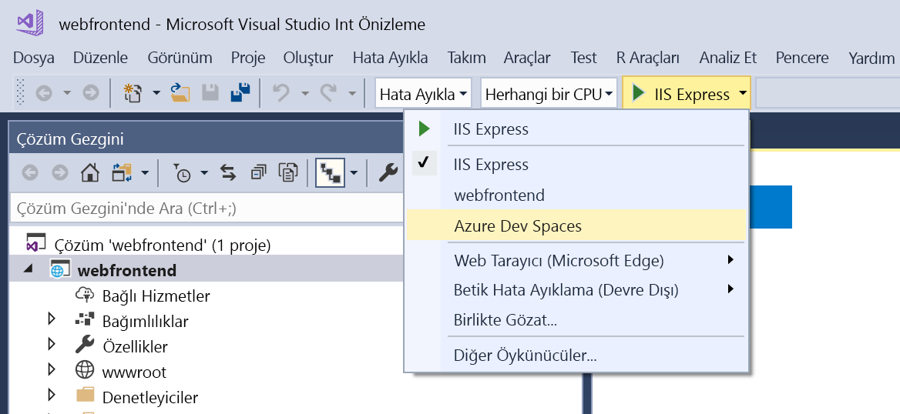
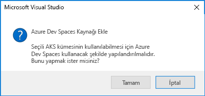

# <a name="quickstart-develop-with-net-core-on-kubernetes-with-azure-dev-spaces-visual-studio"></a>Hızlı Başlangıç: Azure geliştirme alanları (Visual Studio) ile Kubernetes üzerinde .NET Core ile geliştirin

Bu kılavuzda şunların nasıl yapıldığını öğreneceksiniz:

- Azure’da yönetilen bir Kubernetes ile Azure Dev Spaces’ı ayarlayın.
- Visual Studio kullanarak kapsayıcılarda yinelemeli kod geliştirin.
- Visual Studio kullanarak kümenizde çalışan kodda hata ayıklama.

## <a name="prerequisites"></a>Önkoşullar

- Azure aboneliği. Hesabınız yoksa [ücretsiz bir hesap](https://azure.microsoft.com/free) oluşturabilirsiniz.
- Azure geliştirme iş yükü yüklenmiş olan Windows üzerinde Visual Studio 2019. Visual Studio 2017 Windows üzerinde Web geliştirme iş yüküyle kullanabilirsiniz ve [Kubernetes için Visual Studio Araçları](https://aka.ms/get-vsk8stools) yüklü. Visual Studio yüklü yoksa indirdiği [burada](https://aka.ms/vsdownload?utm_source=mscom&utm_campaign=msdocs).

## <a name="create-an-azure-kubernetes-service-cluster"></a>Azure Kubernetes Service kümesi oluşturma

Bir AKS kümesinde oluşturmalısınız bir [bölge desteklenen][supported-regions]. Bir küme oluşturmak için:

1. [Azure portalda](https://portal.azure.com) oturum açma
1. Seçin *+ kaynak Oluştur > Kubernetes hizmeti*. 
1. Girin _abonelik_, _kaynak grubu_, _Kubernetes küme adı_, _bölge_, _Kubernetessürümü_, ve _DNS adı ön eki_.

    

1. *Gözden geçir ve oluştur*’a tıklayın.
1. *Oluştur*’a tıklayın.

## <a name="enable-azure-dev-spaces-on-your-aks-cluster"></a>Azure geliştirme alanları AKS kümenizde etkinleştirme

Azure portalında AKS kümenizin gelin ve tıklayın *geliştirme alanları*. Değişiklik *etkinleştirme geliştirme alanları* için *Evet* tıklatıp *Kaydet*.


## <a name="create-a-new-aspnet-web-app"></a>Yeni bir ASP.NET web uygulaması oluşturma

1. Visual Studio'yu açın.
1. Yeni bir proje oluşturma.
1. Seçin *ASP.NET Core Web uygulaması* ve projenizi adlandırın *webfrontend*.
1. *Tamam* düğmesine tıklayın.
1. İstendiğinde, *Web uygulaması (Model-View-Controller)* şablonu için.
1. Seçin *.NET Core* ve *ASP.NET Core 2.0* en üstünde.
1. *Tamam*'ı tıklatın.

## <a name="connect-your-project-to-your-dev-space"></a>Geliştirme alanınıza projenizi bağlama

Projenizde, seçin **Azure geliştirme alanları** aşağıda gösterildiği gibi başlatma ayarları açılır listeden.



Azure geliştirme alanları iletişim kutusunda seçin, *abonelik* ve *Azure Kubernetes kümesi*. Bırakın *alanı* kümesine *varsayılan* ve etkinleştirme *genel olarak erişilebilir* onay kutusu. *Tamam*'ı tıklatın.


Bu işlem, hizmetinize dağıtır *varsayılan* genel olarak erişilebilir bir URL ile geliştirme alanı. Azure Dev Spaces ile çalışacak şekilde yapılandırılmamış bir küme seçerseniz, yapılandırmak isteyip istemediğinizi soran bir ileti görürsünüz. *Tamam*'ı tıklatın.



Çalışan hizmetin genel URL *varsayılan* geliştirme alanı görüntülenir *çıkış* penceresi:

```cmd
Starting warmup for project 'webfrontend'.
Waiting for namespace to be provisioned.
Using dev space 'default' with target 'MyAKS'
...
Successfully built 1234567890ab
Successfully tagged webfrontend:devspaces-11122233344455566
Built container image in 39s
Waiting for container...
36s

Service 'webfrontend' port 'http' is available at http://webfrontend.1234567890abcdef1234.eus.azds.io/
Service 'webfrontend' port 80 (http) is available at http://localhost:62266
Completed warmup for project 'webfrontend' in 125 seconds.
```

Yukarıdaki örnekte, genel URL'dir http://webfrontend.1234567890abcdef1234.eus.azds.io/. Hizmetinizin genel URL'ye gidin ve geliştirme alanınız hizmetiyle etkileşim kurabilirsiniz.

Bu işlem genel erişim hizmetiniz devre dışı bırakmış olabilir. Genel erişimi etkinleştirmek için güncelleştirebilirsiniz [giriş değeri *values.yaml*][ingress-update].

## <a name="update-code"></a>Kodu güncelleştirme

Visual Studio hala geliştirme alanınıza bağlıysa, Durdur düğmesini tıklatın. Satır 20 değiştirme `Controllers/HomeController.cs` için:
    
```csharp
ViewData["Message"] = "Your application description page in Azure.";
```

Yaptığınız değişiklikleri kaydedin ve hizmeti kullanmaya başlayın **Azure geliştirme alanları** başlatma ayarları açılır listeden. Hizmetinizin genel URL açın, bir tarayıcı ve tıklatın *hakkında*. Güncelleştirilmiş ileti göründüğünü gözlemleyin.

Yeniden oluşturma ve kod düzenleme yapılan her zaman, yeni bir kapsayıcı görüntüsü Azure geliştirme alanları artımlı olarak dağıtarak yerine daha hızlı bir düzenleme/hata ayıklama döngüsü sağlamak için mevcut kapsayıcı içindeki kodu yeniden derler.

## <a name="setting-and-using-breakpoints-for-debugging"></a>Ayarlama ve hata ayıklama için kesme noktaları kullanma

Visual Studio hala geliştirme alanınıza bağlıysa, Durdur düğmesini tıklatın. Açık `Controllers/HomeController.cs` yere imlecinizi buraya koymanız ila 20 satıra tıklayın. Bir kesme noktası ayarlamak için isabet *F9* veya *hata ayıklama* ardından *iki durumlu kesme noktası*. Hata ayıklama modunda geliştirme alanınızı hizmetinizi başlatmak için isabet *F5* veya *hata ayıklama* ardından *hata ayıklamayı Başlat*.

Hizmetinizi bir tarayıcıda açın ve herhangi bir ileti görüntülenir dikkat edin. Visual Studio'ya geri dönün ve 20 satırı vurgulanır gözlemleyin. Kesme satırı 20 hizmeti duraklatıldı. Hizmeti sürdürmek için isabet *F5* veya *hata ayıklama* ardından *devam*. Tarayıcınıza dönün ve ileti görüntülenecektir dikkat edin.

Bir hata ayıklayıcısı ekli Kubernetes'te hizmetinizi çalışırken, çağrı yığını, yerel değişkenleri ve özel durum bilgileri gibi bilgileri hata ayıklamak için tam erişime sahip olursunuz.

Kesme noktası 20 satırında imleci yerleştirerek kaldırmak `Controllers/HomeController.cs` ve ulaşmaktan *F9*.

## <a name="clean-up-your-azure-resources"></a>Azure kaynaklarınızı temizleme

Azure portalında kaynak grubunuzun gelin ve tıklayın *kaynak grubunu Sil*. Alternatif olarak, [az aks Sil](/cli/azure/aks#az-aks-delete) komutu:

```cmd
az group delete --name MyResourceGroup --yes --no-wait
```

## <a name="next-steps"></a>Sonraki adımlar

> [!div class="nextstepaction"]
> [Birden çok kapsayıcı ve takım geliştirme ile çalışma](multi-service-netcore-visualstudio.md)

[ingress-update]: how-dev-spaces-works.md#how-running-your-code-is-configured
[supported-regions]: about.md#supported-regions-and-configurations
