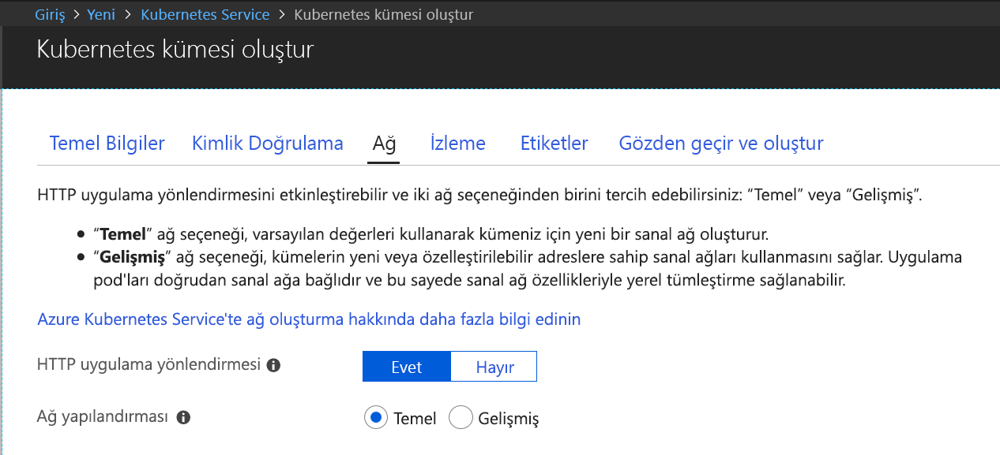

# <a name="quickstart-create-a-kubernetes-dev-space-with-azure-dev-spaces-net-core-and-vs-code"></a>Hızlı Başlangıç: Azure Dev Spaces ile bir Kubernetes geliştirme alanı oluşturma (.NET Core ve VS Code)

Bu kılavuzda şunların nasıl yapıldığını öğreneceksiniz:

- Azure’da yönetilen bir Kubernetes ile Azure Dev Spaces’ı ayarlayın.
- VS Code'u ve komut satırını kullanarak kapsayıcılarda yinelemeli kod geliştirin.
- VS Code’dan geliştirme alanınızdaki kodun hatalarını ayıklama

> [!Note]
> Herhangi bir zamanda **kilitlenirseniz** [Sorun giderme](troubleshooting.md) bölümüne başvurun veya bu sayfada bir yorum paylaşın. Daha ayrıntılı bir [öğreticiyi](get-started-netcore.md) de deneyebilirsiniz.

## <a name="prerequisites"></a>Ön koşullar

- Azure aboneliği. Hesabınız yoksa [ücretsiz bir hesap](https://azure.microsoft.com/free) oluşturabilirsiniz.
- EastUS, CentralUS, WestUS2, WestEurope, CanadaCentral veya CanadaEast bölgesinde Kubernetes 1.10.3'ü çalıştıran, **Http Application Routing** etkinleştirilmiş bir [Kubernetes kümesi](https://ms.portal.azure.com/#create/microsoft.aks).

  

- [Visual Studio Code](https://code.visualstudio.com/download).

## <a name="set-up-azure-dev-spaces"></a>Azure Dev Spaces'i ayarlama

Azure CLI ve Azure Dev Spaces uzantısı Windows, Mac veya Linux makinelere yüklenip çalıştırılabilir. Linux için şu dağıtımlar desteklenir: Ubuntu (18.04, 16.04 ve 14.04), Debian 8 ve 9, RHEL 7, Fedora 26+, CentOS 7, openSUSE 42.2 ve SLES 12.

Azure Dev Spaces kurulumu için aşağıdaki adımları izleyin:

1. [Azure CLI](/cli/azure/install-azure-cli?view=azure-cli-latest)'yi (sürüm 2.0.38 veya üzeri) yükleyin.
1. AKS kümenizde Dev Spaces'i ayarlayın: `az aks use-dev-spaces -g MyResourceGroup -n MyAKS`
1. VS Code için [Azure Dev Spaces uzantısını](https://marketplace.visualstudio.com/items?itemName=azuredevspaces.azds) indirin. Uzantının Market sayfasında ve yeniden VS Code’da Yükle’ye bir kez tıklayın.

## <a name="build-and-run-code-in-kubernetes"></a>Kubernetes'de kodu oluşturma ve çalıştırma

1. GitHub'dan örnek kodu indirin: [https://github.com/Azure/dev-spaces](https://github.com/Azure/dev-spaces) 
1. Dizini webfrontend klasörüne geçirin: `cd dev-spaces/samples/dotnetcore/getting-started/webfrontend`
1. Docker ve Helm grafik varlıkları oluşturun: `azds prep --public`
1. AKS’de kodunuzu derleyin ve çalıştırın. Terminal penceresinde, **webfrontend klasöründen** şu komutu çalıştırın: `azds up`
1. `up` komutu tarafından oluşturulan URL hakkındaki bilgiler için konsol çıkışını tarayın. Şu biçimde olacaktır: 

   `Service 'webfrontend' port 'http' is available at <url>` 

   Tarayıcı penceresinde bu URL'yi açın; web uygulaması yükünü görmelisiniz. 
   
   > [!Note]
   > İlk çalıştırmada genel DNS hizmetinin hazır duruma gelmesi birkaç dakika sürebilir. Genel URL çözümlenmezse konsol çıktısında görüntülenen alternatif http://localhost:<portnumber> URL'sini kullanabilirsiniz. Localhost URL'sini kullanırsanız kapsayıcı yerel olarak çalışıyor gibi görünebilir, ancak gerçekte AKS'de çalışıyordur. Size rahatlık sağlamak ve yerel makinenizden hizmetle etkileşimi kolaylaştırmak için, Azure Dev Spaces Azure'da çalıştırılan kapsayıcıya geçici bir SSH tüneli oluşturur. DNS kaydı hazır olduğunda geri gelip genel URL'yi deneyebilirsiniz.

### <a name="update-a-content-file"></a>İçerik dosyası güncelleştirme

1. `./Views/Home/Index.cshtml` gibi bir dosyayı bulun ve HTML dosyasında bir düzenleme yapın. Örneğin, `<h2>Application uses</h2>` olan 70. satırı `<h2>Hello k8s in Azure!</h2>` benzeri bir değerle değiştirin.
1. Dosyayı kaydedin. Birkaç dakika sonra, Terminal penceresinde çalışan kapsayıcı içindeki bir dosyanın güncelleştirildiğini söyleyen bir ileti göreceksiniz.
1. Tarayıcınıza gidip sayfayı yenileyin. Web sayfasında güncelleştirilmiş HTML’in gösterildiğini görürsünüz.

Ne oldu? HTML ve CSS gibi içerik dosyalarında düzenleme yapılması için bir .NET Core web uygulamasında yeniden derleme yapılması gerekmez; bu nedenle, etkin bir `azds up` komutu değiştirilmiş içerik dosyalarını Azure’daki çalışan kapsayıcı ile otomatik olarak eşitler ve böylece içerik düzenlemelerinizi hemen görebilirsiniz.

### <a name="update-a-code-file"></a>Kod dosyasını güncelleştirme
.NET Core uygulamasının güncelleştirilmiş uygulama ikili dosyalarını yeniden derleyip oluşturması gerektiğinden, kod dosyalarının güncelleştirilmesi biraz daha fazla iş gerektirir.

1. Terminal penceresinde `Ctrl+C` düğmesine basın (`azds up` hizmetini durdurmak için).
1. `Controllers/HomeController.cs` adlı kod dosyasını açın ve Hakkında sayfasında gösterilen iletiyi düzenleyin: `ViewData["Message"] = "Your application description page.";`
1. Dosyayı kaydedin.
1. Terminal penceresinde `azds up` komutunu çalıştırın. 

Bu komut, kapsayıcı görüntüsünü yeniden derler ve Helm grafiğini yeniden dağıtır. Kod değişikliklerinizin çalışan uygulamada etkili olup olmadığını görmek için web uygulamasındaki Hakkında menüsüne gidin.

Bununla birlikte, kod geliştirmek için sonraki bölümde öğreneceğiniz daha da *hızlı bir yöntem* mevcuttur. 

## <a name="debug-a-container-in-kubernetes"></a>Kubernetes’te bir kapsayıcının hatalarını ayıklama

Bu bölümde, Azure’da çalıştırılan kapsayıcınızda doğrudan hata ayıklamak için VS Code kullanacaksınız. Ayrıca daha hızlı bir düzenleme-çalıştırma-test döngüsü elde etmeyi öğreneceksiniz.


### <a name="initialize-debug-assets-with-the-vs-code-extension"></a>Hata ayıklama varlıklarını VS Code uzantısıyla başlatma
VS Code’un Azure’da geliştirme alanı ile iletişim kurabilmesi için önce kod projenizi yapılandırmalısınız. Azure Dev Spaces için VS Code uzantısı hata ayıklama yapılandırmasını ayarlamak için yardımcı komutu sağlar. 

**Komut Paleti**'ni açın (**Görünüm | Komut Paleti** menüsünü kullanarak) ve otomatik tamamlama özelliğini kullanarak komutu yazın ve seçin: `Azure Dev Spaces: Prepare configuration files for Azure Dev Spaces`. 

Bu, `.vscode` klasörünün altında Azure Dev Spaces için hata ayıklama yapılandırması ekler.


### <a name="select-the-azds-debug-configuration"></a>AZDS hata ayıklama yapılandırmasını seçme
1. Hata Ayıklama görünümünü açmak için VS Code’un yan tarafındaki **Etkinlik Çubuğu** içinde Hata Ayıklama simgesine tıklayın.
1. Etkin hata ayıklama yapılandırması olarak **.NET Core Başlatma (AZDS)** öğesini seçin.


> [!Note]
> Komut Paletinde herhangi bir Azure Dev Spaces komutu görmüyorsanız, Azure Dev Spaces için VS Code uzantısını yüklediğinizden emin olun. VS Code içinde açtığınız çalışma alanının azds.yaml dosyasını içeren klasör olduğundan emin olun.


### <a name="debug-the-container-in-kubernetes"></a>Kubernetes’te kapsayıcının hatalarını ayıklama
Kubernetes’te kodunuzun hatalarını ayıklamak için **F5**’e basın.

`up` komutunda olduğu gibi kod, geliştirme ortamıyla eşitlenir ve bir kapsayıcı derlenip Kubernetes’e dağıtılır. Elbette bu kez, hata ayıklayıcı uzak kapsayıcıya eklenir.

> [!Tip]
> VS Code durum çubuğunda tıklanabilir bir URL görüntülenir.

Sunucu tarafı kod dosyasında (örneğin `Controllers/HomeController.cs` kaynak dosyasındaki `Index()` işlevi içinde) bir kesme noktası belirleyin. Tarayıcı sayfasının yenilenmesi, kesme noktasına ulaşılmasına neden olur.

Kodun yerel olarak yürütülmesi durumunda olduğu gibi, çağrı yığını, yerel değişkenler, özel durum bilgileri vb. hata ayıklama bilgilerine tam erişiminiz vardır.

### <a name="edit-code-and-refresh"></a>Kod düzenleme ve yenileme
Hata ayıklayıcı etkinken bir kod düzenlemesi yapın. Örneğin, `Controllers/HomeController.cs` içindeki Hakkında sayfasının iletisini değiştirin. 

```csharp
public IActionResult About()
{
    ViewData["Message"] = "My custom message in the About page.";
    return View();
}
```

Dosyayı kaydedin ve **Hata ayıklama eylemleri** bölmesinde **Yenile** düğmesine tıklayın. 


Azure Dev Spaces, her kod düzenlemesi yapıldığında yeni bir kapsayıcı görüntüsünü yeniden derleme ve yeniden dağıtmayı içeren uzun süreli işlem yerine, mevcut kapsayıcı içindeki kodu artımlı bir şekilde yeniden derleyerek daha hızlı bir düzenleme/hata ayıklama döngüsü sağlar.

Tarayıcıda web uygulamasını yenileyin ve Hakkında sayfasına gidin. Özel iletinizin kullanıcı arabiriminde görüntülendiğini görürsünüz.

**Artık kod üzerinde hızlıca yineleme ve doğrudan Kubernetes’te hata ayıklamaya yönelik bir yönteminiz var!**

## <a name="next-steps"></a>Sonraki adımlar

Azure Dev Spaces uygulamasının birden fazla kapsayıcı arasında daha karmaşık uygulamalar geliştirmenize nasıl yardımcı olduğunu ve farklı alanlarda kodunuzun farklı sürümleri veya dallarıyla çalışarak işbirliğine dayalı geliştirme deneyimini nasıl kolaylaştırabildiğinizi öğrenin. 

> [!div class="nextstepaction"]
> [Birden çok kapsayıcı ve takım geliştirme ile çalışma](team-development-netcore.md)
