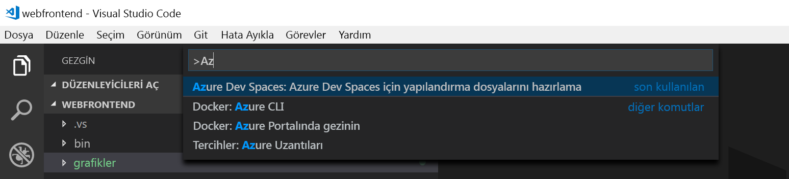
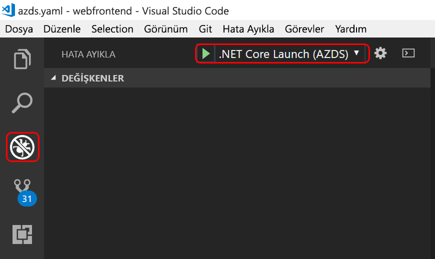

# <a name="quickstart-develop-with-net-core-on-kubernetes-using-azure-dev-spaces-visual-studio-code"></a>Hızlı Başlangıç: Azure geliştirme (Visual Studio Code) boşluklarla Kubernetes üzerinde .NET Core ile geliştirme

Bu kılavuzda şunların nasıl yapıldığını öğreneceksiniz:

- Azure’da yönetilen bir Kubernetes ile Azure Dev Spaces’ı ayarlayın.
- Yinelemeli olarak Visual Studio Code ve komut satırını kullanarak kapsayıcılardaki kod geliştirin.
- Visual Studio Code geliştirme alanınızdan kodunda hata ayıklayın.

## <a name="prerequisites"></a>Önkoşullar

- Azure aboneliği. Hesabınız yoksa [ücretsiz bir hesap](https://azure.microsoft.com/free) oluşturabilirsiniz.
- [Visual Studio Code'u](https://code.visualstudio.com/download).
- [Azure geliştirme alanları](https://marketplace.visualstudio.com/items?itemName=azuredevspaces.azds) ve [ C# ](https://marketplace.visualstudio.com/items?itemName=ms-vscode.csharp) Visual Studio Code için Uzantılar.
- [Yüklü Azure CLI](/cli/azure/install-azure-cli?view=azure-cli-latest).

## <a name="create-an-azure-kubernetes-service-cluster"></a>Azure Kubernetes Service kümesi oluşturma

Bir AKS kümesinde oluşturmak gereken bir [bölge desteklenen](https://docs.microsoft.com/azure/dev-spaces/#a-rapid,-iterative-kubernetes-development-experience-for-teams). Aşağıdaki komutları adlı bir kaynak grubu oluşturacaksınız *MyResourceGroup* ve adlı bir AKS kümesi *MyAKS*.

```cmd
az group create --name MyResourceGroup --location eastus
az aks create -g MyResourceGroup -n MyAKS --location eastus --node-count 1 --generate-ssh-keys
```

## <a name="enable-azure-dev-spaces-on-your-aks-cluster"></a>Azure geliştirme alanları AKS kümenizde etkinleştirme

Kullanım `use-dev-spaces` komutunu kullanarak AKS kümenizde geliştirme alanları etkinleştirme ve yönergeleri izleyin. Geliştirme alanları aşağıdaki komutu etkinleştirir *MyAKS* içinde küme *MyResourceGroup* grup ve oluşturan bir *varsayılan* geliştirme alanı.

```cmd
$ az aks use-dev-spaces -g MyResourceGroup -n MyAKS

'An Azure Dev Spaces Controller' will be created that targets resource 'MyAKS' in resource group 'MyResourceGroup'. Continue? (y/N): y

Creating and selecting Azure Dev Spaces Controller 'MyAKS' in resource group 'MyResourceGroup' that targets resource 'MyAKS' in resource group 'MyResourceGroup'...2m 24s

Select a dev space or Kubernetes namespace to use as a dev space.
 [1] default
Type a number or a new name: 1

Kubernetes namespace 'default' will be configured as a dev space. This will enable Azure Dev Spaces instrumentation for new workloads in the namespace. Continue? (Y/n): Y

Configuring and selecting dev space 'default'...3s

Managed Kubernetes cluster 'MyAKS' in resource group 'MyResourceGroup' is ready for development in dev space 'default'. Type `azds prep` to prepare a source directory for use with Azure Dev Spaces and `azds up` to run.
```

## <a name="get-sample-application-code"></a>Örnek uygulama kodunu alma

Bu makalede, kullandığınız [Azure geliştirme alanları örnek uygulama](https://github.com/Azure/dev-spaces) Azure geliştirme alanları göstermek için.

Github'dan uygulama kopyalamak ve gidin *geliştirme-alanları/samples/dotnetcore/alma-çalışmaya/webfrontend* dizini:

```cmd
git clone https://github.com/Azure/dev-spaces
cd dev-spaces/samples/dotnetcore/getting-started/webfrontend
```

## <a name="prepare-the-application"></a>Uygulama hazırlama

Kubernetes kullanarak uygulamayı çalıştırmak için Docker ve Helm grafiği varlıkları oluşturmak `azds prep` komutu:

```cmd
azds prep --public
```

Çalıştırmalısınız `prep` komutunu *geliştirme-alanları/samples/dotnetcore/alma-çalışmaya/webfrontend* doğru Docker ve Helm grafiği varlıkları oluşturmak için dizin.

## <a name="build-and-run-code-in-kubernetes"></a>Kubernetes'de kodu oluşturma ve çalıştırma

Derleme ve AKS kullanarak kodunuzu çalıştırmak `azds up` komutu:

```cmd
$ azds up
Synchronizing files...4s
Using dev space 'default' with target 'MyAKS'
Installing Helm chart...2s
Waiting for container image build...1m 43s
Building container image...
Step 1/12 : FROM microsoft/dotnet:2.2-sdk
Step 2/12 : ARG BUILD_CONFIGURATION=Debug
Step 3/12 : ENV ASPNETCORE_ENVIRONMENT=Development
Step 4/12 : ENV DOTNET_USE_POLLING_FILE_WATCHER=true
Step 5/12 : EXPOSE 80
Step 6/12 : WORKDIR /src
Step 7/12 : COPY ["webfrontend.csproj", "./"]
Step 8/12 : RUN dotnet restore "webfrontend.csproj"
Step 9/12 : COPY . .
Step 10/12 : RUN dotnet build --no-restore -c $BUILD_CONFIGURATION
Step 11/12 : RUN echo "exec dotnet run --no-build --no-launch-profile -c $BUILD_CONFIGURATION -- \"\$@\"" > /entrypoint.sh
Step 12/12 : ENTRYPOINT ["/bin/bash", "/entrypoint.sh"]
Built container image in 3m 44s
Waiting for container...13s
Service 'webfrontend' port 'http' is available at http://webfrontend.1234567890abcdef1234.eus.azds.io/
Service 'webfrontend' port 80 (http) is available at http://localhost:54256
...
```

Çıktıda gösterilen ortak URL'yi açarak çalışan hizmeti gördüğünüz `azds up` komutu. Bu örnekte genel URL: *http://webfrontend.1234567890abcdef1234.eus.azds.io/*.

Durdurursanız `azds up` komutunu kullanarak *Ctrl + c*, hizmet, AKS içinde çalışmaya devam eder ve genel URL sunulmaya devam edecektir.

## <a name="update-code"></a>Kodu güncelleştirme

Hizmetinizi güncelleştirilmiş bir sürümünü dağıtmak için projenizdeki herhangi bir dosyayı güncelleştirmek ve yeniden `azds up` komutu. Örneğin:

1. Varsa `azds up` hala, çalışıyor basın *Ctrl + c*.
1. Güncelleştirme [20 satır `Controllers/HomeController.cs` ](https://github.com/Azure/dev-spaces/blob/master/samples/dotnetcore/getting-started/webfrontend/Controllers/HomeController.cs#L20) için:
    
    ```csharp
    ViewData["Message"] = "Your application description page in Azure.";
    ```

1. Yaptığınız değişiklikleri kaydedin.
1. Yeniden çalıştırılan `azds up` komutu:

    ```cmd
    $ azds up
    Using dev space 'default' with target 'MyAKS'
    Synchronizing files...1s
    Installing Helm chart...3s
    Waiting for container image build...
    ...    
    ```

1. ' A tıklayın ve çalışan hizmet gidin *hakkında*.
1. Yaptığınız değişiklikleri gözlemleyin.
1. Tuşuna *Ctrl + c* durdurmak için `azds up` komutu.

## <a name="enable-visual-studio-code-to-debug-in-kubernetes"></a>Kubernetes'te hata ayıklamak Visual Studio Code etkinleştir

Visual Studio Code'u açın, *dosya* ardından *Aç...* , gitmek *geliştirme-alanları/samples/dotnetcore/alma-çalışmaya/webfrontend* dizin seçeneğine tıklayıp *açık*.

Artık *webfrontend* proje Visual Studio kullanarak çalıştırdığınız aynı hizmet olan Code'da açık `azds up` komutu. Bu hizmeti kullanmak yerine Visual Studio Code kullanarak AKS hata ayıklamak için `azds up` doğrudan geliştirme alanınızı ile iletişim kurmak için Visual Studio Code'u kullanmak için bu projeyi hazırlamanız gerekir.

Komut paletini Visual Studio Code'da açmak için *görünümü* ardından *komut paleti*. Yazmaya başlayın `Azure Dev Spaces` tıklayın `Azure Dev Spaces: Prepare configuration files for Azure Dev Spaces`.



Bu komut, Azure geliştirme alanlarında doğrudan Visual Studio Code'dan çalıştırmak üzere projenizi hazırlar. Ayrıca oluşturur bir *.vscode* projenizin kökünde yapılandırmasını hata ayıklama dizin.

## <a name="build-and-run-code-in-kubernetes-from-visual-studio"></a>Derleme ve kod Kubernetes'te Visual Studio'dan çalıştırma

Tıklayarak *hata ayıklama* simgesine tıklayın ve sol *.NET Core başlatın (AZDS)* en üstünde.



Bu komut, yapılar ve hizmetinizi Azure geliştirme alanlarında hata ayıklama modunda çalıştırır. *Terminal* penceresinin altındaki hizmetiniz için Azure geliştirme alanları çalıştıran yapı çıkışını ve URL'leri gösterir. *Hata ayıklama konsolunu* günlük çıktısını gösterir.

> [!Note]
> Tüm Azure geliştirme alanları komutlarında görmüyorsanız, *komut paleti*, yüklediğinizden emin olun [Azure geliştirme alanları için Visual Studio Code uzantısı](https://marketplace.visualstudio.com/items?itemName=azuredevspaces.azds). Ayrıca, açtığınız doğrulayın *geliştirme-alanları/samples/dotnetcore/alma-çalışmaya/webfrontend* Visual Studio code'da dizin.

## <a name="setting-and-using-breakpoints-for-debugging"></a>Ayarlama ve hata ayıklama için kesme noktaları kullanma

Hata ayıklama modunu kullanarak hizmetinizi başlatın *.NET Core başlatın (AZDS)*.

Geri gidin *Gezgini* tıklayarak görünümü *görünümü* ardından *Gezgini*. Açık `Controllers/HomeController.cs` yere imlecinizi buraya koymanız ila 20 satıra tıklayın. Bir kesme noktası ayarlamak için isabet *F9* veya *hata ayıklama* ardından *iki durumlu kesme noktası*.

Hizmetinizi bir tarayıcıda açın ve herhangi bir ileti görüntülenir dikkat edin. Visual Studio Code için geri dönün ve 20 satırı vurgulanır gözlemleyin. Kesme satırı 20 hizmeti duraklatıldı. Hizmeti sürdürmek için isabet *F5* veya *hata ayıklama* ardından *devam*. Tarayıcınıza dönün ve ileti görüntülenecektir dikkat edin.

Bir hata ayıklayıcısı ekli Kubernetes'te hizmetinizi çalışırken, çağrı yığını, yerel değişkenleri ve özel durum bilgileri gibi bilgileri hata ayıklamak için tam erişime sahip olursunuz.

Kesme noktası 20 satırında imleci yerleştirerek kaldırmak `Controllers/HomeController.cs` ve ulaşmaktan *F9*.

## <a name="update-code-from-visual-studio-code"></a>Visual Studio code'dan kodunu güncelleştirme

Hizmet hata ayıklama modunda çalışırken, 20 satırında güncelleştirme `Controllers/HomeController.cs`. Örneğin:

```csharp
ViewData["Message"] = "Your application description page in Azure while debugging!";
```

Dosyayı kaydedin. Tıklayın *hata ayıklama* ardından *yeniden hata ayıklama* veya *hata ayıklama araç çubuğu*, tıklayın *yeniden hata ayıklama* düğmesi.


Hizmetinizi bir tarayıcıda açın ve güncelleştirilmiş iletinizi görüntülenen dikkat edin.

Yeniden oluşturma ve kod düzenleme yapılan her zaman, yeni bir kapsayıcı görüntüsü Azure geliştirme alanları artımlı olarak dağıtarak yerine daha hızlı bir düzenleme/hata ayıklama döngüsü sağlamak için mevcut kapsayıcı içindeki kodu yeniden derler.

## <a name="clean-up-your-azure-resources"></a>Azure kaynaklarınızı temizleme

```cmd
az group delete --name MyResourceGroup --yes --no-wait
```

## <a name="next-steps"></a>Sonraki adımlar

Azure geliştirme alanları, birden çok kapsayıcıya daha karmaşık uygulamalar geliştirmenize nasıl yardımcı olur ve farklı sürümleri ya da farklı alanları kodunuzun dalları birlikte çalışarak işbirliğine dayalı geliştirme nasıl basitleştirebileceğinizi öğrenin. 

> [!div class="nextstepaction"]
> [Birden çok kapsayıcı ve takım geliştirme ile çalışma](multi-service-netcore.md)
