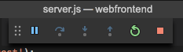

# <a name="quickstart-create-a-kubernetes-dev-space-with-azure-dev-spaces-nodejs"></a>Hızlı Başlangıç: Azure Dev Spaces ile bir Kubernetes geliştirme alanı oluşturma (Node.js)

Bu kılavuzda şunların nasıl yapıldığını öğreneceksiniz:

- Azure’da yönetilen bir Kubernetes ile Azure Dev Spaces’ı ayarlayın.
- VS Code'u ve komut satırını kullanarak kapsayıcılarda yinelemeli kod geliştirin.
- Bu kümede çalıştırılan kodda hata ayıklaması yapın.

> [!Note]
> Herhangi bir zamanda **kilitlenirseniz** [Sorun giderme](troubleshooting.md) bölümüne başvurun veya bu sayfada bir yorum paylaşın. Daha ayrıntılı bir [öğreticiyi](get-started-nodejs.md) de deneyebilirsiniz.

## <a name="prerequisites"></a>Ön koşullar

- Azure aboneliği. Azure aboneliğiniz yoksa [ücretsiz hesap](https://azure.microsoft.com/free) oluşturabilirsiniz.
- [Visual Studio Code](https://code.visualstudio.com/download).
- [Azure CLI](/cli/azure/install-azure-cli?view=azure-cli-latest) sürüm 2.0.43 veya üzeri.
- EastUS, CentralUS, WestUS2, WestEurope, CanadaCentral veya CanadaEast bölgesinde Kubernetes 1.9.6 veya üzerini çalıştıran, **Http Application Routing** etkinleştirilmiş bir Kubernetes kümesi.

    ```cmd
    az group create --name MyResourceGroup --location <region>
    az aks create -g MyResourceGroup -n myAKS --location <region> --kubernetes-version 1.11.2 --enable-addons http_application_routing --generate-ssh-keys
    ```

## <a name="set-up-azure-dev-spaces"></a>Azure Dev Spaces'i ayarlama

Azure CLI ve Azure Dev Spaces uzantısı Windows, Mac veya Linux makinelere yüklenip çalıştırılabilir. Linux için şu dağıtımlar desteklenir: Ubuntu (18.04, 16.04 ve 14.04), Debian 8 ve 9, RHEL 7, Fedora 26+, CentOS 7, openSUSE 42.2 ve SLES 12.

Azure Dev Spaces kurulumu için aşağıdaki adımları izleyin:

1. AKS kümenizde Dev Spaces'i ayarlayın: `az aks use-dev-spaces -g MyResourceGroup -n MyAKS`
1. VS Code için [Azure Dev Spaces uzantısını](https://marketplace.visualstudio.com/items?itemName=azuredevspaces.azds) indirin. Uzantının Market sayfasında ve yeniden VS Code’da Yükle’ye bir kez tıklayın.

## <a name="build-and-run-code-in-kubernetes"></a>Kubernetes'de kodu oluşturma ve çalıştırma

1. GitHub'dan örnek kodu indirin: [https://github.com/Azure/dev-spaces](https://github.com/Azure/dev-spaces) 
1. Dizini webfrontend klasörüne geçirin: `cd dev-spaces/samples/nodejs/getting-started/webfrontend`
1. Docker ve Helm grafik varlıkları oluşturun: `azds prep --public`
1. AKS’de kodunuzu derleyin ve çalıştırın. Terminal penceresinde, **webfrontend klasöründen** şu komutu çalıştırın: `azds up`
1. `up` komutu tarafından oluşturulan URL hakkındaki bilgiler için konsol çıkışını tarayın. Şu biçimde olacaktır: 

   ```output
   (pending registration) Service 'webfrontend' port 'http' will be available at <url>
   Service 'webfrontend' port 80 (TCP) is available at http://localhost:<port>
   ```

   Tarayıcı penceresinde bu URL'yi açın; web uygulaması yükünü görmelisiniz. Kapsayıcı yürütülürken, terminal penceresine `stdout` ve `stderr` çıkışının akışı yapılır.
   
   > [!Note]
   > İlk çalıştırmada genel DNS hizmetinin hazır duruma gelmesi birkaç dakika sürebilir. Genel URL çözümlenmezse konsol çıktısında görüntülenen alternatif http://localhost:<portnumber> URL'sini kullanabilirsiniz. Localhost URL'sini kullanırsanız kapsayıcı yerel olarak çalışıyor gibi görünebilir, ancak gerçekte AKS'de çalışıyordur. Size rahatlık sağlamak ve yerel makinenizden hizmetle etkileşimi kolaylaştırmak için, Azure Dev Spaces Azure'da çalıştırılan kapsayıcıya geçici bir SSH tüneli oluşturur. DNS kaydı hazır olduğunda geri gelip genel URL'yi deneyebilirsiniz.

### <a name="update-a-content-file"></a>İçerik dosyası güncelleştirme
Azure Dev Spaces yalnızca kodu Kubernetes’te çalıştırmaya yönelik değildir; aynı zamanda kod değişikliklerinizin buluttaki bir Kubernetes ortamında uygulandığını hızlıca ve yinelenerek görmenizi sağlar.

1. `./public/index.html` dosyasını bulun ve HTML dosyasında bir düzenleme yapın. Örneğin, sayfanın arka plan rengini mavinin bir tonu ile değiştirin:

    ```html
    <body style="background-color: #95B9C7; margin-left:10px; margin-right:10px;">
    ```

1. Dosyayı kaydedin. Birkaç dakika sonra, Terminal penceresinde çalışan kapsayıcı içindeki bir dosyanın güncelleştirildiğini söyleyen bir ileti göreceksiniz.
1. Tarayıcınıza gidip sayfayı yenileyin. Renk güncelleştirmenizi görürsünüz.

Ne oldu? HTML ve CSS gibi içerik dosyalarında düzenlemeler yapmak için Node.js işleminin yeniden başlatılması gerekmez; bu nedenle etkin bir `azds up` komutu, değiştirilmiş tüm içerik dosyalarını Azure’daki çalışan kapsayıcıya doğrudan otomatik olarak eşitler ve böylece içerik düzenlemelerinizi görmenin hızlı bir yolunu sağlar.

### <a name="test-from-a-mobile-device"></a>Mobil cihazdan test etme
webfrontend genel URL'sini kullanarak web uygulamasını bir mobil cihazdan açın. Uzun adresi el ile girmemek için URL'yi masaüstü bilgisayarınızda kopyalayıp cihazınıza gönderebilirsiniz. Web uygulaması mobil cihazınızda yüklendiğinde, kullanıcı arabiriminin küçük bir cihazda düzgün şekilde gösterilmediğini fark edersiniz.

Bu sorunu gidermek için bir `viewport` meta etiketi ekleyin:
1. `./public/index.html` dosyasını açın
1. Mevcut `head` öğesine bir `viewport` meta etiketi ekleyin:

    ```html
    <head>
        <!-- Add this line -->
        <meta name="viewport" content="width=device-width, initial-scale=1">
    </head>
    ```

1. Dosyayı kaydedin.
1. Cihazınızın tarayıcısını yenileyin. Şimdi web uygulamasının doğru şekilde işlendiğini görürsünüz. 

Bu örnek, bir uygulamayı kullanılması amaçlanan cihazlarda test edinceye kadar bazı sorunların nasıl bulunamadığını gösterir. Azure Dev Spaces sayesinde kodunuzda hızla yineleme yapabilir ve hedef cihazlardaki değişiklikleri doğrulayabilirsiniz.

### <a name="update-a-code-file"></a>Kod dosyasını güncelleştirme
Sunucu tarafı kod dosyalarının güncelleştirilmesi, Node.js uygulamasının yeniden başlatılması gerektiği için biraz daha fazla işlem gerektirir.

1. Terminal penceresinde `Ctrl+C` düğmesine basın (`azds up` hizmetini durdurmak için).
1. `server.js` adlı kod dosyasını açın ve hizmetin karşılama iletisini düzenleyin: 

    ```javascript
    res.send('Hello from webfrontend running in Azure!');
    ```

3. Dosyayı kaydedin.
1. Terminal penceresinde `azds up` komutunu çalıştırın. 

Bu işlem, kapsayıcı görüntüsünü yeniden derler ve Helm grafiğini yeniden dağıtır. Kod değişikliklerinizin uygulandığını görmek için tarayıcı sayfasını yeniden yükleyin.

Bununla birlikte, kod geliştirmek için sonraki bölümde öğreneceğiniz daha da *hızlı bir yöntem* mevcuttur. 

## <a name="debug-a-container-in-kubernetes"></a>Kubernetes’te bir kapsayıcının hatalarını ayıklama

Bu bölümde, Azure'da çalıştırılan kapsayıcımızda doğrudan hata ayıklamak için VS Code kullanacaksınız. Ayrıca daha hızlı bir düzenleme-çalıştırma-test döngüsü elde etmeyi öğreneceksiniz.


### <a name="initialize-debug-assets-with-the-vs-code-extension"></a>Hata ayıklama varlıklarını VS Code uzantısıyla başlatma
VS Code'un Azure Dev Space'imizle iletişim kurabilmesi için önce kod projenizi yapılandırmalısınız. Azure Dev Spaces için VS Code uzantısı hata ayıklama yapılandırmasını ayarlamak için yardımcı komutu sağlar. 

**Komut Paleti**'ni açın (**Görünüm | Komut Paleti** menüsünü kullanarak) ve otomatik tamamlama özelliğini kullanarak komutu yazın ve seçin: `Azure Dev Spaces: Prepare configuration files for Azure Dev Spaces`.

Bu, `.vscode` klasörünün altında Azure Dev Spaces için hata ayıklama yapılandırması ekler. Bu komut, projeyi dağıtım için yapılandıran `azds prep` komutuyla karıştırılmamalıdır.


### <a name="select-the-azds-debug-configuration"></a>AZDS hata ayıklama yapılandırmasını seçme
1. Hata Ayıklama görünümünü açmak için VS Code’un yan tarafındaki **Etkinlik Çubuğu** içinde Hata Ayıklama simgesine tıklayın.
1. Etkin hata ayıklama yapılandırması olarak **Program Başlat (AZDS)** öğesini seçin.


> [!Note]
> Komut Paletinde herhangi bir Azure Dev Spaces komutu görmüyorsanız, Azure Dev Spaces için VS Code uzantısını yüklediğinizden emin olun.

### <a name="debug-the-container-in-kubernetes"></a>Kubernetes’te kapsayıcının hatalarını ayıklama
Kubernetes’te kodunuzun hatalarını ayıklamak için **F5**’e basın!

`up` komutuna benzer şekilde, hata ayıklamaya başladığınızda kod geliştirme alanıyla eşitlenir ve bir kapsayıcı derlenip Kubernetes’e dağıtılır. Bu kez, hata ayıklayıcı uzak kapsayıcıya eklenir.

> [!Tip]
> VS Code durum çubuğunda tıklanabilir bir URL görüntülenir.

Sunucu tarafı kod dosyasında (örneğin `server.js` içindeki `app.get('/api'...` içinde) bir kesme noktası belirleyin. Tarayıcı sayfasını yenilediğinizde veya 'Tekrar Söyleyin' düğmesine bastığınızda kesme noktasına basıp koda girebilirsiniz.

Kodun yerel olarak yürütülmesi durumunda olduğu gibi, çağrı yığını, yerel değişkenler, özel durum bilgileri vb. hata ayıklama bilgilerine tam erişiminiz vardır.

### <a name="edit-code-and-refresh-the-debug-session"></a>Kod düzenleme ve hata ayıklama oturumunu yenileme
Hata ayıklayıcı etkinken bir kod düzenlemesi yapın; örneğin, karşılama iletisini yeniden değiştirin:

```javascript
app.get('/api', function (req, res) {
    res.send('**** Hello from webfrontend running in Azure! ****');
});
```

Dosyayı kaydedin ve **Hata ayıklama eylemleri** bölmesinde **Yenile** düğmesine tıklayın. 



Azure Dev Spaces, her kod düzenlemesi yapıldığında yeni bir kapsayıcı görüntüsünü yeniden derleme ve yeniden dağıtmayı içeren uzun süreli işlem yerine, hata ayıklama oturumları arasında Node.js işlemini yeniden başlatarak daha hızlı bir düzenleme/hata ayıklama döngüsü sağlar.

Tarayıcıda web uygulamasını yenileyin veya *Tekrar Söyleyin* düğmesine basın. Özel iletinizin kullanıcı arabiriminde görüntülendiğini görürsünüz.

### <a name="use-nodemon-to-develop-even-faster"></a>NodeMon ile daha da hızlı geliştirme

Örnek `webfrontend` projesi, Azure Dev Spaces ile tamamen uyumlu bir Node.js dağıtımını hızlandırmaya yönelik olan popüler [nodemon](https://nodemon.io/) aracını kullanacak şekilde yapılandırılmıştır.

Aşağıdaki adımları deneyin:
1. VS Code hata ayıklayıcıyı durdurun.
1. VS Code’un yan tarafındaki **Etkinlik Çubuğu** içinde Hata Ayıklama simgesine tıklayın. 
1. Etkin hata ayıklama yapılandırması olarak **Ekle (AZDS)** öğesini seçin.
1. F5'e basın.

Bu yapılandırmada, kapsayıcı *nodemon* başlatacak şekilde yapılandırılmıştır. Sunucu kodu düzenlemeleri yapıldığında *nodemon*, tıpkı yerel olarak geliştirme sırasında yaptığı gibi Node işlemini otomatik olarak yeniden başlatır. 
1. `server.js` içindeki karşılama iletisini yeniden düzenleyin ve dosyayı kaydedin.
1. Değişikliklerinizin uygulandığını görmek için tarayıcıyı yenileyin veya *Tekrar Söyleyin* düğmesine tıklayın!

**Artık kod üzerinde hızlıca yineleme ve doğrudan Kubernetes’te hata ayıklamaya yönelik bir yönteminiz var!**

## <a name="next-steps"></a>Sonraki adımlar

> [!div class="nextstepaction"]
> [Birden çok kapsayıcı ve takım geliştirme ile çalışma](team-development-nodejs.md)
