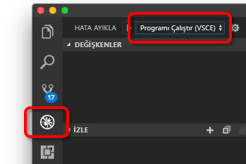

# <a name="quickstart-develop-with-nodejs-on-kubernetes-using-azure-dev-spaces"></a>Hızlı Başlangıç: Azure geliştirme alanları kullanarak Kubernetes üzerinde Node.js ile geliştirme

Bu kılavuzda şunların nasıl yapıldığını öğreneceksiniz:

- Azure’da yönetilen bir Kubernetes ile Azure Dev Spaces’ı ayarlayın.
- Yinelemeli olarak Visual Studio Code ve komut satırını kullanarak kapsayıcılardaki kod geliştirin.
- Visual Studio Code geliştirme alanınızdan kodunda hata ayıklayın.

## <a name="prerequisites"></a>Önkoşullar

- Azure aboneliği. Azure aboneliğiniz yoksa [ücretsiz hesap](https://azure.microsoft.com/free) oluşturabilirsiniz.
- [Visual Studio Code'u](https://code.visualstudio.com/download).
- [Azure geliştirme alanları](https://marketplace.visualstudio.com/items?itemName=azuredevspaces.azds) Visual Studio Code uzantısı.
- [Yüklü Azure CLI](/cli/azure/install-azure-cli?view=azure-cli-latest).

## <a name="create-an-azure-kubernetes-service-cluster"></a>Azure Kubernetes Service kümesi oluşturma

Bir AKS kümesinde oluşturmak gereken bir [bölge desteklenen][supported-regions]. Aşağıdaki komutları adlı bir kaynak grubu oluşturacaksınız *MyResourceGroup* ve adlı bir AKS kümesi *MyAKS*.

```cmd
az group create --name MyResourceGroup --location eastus
az aks create -g MyResourceGroup -n MyAKS --location eastus --node-vm-size Standard_DS2_v2 --node-count 1 --disable-rbac --generate-ssh-keys
```

## <a name="enable-azure-dev-spaces-on-your-aks-cluster"></a>Azure geliştirme alanları AKS kümenizde etkinleştirme

Kullanım `use-dev-spaces` komutunu kullanarak AKS kümenizde geliştirme alanları etkinleştirme ve yönergeleri izleyin. Geliştirme alanları aşağıdaki komutu etkinleştirir *MyAKS* içinde küme *MyResourceGroup* grup ve oluşturan bir *varsayılan* geliştirme alanı.

```cmd
$ az aks use-dev-spaces -g MyResourceGroup -n MyAKS

'An Azure Dev Spaces Controller' will be created that targets resource 'MyAKS' in resource group 'MyResourceGroup'. Continue? (y/N): y

Creating and selecting Azure Dev Spaces Controller 'MyAKS' in resource group 'MyResourceGroup' that targets resource 'MyAKS' in resource group 'MyResourceGroup'...2m 24s

Select a dev space or Kubernetes namespace to use as a dev space.
 [1] default
Type a number or a new name: 1

Kubernetes namespace 'default' will be configured as a dev space. This will enable Azure Dev Spaces instrumentation for new workloads in the namespace. Continue? (Y/n): Y

Configuring and selecting dev space 'default'...3s

Managed Kubernetes cluster 'MyAKS' in resource group 'MyResourceGroup' is ready for development in dev space 'default'. Type `azds prep` to prepare a source directory for use with Azure Dev Spaces and `azds up` to run.
```

## <a name="get-sample-application-code"></a>Örnek uygulama kodunu alma

Bu makalede, kullandığınız [Azure geliştirme alanları örnek uygulama](https://github.com/Azure/dev-spaces) Azure geliştirme alanları göstermek için.

Github'dan uygulama kopyalamak ve gidin *geliştirme-alanları/samples/nodejs/alma-çalışmaya/webfrontend* dizini:

```cmd
git clone https://github.com/Azure/dev-spaces
cd dev-spaces/samples/nodejs/getting-started/webfrontend
```

## <a name="prepare-the-application"></a>Uygulama hazırlama

Kubernetes kullanarak uygulamayı çalıştırmak için Docker ve Helm grafiği varlıkları oluşturmak `azds prep` komutu:

```cmd
azds prep --public
```

Çalıştırmalısınız `prep` komutunu *geliştirme-alanları/samples/nodejs/alma-çalışmaya/webfrontend* doğru Docker ve Helm grafiği varlıkları oluşturmak için dizin.

## <a name="build-and-run-code-in-kubernetes"></a>Kubernetes'de kodu oluşturma ve çalıştırma

Derleme ve AKS kullanarak kodunuzu çalıştırmak `azds up` komutu:

```cmd
$ azds up
Using dev space 'default' with target 'MyAKS'
Synchronizing files...2s
Installing Helm chart...2s
Waiting for container image build...2m 25s
Building container image...
Step 1/8 : FROM node
Step 2/8 : ENV PORT 80
Step 3/8 : EXPOSE 80
Step 4/8 : WORKDIR /app
Step 5/8 : COPY package.json .
Step 6/8 : RUN npm install
Step 7/8 : COPY . .
Step 8/8 : CMD ["npm", "start"]
Built container image in 6m 17s
Waiting for container...13s
Service 'webfrontend' port 'http' is available at http://webfrontend.1234567890abcdef1234.eus.azds.io/
Service 'webfrontend' port 80 (http) is available at http://localhost:54256
...
```

Çıktıda gösterilen ortak URL'yi açarak çalışan hizmeti gördüğünüz `azds up` komutu. Bu örnekte genel URL: *http://webfrontend.1234567890abcdef1234.eus.azds.io/* .

Durdurursanız `azds up` komutunu kullanarak *Ctrl + c*, hizmet, AKS içinde çalışmaya devam eder ve genel URL sunulmaya devam edecektir.

## <a name="update-code"></a>Kodu güncelleştirme

Hizmetinizi güncelleştirilmiş bir sürümünü dağıtmak için projenizdeki herhangi bir dosyayı güncelleştirmek ve yeniden `azds up` komutu. Örneğin:

1. Varsa `azds up` hala, çalışıyor basın *Ctrl + c*.
1. Güncelleştirme [10'da satır `server.js` ](https://github.com/Azure/dev-spaces/blob/master/samples/nodejs/getting-started/webfrontend/server.js#L10) için:
    
    ```javascript
        res.send('Hello from webfrontend in Azure');
    ```

1. Yaptığınız değişiklikleri kaydedin.
1. Yeniden çalıştırılan `azds up` komutu:

    ```cmd
    $ azds up
    Using dev space 'default' with target 'MyAKS'
    Synchronizing files...1s
    Installing Helm chart...3s
    Waiting for container image build...
    ...    
    ```

1. Çalışan hizmetinize gidin ve yaptığınız değişiklikleri gözlemleyin.
1. Tuşuna *Ctrl + c* durdurmak için `azds up` komutu.

## <a name="initialize-code-for-debugging-in-kubernetes-with-visual-studio-code"></a>Kodu Visual Studio Code ile kubernetes hata ayıklama başlatılamıyor

Visual Studio Code'u açın, *dosya* ardından *Aç...* , gitmek *geliştirme-alanları/samples/nodejs/alma-çalışmaya/webfrontend* dizin seçeneğine tıklayıp *açık*.

Artık *webfrontend* proje Visual Studio kullanarak çalıştırdığınız aynı hizmet olan Code'da açık `azds up` komutu. Bu hizmeti kullanmak yerine Visual Studio Code kullanarak AKS hata ayıklamak için `azds up` doğrudan geliştirme alanınızı ile iletişim kurmak için Visual Studio Code'u kullanmak için bu projeyi hazırlamanız gerekir.

Komut paletini Visual Studio Code'da açmak için *görünümü* ardından *komut paleti*. Yazmaya başlayın `Azure Dev Spaces` tıklayın `Azure Dev Spaces: Prepare configuration files for Azure Dev Spaces`.


Bu komut, Azure geliştirme alanlarında doğrudan Visual Studio Code'dan çalıştırmak üzere projenizi hazırlar. Ayrıca oluşturur bir *.vscode* projenizin kökünde yapılandırmasını hata ayıklama dizin.

## <a name="build-and-run-code-in-kubernetes-from-visual-studio-code"></a>Derleme ve kod, Visual Studio Code'dan Kubernetes'te çalıştırma

Tıklayarak *hata ayıklama* simgesine tıklayın ve sol *başlatma sunucu (AZDS)* en üstünde.



Bu komut, yapılar ve hizmetinizi Azure geliştirme alanlarında hata ayıklama modunda çalıştırır. *Terminal* penceresinin altındaki hizmetiniz için Azure geliştirme alanları çalıştıran yapı çıkışını ve URL'leri gösterir. *Hata ayıklama konsolunu* günlük çıktısını gösterir.

> [!Note]
> Tüm Azure geliştirme alanları komutlarında görmüyorsanız, *komut paleti*, yüklediğinizden emin olun [Azure geliştirme alanları için Visual Studio Code uzantısı](https://marketplace.visualstudio.com/items?itemName=azuredevspaces.azds). Ayrıca, açtığınız doğrulayın *geliştirme-alanları/samples/nodejs/alma-çalışmaya/webfrontend* Visual Studio code'da dizin.

Tıklayın *hata ayıklama* ardından *hata ayıklamayı Durdur* hata ayıklayıcıyı durdurmak için.

## <a name="setting-and-using-breakpoints-for-debugging"></a>Ayarlama ve hata ayıklama için kesme noktaları kullanma

Hizmeti kullanmaya başlayın *başlatma sunucu (AZDS)* .

Geri gidin *Gezgini* tıklayarak görünümü *görünümü* ardından *Gezgini*. Açık `server.js` ve imlecinizi buraya koymanız için 10. satırda bir yere tıklayın. Bir kesme noktası ayarlamak için isabet *F9* veya *hata ayıklama* ardından *iki durumlu kesme noktası*.

Hizmetinizi bir tarayıcıda açın ve herhangi bir ileti görüntülenir dikkat edin. Visual Studio Code için geri dönün ve 10. satır vurgulanır gözlemleyin. Ayarladığınız kesme noktası 10. satır hizmeti duraklatıldı. Hizmeti sürdürmek için isabet *F5* veya *hata ayıklama* ardından *devam*. Tarayıcınıza dönün ve ileti görüntülenecektir dikkat edin.

Bir hata ayıklayıcısı ekli Kubernetes'te hizmetinizi çalışırken, çağrı yığını, yerel değişkenleri ve özel durum bilgileri gibi bilgileri hata ayıklamak için tam erişime sahip olursunuz.

Kesme noktası 10 satırında imleci yerleştirerek kaldırma `server.js` ve ulaşmaktan *F9*.

Tıklayın *hata ayıklama* ardından *hata ayıklamayı Durdur* hata ayıklayıcıyı durdurmak için.

## <a name="update-code-from-visual-studio-code"></a>Visual Studio code'dan kodunu güncelleştirme

Hata ayıklama moduna *bir sunucu (AZDS için) eklemek* ve hizmeti başlatın:


Bu komut, oluşturur ve hizmetinizi Azure geliştirme alanlarında çalıştırır. Ayrıca başlatan bir [nodemon](https://nodemon.io) işlem hizmetinizin kapsayıcı ve bunun için VS Code ekler. *Nodemon* işlem, kaynak kodu değişiklikleri yapıldığında, daha hızlı bir şekilde iç döngü geliştirme makinenizde geliştirmeye benzer etkinleştirmek için otomatik yeniden başlatmaları sağlar.

Hizmet başlatıldıktan sonra tarayıcı kullanarak gidin ve kutucukla etkileşim kurabilirsiniz.

Hizmet çalışırken, VS Code ve güncelleştirme 10. satır içinde dönmek `server.js`. Örneğin:
```javascript
    res.send('Hello from webfrontend in Azure while debugging!');
```

Dosyayı kaydedin ve bir tarayıcıda, hizmetinize geri dönün. Hizmetiyle etkileşim kurmak ve güncelleştirilmiş iletinizi görüntülenen dikkat edin.

Çalışırken *nodemon*, herhangi bir kod değişikliği algılandı hemen sonra düğüm işlemi otomatik olarak yeniden başlatılır. Bu otomatik yeniden başlatma işlemi, düzenleme ve hizmetinizi yerel makinenizdeki bir iç döngü geliştirme deneyimi sağlayan, yeniden başlatma deneyimini benzerdir.

## <a name="clean-up-your-azure-resources"></a>Azure kaynaklarınızı temizleme

```cmd
az group delete --name MyResourceGroup --yes --no-wait
```

## <a name="next-steps"></a>Sonraki adımlar

Azure geliştirme alanları, birden çok kapsayıcıya daha karmaşık uygulamalar geliştirmenize nasıl yardımcı olur ve farklı sürümleri ya da farklı alanları kodunuzun dalları birlikte çalışarak işbirliğine dayalı geliştirme nasıl basitleştirebileceğinizi öğrenin.

> [!div class="nextstepaction"]
> [Birden çok kapsayıcı ve takım geliştirme ile çalışma](multi-service-nodejs.md)


[supported-regions]: about.md#supported-regions-and-configurations