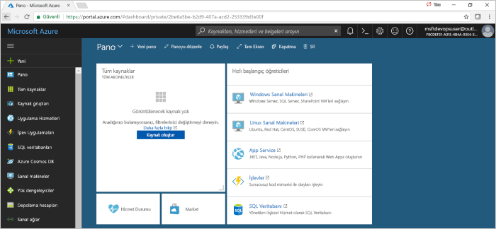
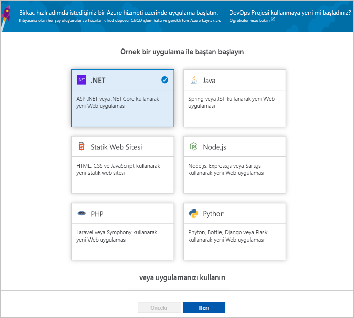
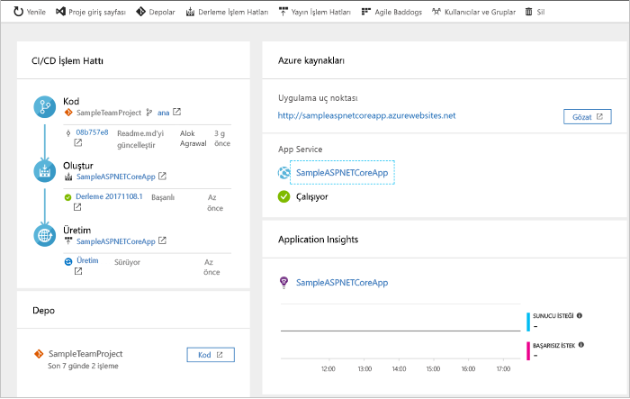
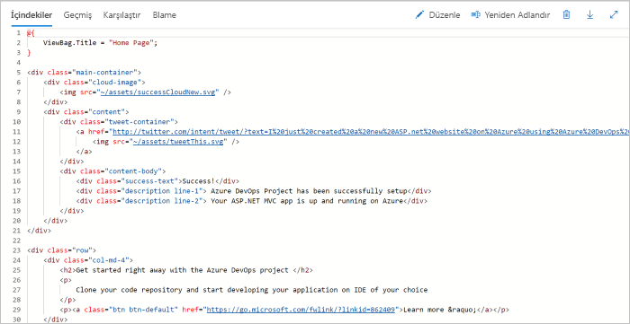
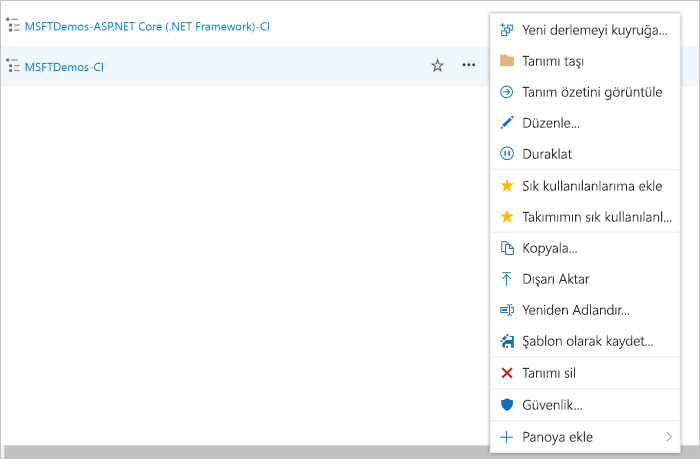

# Azure DevOps projeleri ile .NET için CI/CD işlem hattı oluşturma

DevOps projeleri ile sürekli tümleştirme (CI) ve .NET core veya ASP.NET uygulamanız için sürekli teslim (CD) yapılandırın. DevOps projeleri derleme ve yayın işlem hattı Azure işlem hatları, başlangıç yapılandırmasını basitleştirir.

Azure aboneliğiniz yoksa, [Visual Studio Dev Essentials](https://visualstudio.microsoft.com/dev-essentials/) üzerinden ücretsiz edinebilirsiniz.

## Azure portalında oturum açın

DevOps projeleri, Azure DevOps bir CI/CD işlem hattı oluşturur. Yeni bir Azure DevOps kuruluş oluşturun veya mevcut bir kuruluşa kullanın. DevOps projeleri, Azure kaynaklarını da tercih ettiğiniz bir Azure aboneliği oluşturur.

1. [Microsoft Azure portalında](https://portal.azure.com) oturum açın.

1. Sol bölmede seçin **kaynak Oluştur** sol gezinti çubuğunda ve ardından arama simgesine **DevOps projeleri**.  

3.  **Oluştur**’u seçin.

    

## Örnek uygulama ve Azure hizmeti seçme

1. .NET örnek uygulaması'nı seçin. .NET örnekleri açık kaynaklı ASP.NET çerçevesi ya da çoklu platform .NET Core çerçevesi seçeneklerinden birini içerir.

    

1. .NET Core uygulama çerçevesi seçin.  
    Bu örnek bir ASP.NET Core MVC uygulamasıdır.
    
2. **İleri**’yi seçin.  
    Windows üzerinde Web App varsayılan dağıtım hedefidir.  İsteğe bağlı olarak, Linux üzerinde Web App veya Kapsayıcılar için Web App’i seçebilirsiniz.  Daha önce seçtiğiniz uygulama çerçevesi, burada Azure hizmeti dağıtımı hedef türünü belirler.  
    
3. Varsayılan hizmet bırakın ve ardından **sonraki**.

## Azure DevOps ve Azure aboneliğinin yapılandırın 

1. Yeni bir ücretsiz Azure DevOps kuruluş oluşturun veya mevcut bir kuruluşa seçin.

    a. Projeniz için bir ad seçin. 

    b. Azure aboneliği ve konumu seçin, uygulamanız için bir ad seçin ve ardından **Bitti**.  
    DevOps projeleri Pano, birkaç dakika sonra Azure portalında görüntülenir. Azure DevOps kuruluşunuzdaki bir depodaki örnek bir uygulama kümesi, bir derleme yürütülür ve uygulamanızı Azure'a dağıtılır. Bu pano, kod deposu, CI/CD işlem hattı ve uygulamanızı azure'da görünürlük sağlar.
    

2. Panonun sağ tarafta seçin **Gözat** çalışan uygulamanızı görüntülemek için.

     

## Kod değişikliklerini işleme ve CI/CD’yi yürütme

 DevOps projeleri, Azure depoları veya GitHub Git deposu oluşturuldu. Depo görüntüleyin ve uygulamanıza kod değişikliği yapmanız için aşağıdakileri yapın:

1. DevOps projeleri panosunun sol tarafta, bağlantısını seçin, **ana** dal.  
Bu bağlantı yeni oluşturulan Git deposuna bir görünüm açar.

1. Depo kopya URL'sini görüntülemek için tarayıcının sağ üst kısmından **Kopya**’yı seçin.  
Git deponuzu en sevdiğiniz IDE’de kopyalayabilirsiniz.  Sonraki birkaç adımda, kod değişiklikleri yapıp doğrudan ana dala işlemek için web tarayıcısını kullanabilirsiniz.

1. Tarayıcı sol tarafında, Git **Views/Home/index.cshtml** dosya.

1. Seçin **Düzenle**, ardından H2 bölüm başlığı bir değişiklik yapın. Örneğin **hemen Azure DevOps Projects ile çalışmaya başlama** veya başka bir değişiklik yapın.

    

1. Seçin **işleme**ve ardından değişikliklerinizi kaydedin.

1. Tarayıcınızda Azure DevOps projesi panoya gidin.  Bir derlemenin sürdüğünü görüyor olmanız gerekir. Yaptığınız değişiklikleri otomatik olarak oluşturulur ve bir CI/CD işlem hattı dağıtılır.

## CI/CD işlem hattı inceleyin

Önceki adımda, Azure DevOps projeleri, eksiksiz bir CI/CD işlem hattı otomatik olarak yapılandırılır. İşlem hattını gerektiği şekilde keşfedin ve özelleştirin. Azure DevOps yapıyla hakkında bilgilenmeli ve yayın işlem hatları için aşağıdaki adımları uygulayın.

1. DevOps projeleri panonun üst kısmında seçin **derleme işlem hatlarını**.  
Bu bağlantı, bir tarayıcı sekmesi açar ve Azure DevOps yeni projeniz için işlem hattı oluşturun.

1. Üç nokta (...) seçin.  Bu eylem, yeni bir yapıyı kuyruğa, bir derleme duraklatma ve derleme işlem hattı düzenleme gibi birkaç etkinlik başlayabileceğiniz bir menü açılır.

1. **Düzenle**’yi seçin.

    

1. Bu bölmede, derleme işlem hattı için çeşitli görevleri inceleyebilirsiniz.  
 Derleme bağımlılıklarını geri yükleme ve kullanılan çıkışları yayımlama Git deposu dağıtımları için kullanılan kaynaklardan getirilirken gibi çeşitli görevleri gerçekleştirir.

1. Derleme işlem hattı üstünde derleme işlem hattı adı seçin.

1. Bir şeyler daha açıklayıcı, select, derleme işlem hattı adını değiştirmek **Kaydet ve kuyruğa**ve ardından **Kaydet**.

1. Derleme işlem hattı adınızın altında **Geçmiş**’i seçin.   
İçinde **geçmişi** bölmesinde, bir denetim kaydı yaptığınız son değişiklikler derleme için bkz.  Azure işlem hatları için derleme işlem hattı yapılan değişiklikleri izler ve sürümleri karşılaştırmanızı sağlar.

1. **Tetikleyiciler**’i seçin.  
DevOps projeleri CI tetikleyicisini otomatik olarak oluşturulan ve depoya her işleme, yeni bir yapı başlatır.  İsteğe bağlı olarak dalları CI işlemine dahil etmeyi veya işlemden hariç tutmayı seçebilirsiniz.

1. **Saklama**’yı seçin.  
Senaryonuza bağlı olarak, saklamak veya belirli bir sayıda derlemeleri kaldırmak için ilkeleri belirtebilirsiniz.

1. Seçin **derleme ve yayın**, ardından **yayınlar**.  
DevOps projeleri, azure'da dağıtımlarını yönetmek için bir yayın ardışık düzeni oluşturur.

1.  Solda, yayın işlem hattınızı yanındaki üç nokta (...) seçin ve ardından **Düzenle**.  
Sürüm ardışık yayın işlemini tanımlar. bir işlem hattı içerir.  

1. **Yapıtlar**’ın altında **Bırak**’ı seçin.  Önceki adımlarda incelediğiniz derleme işlem hattı, yapıt için kullanılan çıkışı üretir. 

1. Yanındaki **bırak** simgesini seçme **sürekli dağıtım tetikleyicisi**.  
Bu yayın işlem hattı yok her seferinde yeni bir derleme yapıtının kullanılabilir bir dağıtım çalıştığı etkin bir CD tetikleyicisine sahiptir. İsteğe bağlı olarak, el ile yürütme dağıtımlarınızı gerektirir böylece tetikleyiciyi devre dışı bırakabilirsiniz.  

1. Sol tarafta, seçin **görevleri**.   
Dağıtım işleminizin gerçekleştiren etkinlikler görevlerdir. Bu örnekte, Azure App Service'e dağıtmak için bir görev oluşturulur.

1. Sağ tarafta seçin **yayınları görüntüleyebilir**. Bu görünümde yayın geçmişi gösterilir.

1. Sürümlerinizin birini yanındaki üç nokta (...) seçin ve ardından **açık**.  
Yayın özeti, ilişkili iş öğeleri ve test gibi keşfetmek için birkaç menüleri vardır.

1. **İşlemeler**'i seçin.   
Bu görünümde, belirli bir dağıtım ile ilişkili kod tamamlama gösterilir. 

1. **Günlükler**’i seçin.  
Günlüklerde, dağıtım işlemiyle ilgili yararlı bilgiler bulunur. Bunlar hem dağıtım sırasında hem de sonrasında görüntülenebilir.

## Kaynakları temizleme

Azure App Service ve artık gerekmediğinde, oluşturduğunuz ilgili diğer kaynakları silebilirsiniz. Kullanım **Sil** DevOps projeleri Pano işlevselliği.

## Sonraki adımlar

Derleme ve yayın işlem hattınızı ekibinizin ihtiyaçlarını karşılayacak şekilde değiştirmeyle ilgili daha fazla bilgi edinmek için bu öğreticiye bakın:

> [!div class="nextstepaction"]
> [CD işlemini özelleştirme](https://docs.microsoft.com/azure/devops/pipelines/release/define-multistage-release-process?view=vsts)

## Videolar

> [!VIDEO https://www.youtube.com/embed/itwqMf9aR0w]
