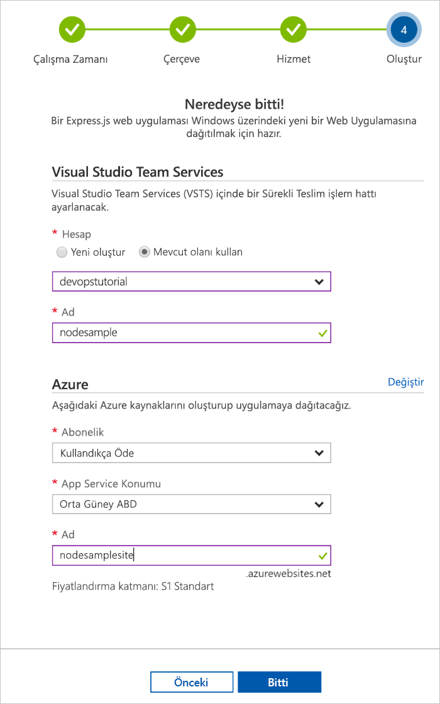
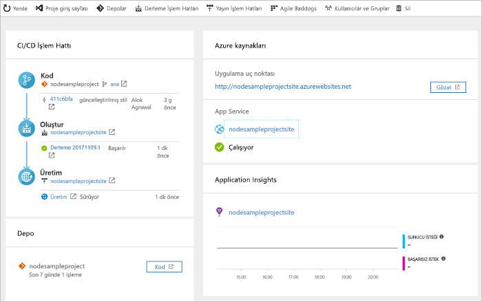

# Azure DevOps Projesi ile Node.js için CI/CD işlem hattı oluşturma

Azure DevOps Projesi, Microsoft’un Azure için DevOps çözümü olan Visual Studio Team Services’te (VSTS) Node.js uygulamanız için Azure kaynakları oluşturan ve sürekli tümleştirme (CI) ve sürekli teslim (CD) işlem hattı ayarlayan basitleştirilmiş bir deneyim sunar.  

Azure aboneliğiniz yoksa, [Visual Studio Dev Essentials](https://visualstudio.microsoft.com/dev-essentials/) üzerinden ücretsiz edinebilirsiniz.

## Azure portalında oturum açın

Azure DevOps Projesi VSTS'de bir CI/CD işlem hattı oluşturur.  Ücret ödemeden **yeni bir VSTS** hesabı oluşturabilir veya **mevcut bir hesabı** kullanabilirsiniz.  DevOps Projesi ayrıca tercih ettiğiniz **Azure aboneliğinde** **Azure kaynakları** oluşturur.

1. [Microsoft Azure portalda](https://portal.azure.com) oturum açın.

1. Sol gezinti çubuğunda **Kaynak oluştur** simgesini seçin ve ardından **DevOps projesini** arayın.  **Oluştur**’u seçin.

    

## Örnek uygulama ve Azure hizmeti seçme

1. **Node.js** örnek uygulamasını seçin.  Node.js örnekleri birkaç uygulama çerçevesi seçeneği içerir.

1. Varsayılan örnek çerçeve **Express.js**’dir. Varsayılan ayarı değiştirmeyin ve **İleri**’yi seçin.  

1. **Windows üzerinde Web App** varsayılan dağıtım hedefidir.  Önceki adımlarda seçtiğiniz uygulama çerçevesi, burada bulabileceğiniz Azure hizmeti dağıtımı hedefi türünü belirler.  Varsayılan hizmeti değiştirmeyin ve ardından **İleri**’yi seçin.
 
## VSTS'yi ve Azure aboneliğini yapılandırma 

1. **Yeni** bir VSTS hesabı oluşturun veya **mevcut** bir hesabı kullanın.  VSTS projeniz için bir **ad** seçin.  **Azure aboneliğinizi**, **konumunuzu** ve uygulamanız için bir **ad** seçin.  İşiniz bittiğinde **Bitti**’yi seçin.

    

1. Birkaç dakika içinde **proje panosu** Azure portalda yüklenir.  VSTS hesabınızdaki bir depoda örnek uygulama ayarlanır, bir derleme yürütülür ve uygulamanız Azure’a dağıtılır.  Bu pano **kod deponuza**, **VSTS CI/CD işlem hattına** ve **Azure’daki uygulamanıza** görünürlük sağlar.  Panonun sağ tarafında çalışan uygulamanızı görüntülemek için **Gözat**’ı seçin.

     
    
Azure DevOps projesi otomatik olarak bir CI derlemesi ve yayın tetikleyicisi yapılandırır.  Artık en son çalışmanızı otomatik olarak web sitenize dağıtan bir CI/CD işlemiyle Node.js uygulaması üzerinde bir ekiple birlikte çalışmaya hazırsınız.

## Kod değişikliklerini işleme ve CI/CD’yi yürütme

Azure DevOps projesi, VSTS veya GitHub hesabınızda bir Git deposu oluşturdu.  Depoyu görüntülemek ve uygulamanızda kod değişiklikleri yapmak için aşağıdaki adımları izleyin.

1. DevOps projesi panosunun sol tarafında **ana** dalınızın bağlantısını seçin.  Bu bağlantı yeni oluşturulan Git deposuna bir görünüm açar.

1. Depo kopya URL'sini görüntülemek için tarayıcının sağ üst kısmından **Kopya**’yı seçin. Git deponuzu en sevdiğiniz IDE’de kopyalayabilirsiniz.  Sonraki birkaç adımda, kod değişiklikleri yapıp doğrudan ana dala işlemek için web tarayıcısını kullanabilirsiniz.

1. Tarayıcının sol tarafında **views/index.pug** dosyasına gidin.

1. **Düzenle**’yi seçin ve h2 başlığında bir değişiklik yapın.  Örneğin, **Azure DevOps Projesi ile hemen kullanmaya başlayın** yazın veya başka bir değişiklik yapın.

1. **İşle**’yi seçin ve ardından değişikliklerinizi kaydedin.

1. Tarayıcınızda **Azure DevOps projesi panosuna** gidin.  Bir derlemenin sürdüğünü görüyor olmanız gerekir.  Yaptığınız değişiklikler otomatik olarak derlenir ve bir VSTS CI/CD işlem hattı üzerinden dağıtılır.

## VSTS CI/CD işlem hattını inceleme

Azure DevOps projesi, VSTS hesabınızda otomatik olarak tam bir VSTS CI/CD işlem hattı yapılandırdı.  İşlem hattını gerektiği şekilde keşfedin ve özelleştirin.  VSTS derlemesi ve yayın tanımları ile kendinizi alıştırmak için aşağıdaki adımları izleyin.

1. Azure DevOps projesi panosunun **üst** kısmından **Derleme İşlem Hatları**’nı seçin.  Bu bağlantı, bir tarayıcı sekmesi açar ve yeni projeniz için VSTS derleme tanımını açar.

1. Fare imlecini **Durum** alanının yanındaki derleme tanımının sağına taşıyın. Görüntülenen **üç noktayı** seçin.  Bu eylem, yeni bir derlemeyi sıraya alma, derleme duraklatma ve derleme tanımını düzenleme gibi birkaç etkinliği başlatabileceğiniz bir menüyü açar.

1. **Düzenle**’yi seçin.

1. Bu görünümden derleme tanımınızın **çeşitli görevlerini inceleyin**.  Derleme, Git deposundan kaynak getirme, bağımlılıkları geri yükleme ve dağıtım için kullanılan çıkışları yayımlama gibi çeşitli görevleri yürütür.

1. Derleme tanımının üst kısmında **derleme tanımı adını** seçin.

1. Derleme tanımınızın **adını** daha açıklayıcı bir şeyle değiştirin.  **Kaydet ve sıraya al**’ı ve ardından **Kaydet**’i seçin.

1. Derleme tanımı adınızın altında **Geçmiş**’i seçin.  Derleme için yaptığınız son değişikliklere ait denetim kaydını görürsünüz.  VSTS, derleme tanımında yapılan değişiklikleri izler ve sürümleri karşılaştırmanızı sağlar.

1. **Tetikleyiciler**’i seçin.  Azure DevOps projesi otomatik olarak bir CI tetikleyicisi oluşturdu. Depoya yönelik her işleme yeni bir derleme başlatır.  İsteğe bağlı olarak dalları CI işlemine dahil etmeyi veya işlemden hariç tutmayı seçebilirsiniz.

1. **Saklama**’yı seçin.  Senaryonuza bağlı olarak, belirli sayıdaki derlemeleri saklayacak veya kaldıracak ilkeleri belirtebilirsiniz.

1. **Derleme ve Yayın**’ı ve ardından **Yayınlar**’ı seçin.  Azure DevOps projesi Azure'a yönelik dağıtımları yönetmek için bir VSTS yayın tanımı oluşturdu.

1. Tarayıcının sol tarafında, yayın tanımınızın yanındaki **üç noktayı** ve ardından **Düzenle**’yi seçin.

1. Yayın tanımı, yayın işlemini tanımlayan bir **işlem hattı** içerir.  **Yapıtlar**’ın altında **Bırak**’ı seçin.  Önceki adımlarda incelediğiniz derleme tanımı, yapıt için kullanılan çıkışı üretir. 

1. **Bırak** simgesinin sağ tarafında **Sürekli dağıtım tetikleyicisi**’ni seçin.  Bu yayın tanımı, yeni bir derleme yapıtı kullanılabilir olduğunda bir dağıtım yürüten CD tetikleyicisini etkinleştirdi.  İsteğe bağlı olarak, dağıtımlarınızın el ile yürütme gerektirmesi için tetikleyiciyi devre dışı bırakabilirsiniz. 

1. Tarayıcının sol tarafında **Görevler**’i seçin.  Görevler, dağıtım işleminizin gerçekleştirdiği etkinliklerdir.  Bu örnekte, **Azure App Service**’e dağıtmak üzere bir görev oluşturuldu.

1. Tarayıcının sağ tarafında **Yayınları görüntüle**’yi seçin.  Bu görünümde yayın geçmişi gösterilir.

1. Yayınlarınızdan birinin yanındaki **üç nokta** simgesini seçin ve sonra da **Aç**'ı seçin.  Bu görünümde keşfedilebilecek yayın özeti, ilişkili iş öğeleri ve testler gibi çeşitli menüler vardır.

1. **İşlemeler**'i seçin.  Bu görünümde, belirli bir dağıtımla ilişkilendirilmiş kod işlemeleri gösterilir. 

1. **Günlükler**’i seçin.  Günlüklerde, dağıtım işlemiyle ilgili yararlı bilgiler bulunur.  Bunlar hem dağıtım sırasında hem de sonrasında görüntülenebilir.

## Kaynakları temizleme

Artık gerekli olmadığında, Azure DevOps projesi panosundaki **Sil** işlevini kullanarak bu hızlı başlangıçta oluşturulmuş olan Azure App Service’i ve ilgili kaynakları silebilirsiniz.

## Sonraki adımlar

Bu hızlı başlangıçta CI/CD işleminizi yapılandırdığınızda, bir derleme ve yayın tanımı VSTS projenizde otomatik olarak oluşturulur. Ekibinizin gereksinimlerine uygun olarak bu derleme ve yayın tanımlarını istediğiniz gibi değiştirebilirsiniz. Daha fazla bilgi edinmek için bu öğreticiye bakın:

> [!div class="nextstepaction"]
> [CD işlemini özelleştirme](https://docs.microsoft.com/vsts/pipelines/release/define-multistage-release-process?view=vsts)

## Videolar

> [!VIDEO https://www.youtube.com/embed/3etwjubReJs]
