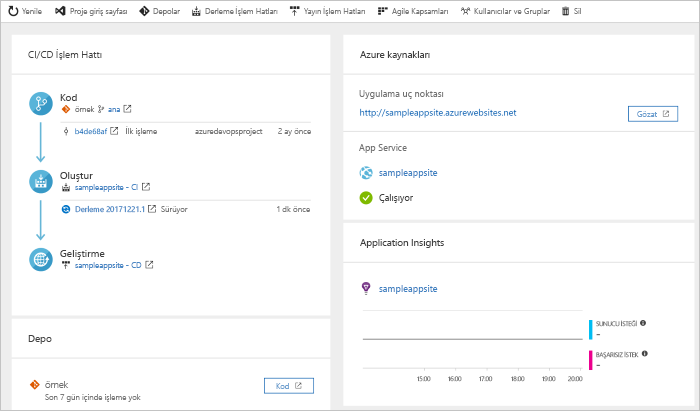

# Azure DevOps projeleri ile Python için CI/CD işlem hattı oluşturma

Azure DevOps projeleri, Azure kaynaklarını oluşturan ve sürekli tümleştirme (CI) ve Python uygulamanız için sürekli teslim (CD) işlem hattı ayarlar basitleştirilmiş bir deneyim sunar.  

Azure aboneliğiniz yoksa, ücretsiz aracılığıyla edinebilirsiniz [Visual Studio Dev Essentials](https://visualstudio.microsoft.com/dev-essentials/).

## Azure portalında oturum açın

 DevOps projeleri, Azure işlem hatlarında bir CI/CD işlem hattı oluşturur.  Ücretsiz ve yeni bir Azure DevOps kuruluş oluşturun veya mevcut bir kuruluşa kullanın. DevOps projeleri, Azure kaynaklarını da tercih ettiğiniz bir Azure aboneliği oluşturur.

1. [Microsoft Azure portalında](https://portal.azure.com) oturum açın.

2. Seçin **kaynak Oluştur** sol bölmesinde ve ardından arama simgesine **DevOps projeleri**.  

3. **Oluştur**’u seçin.

    

## Örnek uygulama ve Azure hizmeti seçme

1. Python örnek uygulaması'nı seçin. Python örnekleri birkaç uygulama çerçevesi seçeneği içerir.

1. Varsayılan örnek Django çerçevedir. Varsayılan ayarı bırakın ve ardından **sonraki**.    
İçin Web App kapsayıcıları varsayılan dağıtım hedefidir. Daha önce seçtiğiniz uygulama çerçevesi, burada Azure hizmeti dağıtımı hedef türünü belirler. 

3. Varsayılan hizmet bırakın ve ardından **sonraki**.
 
## Azure DevOps ve Azure aboneliğinin yapılandırın 

1. Yeni bir Azure DevOps kuruluş oluşturun veya mevcut bir kuruluşa seçin. 

    a. Azure DevOps projeniz için bir ad girin.  

    b. Azure aboneliği ve konumu seçin, uygulamanız için bir ad girin ve ardından **Bitti**.  
     Proje Panosu, birkaç dakika sonra Azure portalında görüntülenir. Azure DevOps kuruluşunuzdaki bir depodaki örnek bir uygulama kümesi, bir derleme yürütülür ve uygulamanızı Azure'a dağıtılır. Bu pano, kod deposu, CI/CD işlem hattınızı ve uygulamanızı azure'da görünürlük sağlar.  
    
2. Seçin **Gözat** çalışan uygulamanızı görüntülemek için.

     
    
   DevOps projeleri otomatik olarak yapılandırır bir CI derleme ve yayın tetikleyicisi. Artık otomatik olarak en son iş sitenize dağıtan bir CI/CD işlem kullanarak bir Python uygulaması bir ekip ile işbirliği yapmaya hazır.

## Kod değişikliklerini işleme ve CI/CD’yi yürütme

 DevOps projeleri, Azure depoları veya GitHub Git deposu oluşturur. Depo görüntüleyin ve uygulamanıza kod değişikliği yapmanız için aşağıdakileri yapın: 

1. DevOps projeleri panosunun sol tarafta, ana dal için bağlantıyı seçin.  
        Bu bağlantı yeni oluşturulan Git deposuna bir görünüm açar.

1. Depo kopya URL'sini görüntülemek için tarayıcının sağ üst kısmından **Kopya**’yı seçin.   
Git deponuzu en sevdiğiniz IDE’de kopyalayabilirsiniz.  Sonraki birkaç adımda, kod değişiklikleri yapıp doğrudan ana dala işlemek için web tarayıcısını kullanabilirsiniz.

1. Sol tarafta, Git **app/templates/app/index.html** dosya.

1. **Düzenle**’yi seçin ve metnin bir kısmında değişiklik yapın. Örneğin, div etiketlerinden biri için metnin bir kısmını değiştirin.

1. Seçin **işleme**ve ardından değişikliklerinizi kaydedin.

1. Tarayıcınızda DevOps projeleri panoya gidin.   
    Devam eden bir yapı görmelisiniz. Yaptığınız değişiklikler otomatik olarak oluşturulur ve bir CI/CD işlem hattı dağıtılır.

## CI/CD işlem hattı inceleyin

DevOps projeleri, önceki adımda, eksiksiz bir CI/CD işlem hattı otomatik olarak yapılandırılır. İşlem hattını gerektiği şekilde keşfedin ve özelleştirin. Derleme ve yayın işlem hatları ile kendinizi alıştırın için aşağıdakileri yapın:

1. DevOps projeleri panonun üst kısmında seçin **derleme işlem hatlarını**.  
Derleme işlem hattı yeni projeniz için bir tarayıcı sekmesi görüntülenir.

1. İşaret **durumu** alan ve ardından **üç nokta** (...).  
        Bir derleme duraklatma ve derleme işlem hattı düzenleme yeni bir derleme kuyruğa alma gibi çeşitli seçenekler bir menü görüntüler.

1. **Düzenle**’yi seçin.

1. Bu bölmede, derleme işlem hattı için çeşitli görevleri inceleyebilirsiniz.  
        Derleme bağımlılıklarını, geri yükleme, Git deposundan kaynakları alma gibi çeşitli görevler gerçekleştiren ve dağıtımlar için yayımlama çıkartır.

1. Derleme işlem hattı üstünde derleme işlem hattı adı seçin.

1. Bir şeyler daha açıklayıcı, select, derleme işlem hattı adını değiştirmek **Kaydet ve kuyruğa**ve ardından **Kaydet**.

1. Derleme işlem hattı adınızın altında **Geçmiş**’i seçin.  
        Derleme için yaptığınız son değişikliklere ait denetim kaydını görürsünüz.  Azure DevOps derleme işlem hattı için yapılan değişiklikleri izler ve sürümleri karşılaştırmanızı sağlar.

1. **Tetikleyiciler**’i seçin.  
         DevOps projeleri CI tetikleyicisini otomatik olarak oluşturur ve depoya her işleme, yeni bir derleme başlar.  İsteğe bağlı olarak dalları CI işlemine dahil etmeyi veya işlemden hariç tutmayı seçebilirsiniz.

1. **Saklama**’yı seçin.  
        Senaryonuza bağlı olarak, saklamak veya belirli bir sayıda derlemeleri kaldırmak için ilkeleri belirtebilirsiniz.

1. Seçin **derleme ve yayın**ve ardından **yayınlar**.   
 DevOps projeleri, azure'da dağıtımlarını yönetmek için bir yayın ardışık düzeni oluşturur.

1. Yayın işlem hattınızı yanındaki üç nokta simgesini seçin ve ardından **Düzenle**.  
Sürüm ardışık yayın işlemini tanımlar.  
        
12. **Yapıtlar**’ın altında **Bırak**’ı seçin.   
Önceki adımlarda incelenirken derleme işlem hattı yapıt için kullanılan bir çıktı üretir. 

1. Yanındaki **bırak** simgesini seçme **sürekli dağıtım tetikleyicisi**.  
        Yayın işlem hattı yok her seferinde yeni bir derleme yapıtının kullanılabilir bir dağıtım çalıştığı etkin bir CD tetikleyicisine sahiptir. İsteğe bağlı olarak, el ile yürütme dağıtımlarınızı gerektirir böylece tetikleyiciyi devre dışı bırakabilirsiniz. 

1. Sol tarafta, seçin **görevleri**.   
Dağıtım işleminizin gerçekleştiren etkinlikler görevlerdir. Bu örnekte, Azure App Service'e dağıtmak için bir görev oluşturulur.

1. Sağ tarafta seçin **yayınları görüntüleyebilir** yayınlar geçmişini görüntülemek için.  
        
1. Sürümlerinizin birini yanındaki üç nokta (...) seçin ve ardından **açık**.  
        Bu görünümden gibi bir sürüm summary, ilişkili iş öğeleri ve testleri keşfetmek için birkaç menüleri vardır.

1. **İşlemeler**'i seçin. 
        Bu görünümde, belirli bir dağıtım ile ilişkili kod tamamlama gösterilir. 

1. **Günlükler**’i seçin.   
Günlüklerde, dağıtım işlemiyle ilgili yararlı bilgiler bulunur. Bunları, sırasında ve sonrasında dağıtımları görüntüleyebilirsiniz.

## Kaynakları temizleme

Artık gerekmediğinde, Azure App Service ve ilgili kaynakları silebilirsiniz. Kullanım **Sil** DevOps projeleri Pano işlevselliği.

## Sonraki adımlar

Derleme, CI/CD işlem yapılandırılmış ve yayın işlem hatları otomatik olarak oluşturulan. Ekibinizin ihtiyaçlarını karşılamak için bu derleme ve yayın işlem hatlarını değiştirebilirsiniz. CI/CD işlem hattı hakkında daha fazla bilgi için bkz:

> [!div class="nextstepaction"]
> [CD işlemini özelleştirme](https://docs.microsoft.com/azure/devops/pipelines/release/define-multistage-release-process?view=vsts)
