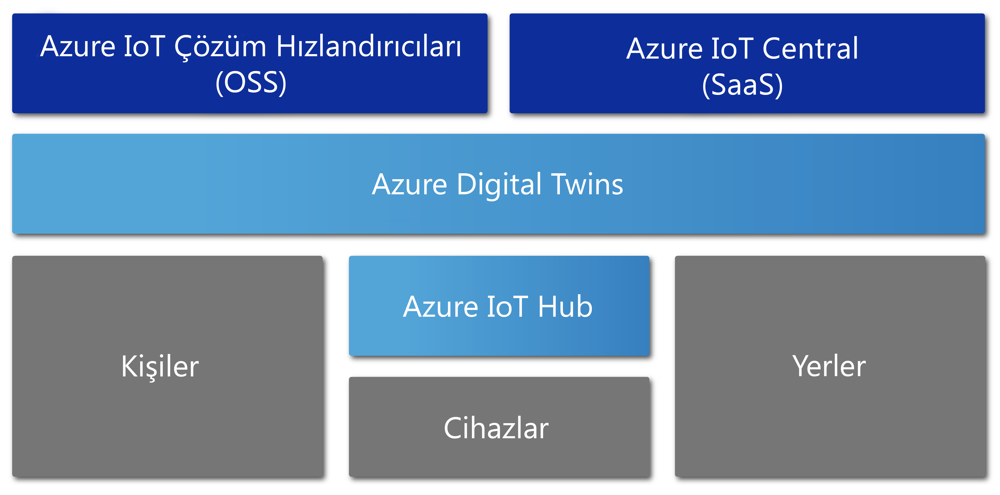

# Azure Digital Twins'e genel bakış

Azure Digital Twins, fiziksel ortamların kapsamlı modellerini oluşturan bir Azure IoT hizmetidir. İnsanlar, alanlar ve cihazlar arasındaki ilişkileri ve etkileşimleri modellemek için uzamsal zeka grafları oluşturma, bu hizmetin özelliklerinden bazılarıdır.

Azure Digital Twins, ayrı sensörler yerine fiziksel alandaki verileri sorgulamanızı sağlar. Bu hizmet dijital ve fiziksel dünyadaki akış verileri arasında bağlantı oluşturan yeniden kullanılabilir, yüksek oranda ölçeklenebilir ve uzamsal farkındalığa sahip deneyimler oluşturmanıza yardımcı olur. Bir fabrikanın bakım gereksinimlerini belirleme, bir elektrik şebekesinin gerçek zamanlı enerji gereksinimlerini analiz etme veya bir ofis için kullanılabilir alanı en iyi duruma getirme gibi görevler için uygulamalarınız bu benzersiz olarak ilişkilendirilen bağlamsal özelliklerle zenginleştirilir.

Azure Digital Twins depolar, ofisler, okullar, hastaneler, bankalar, stadyumlar, fabrikalar, otoparklar, parklar, akıllı şebekeler ve şehirler gibi her türlü ortam için uygundur. Birden fazla eyaletteki günlük sıcaklığı takip etme, meşgul insansız hava aracı yollarını izleme, otonom araçları tanımlama, bir binanın doluluk düzeylerini analiz etme veya mağazanızdaki en yoğun kasayı belirleme gibi senaryolarda bu hizmetten faydalanabilirsiniz. Gerçek dünyadaki iş senaryonuz ne olursa olsun Azure Digital Twins ile uygun bir dijital örnek sağlanabilir.

Aşağıdaki videoda Digital Twins ayrıntılı bir şekilde incelenmiştir:

> [!VIDEO https://www.youtube.com/embed/TvN_NxpgyzQ]

## Temel işlevler

Azure Digital Twins hizmetinin özellikleri şunlardır:

### Uzamsal zeka grafı

[*Uzamsal zeka grafı*](./concepts-objectmodel-spatialgraph.md) veya *uzamsal graf*, fiziksel ortamın görsel temsilidir ve insanlar, yerler ve cihazlar arasındaki ilişkileri modellemenizi sağlar.

Bir mahalleye dağıtılmış olan elektrik sayaçlarından oluşan bir akıllı hizmet uygulamasını düşünün. Elektrik kullanımını ve faturaları doğru şekilde izlemek ve tahmin etmek için akıllı hizmet şirketinin her cihazı ve sensörü konum ile fatura düzenlenecek müşteri bağlamında modellemesi gerekir. Uzamsal zeka grafı, bu tür karmaşık ilişkileri modellemenizi sağlar.

### Dijital ikiz nesne modelleri

[Dijital ikiz nesne modelleri](./concepts-objectmodel-spatialgraph.md), geliştirme süreçlerini hızlandırmak ve kolaylaştırmak için çözümünüzün etki alanına uygun ihtiyaçlarını karşılayan önceden tanımlanmış cihaz protokolleri ve veri şemalarıdır.

Örneğin bir oda doluluk durumu uygulamasında kampüs, bina, kat, oda vb. önceden tanımlı alan türleri kullanabilir.

### Birden çok ve iç içe yerleştirilmiş kiracılar

Güvenli bir şekilde ölçeklendirilen ve birden fazla kiracı için yeniden kullanılabilen çözümler oluşturabilirsiniz. Ayrıca yalıtılmış ve güvenli bir şekilde erişilebilen ve kullanılabilen birden fazla alt kiracı da oluşturabilirsiniz.

Örneğin bir alan kullanım uygulaması, belirli bir binada bulunan bir kiracının verilerini diğer kiracı verilerinden yalıtacak veya tek bir kiracının verilerini birden fazla binayla birleştirecek şekilde yapılandırılabilir.

### Gelişmiş işlem özellikleri

[Kullanıcı tanımlı işlevler](./concepts-user-defined-functions.md) olarak adlandırılan gelişmiş işlem özellikleri, önceden tanımlı uç noktalara sinyal göndermek için gelen [cihaz verileriyle](./concepts-device-ingress.md) özel işlev tanımlayıp çalıştırmanızı sağlar. Bu özellik, cihaz görevlerini özelleştirme ve otomasyon açısından geliştirir.

Örneğin bir akıllı tarım uygulaması, topraktaki nem miktarı sensöründen gelen değerlere ek olarak hava tahminlerini değerlendirerek sulama gereksinimleriyle ilgili sinyaller gönderen bir kullanıcı tanımlı işleve sahip olabilir.

### Yerleşik erişim denetimi

[Rol tabanlı erişim denetimi](./security-role-based-access-control.md) ve [Azure Active Directory](./security-authenticating-apis.md) gibi erişim ve kimlik yönetim özellikleri, kişilerin ve cihazların erişimini güvenli bir şekilde denetlemenizi sağlar.

Örneği bir tesis yönetim uygulaması, odayı kullananların sıcaklığı belirli bir aralıkta ayarlamasına, tesis yöneticilerinin ise sıcaklığı herhangi bir değere ayarlamasına izin verecek şekilde yapılandırılabilir.

### Ekosistem

Bir Azure Digital Twins örneğini şunlar gibi birçok güçlü Azure hizmetine bağlayabilirsiniz: Azure Stream Analytics, yapay zeka, depolama hizmetleri, Azure Haritalar, Microsoft Karma Gerçeklik, Dynamics 365 veya Office 365.

Örneğin bir akıllı bina uygulaması, Azure Digital Twins'i kullanarak ayrı katlardaki ekipleri ve cihazları gösterebilir. Cihazlar, sağlanan Digital Twins örneğine canlı veri akışı yaptıkça Azure Stream Analytics bu verilere göre eyleme dönüştürülebilir önemli içgörüler sağlayabilir. Ardından bu veriler Azure Depolama hizmetinde depolanıp Office 365 ile kuruluşun tamamına dağıtılabilecek paylaşılabilir dosya biçimine dönüştürülebilir.

## Azure Digital Twins'den yararlanan çözümler

Azure Digital Twins IoT modelleme, veri işleme, olay işleme ve cihaz izleme süreçlerini kolaylaştırdığından fiziksel dünyayı ve ilişkileri gösterme açısından kullanışlıdır. Aşağıda verilen bu hizmetin kullanılabileceği farklı sektör senaryolarına göz atın:

* Bir tesis yönetim şirketine ofis binasını yapılandırmayla ilgili en iyi yöntemler hakkında içgörüler sağlamak için belirli alanların zaman içindeki doluluk düzeylerini gösterme.
* Güvenlik görevlisi ayarlama ve bakım hizmetleri zamanlama gibi bir mağazadaki ya da spor salonundaki hizmetleri gerçekleştiren bir mobil uygulama için iş emri biletlerini tetikleme.
* Bina sakinlerine gerçek zamanlı oda kullanım durumunu gösterme. Ardından kişinin ihtiyaçlarına uygun çalışma alanlarını ayırmasına yardımcı olma.
* Bir alan içinde varlıkların bulunduğu konumu izleme.
* Kullanıcı tercihlerini ve enerji şebekesi kısıtlamalarını modelleyerek elektrikli araç şarj işlemlerini iyileştirme.

## Diğer IoT Hizmetleri bağlamında Azure Digital Twins

Azure Digital Twins, verileri fiziksel dünyayla eşitlemek için Azure IoT Hub'ı kullanarak IoT cihazlarına ve sensörlerine bağlanır. Aşağıdaki diyagramda Azure Digital Twins ile diğer Azure IoT hizmetler arasındaki ilişki gösterilmiştir:

IoT ekosisteminin diğer bileşenleriyle ilgili ayrıntılı açıklamalar için bkz. [Azure IoT teknolojileri ve çözümleri](https://docs.microsoft.com/azure/iot-fundamentals/iot-services-and-technologies).

## Sonraki adımlar

Azure Digital Twins özellikleriyle ilgili kısa tanıtıma geçin:

> [!div class="nextstepaction"]
> [Hızlı başlangıç: Azure Digital Twins'i kullanarak uygun odaları bulma](./quickstart-view-occupancy-dotnet.md)

Azure Digital Twins'i kullanan bir tesis yönetim uygulamasının ayrıntılarını inceleyin:

> [!div class="nextstepaction"]
> [Öğretici: Azure Digital Twins'i dağıtma ve uzamsal graf yapılandırma](./tutorial-facilities-setup.md)

Temel Azure Digital Twins kavramları hakkında bilgi edinin:

> [!div class="nextstepaction"]
> [Digital Twins nesne modelini ve uzamsal zeka grafını anlama](./concepts-objectmodel-spatialgraph.md)
