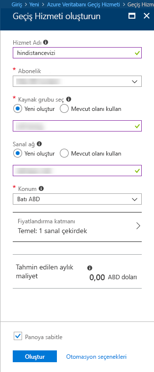

# Azure portalını kullanarak Azure Veritabanı Geçiş Hizmeti örneği oluşturma
Bu Hızlı Başlangıç kılavuzunda Azure Veritabanı Geçiş Hizmeti’nin bir örneğini oluşturmak için Azure portalını kullanacaksınız.  Hizmeti oluşturduktan sonra, şirket içi SQL Server’daki verileri bir Azure SQL veritabanına geçirmek için bu hizmeti kullanabilirsiniz.

Azure aboneliğiniz yoksa başlamadan önce [ücretsiz](https://azure.microsoft.com/free/) bir hesap oluşturun.

## Azure portalında oturum açma
Web tarayıcınızı açıp [Microsoft Azure portalı](https://portal.azure.com/)’na gidin. Portalda oturum açmak için kimlik bilgilerinizi girin. Varsayılan görünüm hizmet panonuzu içerir.

## Kaynak sağlayıcısını kaydetme
İlk Veritabanı Geçiş Hizmeti örneğinizi oluşturmadan önce Microsoft.DataMigration kaynak sağlayıcısını kaydedin.

1. Azure portalında, **Tüm hizmetler**’i seçin ve sonra **Abonelikler**’i seçin.

2. Azure Veritabanı Geçiş Hizmeti örneğini oluşturmak istediğiniz aboneliği seçin ve sonra **Kaynak sağlayıcıları**’nı seçin.

3. Geçiş öğesini arayın ve sonra Microsoft.DataMigration öğesinin sağ tarafındaki **Kaydet**’i seçin.

## Hizmetin bir örneğini oluşturma
1. Şu anda önizleme sürümünde olan Azure Veritabanı Geçiş Hizmeti’nin bir örneğini oluşturmak için **+ Kaynak oluştur**’a tıklayın.

2. "Geçiş" için marketi seçin, **Azure Veritabanı Geçiş Hizmeti**’ni seçin ve **Azure Veritabanı Geçiş Hizmeti (önizleme)** ekranında, **Oluştur**’a tıklayın.

3. **Veritabanı Geçiş Hizmeti** ekranında: 

    - Azure Veritabanı Geçiş Hizmeti örneğinizi tanımlamak için akılda kalıcı ve benzersiz bir **Hizmet adı** seçin.
    - Örneği oluşturmak istediğiniz Azure **Aboneliğini** seçin.
    - Benzersiz bir ada sahip yeni bir **Ağ** oluşturun.
    - Kaynak veya hedef sunucunuza en yakın **Konum**’u seçin.
    - **Fiyatlandırma katmanı** için Temel: 1 Sanal Çekirdek seçeneğini belirleyin.

    
4. **Oluştur**’u seçin.

Birkaç dakika sonra Azure Veritabanı Geçiş Hizmeti örneğiniz oluşturulur ve kullanıma hazır hale gelir. Veritabanı Geçiş Hizmeti aşağıdaki resimde gösterildiği gibi görüntülenir:

## Kaynakları temizleme
[Azure kaynak grubunu](../azure-resource-manager/resource-group-overview.md) silerek bu Hızlı Başlangıç kılavuzunda oluşturduğunuz kaynakları temizleyebilirsiniz.  Kaynak grubunu silmek için, oluşturduğunuz Azure Veritabanı Geçiş Hizmeti örneğine gidin. **Kaynak grubu** adını seçin ve **Kaynak grubunu sil** seçeneğini belirleyin.  Bu eylem kaynak grubundaki tüm varlıkları ve kaynak grubunu siler.

## Sonraki adımlar
> [!div class="nextstepaction"]
> [Şirket içi SQL Server’dan Azure SQL Veritabanı’na geçiş](tutorial-sql-server-to-azure-sql.md)