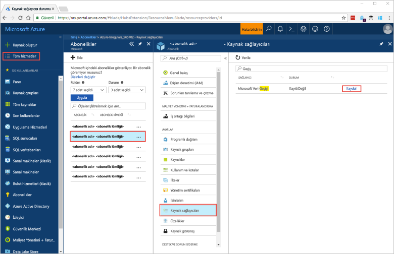
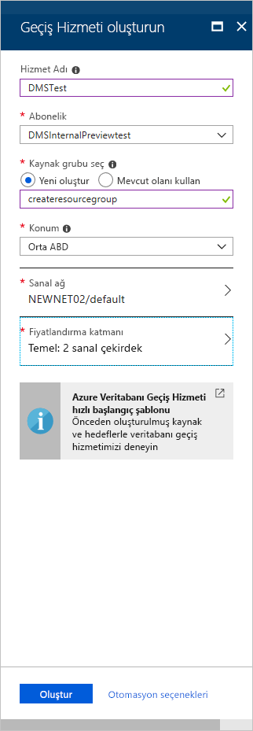

# Hızlı Başlangıç: Azure portalını kullanarak Azure Veritabanı Geçiş Hizmeti örneği oluşturma
Bu Hızlı Başlangıç kılavuzunda Azure Veritabanı Geçiş Hizmeti’nin bir örneğini oluşturmak için Azure portalını kullanacaksınız.  Hizmeti oluşturduktan sonra, şirket içi SQL Server’daki verileri bir Azure SQL veritabanına geçirmek için bu hizmeti kullanabilirsiniz.

Azure aboneliğiniz yoksa başlamadan önce [ücretsiz](https://azure.microsoft.com/free/) bir hesap oluşturun.

## Azure portalında oturum açma
Web tarayıcınızı açın, [Microsoft Azure portalına gidin](https://portal.azure.com/) ve kimlik bilgilerinizi girerek portalda oturum açın.

Varsayılan görünüm hizmet panonuzu içerir.

## Kaynak sağlayıcısını kaydetme
İlk Veritabanı Geçiş Hizmeti örneğinizi oluşturmadan önce Microsoft.DataMigration kaynak sağlayıcısını kaydedin.

1. Azure portalında, **Tüm hizmetler**’i seçin ve sonra **Abonelikler**’i seçin.

2. Azure Veritabanı Geçiş Hizmeti örneğini oluşturmak istediğiniz aboneliği seçin ve sonra **Kaynak sağlayıcıları**’nı seçin.

3. "migration" araması yapın ve **Microsoft.DataMigration** öğesinin sağ tarafındaki **Kaydet**'i seçin.

    

## Hizmetin bir örneğini oluşturma
1. Azure Veritabanı Geçiş Hizmeti’nin bir örneğini oluşturmak için +**Kaynak oluştur**’u seçin.

2. "Geçiş" için marketi arayın, **Azure Veritabanı Geçiş Hizmeti**’ni seçin ve **Azure Veritabanı Geçiş Hizmeti**  ekranında, **Oluştur**’u seçin.

3. **Geçiş Hizmeti Oluştur** ekranında: 

    - Azure Veritabanı Geçiş Hizmeti örneğinizi tanımlamak için akılda kalıcı ve benzersiz bir **Hizmet Adı** seçin.
    - Örneği oluşturmak istediğiniz Azure **Aboneliğini** seçin.
    - Yeni bir **Kaynak Grubu** seçin ya da yeni bir tane oluşturun.
    - Kaynak veya hedef sunucunuza en yakın **Konum**’u seçin.
    - Var olan bir **Sanal ağı** (VNET) seçin veya bir tane oluşturun.

        Sanal ağ, Azure Veritabanı Geçiş Hizmeti'nin kaynak veritabanına ve hedef ortama erişmesini sağlar.

        Azure portalda sanal ağ oluşturma hakkında daha fazla bilgi için [Azure portalı kullanarak sanal ağ oluşturma](https://aka.ms/vnet) makalesine bakın.

    - Temel seçin: 1 sanal çekirdek için **fiyatlandırma katmanı**.

        

4. **Oluştur**’u seçin.

    Birkaç dakika sonra Azure Veritabanı Geçiş Hizmeti örneğiniz oluşturulur ve kullanıma hazır hale gelir. Veritabanı Geçiş Hizmeti aşağıdaki resimde gösterildiği gibi görüntülenir:

    

## Kaynakları temizleme
[Azure kaynak grubunu](../azure-resource-manager/resource-group-overview.md) silerek bu Hızlı Başlangıç kılavuzunda oluşturduğunuz kaynakları temizleyebilirsiniz. Kaynak grubunu silmek için, oluşturduğunuz Azure Veritabanı Geçiş Hizmeti örneğine gidin. **Kaynak grubu** adını seçin ve **Kaynak grubunu sil** seçeneğini belirleyin. Bu eylem kaynak grubundaki tüm varlıkları ve kaynak grubunu siler.

## Sonraki adımlar
> [!div class="nextstepaction"]
> [Şirket içi SQL Server’dan Azure SQL Veritabanı’na geçiş](tutorial-sql-server-to-azure-sql.md)