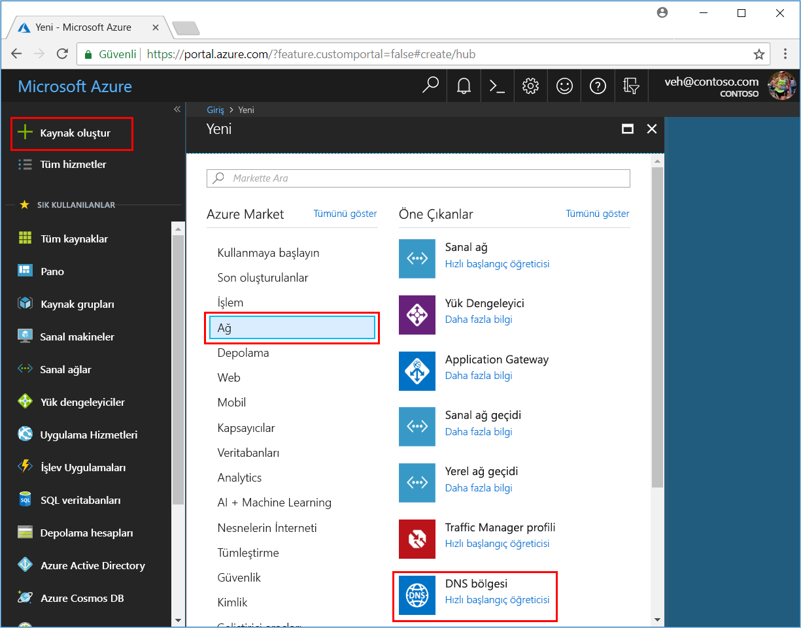
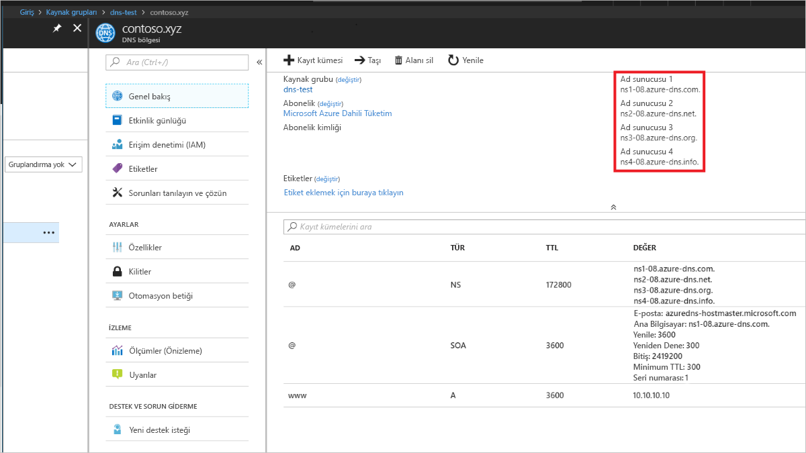

# <a name="quickstart-create-an-azure-dns-zone-and-record-using-the-azure-portal"></a>Hızlı Başlangıç: Bir Azure DNS bölgesi ve kaydı Azure portalını kullanarak oluşturma

Azure DNS'yi, genel etki alanınızdaki ana bilgisayar adlarını çözümleyecek şekilde yapılandırabilirsiniz. Örneğin, satın aldığınız *contoso.xyz* etki alanı adı bir etki alanı adı kayıt şirketinden, Azure DNS için ana bilgisayar yapılandırabilirsiniz *contoso.xyz* etki alanı ve Çözümle *www.contoso.xyz* IP adresine web sunucunuzda veya web uygulaması.

Bu hızlı başlangıçta, bir test etki alanı oluşturacak ve çözmek için bir adres kaydı oluşturup *www* IP adresine *10.10.10.10*.

>[!IMPORTANT]
>Tüm adlarını ve IP adreslerini bu hızlı başlangıçta, gerçek dünya senaryoları temsil etmeyen verilebilir.

<!---
You can also perform these steps using [Azure PowerShell](dns-getstarted-powershell.md) or the cross-platform [Azure CLI](dns-getstarted-cli.md).
--->

Azure aboneliğiniz yoksa başlamadan önce [ücretsiz bir hesap](https://azure.microsoft.com/free/?WT.mc_id=A261C142F) oluşturun.

Tüm portal adımları için oturum açın [Azure portalında](https://portal.azure.com).

## <a name="create-a-dns-zone"></a>DNS bölgesi oluşturma

Bir DNS bölgesi bir etki alanı için DNS girişleri içerir. Etki alanınızı Azure DNS'de barındırmaya başlamak için bu etki alanı adı için bir DNS bölgesi oluşturun. 

**DNS bölgesi oluşturmak için:**

1. Üst sol seçin **kaynak Oluştur**, ardından **ağ**, ardından **DNS bölgesi**.

1. Üzerinde **DNS bölgesi oluştur** sayfasında yazın veya aşağıdaki değerleri seçin:

   - **Ad**: Tür *contoso.xyz* Bu hızlı başlangıç örnek. DNS bölge adını, Azure DNS sunucularındaki yapılandırılmamış herhangi bir değer olabilir. Gerçek dünyada etki alanı adı kayıt kuruluşunuzdan satın aldığınız etki alanını kullanmanız gerekir.
   - **Kaynak grubu**: Seçin **Yeni Oluştur**, girin *MyResourceGroup*seçip **Tamam**. Kaynak grubu adı, Azure abonelik içinde benzersiz olmalıdır. 

1. **Oluştur**’u seçin.

   

Bölgenin oluşturulması birkaç dakika sürebilir.

## <a name="create-a-dns-record"></a>DNS kaydı oluşturma

DNS bölgesi içinde etki alanınız için DNS girişleri veya kayıtları oluşturun. Yeni bir adres kaydı veya bir IPv4 adresi için bir ana bilgisayar adı çözümlenemedi 'A' kaydı oluşturun.

**Bir 'A' kaydı oluşturmak için:**

1. Azure portalında altında **tüm kaynakları**açın **contoso.xyz** DNS bölgesine **MyResourceGroup** kaynak grubu. Girdiğiniz *contoso.xyz* içinde **ada göre filtrele** daha kolay bulmak için arama kutusu.

1. Üst kısmındaki **DNS bölgesi** sayfasında **+ kayıt kümesi**.

1. Üzerinde **kayıt kümesi Ekle** sayfasında yazın veya aşağıdaki değerleri seçin:

   - **Ad**: Tür *www*. Belirtilen IP adresine çözümlemek istediğiniz ana bilgisayar adı kayıt adıdır.
   - **Tür**: Seçin **A**. 'Bir' en yaygın kayıtlardır ancak posta sunucuları ("MX"), IP v6 adresleri ('AAAA') ve benzeri diğer kayıt türleri vardır. 
   - **TTL**: Tür *1*. *Yaşam süresi* ne kadar süreyle DNS sunucuları ve istemciler bir yanıt önbelleğe alabilir DNS isteğini belirtir.
   - **TTL birimi**: Seçin **saat**. İçin zaman birimi budur **TTL** değeri. 
   - **IP adresi**: Bu hızlı örnek için türü *10.10.10.10*. Bu değer, kayıt adının IP adresini çözümler olur. Gerçek hayattaki bir senaryoda, web sunucunuz için genel IP adresini girmeniz gerekir.

Bu hızlı başlangıçta yalnızca hızlı Test amaçları için olduğundan, bir etki alanı adı kayıt şirketinize Azure DNS ad sunucularını yapılandırmak için gerek yoktur. Gerçek üretim etki alanı ile web sunucusu veya uygulamaya bağlanmak için ana bilgisayar adını çözümlemek için Internet'teki herkes istersiniz. Azure DNS ad sunucularıyla ad sunucusu kayıtlarını değiştirmek için etki alanı adı kayıt sayfasını ziyaret edin. Daha fazla bilgi için [Öğreticisi: Etki alanınızı Azure DNS'de konak](dns-delegate-domain-azure-dns.md#delegate-the-domain).

## <a name="test-the-name-resolution"></a>Ad çözümlemesini test etme

Test 'A' kaydı test DNS bölgesi olduğuna göre ad çözümlemesi adında bir araç ile test edebilirsiniz *nslookup*. 

**DNS ad çözümlemesini test etmek için:**

1. Azure portalında altında **tüm kaynakları**açın **contoso.xyz** DNS bölgesine **MyResourceGroup** kaynak grubu. Girdiğiniz *contoso.xyz* içinde **ada göre filtrele** daha kolay bulmak için arama kutusu.

1. Ad sunucusu adlarını birini adı sunucu listesinden kopyalayın **genel bakış** sayfası. 

   

1. Bir komut istemi açın ve aşağıdaki komutu çalıştırın:

   ```
   nslookup www.contoso.xyz <name server name>
   ```

   Örneğin:

   ```
   nslookup www.contoso.xyz ns1-08.azure-dns.com.
   ```

   Aşağıdaki ekrana benzer bir şey görmeniz gerekir:

   

Ana bilgisayar adı **www\.contoso.xyz** çözümler **10.10.10.10**yapılandırdığınız şekilde. Bu sonuç, ad çözümlemesi doğru şekilde çalıştığını doğrular. 

## <a name="clean-up-resources"></a>Kaynakları temizleme

Bu hızlı başlangıçta oluşturulan kaynakları artık ihtiyacınız olmadığında, bunları silerek kaldırmak **MyResourceGroup** kaynak grubu. Açık **MyResourceGroup** kaynak grubu ve select **kaynak grubunu Sil**.

## <a name="next-steps"></a>Sonraki adımlar

> [!div class="nextstepaction"]
> [Özel etki alanında bir web uygulaması için DNS kayıtları oluşturma](./dns-web-sites-custom-domain.md)